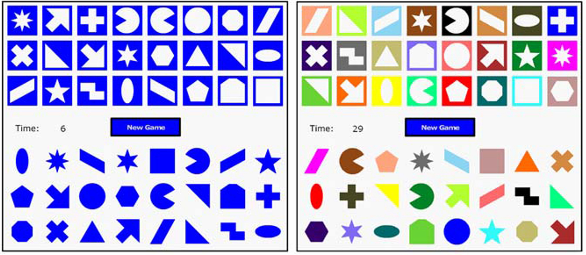
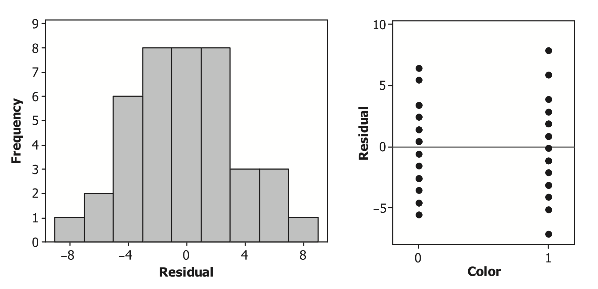
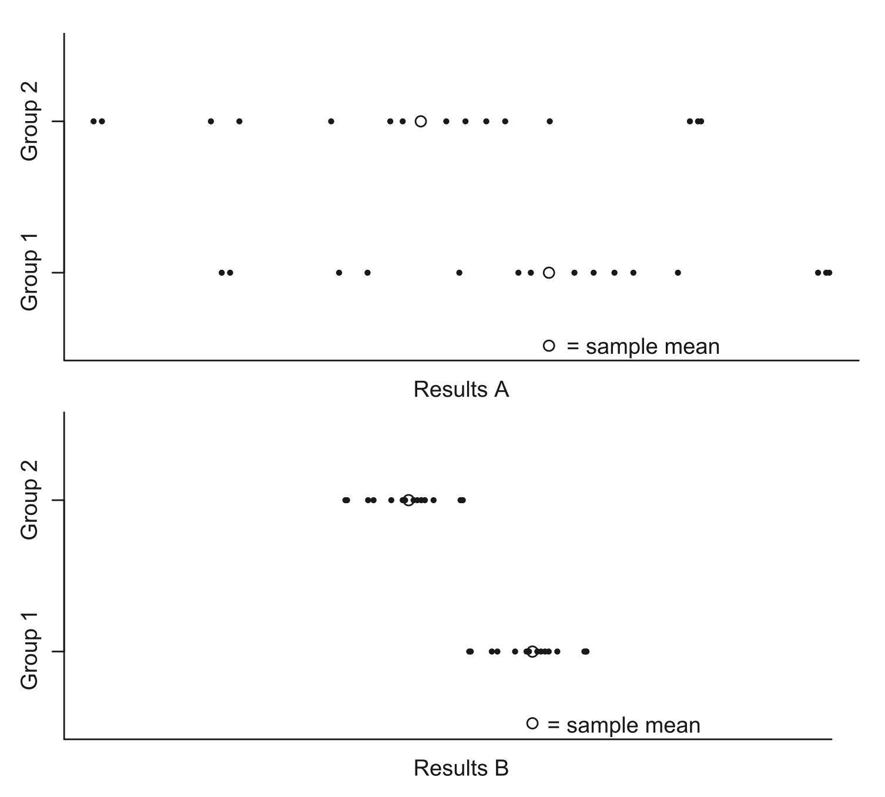
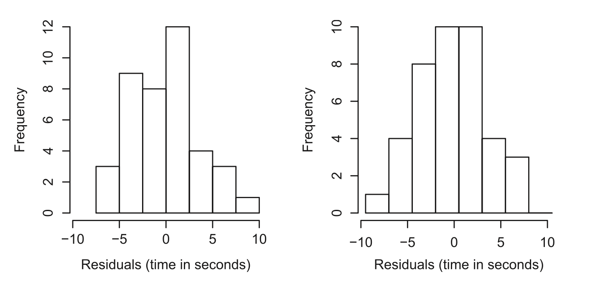
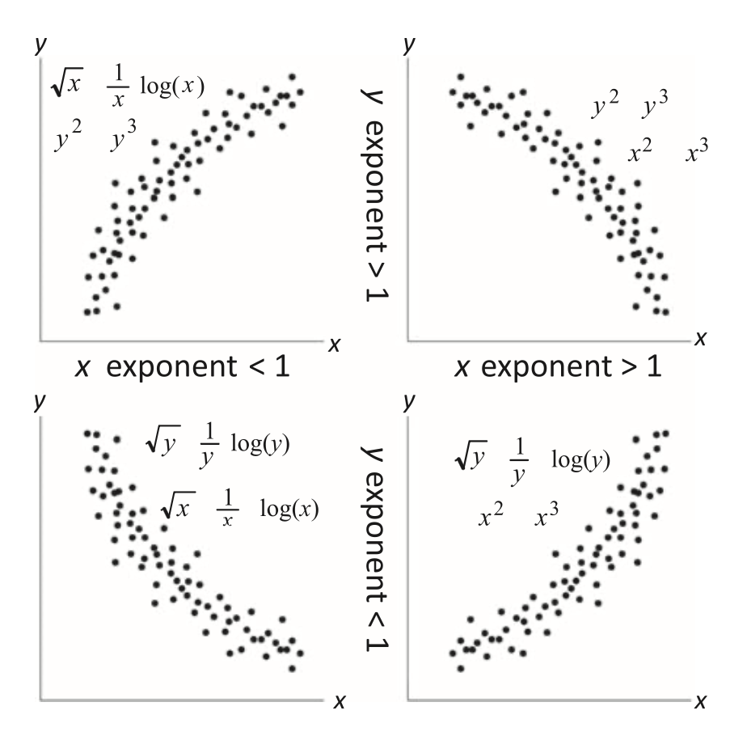
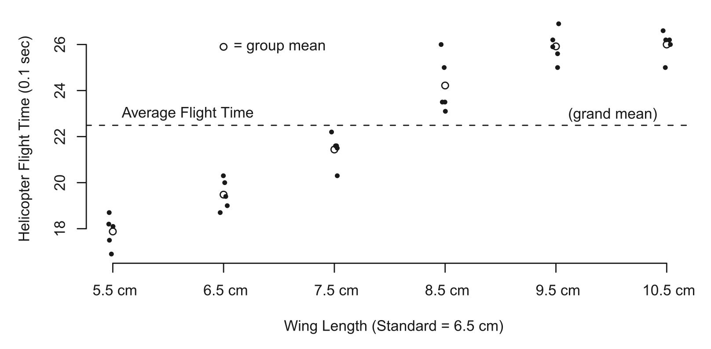
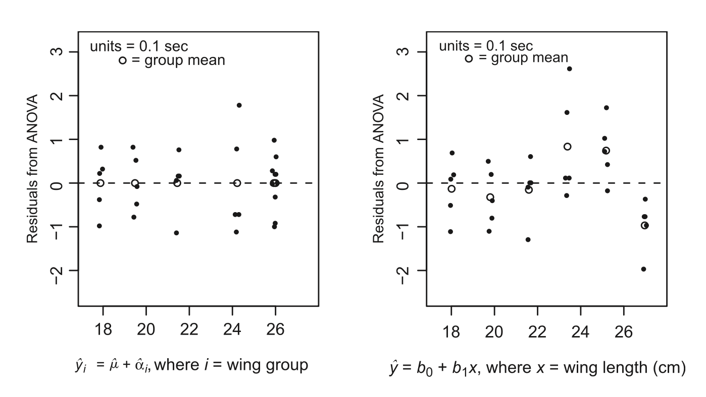
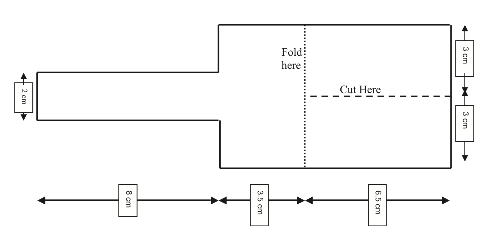

```{r setup,include=FALSE,warning=FALSE,message=FALSE}
knitr::opts_chunk$set(echo=FALSE)
library(dplyr)
library(readr)
library(knitr)
library(kableExtra)
library(ggplot2)
library(tidyverse)
library(devtools)
library(plotly)
install_github("Tanvi-Jindal/myfirstpackage")
library(myfirstpackage)
theme_set(
  theme_minimal(base_family = "Latin Modern Roman") +
    theme(
      plot.title = element_text(size = 24, face = "bold"),
      axis.title = element_text(size = 12),
      plot.caption = element_text(size = 10, hjust = 0)
    )
)
```

# Making Connections: The Two-Sample t-Test, Regression, and ANOVA

<span style="float:right;"> *In theory, there’s no difference between theory and practice. In practice, there is.*</span>  
<span style="float:right;"> -Yogi Berra^[Yogi Berra was an American League Baseball player and manager. This quote has also been attributed to computer scientist Jan L. A. van de Snepscheut.] 
</span>

<br> <br>

Statistics courses often teach the two-sample t-test, linear regression, and analysis of variance (ANOVA) as very distinct approaches to analyzing different types of data. However, this chapter makes connections among these three techniques by focusing on the statistical models. Statistical software has made it easy to calculate statistics and $p$-values. But without understanding the underlying model assumptions, it is easy to draw incorrect conclusions from the sample data. As studies become more complex, models become fundamental to drawing appropriate conclusions. In this chapter, a simple student experiment involving games and several additional studies are used to do the following:


- Compare the underlying statistical models for the two-sample t-test, linear regression, and
ANOVA
- Discuss the model assumptions for each of these three tests
- Create and interpret normal probability plots
- Transform data in order to better fit the model assumptions
- Discuss the mathematical details of each hypothesis test and corresponding confidence interval


\newpage


## Investigation: Do Distracting Colors Influence the Time to Complete a Game?

In 1935, John Stroop published a paper presenting his research on the reaction time of undergraduate students identifying ink colors.2 He found that students took a longer time identifying ink colors when the ink was used to spell a different color. For example, if the word "\color{blue}yellow\color{black}" was printed in blue ink, students took longer to identify the blue ink because they automatically read the word “yellow.” Even though students were told only to identify the ink color, the automatized behavior of reading interfered with the task and slowed their reaction time.^[Note that many psychologists would call this procedural knowledge instead of automatized behavior. Both are processes that can be done without conscious thought, but automatized behaviors are processes that cannot be slowed down, do not
decline with age, and show no gender differences.]  *Automatized behaviors* are behaviors that can be done automatically without carefully thinking through each step in the process. Stroop’s work, demonstrating that automatized behaviors can act as a distracter for other desired behaviors, is so well known that the effect is often called the *Stroop effect*.

Several students in an introductory statistics class wanted to develop a final project that would test the impact of distracters. They decided to conduct a study to determine if students at their college would perform differently when a distracting color was incorporated into a computerized game. This game challenges people to place an assortment of shaped pegs into the appropriate spaces as quickly as possible. Before any data were collected, these students developed a clear set of procedures.

- 40 students would be randomly selected from the college.^[Since it was not possible to force college students to be involved in this study, these researchers randomly selected students from an online college directory until they had 40 students who were willing to play the game.]
- 20 students would be assigned to the standard game and 20 would be assigned to a game with a color
distracter. The student researchers would flip a coin to randomly assign subjects to a treatment. Once
20 subjects had been assigned to either group, the rest would automatically be assigned to play the
other game.
- Subjects would see a picture of the game and have the rules clearly explained to them before they
played the game. An example of both games is shown in Figure 2.1.
- Subjects would play the game in the same area with similar background noise to control for other
possible distractions.
- The response variable would be the time in seconds from when the participant pressed the “start
game” button to when he or she won the game.

```{r fig2.1, echo=FALSE, out.width="100%", fig.align="center", fig.cap="An image of the electronic Shapesplosion game with and without color distracters. The instructions for the game were to click and drag each peg to the space with the matching shape."}

```

>**NOTE**
It is important to recognize that each subject in this study was assigned to exactly one treatment, either the standard game or the color distracter game. Some researchers may point out that a paired design (where each subject was assigned to both treatments) might have been more efficient. However, for the purposes of this chapter, this study will be treated as the students originally designed it: a study comparing two independent samples.


### Understanding the Study Design 

1. For this study, identify the units, the population for which conclusions can be drawn, the explanatory variable, and the response variable.

2. Is this study an experiment or an observational study? Explain.

3. The researchers hoped to determine if distracting colors influenced college students’ response times when playing a computerized game. Write out in words and symbols appropriate null and alternative hypotheses. Let $\mu_1$ represent the true mean response time of the color group and $\mu_2$ the true mean response time of the standard group. Use a two-sided alternative hypothesis for this question.

4. Create an individual value plot or a boxplot of the Games1 data from this study. Describe the graph. For example, does it look as if the groups have equal means or equal standard deviations? Are there any unusual observations in the data set? Calculate the mean and standard deviation of the color distracter responses, $\bar{y}_1$ and $s_1$ , as well as the mean and standard deviation of the standard game responses, $\bar{y}_2$ and $s_2$.


## The Two-Sample t-Test to Compare Population Means


### The Statistical Model

Generally, **statistical models** have the following form:

<p style="text-align: center; font-size: 1.2em; font-weight: bold;">
  observed value = mean response + random error
</p>


The statistical model describes each observed value in a data set as the sum of a mean response for some subgroup of interest (often called a group mean) and a random error term. The mean response is fixed for each group, while the random error term is used to model the uncertainty of each individual outcome. The random error term for each individual outcome cannot be predicted, but in the long run there is a regular pattern that can be modeled with a distribution (such as the normal distribution).

The key question in this study is whether or not the two types of games have different average completion times. The two-sample t-test starts with the assumption that the two group means are equal. This is often written as the null hypothesis $H_0 : \mu_1 - \mu_2 = 0$ or, equivalently, $H_0 : \mu_1 = \mu_2$.

The underlying model used in the two-sample t-test is designed to account for these two group means ($\mu_1$ and $\mu_2$) and random error. The statistical model for the first population, the color distracter group, is:

```{r, results='asis', echo=FALSE}
library(knitr)
library(kableExtra)

# Create table
tbl <- matrix("", nrow = 5, ncol = 8)
tbl[1, 1] <- "observed"
tbl[1, 3] <- "mean"
tbl[1, 5] <- "error"
tbl[2, 1] <- "value"
tbl[2, 3] <- "response"
tbl[2, 5] <- "term"
tbl[3, 1] <- "(random)"
tbl[3, 3] <- "(not random)"
tbl[3, 5] <- "(random)"
tbl[4, 1] <- "\u2193"
tbl[4, 3] <- "\u2193"
tbl[4, 5] <- "\u2193"
tbl[5, 1] <- "$y_{1,j}$"
tbl[5, 2] <- " = "
tbl[5, 3] <- "$\\mu_1$"
tbl[5, 4] <- "+"
tbl[5, 5] <- "$\\epsilon_{1,j}$"
tbl[5, 8] <- "for $j = 1, 2, ... ,n_1$"

# Display table
kable(tbl, align = "c") %>%
  kable_styling(full_width = FALSE)%>%
  row_spec(0, extra_css = "border-bottom: none;") %>%
  column_spec(1:8, extra_css = "border: none;")

#kable(tbl, format = "html", align = "c") %>%
#  kable_styling(full_width = FALSE, bootstrap_options = NULL, border_color = "white") %>%
#  row_spec(0, extra_css = "border-bottom: none;") %>%
#  column_spec(1:6, extra_css = "border: none;")
```


where j is used to represent each observation in the sample from the first population. For example, $y_{1, 9}$ represents the 9th observation in the first group (the color distracter group). In this data set, there were 20 observations taken from the first population; thus, $n_1$ = 20.

This model states that the color distracter game is expected to be centered at the constant value $\mu_1$ . In addition, each observation is expected to have some variability (random error) that is typically modeled by a normal distribution with a mean equal to zero and a fixed variance s2. Similarly, each observation from the second group, the standard game, can be modeled as the sum of $\mu_2$ plus a random error term, $\epsilon_{2, j}$:

\begin{align}
y_{2, j} = \mu_2 + \epsilon_{2, j}  ~~\text{ for }~ j = 1, 2, ... ,n_2
\end{align}

where $n_2 = 20$, $\mu_2$ is the mean of the standard group, and the $\epsilon_{2, j}$ are random variables (typically from a
normal distribution) with a mean equal to zero and variance $\sigma^2$ . Often, this statistical model is more succinctly written as: 

\begin{align} \label{2.1}
y_{i, j} = \mu_i + \epsilon_{i, j} ~~\text{ for }~ j = 1, 2 \text{ and } j = 1, 2, ... ,n_2 ~~\text{ where }~  \epsilon_{i, j} \sim N(0,\sigma^2)
\tag{2.1}
\end{align}

>**MATHMATICAL NOTE**
You may recall from your introductory statistics course that adding a constant to each random variable in a population does not change the shape or spread of the population. Since each mean response ($\mu_i$) is fixed (i.e., a constant value), Equation \ref{2.1} can be used to show that $y_{i, j} \sim N(\mu_i,\sigma^2)$.


This model has one assumption that you may not have made when previously conducting a two-sample t-test. Equation \ref{2.1} states that all $\epsilon_{i, j}$ come from a normally distributed population with a mean of zero and
variance s2 . This is called the equal variance assumption. Some introductory statistics courses discuss only a two-sample t-test that does not require the equal variance assumption. The equal variance assumption is
made here because it makes sense for this experiment, the data support it ($s_1$ is close to $s_2$), and it allows a direct comparison to ANOVA and regression models.

In Equation \ref{2.1}, the mean response of the model is the population mean ($\mu_1$ or $\mu_2$). Just as a sample mean, $\bar{y}_i$, is used to estimate the population means, $\mu_i$, residuals are used to estimate the random error terms. **Residuals** are the difference between the observed response and the estimated mean response. For example, the random error term $\epsilon_{1, 12} = + \bar{y}_{1, 12} - \mu_1$ is estimated by $\hat{\epsilon}_{1, 12} = + \bar{y}_{1, 12} - \bar{y}_1$.


>**NOTE**
A **statistic** is any mathematical function of the sample data. **Parameters** are actual population values that cannot be known unless the entire population is sampled. The mean response is based on population parameters. If a sample data set is used, we do not know the population parameters. Sample statistics (such as the sample mean, $\bar{y}$, and the sample standard deviation, $s$) are used to estimate population parameters ($\mu$ and $\sigma$). Statisticians often use a hat on top of a parameter to represent an estimate of that parameter. For example, an estimate of the population standard deviation is written $s = \hat{\sigma}$ , and an estimate for a mean is written $\bar{y}_1 = \hat{\mu}_1$ or $\bar{y}_2 = \hat{\mu}_2$.


### Statistical Models for the Two-Sample t-Test 

5. Assume that we have two very small populations that can be written as
$y_{1,1} = 15$, $y_{1,2} = 17$, $y_{1,3} = 16$, $y_{2,1} = 11$, $y_{2,2} = 9$, $y_{2,3} = 10$. Find $\mu_1$, $\mu_2$, $\epsilon_{1, 1}$, $\epsilon_{1, 3}$, and $\epsilon_{2, 1}$.

Notice the double subscripts on the observed responses: $y_{1,1}$ is read as “y one one.” The first subscript tells us that the observation was from the first group, and the second subscript tells us the observation number. For example, $y_{1,j}$ is the jth observation from the first group.

6. Use the game study and the data in the file Games1 to identify $n_1$, $n_2$, $y_{1,12}$ , $y_{2,12}$ , $\epsilon_{1, 12}$, and $\epsilon_{2, 12}$,
where $y_{1,12}$ represents the 12th observation from group 1 (the color distracter group). Note that since this is a sample, not a population, we do not know $\mu_1$ or $\mu_2$ , but we can estimate them with $\bar{y}_1 = \hat{\mu}_1$ and $\bar{y}_2 = \hat{\mu}_2$.

### Model Assumptions for the Two-Sample t-Test

Several implicit assumptions are built into the model for the two-sample t-test shown in Equation \ref{2.1}:

- Constant parameters: The population values in this model ($\mu_1$ , $\mu_2$ , and $\sigma$) do not change throughout the study.
- Additive terms: The model described in Equation \ref{2.1} shows that the observed responses are the sum of our parameters and error terms. For example, we are not considering models such as
$y_{i, j} = \mu_i * \epsilon_{i, j}$ .
- $\epsilon_{i, j} \sim N(0,\sigma^2)$. This assumption has many key components:
- The error terms are independent and identically distributed (iid).
- The error terms follow a normal probability distribution.
- The error terms have a mean of zero. This implies that the average of several observed values will tend to be close to the true mean. In essence, there is no systematic bias in the error terms.
- The population variance $\sigma^2$ is the same for both groups (color distracter and standard games) being tested.

The first assumption tells us about the mean response. The parameter estimate ($\bar{y}_i$) would not be meaningful if the true parameter value ($\mu_i$) were not constant throughout the study. The second assumption simply states the types of models we are building. In later chapters with more complex models, we will discuss how to use residual plots to determine if the model is appropriate. In this chapter, we will focus on the assumptions about the error terms

>**MATHMATICAL NOTE**
In later chapters, we will show that a curved pattern in a residual versus fit plot suggests that an additive model may not be appropriate. In this example, there are only two fitted values (i.e., expected values), so we cannot see any curved patterns. When the additive assumption is violated, residual plots may also indicate different standard deviations, a nonnormal distribution, or lack of independence. Transforming the data to a new scale can often make the additivity assumption (and several of the other assumptions) more appropriate.

The statistical model described in Equation \ref{2.1} assumes that $\epsilon_{i, j}$ are modeled as **independent and identically distributed** (iid) random variables. The independent error term assumption states that there is no relationship between one observation and the next. For example, knowing that the 8th subject in a group played the game more quickly than average does not provide any information about whether the 7th or 9th person in the group will be above or below the average.

The identically distributed assumption states that each error is assumed to come from the same population distribution. Thus, each subject from a particular group is from the same population. If any error term
based on a particular observation comes from a different population, the two-sample t-test will not be valid. For example, elementary school students may have different expected completion times for the Shapesplosion game than college students. It would be inappropriate to include younger students in a study where the population was assumed to be college students

Model assumptions for the residuals should always be checked with plots of the data. The extended activities will describe normality tests in more detail, but in most situations a simple graph of the residuals will
suffice. The two sample t-test actually requires only that the sample means (each $\bar{y}_{i,j}$) be normally distributed. The central limit theorem allows us to assume this is true if group sample sizes are similar and large ($n_1 \ge 15$ and $n_2 \ge 15$) and there does not appear to be any extreme skewness or outliers in the residuals.

Since residuals are defined as the difference between each observed value and the corresponding group mean, they should always sum to zero. Thus, we cannot check residuals to determine whether each of the error
terms is centered at zero. The assumption that the error terms are centered at zero is really stating that there are no other sources of variability that may be biasing our results. In essence, the only difference between the two population means is explained by the mean response. 

To check the assumption that the two populations have the same variance, an informal test can be used. If the ratio of the sample standard deviations is less than 2, we can proceed with the analysis.^[Some texts suggest rejecting the equal variance assumption when the ratio is greater than 3 instead of 2. If the ratio is close to 2 (or 3), many statisticians would suggest conducting a more formal F-test for equal variances.]


**Informal Test for Equal Variances**


$$
\text{if }~~  \frac{\max(s_1, s_2)}{\min(s_1,2)} < 2 
~~ \text{ or, equivalently, if } 
~~ \frac{\max(s^2_1, s^2_2)}{\min(s^2_1,s^2_2)} < 4
$$


then we do not have enough evidence to conclude that the population variances are different.

Several key observations should be made about the individual value plot shown in Figure 2.2:

- The mean completion time is higher for the color distracter group than for the standard group.
- Neither group appears to have clear outliers, skewness, or large gaps.
- The spread (variance) of the two groups appears to be similar.

>**Key Concept**
Every statistical hypothesis test has basic underlying conditions that need to be checked before any valid conclusions can be drawn.

```{r fig2.2, echo=FALSE, out.width="100%", fig.align="center", fig.cap="Individual value plot of the data from the color distracter and standard games."}

```

### Checking Assumptions for the t-Test {-}

7. Calculate the residuals in the Games1 data. Plot a histogram of the residuals (or create a normal probability plot of the residuals). Do the residuals appear to be somewhat normally distributed?
8. Use the informal test to determine if the equal variance assumption is appropriate for this study.
9. The variable StudentID represents the order in which the games were played. Plot the residuals versus the order of the data to determine if any patterns exist that may indicate that the observations are
not independent.
10. Use statistical software to conduct a two-sample t-test (assuming equal variances) and find the $p$-value corresponding to this statistic. In addition, use software to calculate a 95% confidence interval for
the difference between the two means ($\mu_1$ - $\mu_2$ ). Equation \ref{2.7} and the extended activities provide details on conducting these calculations by hand. If H0 : $\mu_1$ = $\mu_2$ is true, the **$p$-value** states how likely it is that random chance alone would create a difference between two sample means ($\bar{y}_1 - \bar{y}_2$) at least as large as the one observed. Based on the $p$, what can you conclude about these two types of
games?

\newpage


## The Regression Model to Compare Population Means

### The Linear Regression Model

The simple linear regression model discussed in introductory statistics courses typically has the following form:

\begin{equation} \label{2.2}
y_i = \beta_0 + \beta_1x_i + \epsilon_i ~\text{ for } i = 1, 2, ... , n ~\text{ where } \epsilon_i \sim N(0,\sigma^2)
\tag{2.2}
\end{equation}

A **simple linear regression** model is a straight-line regression model with a single explanatory variable and a single response variable. For this linear regression model, the mean response ($\beta_0 + \beta_1x_i$) is a function of two parameters, $\beta_0$ and $\beta_1$, and an explanatory variable, $x$. The random error terms, $\epsilon_i$, are assumed to be independent and to follow a normal distribution with mean zero and variance $\sigma^2$.

In Equation \ref{2.1}, we used double subscripts: $i = 1, 2$ was used to show that there were two distinct groups and $j = 1, 2, ... , n_i$ was used to identify each of the $n_1 = n_2 = 20$ items within the two groups. In the regression model, there is only one set of subscripts: $i = 1, 2, ..., n$, where $n = 40 = n_1 + n_2$. Instead of having two distinct means in the model ($\mu_1$ and $\mu_2$), as in the two-sample t-test, we have one regression model where the parameters, $\beta_0$ and $\beta_1$, are fixed. The categorical explanatory variable, $x$, indicates game type.

A procedure commonly used to incorporate categorical explanatory variables, such as the game type, into a regression model is to define **indicator variables**, also called **dummy variables**, that will take on the role of the x variable in the model. Creating dummy variables is a process of mapping the column of categorical data into 0 and 1 data. For example, the indicator variable will have the value 1 for every observation from the color distracter game and 0 for every observation from the standard game. Most statistical software packages have a command for automatically creating dummy variables.

>**NOTE**
Typically an indicator variable is created for each category. Thus, there would be an indicator variable called Color equal to 1 for the color distracter game and 0 otherwise and another indicator variable called Standard equal to 1 for the standard game and 0 for all other categories. Notice that there is complete redundancy between the two indicator variables: Knowing the value of the Color variable automatically tells us the value of the Standard variable for each subject. Thus, only one of the indicator variables is needed in this model. Although this study has only two categories of games (color and standard), it is common for a categorical explanatory variable to have more than two categories. Chapter 3 provides the opportunity to use indicator variables when there are multiple categories.

>**Key Concept**
Indicator variables can be created to incorporate categorical explanatory variables into a regression model.


### Calculating a Regression Model and Hypothesis Test for the Slope {-}

11. Use the software instructions and the Games1 data to create indicator variables where $x = 1$ represents the color distracter game and $x = 0$ represents the standard game. Develop a regression model using Time as the response and the indicator variable as the explanatory variable.

12. Use statistical software to calculate the t-statistic and $p$-value for the hypothesis tests $H_0 : \beta_1 = 0$ versus $H_1 : \beta_1 \ne 0$. In addition, construct a 95% confidence interval for $\beta_1$ . Based on these statistics, can you conclude that the coefficient, $\beta_1$, is significantly different from zero? Details for calculating these statistics by hand are provided in the extended activities.

13. Repeat the two previous questions, but use an indicator variable where $x = 1$ represents the standard game and $x = 0$ represents the color distracter game. Compare the regression line, hypothesis test, and $p$-value to those from the previous questions. When there are only two categories (color distracter and standard), does the choice of indicator variable impact your conclusions? Why or why not?

In the previous questions, we assigned $x$ to be the dummy variable that indicates the type of game. Notice that the mean response is still a constant (nonrandom) value for each of the two game categories. In other
words, when $x = 1$ the mean response is a fixed value, and when $x = 0$ the mean response is a fixed value. In addition, the “slope” coefficient ($\beta_1$) can be considered as an estimate of the average amount by which the response variable will change from the standard game ($x = 0$) to the color distracter game ($x = 1$).

Although the notation has changed, the regression model and the model used in the two-sample t-test are mathematically equivalent. When a subject is from the color distracter group, the mean response is $\mu_1$ in the t-test and the mean response sets $x = 1$ in the regression model. Thus,

\begin{equation}
\label{2.3} \mu_1 = \beta_0 + \beta_1(1)  = \beta_0 + \beta_1 \tag{2.3}
\end{equation}

When a subject is from the standard group, the mean response is $\mu_2$ in the t-test and the mean response sets $x = 0$ in regression. Thus,

\begin{equation}
\label{2.4} \mu_2 = \beta_0 + \beta_1(0)  = \beta_0 \tag{2.4}
\end{equation}

Equations \ref{2.3} and \ref{2.4} can be combined to show the relationship between the two-sample t-test and regression hypotheses.

\begin{equation}
\label{2.5} \mu_1 - \mu_2 = (\beta_0 + \beta_1) -  \beta_0 = \beta_1 \tag{2.5}
\end{equation}

Thus, stating that $\mu_1 - \mu_2 = 0$ is equivalent to stating that $\beta_1 = 0$

>**Key Concept**
In testing the difference in two population means, testing the null hypothesis $H_0 : \beta_1 = 0$ for a regression model is equivalent to testing the two-sample t-test hypothesis $H_0 : \mu_1 - \mu_2 = 0$ *when using the equal variance assumption*.


### Model Assumptions for Regression

While no distributional assumptions are needed to create estimates of b0 and b1 , it is necessary to check the same model assumptions when conducting a hypothesis test for b1. Just as in the two-sample t-test, the model assumes that the parameters b0 , b1 , and $\sigma^2$ are constant. In addition, Equation \ref{2.2} shows that our model consists of the mean response plus the error term. The regression model also assumes that $\epsilon_i \sim N(0,\sigma^2)$.

This expression represents the following four assumptions:

- The error terms are independent and identically distributed (iid).
- The error terms follow a normal probability distribution.
- The error terms have a mean of zero .
- The error terms in the regression model are assumed to come from a single population with variance $\sigma^2$ (i.e., the variance does not depend on $x$).

In regression, assumptions about the error terms are also checked by residual plots. Here, $y_i$  represents each observed response and $\hat{y}_i = b_0 + b_1x_i$  represents the estimated mean response. So the residuals are simply the observed value minus the estimated value: $\hat{\epsilon}_i = y_i - \hat{y}_i$

Figure 2.3 shows a histogram of the residuals and a plot of the residuals by type of game. The histogram shows that the residuals approximately follow the shape of a normal distribution. The residual versus game type graph shows that there are no obvious outliers and that the spread of both groups is roughly equivalent. Since residuals are just the mean response subtracted from the observed value, the center of the residual plots has shifted to zero. However, the spread of the residual versus game plot is identical to the spread of the individual value plot in Figure 2.2.

```{r fig2.3, echo=FALSE, out.width="100%", fig.align="center", fig.cap="Histogram of residuals and plot of residuals versus color."}

```

>**Key Concept**
No assumptions are needed about the error terms to calculate estimates ($b_1 = \hat{\beta}_1$ and $b_0 = \hat{\beta}_0$) of the slope and intercept of the regression line. These estimates are simply well-known mathematical calculations. However, all the model assumptions should be satisfied in order to properly conduct a hypothesis test or create a confidence interval for $\beta_1$.

### Checking Model Assumptions {-}

14. Calculate the residuals from the regression line in Question 11. Plot a histogram of the residuals (or create a normal probability plot of the residuals). In addition, create a residual versus order plot and use the informal test to determine if the equal variance assumption is appropriate for this study. Compare these plots to the residual plots created for the two-sample t-test. Why are these graphs so similar?

15. Create a scatterplot with the regression line in Question 11. Use the graph to give an interpretation of the slope and y-intercept, b1 and b0, in the context of the game study.

\newpage

## ANOVA to Compare Population Means

The term **ANOVA** is an acronym for **ANalysis Of VAriance**. ANOVA models often describe categorical explanatory variables in terms of factors and levels. The explanatory variable, also called a factor, in
this study is the type of game; the two conditions, the two levels of the factor, are color distracter and standard.


### The ANOVA Model

The ANOVA model for the game study can be written as

\begin{equation}
\label{2.6} y_{i,j} = \mu + \alpha_i + \epsilon_{i,j} for i = 1, 2 and j = 1, 2, ... , n where \epsilon_{i,j} \sim N(0,\sigma^2) \tag{2.6}
\end{equation}

The mean response in the ANOVA model is $\mu + \alpha_1$ for the color distracter group and $\mu + \alpha_2$ for the standard group, where $\mu$ is the mean of all the completion times in the study. This overall mean is often called the grand mean or the benchmark value; $\alpha_1$ is the **effect**, or **main effect**, of the color distracter group. **Effects** are a measure of differences between group means. The effect $\alpha_1$ represents the change in the response from the grand mean to the color distracter group mean.^[In this text m is always considered the overall mean of the data. Also throughout this chapter, we are always assuming balanced data.]

To summarize, here is what the symbols in the model represent:

- $y_{i,j}$: observed completion time for subject j from group i
- $\mu$: overall mean (the benchmark value)
- $\alpha_i$: effect of group i (i = 1, 2)
- $\epsilon_{i,j}$: error for the jth subject ( $j = 1, 2, ... , 20$) from the ith group ($i = 1, 2$)

Although the notation varies, the mean response for the ANOVA model is mathematically equivalent to the mean response in the t-test.


 - $\mu_1 = \mu + \alpha_1$: population mean for the color distracter games
 - $\mu_2 = \mu + \alpha_2$: population mean for the standard games


### The ANOVA Model {-}

16. Explain (or use equations to show) why the ANOVA hypothesis H0 : $\alpha_1$ = $\alpha_2$ is equivalent to the two- sample t-test hypothesis H0 : $\mu_1$ = $\mu_2$ .
*In this text m is always considered the overall mean of the data. Also throughout this chapter, we are always assuming balanced data.

>**Key Concept**
In the ANOVA model, there is the appearance that we are describing two means ($\mu_1$ and $\mu_2$) using three parameters ($\mu$, $\alpha_1$ , and $\alpha_2$). Since it can be shown that $\alpha_2 = -\alpha_1$, there are actually just two parameters ($\mu$ and $alpha_1$) that are estimated. Thus, the null hypothesis stating no effect size can also be written as $H_0: \alpha_1 = \alpha_2 = 0$ or $H_0: \mu_1 = \mu_2 = \mu$.

17. Write the proper ANOVA model [provide the appropriate ij subscripts as in Equation \ref{2.6}] for the observation representing the 3rd subject from the color distracter group. Also give the notation for the observation representing the 20th subject from the standard group.

18. Why doesn’t $\mu$ have any subscript in the ANOVA model?

After the data have been collected, the averages for all three meaningful groupings of the data can be calculated. The following mathematical notation is often used to represent the calculated sample averages:

- $\bar{y}_{..}$: **grand mean** (the overall average of the combined results)
- $\bar{y}_{1.}$: average for the color distracter game sample results
- $\bar{y}_{2.}$: average for the standard game sample results

>**Note**
Throughout this chapter, $\bar{y}_{1.} = \bar{y}_{1}$ and $\bar{y}_{2.} = \bar{y}_{2}$. The dot notation is often used with more complex models
to indicate that the average was taken over all values of that subscript. For example, $bar{y}_{2.}$ averages over all
$j = 1, 2, 3, ... , n_2$, observations from the standard game sample results.


The effect of the color distracter game, $\alpha_1$ , can be estimated by $\hat{\alpha}_1 = \bar{y}_{1.} - \bar{y}_{..}$. Similarly, $\hat{\alpha}_2 = \bar{y}_{2.} - \bar{y}_{..}$
estimates the standard game effect, $\alpha_2$. As in regression and the two-sample t-test, each residual $\hat{\epsilon}_{ij}$ is the
difference between an observed value and the corresponding mean response.

$$
\begin{aligned}
\hat{\epsilon}_{ij}  
  &= \text{observed} - (\text{grand mean} + \text{effect of group}_i)\\
  &= y_{i,j} - [\bar{y}_{..} + \hat{\alpha}_i]\\
  &= y_{i,j} - [\bar{y}_{..} + (\bar{y}_{i.} - \bar{y}_{..})]\\
  &= y_{i,j} - \bar{y}_{i.}\\
\end{aligned}  
$$

\Large
\textbf{\textcolor{red}{Key Concept:}}
\color{red}
Since the mean responses for the two-sample t-test, regression, and ANOVA are mathematically equivalent for this data set, the residual values are also identical for all three models.
\color{black}
\normalsize

## Activity: Estimating the Model Values {-}
>19. Use the `Games1` data to calculate $\bar{y}_{..}$, $\bar{y}_{1.}$, and $\bar{y}_{2.}$.
20. Estimate the effect sizes for the color distracter game and the standard game.
21. The main effects are often visualized with a **main effects plot**. The main effects plot simply plots the average for each factor level and, in this example, shows that the color distracter group exhibited a higher average completion time than the standard group. Main effect plots are not very informative with just one explanatory variable. However, in more complex data sets with several explanatory variables, main effect plots can be quite useful in comparing effect sizes across all the explanatory variables. Use statistical software to create a main effects plot.
22. Calculate the residual for the 20th observation from the standard group, $\hat{e}_{2, 20}$.

## Model Assumptions for ANOVA {-}

The model assumptions for ANOVA are equivalent to those for the two previous tests. In fact, the assumptions discussed in this section are called the six *Fisher assumptions*, after Ronald Fisher, who developed the ANOVA and the corresponding $F$-test.

- The parameters ($\mu$, each $\alpha_i$, and $\sigma^2$) are constant throughout the study.
- Each term in the ANOVA model is added.
- The error terms are independent and identically distributed (iid).
- The error terms follow a normal probability distribution.
- The error terms have a mean of zero.
- Population variances within each factor level (each game type) are equal (i.e., the sample variances can be pooled).

The following questions provide an opportunity to use software to calculate an **$F$-statistic** (the test statistic for $H_0: \alpha_1 = \alpha_2 = 0$ that is calculated using an ANOVA table) and corresponding $p$-value. In addition, you will use graphs to visualize the residuals to check the model assumptions. The extended activities will describe the ANOVA calculations in more detail.

## Activity: Checking Assumptions {-}
>23. Use statistical software to calculate the $F$-statistic and find the $p$-value. Use the $p$-value to draw conclusions from this study.
24. How does the $p$-value in ANOVA compare to the $p$-value you found for the two-sample $t$-test and the regression model?
25. Take the square root of the $F$-statistic in the ANOVA table. Does this value look familiar? Explain.
26. Check the model assumptions by creating a histogram of the residuals, a plot of the residuals versus the type of game, and a plot of the residuals versus the order of the observations (the order in which data were collected). Are the residuals approximately normal? Are the residual variances similar for the two factor levels? Are there patterns in the residual plots that might indicate that the residuals are not iid?
27. Compare the three statistical models. Describe the connections among the $t$-test, ANOVA, and regression. Why are the $p$-values the same for all three models?

## **Comparing Planned Variability to Random Variability**

The statistical model (observed value = mean response + random error) assumes that there are only two types of variability that can occur in a study. The difference between subgroup means (i.e., the difference between mean response values) represents the **planned variability** in the study. For example, in the game study we plan to find that the mean for the color distracter group is different from the mean for the standard group. The random error term is used to model the uncertainty of each individual outcome, called the **random variability**.

All three test statistics described in this chapter are based on a ratio. Each hypothesis test is based on comparing the planned variability to the random variability. The numerator in every test represents differences between group means. The denominator is a measure based on the variability of the residuals. If the subgroup means are far apart compared to the random variability, the null hypothesis is rejected and we conclude that the two population means are different.

Figure 2.4 shows boxplots for two fictitious data sets, `Results A` and `Results B`. Notice that the differences between group means are identical. In other words, the numerator of the test statistic (difference between group means) is the same for both data sets.

Even though the difference between group means (planned variability as described by the mean response) is the same, the variability within each group (random variability represented by the error term) is different. The residual variation (the denominator) is much larger for `Results A` than for `Results B`. Thus, the `Results B` data set will correspond to a larger test statistic and a smaller $p$-value, and we are more likely to reject the null hypothesis. Thus, `Results B` provides much stronger evidence that the difference between group means is not due simply to chance, but due to real differences in the two population means.

\large  
\textbf{\textcolor{red}{Key Concept:}}  
\color{red}
Random sampling and random allocation do not impact the type of statistical model or technique used, but they do impact the type of conclusions that can be drawn. When units are randomly sampled from a population, we can generalize the conclusions to that population. Well-designed experiments incorporate random allocation in a study and can be used to show causation.
\color{black}
\normalsize

Random sampling and random allocation can be used to convert unplanned systematic variability into random variability. For example, in the game study, the subjects’ natural ability may bias the results if more talented subjects tend to play one game type over the other. However, if we randomly allocate subjects to a game type, we can expect each group to have an equivalent number of talented subjects. In addition, the variability in natural abilities now tends to look like the random variability that can be modeled with the error term.

In this chapter, we assume this was a well-designed study with no obvious biases. We focus on creating models and better understanding the random error term in order to determine if statistical techniques (two-sample $t$-test, regression, and ANOVA) are appropriate. Later chapters will discuss how to address extraneous variables and properly design studies.

\large  
\textbf{NOTE:}  
Later chapters will explain how studies can be designed to control for the influence of extraneous variables that are suspected of potentially biasing the results. Extraneous variables can be controlled by *limiting the study to conditions that are as consistent as possible*. For example, the researchers could decide to have the subjects play all games with the same number of pegs and play all games in a quiet room at the same time of day. Extraneous variables can also be controlled by *incorporating a new variable into the mean response*. Instead of simply testing for the type of game (color or standard), the researchers could include a second explanatory variable in the study. For example, the researchers could test each student’s ability before the study, group students into experienced and inexperienced groups, and then, within each experience group, randomly assign the type of game each student should play.
\normalsize

## **Random Sampling and Random Allocation**

There is one more type of variability that is not included in the statistical model: **unplanned systematic variability**. This variability is caused by extraneous variables that can bias the results. **Extraneous variables** (such as time of day, prior computer game experience of the subject, number of pegs in the game, or amount of background noise) are not of interest in our study, but they may have an influence on the completion time of the game.

Essentially all studies have numerous extraneous variables that may be biasing the results. The problem is that we typically do not know all possible extraneous variables in a study or if they are biasing the results. **Random sampling** and **random allocation** are used to protect against the unwanted influence of extraneous variables:

- *Random sampling:* How was the sample collected? If the subjects in the sample were randomly selected from the population of interest, inferences can be drawn (generalized) to the entire population.

- *Random allocation:* How were units assigned to treatments? If the units were randomly allocated to treatment groups, a statistically significant result in a well-designed study shows that the treatment *causes* changes in the response variable.

```{r fig2.4, echo=FALSE, out.width="100%", fig.align="center", fig.cap="Dotplots representing data from two studies. The difference between the group means is the same in both data sets, but the random variation is not the same. The variability in the residuals is much larger for 'Results A' than for 'Results B'."}

```

In the computer game study, students were “randomly” selected from the college. If the 40 students were truly a simple random sample of all students currently attending the college, the results of this study would hold for all students in the college. However, even if the researchers used a **sampling frame** (list of the population of all current students at their college) to randomly select 40 students, it would be unlikely that the first 40 subjects selected would agree to participate in the study. Thus, the population for the study would be all current college students who would agree to participate in the study. If the researchers’ version of “random sample” meant a collection of friends who agreed to participate in their study, the conclusions would hold only for the 40 students who volunteered.

The key point is that it is often very difficult to collect a true simple random sample from the population. If the sample is not reflective of the entire population (an appropriate random sample is not collected), the result may contain biases which may invalidate the results.

Random allocation is much easier to do appropriately in this study. Simply flipping a fair coin is enough to randomly assign subjects to a particular type of game. Therefore, since the sample data led us to reject the null hypothesis, we can be quite certain that the type of game *caused* a difference in the average completion time.

## **What Can We Conclude from the Game Study?**

Validation of model assumptions is essential before drawing conclusions from hypothesis tests. The residual plots created throughout this chapter appear to support the model assumptions. There are no clear trends or outliers in the residual plots. In general, the graphs do not give enough evidence to reject the assumption that the error terms are normally distributed with a mean of zero and a constant variance.

The $p$-value for all three hypothesis tests is 0.0279. When we assume the null hypothesis is true in an experiment, we are assuming that there is nothing creating group differences except the random allocation process. Under this assumption, a group difference at least as extreme as the one actually observed would occur only 2.79% of the time. This allows us to conclude that the type of game does cause a difference in completion times.

Under the conditions of this computer game study, we have shown that the statistical model and assumptions for the two-sample $t$-test (assuming equal variances), regression, and ANOVA models are mathematically equivalent. Thus, testing if there is a difference between means, if the regression slope is not zero, or if the factor effects are significant will lead to the same conclusion because they are exactly the same test.

The tests in this computer game study are identical because there were only two groups (two levels) of one explanatory variable and we assumed the variances of both groups were equivalent. Under these conditions, any of the three tests can be used to draw appropriate conclusions as long as the model assumptions are met. The extended activities and end-of-chapter exercises provide more details about the differences among the three tests.

## *A Closer Look: Statistical Models*{-}

## **Normal Probability Plots to Assess Normality**

Figure 2.5 shows two histograms of the residuals calculated from the Games1 data. Both histograms use the same data and the same class widths (width of each bar); the only difference is that the bins start at different positions. Note that the histogram on the left looks somewhat skewed while the right graph is fairly symmetric.

These graphs are provided to illustrate that histograms are not always reliable for determining whether the residuals come from a normal distribution. Histograms are especially unreliable with small data sets, where the choice of class sizes can have a significant effect on the appearance of the graph.

An alternative to histograms is normal probability plots. A **normal probability plot** is a scatter-plot of observed data versus the corresponding percentiles of the normal distribution. If the scatterplot forms a straight line, the percentiles of observed data match the percentiles of a normal distribution and we make the assumption that the observed data could have come from a population with a normal distribution.

```{r fig2.5, echo=FALSE, out.width="100%", fig.align="center", fig.cap="Two histograms of the computer game study residuals."}

```

## Extended Activity: Creating Probability Plots {-}
Data set: $Normal$

The following questions ask you to work through the process of calculating and interpreting probability plots.
>28. **Calculating a Normal Probability Plot by Hand**  
>Consider the following sample data set of $n = 5$ observations: 14, 11, 17, 15, 13. Complete the following steps to create a normal probability plot.  
> a. Sort the data from smallest to largest. Use a subscript in parentheses, $(i)$, to represent the ordered data. For example $y_{(1)} = 11$ is the smallest observation and $y_{(5)} = 17$ is the largest observed value.  
> b. For each $(i)$, calculate the $(i - 0.5)/n$ percentile of the standard normal distribution. For example, corresponding to $(i) = (1)$, the $(1 - 0.5)/5 = 10$th percentile of the standard normal distribution is $-1.28$, since $P(Z \leq -1.28) = 0.10$ when $Z \sim N(0, 1)$. For $(i) = (3)$, the $(3 - 0.5)/5 = 50$th percentile (i.e., the median) of the standard normal distribution is $0$. Repeat this process for the other ordered values, $y_{(2)}, y_{(4)}$, and $y_{(5)}$.  
> c. Make a normal probability plot by creating a scatterplot with the percentiles of the observed data along the $x$-axis and the percentiles of the standard normal distribution along the $y$-axis. If the data fall along a straight line, then the data are consistent with the hypothesis that they are a random sample from a population that is normally distributed.  
> The data in this question are a little “heavier” toward the tails (the normal distribution has more observations in the center and fewer observations toward the tails than does this data set), so the probability plot has an S-shaped curve. With only five data points, the shape is not as clear as it would be for a data set with a larger sample size from a “heavy-tailed” population.  
> d. If you standardized the data (subtracted the sample mean and then divided by the sample standard deviation), would you expect the shape of the normal probability plot to change?  
> e. Does the shape of the normal probability plot change if you multiply each observation in the sample data set by 5?  
> f. Does the shape of the normal probability plot change if you divide each observation in the sample data set by 3?  
>29. **Plotting Normal Data**  For this problem, use the Normal data set. The first column of data actually is a random sample from a normal distribution.  
> a. Use software to create a histogram and normal probability plot of the first column of the Normal data set.  
> b. Double the five largest observed values in the Normal data set. Create a histogram and normal probability plot of the “Largest 5 Doubled” data. Describe how the normal probability plot and the histogram change.  
> c. Now, double the five smallest observed values in the original Normal data set. Create a histogram and normal probability plot of the “Smallest 5 Doubled” data. Describe how the normal probability plot and the histogram change.  
> d. Draw (by hand) a picture of what a normal probability plot might look like for a data set with *fewer* observations in both tails than you would expect from a normal distribution.  
> e. Draw (by hand) a picture of what a normal probability plot might look like for a data set with *more* observations in both tails than you would expect from a normal distribution.  

>**NOTE**  
>As with any other hypothesis test, when we fail to reject $H_0$ we do not prove $H_0$ is true. Normal probability plots cannot be used to prove that the data came from a normal distribution ($H_0$), but they can be used to show that the data are consistent with data from a normal population.

Assessing whether or not data could have come from a normal population by examining a normal probability plot requires some experience and may seem subjective. After all, even when data do come from a normal population, sampling variability (random variability) will sometimes lead to a normal probability plot where the data do not lie along a straight line.

## Extended Activity: Understanding Variability in Random Samples {-}

Data set: $Games1$

>30. If you have no experience with probability plots, it can be helpful to look at several sample data sets that actually do come from a normal distribution. Use software to draw several random samples of the same size from an actual normal population and create normal probability plots. These plots can be compared to the normal probability plot from the actual data. If the real data plot looks similar to the plots where you know that the population is normal, then your data are consistent with the null hypothesis (i.e., the data came from a normal population). If the real data plot is “extreme” (quite different from the plots coming from a normal population), then the differences are not likely due to chance and you can reject the hypothesis that the data came from a normal population.  
> a. Create a normal probability plot of the residuals of the Games1 data from Question 26.  
> b. Use software to draw a random sample of $n = 40$ from an actual normal probability distribution with mean 0 and standard deviation 1. Create a normal probability plot of the sample data.  
> c. Repeat the previous question eight more times, for a total of nine normal probability plots of “data” from an actual normal probability distribution. Does the plot in Part A resemble the nine plots with data sampled from a normal distribution? If you can’t distinguish the Games1 residuals from the other plots, it would seem reasonable to assume that the Games1 residuals are normally distributed.

## **Transformations**

## Transformations for ANOVA {-}

It is common for data to not follow a normal distribution or for subgroups to have dramatically different variances. For example, in biological studies it is common for subgroups with larger means to also have larger variances. Consider measuring the weights of various animal species. We expect the weights of mice to have less variability than the weights of elephants, as measurement instruments often get less precise (more variable) as the measurements get larger.

In these types of situations, the data can often be transformed to fit model assumptions. Transformations are monotonic mathematical operations that change the scale of the explanatory variable, the response variable, or both. When groups within a data set have unequal variances or when data are skewed to the right, a square-root or natural-logarithm transformation on the response variable can often change the data to a scale where the equal variance and normality assumptions are more closely satisfied. Then the transformed data can be analyzed using traditional techniques such as ANOVA or regression.

>**MATHEMATICAL NOTE**  
>Monotonic functions preserve the order of the original data. A monotonic increasing function maintains the direction of the data: For any two data points, when $y_i > y_j$ then $f(y_i) > f(y_j)$. A monotonic decreasing function reverses the direction of the data: For any two data points, when $y_i > y_j$ then $f(y_i) < f(y_j)$. If the transformation is not monotonic over the range of sample data (i.e., if the data set contains zeros or negative numbers), simply add a constant to each number to make all numbers positive or nonzero before transforming the data.

Although an infinite number of transformations could be tried, it is best to focus on commonly used transformations such as the ones listed below:

The **square-root transformation** ($y^{1/2} = \sqrt{y}$) is commonly used when the response variable represents counts, such as a count of the number of observed species. Square-root transformations are also very useful when the variances are proportional to the means.

The **log transformation** is often used when the data represent size or weight measurements. In addition, it is useful when the standard deviations are proportional to the means. A common logarithm is based on the number 10 and written $\log_{10}(x)$. This log is defined as $\log_{10}(10^x) = x$. The natural logarithm, $\ln(x)$, is based on the number $e = 2.71828$, so $\ln(e^x) = x$. For statistical tests, it makes no difference whether you use log base 10 ($\log_{10}$) or natural logs ($\ln$), because they differ only by a constant factor. The log base 10 of a number equals 2.303 times the natural log of the number. Log transformations are often preferred over other transformations because the results tend to be easier to interpret.

The **reciprocal transformation** ($y^{-1} = 1/y$) is often useful when the data represent waiting times, such as time until death or time until a battery fails. If most responses are relatively close to zero but a few responses are larger, this transformation will reduce the effect of large response values.

The **arcsine transformation** ($\sin^{-1}(\sqrt{y})$) and **logit transformation** ($\log[y/(1-y)]$) are useful when measurements are proportions between 0 and 1. The arcsine transformation is often difficult to interpret and cannot be subjected to back transformation (described in the next section) to produce an informative interpretation. The logit function can be usefully interpreted and will be discussed in much more detail in Chapter 7.

## Extended Activity: Transforming Emissions Data {-}

**Data set:** Emission

>31. The data set Emission provides hydrocarbon emission in parts per million (ppm) at idling speed for cars, based on the year each car was manufactured. These data were randomly sampled from a much larger study on pollution control in Albuquerque, New Mexico.  
> a. Create individual value plots or side-by-side boxplots of Emission versus Year. Compare the mean and standard deviation of each group. Do the data within each group look consistent with data from a normal population?  
> b. Transform the response by taking the log of Emission. Create individual value plots or side-by-side boxplots of $\log(\text{Emission})$ versus Year. Compare the plot of the transformed data to the plot in Part A. Which plot shows data that better fit the model assumptions?  
> c. Calculate an ANOVA table, F-test, and $p$-value to determine if the average log(Emission) varies based on Year. Note that the end-of-chapter exercises and Section 2.9 show that ANOVA can compare more than two groups. In this question, $I = 5$ groups instead of 2 groups. However, the model and calculations are identical except that now $i = 1, 2, 3, 4, 5$ instead of $i = 1, 2$. The null hypothesis is $H_0\!:\! \mu_1 = \mu_2 = \mu_3 = \mu_4 = \mu_5$ versus the alternative $H_a\!:\!$ at least one group mean is different from another.  
> d. Create residual plots to evaluate whether the model assumptions for the F-test are violated.
>Notice that although the log transformation was helpful, the data still have outliers. In addition, the equal variance and normality assumptions are still slightly violated. Some statisticians would consider the log-transformed data appropriate for the standard ANOVA. Others would try another transformation, such as taking the log of the transformed data again; this is called a log log transformation. Still others would suggest using a nonparametric test. (Nonparametric tests, such as the Kruskal-Wallis test, are described in Chapter 1.) Nonparametric tests do not require error terms to follow the normal distribution. While any of these analyses would be appropriate, it would not be appropriate to conduct several analyses on the same data and then report only the conclusions corresponding to the test that gave the smallest $p$-value. For example, if we tried three or four hypothesis tests each with an $\alpha$-level = 0.10 and then simply picked the test with the smallest $p$-value, our chances of incorrectly rejecting the null hypothesis would actually be greater than 10%.

If there are very clear outliers, if data are skewed, or if the subgroup variances are clearly different, a transformation applied to the response variable may help the data fit the ANOVA model assumption. When the normality or equal variance assumption does not hold, the one-way ANOVA F-test still tends to be a fairly accurate method if there are equal sample sizes. The F-statistic is much less reliable when there are unbalanced sample sizes and one or more subgroups have a much larger variance than others.$^3$

## Back Transformations {-}

Transformations are not simply a way of playing around with the data until you get the answer you want. It is important to recognize that there is no reason to believe that the original scale used for the measurements is better than other scales. For example, in testing for differences in lengths, should it matter if the original data were collected in meters or in feet? One scale is not better than the other; we transform data simply so that it is easier for our audience to interpret. Some scales, such as pH levels,^[pH is a measure of how acidic or how basic (alkaline) a solution is. It is measured as the negative logarithm (base 10) of the molar concentration of dissolved hydronium ions.] are always presented using a logarithmic scale.

For testing for differences between groups, the $p$-values of transformed data are reliable as long as model assumptions are satisfied. However, other statistical results, such as confidence intervals or the slope coefficient, are typically best understood in the original units. Thus, it is often desirable to back transform the results. **Back transformations** do the opposite of the mathematical function used in the original data transformation. For example, if the natural log transformation was used, a back transformation is conducted by taking the exponent of the number. Unfortunately, it can be very difficult to interpret some statistical results in either the transformed or the back-transformed scale.

Consider conducting a t-test for the difference between the mean car emissions for the pre-63 and the 70–71 groups in Question 31. The standard deviation of the pre-63 group, 592, is more than double that of the 70–71 subgroup, 287.9. We will again assume equal variances in our t-test, but even if a different t-test were chosen, there would be clear evidence of nonnormality. Taking the natural log of Emission addresses the nonnormality problem and also makes the standard deviations very similar. The standard deviation is 0.57 for the transformed pre-63 group and is 0.678 for the transformed 70–71 group. The two-sided hypothesis test gives a $p$-value of 0.001, which provides strong evidence that there is a difference between group means. This test is valid since the model assumptions are met.

The 95% confidence interval for the transformed data is ($-1.434$, $-0.411$). However, this transformed confidence interval is not easy to interpret in terms of actual car emissions. The back-transformed confidence interval is
$$(e^{-1.434}, e^{-0.411}) = (0.238, 0.663)$$

Note that the confidence limits are no longer symmetrical. In addition, this confidence interval no longer is interpreted as the difference between two means, but now represents the confidence interval for the ratio between the two means. The end-of-chapter exercises provide additional examples of interpreting results on the transformed scale (and back-transformed scale).

>**CAUTION**  
>The back-transformed data do not have the same meaning as the original raw data. For two log-transformed means, $\ln(\bar{y}_1) - \ln(\bar{y}_2) = \ln(\bar{y}_1/\bar{y}_2)$. Thus, back transforming the data ($e^{\ln(\bar{y}_1/\bar{y}_2)} = \bar{y}_1/\bar{y}_2$) results in the ratio of the two means. Results of back transformations based on the square-root, reciprocal, and arcsine transformations often have no practical interpretation.

>**Key Concept**  
>It can be difficult to properly interpret slope coefficients or confidence intervals using either transformed or back-transformed data. Hypothesis tests for differences between groups do not need to be back transformed.

## Transformations for Regression {-}

As with ANOVA, there are many situations in regression in which data are skewed, outliers exist, or the variability of the residuals tends to depend on the explanatory variable. Graphing the residuals is often the best way to identify the appropriate transformations. If the statistical model is correct, then no clear patterns (such as a strong curve or fan shape) should be seen in the plots. When there is no clear pattern in the residual plots, it is safe to assume that no statistical model based on the same explanatory variable will be a better fit for the data.

## Extended Activity: Transforming Brain and Body Weight Data {-}

Data set: $Weight$

>32. The Weight data set contains the brain weights ($y$) and body weights ($x$) of 32 species.  
> a. Create a scatterplot of $y$ versus $x$ with a regression line ($\hat{y} = b_0 + b_1x$), a plot of residuals versus the explanatory variable, a plot of residuals versus predicted (or “fitted”) values ($\hat{y}$), and either a normal probability plot or a histogram of the residuals.  
> b. Try various transformations of the explanatory and response variables to create a better linear regression model. Hint: Notice that since both the $x$ and the $y$ variable are right skewed and have outliers, both may need a transformation.

## Choosing the Right Transformation {-}

When a scatterplot of the data reveals a curved (nonlinear) shape, transformations are often used to straighten curved relationships so that a simple linear regression model will fit the data. In some cases, theoretical knowledge or previous studies can provide an indication of a suitable transformation. More formal methods, such as the Box-Cox method and the Box-Tidwell method,$^4$ can also be used to choose a transformation. However, the best indicators of an appropriate transformation are often found by viewing scatterplots and residual plots of the data.

Mosteller and Tukey introduced the ladder of powers and the bulging rule as a way to choose among the family of power transformations.\textsuperscript{5} The following list of transformations is often referred to as the *ladder of powers* because power and logarithmic functions have a natural hierarchy:

\[
\cdots,\ y^2,\ y^{-1},\ y^{-1/2},\ \log(y),\ y^{1/2},\ y,\ y^2,\ \cdots
\]

Notice that $\log(y)$ replaces the transformation $y^0 = 1$, since setting everything to a constant value is not useful. Exponents greater than one will cause the function to increase at a faster rate. Exponents less than one (and the log) will cause the function to bend downward. The curves become progressively steeper (sharper) as the exponent moves away from one.

The bulging rule provides a visual method for determining appropriate transformations. Figure 2.6 shows four different curves (bulges) and indicates which powers of $y$ and $x$ would likely straighten the line. For example, the upper left quadrant of Figure 2.6 shows a curve that tends to become more linear if $y$ is transformed to a power greater than one (such as $y^2$ or $y^3$) and $x$ is transformed to a power less than one (such as $\sqrt{x}$, $\log(x)$, or $x^{-1}$).

```{r fig2.6, echo=FALSE, out.width="100%", fig.align="center", fig.cap="Bulge rule showing appropriate transformations to linearize curved data."}

```

Performing a transformation to control problems with unequal variances can increase the nonlinearity between the explanatory and response variables. Transforming the response variable influences both the variation and the linearity, but transforming the explanatory variable influences only the linearity. Thus, it is best to transform the response variable first to deal with nonconstant variance and then consider additional transformations on the explanatory variable to make the model linear. The following steps are useful for choosing an appropriate transformation:

- Create a scatterplot of the original data.
- Use the ladder of powers or other methods to select a transformation for the explanatory variable, response variable, or both.
- Create a scatterplot of the transformed data. If the scatterplot is not linear, try a new transformation. If the scatterplot is linear, conduct the appropriate statistical analysis and create residual plots.
- If the residual plots are not random, try another transformation. If the residuals do appear random (the model assumptions about the error term are satisfied), then the statistical analysis is reliable.

Often there are no appropriate transformations that will satisfy all the model assumptions. Future chapters discuss more advanced techniques that can be used to allow for nonnormal residuals and for nonlinear relationships.

## Extended Activity: Comparing Four $(x, y)$ Data Sets {-}

Data set: $RegrTrans$

>33. Do the following for each of the four data sets:  
> a. Create a scatterplot of $y$ versus $x$ with a regression line ($\hat{y} = b_0 + b_1 x$), a plot of residuals versus the explanatory variable, a plot of residuals versus predicted (or “fitted”) values ($\hat{y}$), and either a normal probability plot or a histogram of the residuals.  
> b. By hand, sketch on the scatterplot a curve that would fit the data better than the regression line. Notice that the plot of residuals versus the explanatory variable emphasizes the patterns in the residuals much better than does the scatterplot of $y$ versus $x$.  
> c. Try various transformations of the explanatory and response variables to create a better linear regression model (as validated by graphical analysis of the residuals).

## **Calculating Test Statistics**

This section is a rather terse description of the mathematical calculations behind the hypothesis tests and confidence intervals described in this chapter. Most introductory textbooks will dedicate an entire chapter to each of these techniques. The logic behind the calculations for regression and ANOVA will be described in more detail in later chapters of this text.

## The Two-Sample $t$-Test with the Equal Variance Assumption {-}

The two-sample $t$-test can be used to test whether two population means are equal. The null hypothesis about the population means ($H_0: \mu_1 = \mu_2$) is rejected if the difference between the sample means, $\bar{y}_1$ and $\bar{y}_2$, is so large that it doesn’t appear reasonable to assume that the groups have the same mean.

The test statistic for the two-sample $t$-test is

\begin{align} \label{2.7}
t = \frac{(\bar{y}_1 - \bar{y}_2) - (\mu_1 - \mu_2)}{s_p\sqrt{\frac{1}{n_1} + \frac{1}{n_2}}} 
\quad where \quad
s_p = \sqrt{\frac{(n_1-1)s_1^2 + (n_2-1)s_2^2}{n_1 + n_2 - 2}}
\tag{2.7}
\end{align}

The above test statistic is a function of the following summary statistics from the sample data:

\begin{align}
\bar{y}_1 &= \bar{y}_{1.} = \frac{1}{n_1}\sum_{j=1}^{n_1}y_{1,j} \\
\bar{y}_2 &= \bar{y}_{2.} = \frac{1}{n_2}\sum_{j=1}^{n_2}y_{2,j} \\
s_1 &= \sqrt{\frac{1}{n_1 - 1}\sum_{j=1}^{n_1}(y_{1,j} - \bar{y}_{1.})^2} \\
s_2 &= \sqrt{\frac{1}{n_2 - 1}\sum_{j=1}^{n_2}(y_{2,j} - \bar{y}_{2.})^2}
\end{align}

The difference in population means $(\mu_1 - \mu_2)$ is not known, but comes from the statement of the null hypothesis: $\mu_1 - \mu_2 = 0$ (or, equivalently, $\mu_1 = \mu_2$). Thus, the test statistic is simply a ratio of the distance between the two sample means to a measure of variation.

The **pooled standard deviation** (denoted $s_p$) uses a weighted average of the two sample variances in order to estimate the size of the variation in a typical random error term (i.e., $\sigma$, the common standard deviation for the two populations).

Probability theory can be used to prove that if the model assumptions are true, the $t$-statistic in Equation \ref{2.7} follows a $t$-distribution with $(n_1 + n_2 - 2)$ degrees of freedom. If the $t$-statistic is large, the difference between the two means is large compared to the pooled standard deviation. We will reject the null hypothesis that the two means are equal ($H_0$: $\mu_1 = \mu_2$) in favor of $H_a$: $\mu_1 \ne \mu_2$ if the $t$-statistic is so large that it is unlikely to occur when $\mu_1 = \mu_2$. A large $t$-statistic corresponds to a small enough $p$-value, which is found with software or in a $t$-table.

## Extended Activity: Calculating the Two-Sample t-Test {-}

Data set: $Games1$

>34. Use Equation \ref{2.7} to calculate the test statistic ($t$) by hand (i.e., without statistical software) for the computer game study. Use software or a $t$-table with $(n_1 + n_2 - 2)$ degrees of freedom to find the $p$-value.

## Regression {-}

Introductory statistics textbooks describe how least squares techniques can be used to calculate the following statistics to estimate $\beta_0$ and $\beta_1$:

\begin{align} \label{2.8}
b_1 = \hat{\beta}_1 = \frac{n\sum x_i y_i - \sum x_i \sum y_i}{n\sum x_i^2 - (\sum x_i)^2}, \quad
b_0 = \hat{\beta}_0 = \frac{\sum y_i - b_1 \sum x_i}{n}
\tag{2.8}
\end{align}

where $n = n_1 + n_2$. In most introductory statistics texts, Equations \ref{2.8} for the slope and intercept are simplified to

\begin{align}
b_1 = r \frac{s_y}{s_x}
\qquad \text{and} \qquad
b_0 = \bar{y} - b_1 \bar{x} 
\notag
\end{align}

where the sample correlation coefficient is

\[
r = \frac{1}{n - 1} \sum_{i=1}^{n} \left(\frac{y_i - \bar{y}}{s_y}\right) \left(\frac{x_i - \bar{x}}{s_x}\right)
\]

To test the null hypothesis $H_0\!:\! \beta_1 = 0$ versus $H_a\!:\! \beta_1 \ne 0$, it can be shown that the $t$-statistic for the slope coefficient is

\begin{align} \label{2.9}
t = \frac{b_1 - \beta_1}{\hat{\sigma} \sqrt{1 / \sum_{i=1}^{n}(x_i - \bar{x})^2}} \quad \text{where} \quad \hat{\sigma} = \sqrt{\frac{\sum_{i=1}^{n}[y_i - (b_0 + b_1 x_i)]^2}{n-2}}
\tag{2.9}
\end{align}

Notice that $\hat{\sigma}$ is an estimate of the standard deviation of the random errors. If the sample statistic $b_1$ is far away from $\beta_1 = 0$ relative to the size of the estimated standard deviation, $\hat{\sigma}$, then the $t$-statistic will be large and the corresponding $p$-value will be small.

Probability theory can be used to prove that if the regression model assumptions are true, the $t$-statistic in Equation \ref{2.9} follows a $t$-distribution with $n - 2 = n_1 + n_2 - 2$ degrees of freedom.

## Extended Activity: Testing the Slope Coefficient {-}

Data set: $Games1$

>35. Without statistical software, use summary statistics and Equation \ref{2.9} to calculate the test statistic under the null hypothesis that $\beta_1 = 0$. Use software or a $t$-table with $n - 2 = n_1 + n_2 - 2$ degrees of freedom to find the $p$-value.
>36. Compare the test statistic and $p$-values in Questions 34 and 35.

## Analysis of Variance (ANOVA) {-}

Several calculations will be made to test the hypothesis $H_0\!:\! \mu_1 = \mu_2$ in ANOVA, but again the test statistic is a ratio of the spread between group sample means to the variability in the residuals.

If indeed $\mu_1 = \mu_2$ (i.e., $H_0\!:\! \alpha_1 = \alpha_2 = 0$ is true), then we would expect the variation between the level means to be relatively small compared to the variability in the error terms. If the group means are relatively far apart, the $F$-statistic will be large and we will reject $H_0\!:\! \mu_1 = \mu_2$ in favor of $H_a\!:\! \mu_1 \ne \mu_2$. While the logic is similar to that for the other tests described in this chapter, the test statistic for ANOVA, the $F$-statistic, requires many more calculations, as shown below.

**Sums of squares (SS)** are measures of spread, calculated in an ANOVA table like the one you saw in the software output for Questions 23 through 25. The three sums of squares calculated for the ANOVA table for the computer game study are described below.

**Group sum of squares ($SS_{\text{Group}}$)** measures the difference between group means (also called level means). Group sum of squares represents the variability we want in the model. For the computer game, $SS_{\text{Group}}$ measures the spread between the two game type means, but ANOVA can be extended to more than just two groups.

Recall that the $i$th level mean is denoted as $\bar{y}_{i.}$, the grand mean is denoted as $\bar{y}_{..}$, and the corresponding level effect is $\hat{\alpha}_i = \bar{y}_{i.} - \bar{y}_{..}$.

\[
SS_{\text{Group}} = \sum (\text{each level effect})^2 = \sum_{i=1}^{I} n_i (\bar{y}_{i.} - \bar{y}_{..})^2
\]
(where $I = $ number of groups or levels)

\[
= \sum_{i=1}^{2} 20 \times (\bar{y}_{i.} - \bar{y}_{..})^2 \qquad \text{for the computer game study}
\]
\[
= 20 \times (\bar{y}_{1.} - \bar{y}_{..})^2 + 20 \times (\bar{y}_{2.} - \bar{y}_{..})^2
\]

**Error sum of squares ($SS_{\text{Error}}$)** measures the spread of the observed residuals. Recall that each residual is defined as an observed value minus the estimated mean response: $\hat{e}_{i,j} = y_{i,j} - \bar{y}_{i.}$. In any ANOVA model with one explanatory variable, the mean response is the level average.

\[
SS_{\text{Error}} = \sum (\text{each residual effect})^2 = \sum_{i=1}^{I} \sum_{j=1}^{n_i} (y_{i,j} - \bar{y}_{i.})^2
\]
\[
= \sum_{i=1}^{2} (n_i - 1) \times s_i^2 \qquad \text{since} \ s_i^2 = \frac{\sum_{j=1}^{n_i} (y_{i,j} - \bar{y}_{i.})^2}{n_i - 1}
\]
\[
= \sum_{i=1}^{2} (19) \times s_i^2 \qquad \text{for the computer game study}
\]
\[
= 19 \times s_1^2 + 19 \times s_2^2
\]

**Total sum of squares ($SS_{\text{Total}}$)** measures the overall spread of the responses in the full data set.

\begin{align}
SS_{\text{Total}} &= \sum (\text{distance between each observation and the grand mean})^2 \\
&= \sum_{i=1}^{I} \left[ \sum_{j=1}^{n_i} (y_{i,j} - \bar{y}_{..})^2 \right] \\
&= (n - 1) \times s^2 \qquad \text{since} \ s^2 = \frac{ \sum_{i=1}^{I} \left[ \sum_{j=1}^{n_i} (y_{i,j} - \bar{y}_{..})^2 \right] }{n - 1} \\
&= (39) \times s^2 \qquad \text{for the computer game study}
\end{align}

Here, $s^2$ is the overall sample variance and $n = \sum_{i=1}^{I} n_i =$ total sample size.

It can be shown that $SS_{\text{Total}} = SS_{\text{Group}} + SS_{\text{Error}}$. While the specific formula for $SS_{\text{Error}}$ is provided above, it is most easily calculated by subtracting $SS_{\text{Group}}$ from $SS_{\text{Total}}$.

**Degrees of freedom (df)** for each sum of squares are calculated based on how many "free" pieces of information are summed. In this example, there are two levels of the game type factor. We can show that the weighted Type effects must sum to 0 ($n_1 \hat{\alpha}_1 + n_2 \hat{\alpha}_2 = 0$). This implies that knowing the color distracter game effect automatically forces a known effect for the standard game. Thus, $SS_{\text{Group}}$ has only $I - 1 = 2 - 1 = 1$ df. $SS_{\text{Total}}$, like the usual one-sample variance, has $n - 1 = 40 - 1 = 39$ df. It can also be shown that $df_{\text{Total}} = df_{\text{Type}} + df_{\text{Error}}$: thus, $df_{\text{Error}} = df_{\text{Total}} - df_{\text{Type}} = (n - 1) - (I - 1) = n - I = n - 2 = 38$.

**Mean squares** (MS) are measures of “average” spread and are calculated by dividing a sum of squares
(SS) by its associated degrees of freedom (df).

**Group Mean squares ($MS_{\text{Group}}$)** equals $SS_{\text{Group}}/df_{\text{Group}}$. $MS_{\text{Group}}$ is a measure of variability between the levels of each factor and is often called **between-level variability**. It is actually just the variance of the level means.

**Mean square error (MSE)** equals $SS_{\text{Error}}/df_{\text{Error}}$. MSE is a pooled measure of the variability within each level, or the **within-level variability**. Remember that the variance is assumed to be the same for the responses within each level of the factor: $\sigma_1^2 = \sigma_2^2 = \sigma^2$. When $I = 2$, MSE is identical to the pooled variance ($s_p^2$) used in the two-sample $t$-statistic in Equation \ref{2.7}.

If $MS_{\text{Group}}$ is much larger than MSE, it is reasonable to conclude that there truly is a difference between level means and the difference we observed in our study was not simply due to chance variation (random error).

The $F$-statistic ($MS_{\text{Group}}$/MSE) is a ratio of the between-level variability to the within-level variability. If indeed $\mu_1 = \mu_2$ (i.e., $H_0\!:\! \alpha_1 = \alpha_2 = 0$ is true), then we would expect the variation between the level means in our sample data to be about the same as the typical variation within levels and the $F$-statistic would be close to one. Larger values of the $F$-statistic would imply that the level means were farther apart than chance error alone could explain. These calculations are often summarized in an **ANOVA table**, as shown in Table 2.1.

[[[The table is not displaying. But it works when I knit on separate pdf]]]
```{r tab2.1, echo=FALSE, results='asis'}
df2.1 <- data.frame(
  Source = c("Group", "Error", "Total"),
  df = c("$I-1$", "$n-I$", "$n-1$"),
  SS = c(
    "$\\displaystyle\\sum_{i=1}^{I} n_i (\\overline{y}_i - \\overline{y}_{..})^2$",
    "$\\displaystyle\\sum_{i=1}^{I} (n_i-1)s_i^2$",
    "$\\displaystyle\\sum_{i=1}^I \\sum_{j=1}^{n_i} (y_{i,j} - \\overline{y}_{..})^2$"
  ),
  MS = c(
    "$\\dfrac{SS_{\\text{Group}}}{df_{\\text{Group}}}$",
    "$\\dfrac{SS_{\\text{Error}}}{df_{\\text{Error}}}$",
    ""
  ),
  F = c(
    "$\\dfrac{MS_{\\text{Group}}}{\\text{MSE}}$",
    "",
    ""
  ),
  check.names = FALSE
)
cat(
  kable(
    df2.1,
    format = "latex",
    booktabs = TRUE,
    escape = FALSE,
    col.names = c("Source", "df", "SS", "MS", "$F$-Statistic"),
    caption = "Table 2.1 One-factor (\"one-way\") ANOVA table (one factor with $I$ levels).",
    align = c("l", "c", "c", "c", "c")
  ) %>%
    kable_styling(latex_options = "hold_position")
)
```

Probability theory can be used to prove that if the model assumptions are true, the $F$-statistic follows an $F$-distribution with $df_{\text{Group}}$ and $df_{\text{Error}}$ degrees of freedom. The $p$-value gives the likelihood of observing an $F$-statistic at least this extreme (at least this large), assuming that the population means of the two game types are equal. Thus, when the $p$-value is small (e.g., less than 0.05 or 0.01), the effect size of the type of game is conventionally determined to be statistically significant.

## Extended Activity: Calculating an ANOVA Table {-}

Data set: $Games1$

>37. Use $n_1$, $n_2$, $\bar{y}_1$, $\bar{y}_2$, $\bar{y}_{..}$, $s_1$, and $s_2$ to calculate $SS_{\text{Type}}$ (i.e., $SS_{\text{Group}}$), $SS_{\text{Error}}$, $MS_{\text{Type}}$, and MSE for the computer game study.  
>Since the group for the computer game study is game type (the Type variable in the data set), we will use the more descriptive labels $MS_{\text{Type}}$, $SS_{\text{Type}}$, and $df_{\text{Type}}$ instead of $MS_{\text{Group}}$, $SS_{\text{Group}}$, and $df_{\text{Group}}$. This is common practice and is similar to how statistical software reports results based on variable names.
>38. Calculate the overall variance of the completion times in the entire data set and use it to find the total sum of squares ($SS_{\text{Total}}$) for the computer game study. Confirm that $SS_{\text{Total}} = SS_{\text{Type}} + SS_{\text{Error}}$ for the computer game study.
>39. Calculate the $F$-statistic and use software or an $F$-distribution table with $df_{\text{Type}}$ and $df_{\text{Error}}$ degrees of freedom to find the $p$-value.

## **Confidence Intervals**

In previous sections, hypothesis tests were used with sample data to assess the evidence for a claim about a population. They were used to determine if there was evidence to support the claim that the two population means were different. An alternative approach is to use confidence intervals to create an interval estimate of a population parameter (such as the difference between two population means) and provide a level of confidence in the interval estimate.

Each confidence interval discussed in this chapter has the following form:

estimate $\pm$ critical value $\times$ standard error of the estimate

**The estimate** is a sample statistic used to estimate the population parameter. In the computer game study, a confidence interval for the population mean $\mu_1$ would have an estimate of $\bar{y}_1$. A confidence interval for $\mu_1 - \mu_2$ is estimated by $\bar{y}_1 - \bar{y}_2$.

A **confidence level** is the probability that the true parameter value will be captured by the confidence interval. In other words, a 95% confidence level ensures that the method used to calculate the confidence interval will successfully contain the true parameter value 95% of the time.

The **critical value** is a value from a distribution that is used to provide a confidence level for the interval. The critical values used for the two-sample $t$-test and regression are based on the $t$-distribution. The same model assumptions are used in both hypothesis tests and confidence intervals. Thus, the same distribution and degrees of freedom are used in the hypothesis test and confidence interval.

For the game study, a $t$-distribution with 38 degrees of freedom is used. The critical value $t^*_{38}$ for a particular confidence level $C$ is chosen so that $C$\% of the area under the $t$-distribution is between $-t^*_{38}$ and $t^*_{38}$. For example, for a 95% confidence level ($C = 95$), $t^*_{38} = 2.02$, since 95% of the area under a $t$-distribution with 38 df is between $-2.02$ and $2.02$.

If the confidence level were chosen to be 99% ($C = 99$), the confidence interval would be wider than before. A wider interval would have a higher probability of capturing the true mean. The critical value for a 99% confidence interval for the game study is $t^*_{38} = 2.71$.

The **standard error of the estimate** is a measure of the variability of the statistic. For example, a 95% confidence interval for $\mu_1$ is

\[
\bar{y}_1 \pm t^*_{19} \times \hat{\sigma}_{\bar{y}_1}
\]

\[
38.1 \pm 2.09 \times \frac{3.65}{\sqrt{20}}
\]

\[
(36.39, 39.81)
\]

A 95% confidence interval for $\mu_1 - \mu_2$ is

\[
\bar{y}_1 - \bar{y}_2 \pm t^*_{38} \times \hat{\sigma}_{\bar{y}_1 - \bar{y}_2}
\]
\[
38.1 - 35.55 \pm 2.02 \times \sqrt{ \frac{193.65^2 + (19)3.39^2}{20 + 20 - 2} }
\]
\[
(0.29, 4.81)
\]

Note that the “standard error of the estimate” in the confidence interval is identical to the denominator in the test statistic for the corresponding hypothesis test.

## Extended Activity: Calculating a Confidence Interval for the Regression Coefficient {-}

Data set: $Games1$

>40. Note that the “standard error of the estimate” in the confidence interval is identical to the denominator in the test statistic for the corresponding hypothesis test. Use this information to *write out the formula* for a 95% confidence interval for $\beta_1$. Use the output from the corresponding $t$-test to find the estimate, the critical value, and the standard error of the regression coefficient. Use this information to calculate a 95% confidence interval for $\beta_1$.

>**MATHEMATICAL NOTE**  
>The $F$-distribution used in ANOVA is not a symmetric distribution and all values are positive. Confidence intervals for the difference between two means are not calculated with an $F$-distribution. Note that the MSE in ANOVA $= s_p$ from the two-sample $t$-test and the square root of the critical value $\sqrt{F_{1,38}} = t^*_{38}$.

>**Key Concept**  
>Statistics based on sample data are estimates of population parameters. A confidence interval allows us to calculate an interval that has probability $C$ (often $C=95\%$) of containing the true population parameter.

## **Chapter Summary**{-}

When there is only one explanatory variable (factor) with two levels, a $t$-test is typically used to analyze the data. While this chapter has shown that ANOVA or regression analysis techniques provide equivalent results in this setting, they are typically used with different study designs.

The tests used in ANOVA and regression are developed under the assumption that the variances of each group are equal, while a two-sample $t$-test could be used without this assumption. Two-sample $t$-tests are limited to comparing two groups, while ANOVA and regression techniques are often used to analyze data sets with multiple explanatory variables, each having many levels. All three techniques are used when the response variable is quantitative.

While the $t$-test for $\beta_1$ is appropriate, the scatterplot and regression line created in Question 15 show that a regression model does not accurately describe the data. For example, it would be meaningless to predict the expected completion time when $x = 0.5$. Simple linear regression models are typically used when the explanatory variables are quantitative.

Throughout this chapter, you were asked to evaluate **residual plots** to determine whether the model assumptions were met. When model assumptions are not met, the test statistics do not follow the corresponding $t$-distribution or $F$-distribution. Thus, the $p$-values may not be correct. No conclusions should be drawn from any statistical test without checking the appropriate assumptions.

The statistical model and corresponding hypothesis tests assume there are **no extraneous variables** that are biasing the study. Since it is typically impossible to identify all possible sources of bias during a study, **random sampling** and **random allocation** should be used.

In this chapter, we focused on testing the four assumptions about the **error terms** in each model. Table 2.2 shows the residual plots used in this chapter to check model assumptions.

[[[The table is not displaying. But it works when I knit on separate pdf]]]
```{r tab2.2, echo=FALSE, results='asis'}
df2.2 <- data.frame(
  Assumption = c(
    "Normality",
    "Zero mean",
    "Equal variances",
    "Independence",
    "Identically distributed"
  ),
  Plot = c(
    "Histogram or normal probability plot",
    "No plot (errors will always sum to zero under these models)",
    "Plot of original data or residual vs. fits",
    "Residuals vs. order",
    "No plot (ensure each subject was sampled from the same population within each group)"
  ),
  check.names = FALSE
)

cat(
  kable(
    df2.2,
    format = "latex",
    booktabs = TRUE,
    escape = FALSE,
    col.names = c("Assumption", "Plot"),
    caption = "Table 2.2 Plots that can be used to evaluate model assumptions about the residuals.",
    align = c("l", "l")
  ) %>%
    kable_styling(latex_options = "hold_position")
)
```

If the model assumptions are violated, **transformations** can often be used to rescale the data to better fit some model assumptions. Several sophisticated mathematical tests are also available to test these model assumptions. While these tests are useful, plots are often just as effective and better assist in understanding the data. Plots should always be used to visualize the data before any conclusions are drawn. Later chapters will provide much more detail on checking assumptions for more complex models.


## **Exercises**{-}
\vspace{-2em}
\noindent\rule{\linewidth}{0.4pt}

\newcounter{excountlr}
\renewcommand{\theexcountlr}{E.\arabic{excountlr}}

\begin{list}{\theexcountlr.}{\usecounter{excountlr} \setlength{\itemsep}{1.2em}}

  \item Assume you are conducting a $t$-test to determine if there is a difference between two means. You have the following summary statistics: $\bar{x}_1 = 10$, $\bar{x}_2 = 20$, and $s_1 = s_2 = 10$. Without completing the hypothesis tests, explain why $n_1 = n_2 = 100$ would result in a smaller $p$-value than $n_1 = n_2 = 16$.

  \item If the test $H_0\colon \beta_1 = 0$ versus $H_a\colon \beta_1 \ne 0$ results in a small $p$-value, can we be confident that the regression model provides a good estimate of the response value for a given value of $x_i$? Provide an explanation for your answer.

  \item What model assumptions (if any) need to be satisfied in order to calculate $b_0$ and $b_1$ in a simple linear regression model?

  \item Explain why the model $y_i = \beta_0 + \beta_1 x_i$ is not appropriate, but $\hat{y}_i = b_0 + b_1 x_i$ is appropriate.

  \item When there are only two levels (with equal sample sizes) being compared in an $F$-test, explain why $\alpha_1 = -\alpha_2$.

  \item \textbf{Computer Games Again: Extending One-Way ANOVA to More Than Two Levels}

Data set: \texttt{Games2}

Assume that in the computer game study researchers were also interested in testing whether college students could play the game more quickly with their right or left hand. The data set \texttt{Games2} shows a column Type2 with four types of games, based on distracter and which hand was used.

    \begin{enumerate}
      \item Graph the data and compare the center and spread of the completion times for each of the four groups listed under Type2. Does any group have outliers or skewed data?
      \item Conduct an ANOVA with one explanatory variable that has the four levels listed under Type2. Notice that this data set has $I = 4$ groups instead of 2 groups. However, the model and calculations are identical except that now $i = 1, 2, 3, 4$ instead of $i = 1, 2$ and now each group has a sample size of $n_i = 10$. The null hypothesis is $H_0\colon \mu_1 = \mu_2 = \mu_3 = \mu_4$ versus the alternative $H_a\colon$ at least one mean is different from another. Does the ANOVA show that a significant difference exists between group means?
      \item Create residual plots. Are the model assumptions satisfied?
      \item Are there any extraneous variables that might bias the results?
      \item Assuming that the data for this game were collected in the same way as the \texttt{Game1} data, state your conclusions. Be sure to address random sampling and random allocation.
    \end{enumerate}
    
Note that we could consider modeling the completion times as a function of two explanatory variables: the hand used (right or left) and the game type (standard or with color distracter). This would require a two-way ANOVA analysis (discussed in later chapters).

  \item \textbf{Paper Towel Experiment: Comparing Three Factor Levels}

Data set: \texttt{PaperTowel}

As a final project in an introductory statistics class, several students decided to conduct a study to test the strength of paper towels. Television advertisements had claimed that a certain brand of paper towel was the strongest, and these students wanted to determine if there really was a difference. The students purchased rolls of towels at a local store and sampled 26 towels from 3 brands of paper towels: Bounty, Comfort, and Decorator.

Before any data were collected, these students determined that the following should be held as constant as possible throughout the study:

\begin{itemize}
  \item 15 drops of water were applied to the center of each towel.
  \item Paper towels were selected that had the same size.
  \item The towels were held at all four corners by two people.
  \item Weights (10, 25, 50, or 100 grams) were slowly added to the center of each towel by a third person until it broke.
  \item The order in which the 26 paper towels were tested was randomized.
\end{itemize}

The file \texttt{PaperTowel} shows the breaking \texttt{Strength} of each towel. Breaking \texttt{Strength} is defined as the total weight that each towel successfully held. The next additional weight caused the towel to break.

    \begin{enumerate}
      \item For this paper towel study, identify the explanatory variable, the observational units (experimental units or subjects), and the response variable. Write out (in words and symbols) appropriate null and alternative hypotheses.
      \item Graph the data and compare the center and spread of the breaking strength of each of the three brands. Does any group have outliers or skewed data?
      \item Conduct an ANOVA. The null hypothesis is $H_0\colon \mu_1 = \mu_2 = \mu_3$ versus the alternative $H_a\colon$ at least one mean is different from another. Does the ANOVA show that a significant difference exists between brands?
      \item Show that the equal variance assumption is violated in this study. Instead of using Strength as the response variable, use the natural log of Strength to conduct an ANOVA. The null hypothesis is still stated as $H_0\colon \mu_1 = \mu_2 = \mu_3$ versus the alternative $H_a\colon$ at least one mean is different from another. Does the ANOVA show that a significant difference exists between brands?
      \item Compare residual plots and the group standard deviations from the Strength and ln(Strength) $F$-tests. Which test should be used to state your conclusions? Explain.
      \item Assume the students purchased one roll of Bounty paper towels and randomly selected 26 sheets from that one roll. The same holds true for other brands. What is the population for which the results of this study can hold?
      \item Assume the students randomly purchased 26 rolls of Bounty paper towels from various stores and randomly selected one sheet from each roll. The same holds true for other brands. What is the population for which the results of this study can hold?
    \end{enumerate}

  \item \textbf{Dr. Benjamin Spock}

Data set: \texttt{Jury}

Dr. Benjamin Spock was a well-known pediatrician who faced trial in 1968 for his activities as a Vietnam War protester. Specifically, he was charged with conspiring to violate the Selective Service Act by encouraging young men to resist the draft. As part of his defense, his counsel claimed that women were underrepresented on the jury. Women tend to be more sympathetic toward war protesters than men do. The defense counsel claimed that the judge had a history of choosing juries on which women were systematically underrepresented. At that time, jury members in Boston were chosen from a venire (a group of 30 to 200 individuals preselected from the population by the judge’s clerk). By law, people were supposed to be selected for a venire at random. For Dr. Spock’s trial, the judge’s venire had 100 people and only 9 women, none of whom were selected to be on the actual jury.

Dr. Spock’s defense counsel collected data on the percentages of women in venires from this judge’s recent trials together with those of other judges in the Boston area.\textsuperscript{6}

    \begin{enumerate}
      \item Graph the data and compare the center and spread of the percentages of women in the venires of each group (Judge). Does any group have outliers or skewed data?
      \item Conduct an ANOVA with one explanatory variable and seven levels (judge). Notice that this data set now has groups with different sample sizes (i.e., $n_1 \ne n_2 \ne n_3$, etc.). The null hypothesis is $H_0\colon \mu_1 = \mu_2 = \mu_3 = \mu_4 = \mu_5 = \mu_6 = \mu_7$ versus the alternative $H_a\colon$ at least one mean is different from another. Does the ANOVA show that a significant difference exists between group means?
      \item Dr. Spock’s defense counsel collected the data. What questions would you ask the defense about the data collection process before you were convinced that the data could be used in court?
      \item Assuming the data were properly collected, prepare a short statement advising the defense attorney whether the results of this study should be presented in court. If you suggest that the defense should use these results, provide an explanation of how these results are helpful. If you suggest that the defense should not use these results, provide an explanation of how these results are detrimental to the defense. It will be helpful to include a graph with a clear interpretation.
    \end{enumerate}

  \item \textbf{Tread Durability: Comparing Five Tire Brands}

Data set: \texttt{Tires}

The data file \texttt{Tires} relates to five brands of tires chosen at random from local stores. Six tires of each brand were selected and placed in random order on a machine that tested tread durability in thousands of miles.

    \begin{enumerate}
      \item Graph the data and compare the center and spread of the durability measurements for each group (\texttt{Brand} of tire). Does any group have outliers or skewed data?
      \item Conduct an ANOVA. Does the ANOVA show a significant difference exists between group means?
      \item Create residual plots and compare the group standard deviations. Are the model assumptions satisfied?
      \item Brand is used simply to identify different brands within the study. Explain why a simple linear regression model should not be used for the data, even though \texttt{Brand} could be treated as a quantitative variable.
    \end{enumerate}

  \item \textbf{Normal Probability Plots}

Data set: \texttt{Games1}

    \begin{enumerate}
      \item Create a normal probability plot and histogram of the residuals from the \texttt{Games1} data (Question 26) and comment on the normality assumption for the random error term.
      \item Create a normal probability plot or a histogram of the observed responses (completion times $y_i$, where $i = 1, 2, \ldots, n$) from the computer game study.
      \item Explain why residuals should be used instead of the observed responses to test the normality assumption.
    \end{enumerate}

  \item \textbf{Comparing Normal Probability Plots}

    \begin{enumerate}
      \item Use software to draw five random samples, each of size $n = 25$, from an actual normal probability distribution with mean 0 and standard deviation 1. Create a normal probability plot and histogram for each “sample.”
      \item Use software to draw five random samples, each of size $n = 50$, from an actual normal probability distribution with mean 0 and standard deviation 1. Create a normal probability plot and histogram for each “sample.”
      \item Describe how changing sample size impacts our ability to determine if a sample is truly from a normal distribution.
      \item Use software to draw six random samples, each of size $n = 50$, from an actual normal probability distribution. Use means of $-20$ and $15$ and standard deviations of $0.1$, $3$, and $300$. Create a normal probability plot and histogram for each “sample.” Explain why the mean and standard deviation of a population do not impact the normal probability plots.
    \end{enumerate}

  \item \textbf{Transforming ANOVA Data}

Data set: \texttt{Hodgkins}

The data set \texttt{Hodgkins} contains plasma bradykininogen levels (in micrograms of bradykininogen per milliliter of plasma) in three types of subjects (normal, patients with active Hodgkin’s disease, and patients with inactive Hodgkin’s disease). The globulin bradykininogen is the precursor substance for bradykinin, which is thought to be a chemical mediator of inflammation.

    \begin{enumerate}
      \item Create individual value plots or side-by-side boxplots of the bradykininogen levels for each group. Compare the mean and standard deviation of each group. Do the data within each group look consistent with data from a normal population?
      \item Calculate the ANOVA model estimates in order to create a normal probability plot of the residuals. Do the error terms look consistent with data from a normal population?
      \item Transform the data by taking the log of the response. Create individual value plots or side-by-side boxplots of the transformed responses. Compare the mean and standard deviation of each group. Do the transformed data within each group look consistent with data from a normal population?
      \item Calculate the ANOVA model estimates using the transformed data in order to create a normal probability plot of the residuals. Do the error terms look consistent with data from a normal population? You may have to try out more than one transformation before you are satisfied with your answer to this part and Part C.
      \item Using the transformed data, calculate an ANOVA table, $F$-test, and $p$-value to determine if the three patient types differed in their mean bradykininogen levels.
    \end{enumerate}

  \item \textbf{Transformations in Regression}

Data set: \texttt{Weight}

In addition to brain weights and body weights, the \texttt{Weight} data set contains information on lifespan, gestation, and hours of sleep per day.

    \begin{enumerate}
      \item Create a scatterplot of lifespan versus body weight with a regression line ($\hat{y}_i = b_0 + b_1 x_i$), a plot of residuals versus the explanatory variable, a plot of residuals versus predicted (or “fitted”) values ($\hat{y}_i$), and either a normal probability plot or a histogram of the residuals.
      \item Try various transformations of the explanatory and response variables to create a better linear regression model.
      \item Repeat Parts A and B using gestation as the response variable.
      \item Repeat Parts A and B using sleep per day as the response variable.
    \end{enumerate}

  \item \textbf{Computer Games Again: Multiple Comparisons}\footnote{Multiple comparisons are discussed in the extended activities in Chapter 1.}

Data set: \texttt{Games2}

    \begin{enumerate}
      \item Conduct a $t$-test to determine if there is a difference in mean completion time between ColorLeft and StandardLeft. Report the $p$-value and your conclusions based on an individual $\alpha$-level = 0.05.
      \item Conduct a $t$-test to determine if there is a difference in mean completion time between ColorLeft and ColorRight. Report the $p$-value and your conclusions based on an individual $\alpha$-level = 0.05.
      \item Conduct a $t$-test to determine if there is a difference in mean completion time between ColorRight and StandardLeft. Report the $p$-value and your conclusions based on an individual $\alpha$-level = 0.05.
      \item List three other $t$-tests that could test for differences in mean completion time for different levels of Type2. In other words, what combinations of ColorRight, StandardRight, ColorLeft, and StandardLeft have not yet been tested?
      \item Assume all six hypothesis tests were compared. If each of these tests are independent and each of the tests used an $\alpha$-level = 0.05, what is the true probability that at least one of the tests would inappropriately reject the null hypothesis?
      \item What is the individual critical value if you use the Bonferroni method with an overall (familywise) $\alpha$-level = 0.10. Do any of your previous conclusions in Parts A through C change if you test for an overall (familywise) comparison? Explain.
    \end{enumerate}

  \item \textbf{Interpreting Back Transformations}

Data set: \texttt{Skinfold}\textsuperscript{7}

Celiac disease results in an inability to absorb carbohydrates and fats. Crohn’s disease is another chronic intestinal disease in which the body’s immune system attacks the intestines. Both Crohn’s disease and celiac disease often result in malnutrition or impaired growth in children. A skinfold thickness measurement is a simple technique assessing body fat percentages by pinching the skin near the biceps and then using a calipers to measure the skin thickness.

    \begin{enumerate}
      \item Transform the original data into $\sqrt{\text{Thickness}}$, $\ln(\text{Thickness})$, $\log_{10}(\text{Thickness})$, and the reciprocal ($1/\text{Thickness}$). For each transformation, conduct two-sample $t$-tests for differences between the mean of the Crohn’s disease and celiac disease groups. Create a table with $p$-values and confidence intervals for the difference between the two means.
      \item Back transform the confidence intervals in Part A. For example, square the upper and lower bounds of the confidence interval created from the $\sqrt{\text{Thickness}}$ data. Conduct the appropriate back transformation on the other three confidence intervals as well. Create a table of the four back-transformed confidence intervals. What do these back-transformed confidence intervals tell you?
    \end{enumerate}

Confidence limits for the difference between means often cannot be transformed back to the original scale. When reciprocal transformations have very small bounds, the back transformation provides unreasonably large bounds. For example, a skinfold transformation of $1/0.022 = 45.5$ mm is not realistic. In addition, if the lower bound of a confidence interval is negative when the square-root transformation is used, back transforming the results (by squaring the bounds) will result in a confidence interval that does not contain zero. Thus, there are not reasonable practical interpretations of the back-transformed scales.

The log (this includes the natural log and $\log_{10}$) is often preferable over other transformations because the back transformation has a practical interpretation. The $\log_{10}$ back-transformed confidence interval (0.89, 2.03) provides results that can be interpreted, but not in the original units (millimeters). Notice that the confidence interval does not contain zero, but the results are not significant. Recall from your introductory statistics class that if a two-sided confidence interval contains zero, we fail to reject the null hypothesis for the corresponding two-sided hypothesis test. This is a 95\% confidence interval for the ratio of the means. Thus, a value of one represents no difference between group means.

  \item \textbf{Helicopters Again: Building Polynomial Regression Models}

Data set: \texttt{WingLength2}

If you completed the helicopter research project, this series of questions will help you further investigate the use of regression to determine the optimal wing length of paper helicopters to maximize flight time. It is likely that your data from the project did not appear to lie along a straight line, but rather had a curved pattern. In this exercise, we will use a larger data set collected on six different wing lengths.

Figure 2.7 shows an individual value plot of the data, with five observations for each of the six wing length groups. The curved pattern is quite pronounced, and this makes sense. At some point, the wings are so long that the helicopter does not spin stably or is simply too heavy and falls faster. It appears that there is some optimal wing length around 9 or 10 cm.

```{r fig2.7, echo=FALSE, out.width="100%", fig.align="center", fig.cap="Flight times for paper helicopters when dropped from a height of 8 feet, each with a small paperclip attached at the bottom of the base of the helicopter."}

```

```{r fig2.8, echo=FALSE, out.width="100%", fig.align="center", fig.cap="Residuals from an ANOVA and linear regression analysis of the flight times for paper helicopters from six groups: wing lengths 5.5 cm, 6.5 cm (standard), 7.5 cm, 8.5 cm, 19.5 cm, and 10.5 cm."}

```

    \begin{enumerate}
      \item Using the \texttt{WingLength2} data set, try several transformations of either the response or the explanatory variable to see if you can alleviate the problem of nonlinearity.
      \item It is likely that you cannot successfully find a transformation to solve the nonlinearity problem. A closer look at the residuals (Figure 2.8) helps to explain why. The residuals from the regression follow a somewhat sinusoidal pattern: down, then up, then down again. This is a pattern that is seen in a typical third-degree polynomial ($y = a x^3 + b x^2 + c x + d$). To create the appropriate regression model, we will introduce a new method called \textit{polynomial regression} (instead of simple linear regression). In polynomial regression, we can fit the model
      \[ \label{2.10}
        y_i = \beta_0 + \beta_1 x_i + \beta_2 x_i^2 + \beta_3 x_i^3 + \varepsilon_i \qquad \text{for } i = 1, 2, \ldots, n \text{ where } \varepsilon_i \sim N(0, \sigma^2)
        \tag{2.10}
      \]
      Using statistical computing software, fit the model in Equation \ref{2.10} and report estimates for $\beta_0, \beta_1, \beta_2,$ and $\beta_3$.
      \item Look at a plot of the residuals from the polynomial regression versus the predicted values ($\hat{y}_i = b_0 + b_1 x_i + b_2 x_i^2 + b_3 x_i^3$) and a normal probability plot of the residuals and comment on the validity of the regression model assumptions for these data.
      \item Given your answer to Part B and the fact that estimated flight times are considered to be a smooth (polynomial) function of wing length according to the relationship $\hat{y}_i = b_0 + b_1 x_i + b_2 x_i^2 + b_3 x_i^3$, estimate the optimal wing length that will lead to maximum flight time. \textit{Note:} Use calculus or visual inspection to identify a maximum that occurs within a reasonable range of wing lengths.
    \end{enumerate}

Polynomial regression allows us to create a function relating the explanatory and response variables, and this can be useful for predicting responses for levels of the explanatory variable that were not actually measured as a part of the experiment. Of course, we should take care not to predict responses for levels of the explanatory variable that are quite far from those used in the experiment. The regression model may not extend past the domain we were able to analyze.

\end{list}


## **Endnotes**{-}

\begin{enumerate}
  \item Yogi Berra was an American League Baseball player and manager. This quote has also been attributed to computer scientist Jan L. A. van de Snepscheut.
  \item J. R. Stroop, “Studies of Interference in Serial Verbal Reactions,” \textit{Journal of Experimental Psychology}, 18 (1935): 643–662.
  \item The following articles provide more details on transformations: N. R. Draper and W. G. Hunter, “Transformations: Some Examples Revisited,” \textit{Technometrics}, 11 (1969): 23–40; G. E. P. Box and D. R. Cox, “An Analysis of Transformations (with Discussion),” \textit{Journal of the Royal Statistical Society B}, 26 (1964): 211–252; M. S. Bartlett, “The Use of Transformations,” \textit{Biometrics}, 3 (1947): 39–52; J. L. Dolby, “A Quick Method for Choosing a Transformation,” \textit{Technometrics}, 5 (1963): 317–326.
  \item Details of these methods are described in D.C. Montgomery, E. A. Peck, and G. G. Vining, \textit{Introduction to Linear Regression Analysis}, 3rd ed. (New York: Wiley, 2001).
  \item F. Mosteller and J. W. Tukey, \textit{Data Analysis and Regression} (Reading, MA: Addison-Wesley, 1977).
  \item Data collected from H. Zeisel, “Dr. Spock and the Case of the Vanishing Women Jurors,” \textit{University of Chicago Law Review}, 37.1 (Autumn, 1969): 1–18.
  \item Data from J. M. Bland and D. G. Altman, “Statistics Notes: The Use of Transformation When Comparing Two Means,” \textit{BMJ}, 312 (1996): 1153.
  \item G. E. P. Box, “Teaching Engineers Experimental Design with a Paper Helicopter,” \textit{Quality Engineering}, 4 (1992): 453–459. Adapted with permission.
\end{enumerate}


