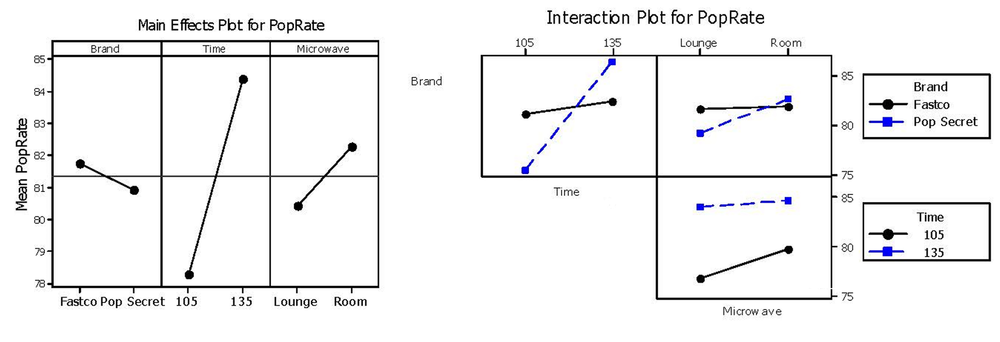
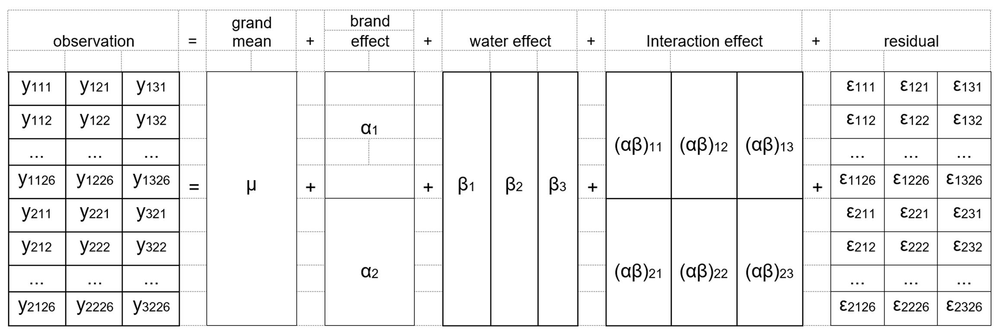
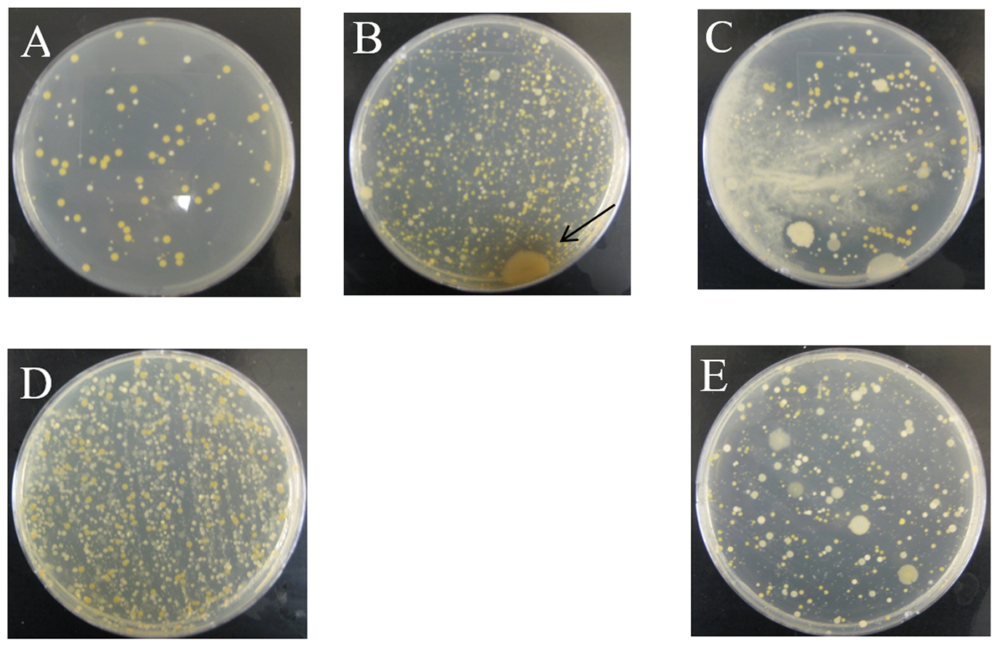

--- 
title: "Chapter 4"
output:
  bookdown::pdf_book:
    latex_engine: xelatex
    number_sections: true
    toc: true
    toc_depth: 2
    keep_tex: true
documentclass: report
bibliography:
  - book.bib
  - packages.bib
biblio-style: apalike
csl: "chicago-fullnote-bibliography.csl"
site: bookdown::bookdown_site

---
```{r setup,include=FALSE,warning=FALSE,message=FALSE}
knitr::opts_chunk$set(echo=FALSE)
library(dplyr)
library(readr)
library(knitr)
library(kableExtra)
library(ggplot2)
library(tidyverse)
library(devtools)
library(plotly)
install_github("Tanvi-Jindal/myfirstpackage")
library(myfirstpackage)
theme_set(
  theme_minimal(base_family = "Latin Modern Roman") +
    theme(
      plot.title = element_text(size = 24, face = "bold"),
      axis.title = element_text(size = 12),
      plot.caption = element_text(size = 10, hjust = 0)
    )
)
```


# The Design and Analysis of Factorial Experiments: Microwave Popcorn

*However beautiful the strategy, you should occasionally look at the results.*  
— Winston Churchill

Statistics ought to be viewed as a whole: understanding the process of formulating *questions*, properly designing a study, actively collecting meaningful data, and then deciding how to properly organize and draw conclusions from the data. Advancements in technology have made data collection and computationally intensive statistical techniques much more feasible. At one time, many statisticians had narrowly defined roles and were considered as primarily “number crunchers.” Today, statisticians characteristically work on interdisciplinary teams that emphasize scientific inference and understanding data in context.

Instead of emphasizing formulas, computation, and mathematical theory, this chapter uses a simple popcorn experiment to demonstrate the numerous challenges that can occur in designing experiments and collecting data.

In this chapter, you will have the opportunity to:

* Key features of a well‑designed experiment and proper data collection  
* Proper determination of response variables, experimental factors, and levels  
* Building on the one‑way ANOVA discussed in Chapter 2 to describe multivariate factorial designs  
* Evaluating multiple hypotheses based on main effects and interaction terms  
* Calculating each of the between‑group and within‑group variances needed in ANOVA tables for balanced factorial designs  
* Calculating effects and developing mathematical models  
* Using multiple comparison tests with ANOVA tables  

## **Investigation: Which Microwave Popcorn Is the Best?**

Popcorn is a staple for many college students. While many students like popcorn because it is inexpensive and easy to prepare, it is also a whole grain food that’s low in fat and calories. According to The Popcorn Institute, Americans consume an average of 54 quarts of popcorn a year per person.

Two popcorn lovers, who also happened to be taking a statistics course, decided to test whether there is a difference in quality between microwave popcorn brands. Yvonne and Tue wanted to know if a cheaper brand of popcorn was just as good as more expensive popcorn. These students could have chosen to conduct a study that could be analyzed with a two‑sample *t*‑test if they had simply compared two brands of popcorn. However, if they did a two‑sample *t*‑test, they would need to hold many factors constant, such as the type of microwave, cooking time, and storage procedures. Since Yvonne and Tue believed that some of these factors could also impact the quality of the popcorn, they decided to include some of these additional factors in their study.

Modeling real‑world phenomena often requires more than just one factor to explain changes in the response. **Factorial designs** are any statistical designs that are structured to use factors (i.e., explanatory variables) to organize meaningful groups of treatment conditions. A two‑sample *t*‑test can be considered a special case of a factorial design that has just one factor (popcorn brand in this case) and two levels (Brand A and Brand B). Factorial designs are very powerful statistical tools because they allow a researcher to simultaneously test the effects of multiple factor‑level combinations on a response of interest.

\large  
\textbf{\textcolor{red}{Key Concept:}}  
\color{red}
In factorial designs, each explanatory variable is called a **factor** and specific conditions within each factor are called **levels**. In any study, these factor‑level combinations are called **conditions**; in experiments, they are often called **treatments**. Factorial designs are often used to test the effects of multiple factors simultaneously, where each factor has two or more levels.  
\color{black}
\normalsize

## **Elements of a Well-Designed Experiment**

Unfortunately, many people mistakenly believe that statistics is only a process of performing mathematical calculations on data in order to examine the validity of a hypothesis. Proper experimental design is just as important as, if not more important than, the choice of statistical calculations. In fact, designing experiments and collecting appropriate data are often the most difficult and time-consuming aspects of conducting experiments.

\large  
\textbf{\textcolor{red}{Key Concept:}}  
\color{red}
A good design attempts to answer the question(s) of interest as clearly and efficiently as possible. Any statistical analysis is only as good as the quality of the data.  
\color{black}
\normalsize

An **experiment** is defined as a study in which purposeful changes are made to controlled conditions in order to identify changes in a response. An experiment imposes a treatment on subjects or experimental units, while an **observational study** simply collects data under varying conditions without imposing any changes. Well-designed experiments are conducted under controlled conditions to make it easier to isolate the impact of each treatment combination. In observational studies, the conditions in the study are rarely the only characteristic that makes the two (or more) populations different. Thus, unknown factors that may bias the results are unfortunately built into an observational study.

\large  
\textbf{\textcolor{red}{Key Concept:}}  
\color{red}
Both experiments and observational studies use sample data to draw conclusions about a larger population, process, or system. It is often much easier to show cause and effect relationships in a well-designed experiment because conditions are controlled.  
\color{black}
\normalsize

\large  
\textbf{NOTE:}  
Some texts state that only experiments can be used to show cause and effect relationships. However, poorly designed experiments should not be used to show causation. In addition, observational studies (such as those testing a relationship between smoking and lung cancer) can be used to show causation if (1) there is a strong association between the explanatory and response variables, (2) higher doses are associated with stronger responses (e.g., more cigarettes increase the likelihood of getting cancer), (3) there are consistent results across many studies, and (4) there are credible explanations for the cause and effect relationship.  
\normalsize

**Experimental design** is the process of planning an experiment that collects the right amount and type of data to answer a question of interest. Several decisions need to be made about how an experiment is to be constructed and executed to ensure that the experimental results are valid. Taking the time to properly design an experiment will improve the precision of answers to research questions. In addition, well-designed experiments often are much more efficient and obtain stronger conclusions than other studies.

The first step in designing an experiment is to clearly define a problem and state the objectives of the experiment. This is often much more difficult than it first appears. Before any data are collected, it is essential that everyone involved understand the objectives of the experiment, what measurements will be taken, what material is needed, and what procedures will be used. Good experimental design typically involves gaining background knowledge outside the field of statistics.

There are many possible ways to conduct an experiment to determine the effect of brand on the quality of popcorn. While microwave popcorn is something these students were quite familiar with, they needed to determine which brands to compare, the appropriate cooking time (which could vary by microwave), and how to define and measure “good” popcorn.

## Identifying a Response Variable {-}

Many possible measurements could be taken on microwave popcorn. Yvonne and Tue could have created a taste rating or a texture rating, measured the volume of the kernels, counted the number of popped kernels, or calculated the percentage of “old maids,” the kernels that did not pop after the bag had been cooked.

Identifying the response variable corresponds to determining what measurements should be taken. Each experiment should ensure that the response variable provides the information needed and that the response measurement is precise enough to address the question of interest. Yvonne and Tue determined that their definition of “quality” popcorn would be popcorn that had the highest percentage of popped kernels per bag. Notice that if Yvonne and Tue had counted only the popped kernels, and not the unpopped kernels, they might have gotten a distorted response, since some brands may tend to have more kernels per bag.

Yvonne and Tue initially discussed randomly sampling 20 kernels from each popped bag and calculating the percentage of popped kernels. However, the size and shape differences between popped and un-popped kernels would have made it rather difficult to simply pull out a random sample. Thus, in order to ensure their counts were as accurate as possible, they decided to count every kernel in every bag of their experiment.

It is also useful to discuss the range and variability of responses expected to be observed. For example, if we conducted a study under conditions that typically gave only two outcomes, either 0% or 100%, the response would be categorical (such as yes/no or popped/not popped), and then an analysis based on categorical response variables should be used. Studies with categorical response variables can be analyzed with techniques such as the chi-square test or logistic regression, which are discussed in Chapters 6 and 7, respectively.

The percentage of popped kernels was considered a quantitative response variable in this experiment. Background research showed that some popcorn companies expected between 94% and 97% popped kernels, but based on their prior popcorn eating experience, Yvonne and Tue expected the percentage to be a little lower. In Yvonne and Tue’s study, they roughly estimated that responses should be between 60% and 99% popped kernels, with an average close to 90%.

\large  
\textbf{\textcolor{red}{Key Concept:}}  
\color{red}
Care needs to be taken before a study is conducted to ensure that the response measurement is accurate and applicable to the research question.  
\color{black}
\normalsize

## **Identifying the Factors and Levels**

The next step in designing an experiment is to investigate any factors that may be of importance or may potentially bias the results. Yvonne and Tue had two microwaves that they typically used to make popcorn, one in their dorm lounge and one in their room. The lounge microwave had a “popcorn” setting, which cooked for 1 minute 45 seconds, though the package instructions for each brand suggested varying cooking times. Most microwaves also have power settings. Should popcorn always be popped at the highest power setting?

With a little research, these students found that the quality of popcorn can also be affected by how it is stored. Popcorn stored in a moisture-rich environment, such as a refrigerator, tends to have a higher percentage of popped kernels. However, too much moisture may cause the popcorn to have a gummy texture. Finally, Yvonne and Tue wanted to compare a relatively expensive brand of popcorn (Pop Secret) to a relatively inexpensive brand (Fastco). Each of these brands also has a variety of flavors, such as butter, kettle corn, and caramel.

Notice that the discussion of factors and potential levels is based not on statistical calculations, but on nonstatistical knowledge. Nonstatistical knowledge is often essential in choosing factors, determining factor levels, and interpreting the results of a study.

Yvonne and Tue decided on three factors of interest, factors that would be included in the study to determine if different levels impact the results:

Factor 1: popcorn Brand at two levels, Fastco and Pop Secret  
Factor 2: Microwave at two levels, Lounge and Room  
Factor 3: cooking Time at two levels, 105 seconds and 135 seconds

It can sometimes be difficult to identify a reasonable range for each factor. Yvonne and Tue had noticed that some brands of popcorn tended to burn at around 150 seconds (2.5 minutes). Even though cooking popcorn longer than 135 seconds might increase the percentage of popped kernels, Yvonne and Tue decided to avoid cooking times likely to cause burning.

Yvonne and Tue then listed suspected extraneous variables, other factors that need to be controlled during the experiment to eliminate potential biases. Yvonne and Tue decided to hold some extraneous variables constant. In particular, they used only the highest power setting on each microwave, they stored all the popcorn on a shelf in their room, and they used only the butter flavor of each brand. There were other variables they could not control, such as age of the popcorn, which manufacturing plant prepared each bag of popcorn, and how different retail stores had stored the popcorn. To account for the extraneous variables they could not control (or had not even thought of), it would be best to randomly select bags of popcorn from the entire population. Instead, Yvonne and Tue did their best to randomly select several bags of Fastco and Pop Secret butter popcorn from a variety of stores in town. This was not a true random sample, and Yvonne and Tue had to be careful in making any statements about how the results of their study extended to a larger population. In addition, when possible, each bag of popcorn in the study was randomly allocated to a factor-level combination. While bags of popcorn can be randomly assigned to a cooking time and microwave, they cannot be randomly assigned to a popcorn brand.

\large  
\textbf{\textcolor{red}{Key Concept:}}  
\color{red}
A good design controls for known extraneous variables (often by holding them constant throughout
the study) and then uses random sampling and random allocation to control for any other unknown or
uncontrollable extraneous variables.
\color{black}
\normalsize

## Choosing a Design {-}

In addition to determining what conditions to test and what measurements to take, in order to create a good experimental design, a researcher must properly define units and determine how units are structured. An **experimental unit** is the smallest part of experimental material that is assigned (randomly, if possible) to a factor-level combination within a study. Since Yvonne and Tue counted every kernel of popcorn, some may incorrectly assume that each kernel is a unit. In an experiment, units are randomly assigned to treatments. In this study, each kernel was not randomly assigned to a condition, but each bag of popcorn was randomly assigned to be popped in a particular microwave for a particular length of time. Thus, bags of popcorn are considered the units for Yvonne and Tue’s study.

\large  
\textbf{\textcolor{red}{Key Concept:}}  
\color{red}
If (1) units are as similar as possible, (2) units are randomly assigned to treatment combinations, and (3) large enough sample sizes are used, then we can conclude that statistically significant differences in the response can be explained by the different treatment combinations.
\color{black}
\normalsize

This chapter will focus on **completely randomized factorial designs**. In completely randomized designs, each unit is assigned to exactly one factor-level combination. Only one measurement is collected for each unit. In the following section, we will use Yvonne and Tue’s data to simultaneously test for the effects of two brands, two cooking times, and two microwaves on the percentage of popped kernels.

\large  
\textbf{NOTE:}  
While this chapter focuses only on completely randomized factorial designs, it is important to recognize the difference between completely randomized, **block and split-plot** or (**repeated measures**) designs. If each unit is assigned to only one factor-level combination, it is appropriate to use a completely randomized design. If each unit is assigned to several conditions or multiple measurements are taken on each unit, a more complex design structure, such as a block or split-plot (repeated measures) design, may be needed.

Block and split-plot (repeated measures) designs also work with different types of factors. The factors of interest in this chapter all have fixed effects. **Fixed effects** correspond to factors where each level is selected because it is of specific interest to the researcher. **Random effects** correspond to factors where the levels are randomly selected from a larger population. All factors in a completely randomized design are also **crossed**; this means that every level of each factor can be tested in combination with every level of every other factor. Alternatively, **nested factors** are factors for which some levels cannot occur simultaneously with other factor levels. Random effects and nested factors can be analyzed with block and split-plot (repeated measures) designs; they are described in Chapter 5.
\normalsize

\large  
\textbf{\textcolor{red}{Key Concept:}}  
\color{red}
If possible, a straightforward design and analysis are usually better than a complex design and analysis. If the design is too complicated and the data are not collected properly, even the most advanced statistical techniques may not be able to draw appropriate conclusions from an experiment.
\color{black}
\normalsize

## **Determining Sample Sizes for Completely Randomized Designs**

When more units are tested, it is more likely that the statistical analysis will identify true differences between conditions. However, every unit tested has a cost, and it is important to carefully determine how many units are practical to test. Is it worth testing additional units to gain a better understanding of the unit-to-unit variability?

Yvonne and Tue estimated that they could each count the kernels in one bag (popped and unpopped) in 10 to 15 minutes. They also thought that they could get a few close friends to count a few bags in exchange for free popcorn. Care should always be taken when measuring results. If the result is a subjective measurement (such as the taste of popcorn or the quality of artwork), very clear procedures should be written and, if possible, the same people should record each measurement. In this popcorn study, counting the percentage of popped kernels per bag is an objective measurement. As long as Yvonne and Tue have trustworthy friends, there should be no problem in having several people help count popcorn kernels.^[Ideally, they would have preferred to have at least two people count each bag to ensure against errors, but that would have doubled the time needed to conduct the experiment. Repeatability and reliability (often called gauge R&R) studies are a technique discussed in many quality control texts as a way to ensure that different people or processes provide similar results.
\normalsize] They estimated that they could conduct 32 tests in about four hours.

The choice of 32 tests, instead of a round number like 30, is also related to a well-designed experiment. Yvonne and Tue found that, based on their choice of factors and levels, there were a total of eight treatment combinations. Table 4.1 lists the eight possible treatment conditions that can be "assigned" to each bag of popcorn. Yvonne and Tue wanted to have a balanced design, a design where the same number of units is assigned to (or randomly selected from) each condition. Balanced designs are often easier to analyze and more likely to identify true differences in the effects of different conditions.$^3$ If Yvonne and Tue wanted to conduct a balanced design, they needed to conduct tests in a multiple of 8 (16, 24, etc.).

```{r tab4.1, echo=FALSE, results='asis'}
df4.1 <- data.frame(
  `Treatment Combination` = 1:8,
  `Popcorn Brand` = c(
    "Fastco", "Pop Secret", "Fastco", "Pop Secret",
    "Fastco", "Pop Secret", "Fastco", "Pop Secret"
  ),
  `Microwave Location` = c(
    "Lounge", "Lounge", "Room", "Room",
    "Lounge", "Lounge", "Room", "Room"
  ),
  `Cooking Time` = c(
    105, 105, 105, 105, 135, 135, 135, 135
  ),
  check.names = FALSE,
  stringsAsFactors = FALSE
)

cat(
  kable(
    df4.1,
    format = "latex",
    booktabs = TRUE,
    caption = "Table 4.1 All possible treatment conditions for the three-factor popcorn study.",
    align = c("c","c","c","c")
  ) %>%
    kable_styling(latex_options="hold_position")
)
```

\large  
\textbf{MATHEMATICAL NOTE:}  
Table 4.1 lists the variables in standard order. Listing conditions in **standard order** is a simple technique that ensures that each factor combination is listed exactly once. The first variable alternates levels every row. For the second variable, levels alternate every other row. The third variable alternates every fourth row. This same process can work for multiple factors with multiple levels. If there were four factors, each with two levels, the fourth column would alternate every eight rows. For studies with more than two levels, simply ensure that the current variable lists each level exactly once for all prior combinations.
\normalsize

### This part not working. The heading is numbered, but it shouldnt be.
## Activity: Determining the Number of Treatment Combinations {‑}
>1. Assume we want to use three cooking times for popping the popcorn instead of two. List the possible treatment combinations that can be assigned. How many are there?
2. Without listing all possibilities, calculate how many treatment combinations would exist for a design that tested five brands with three microwaves at four cooking times.

## **Analyzing a Two-Way Factorial Design**

Since several factors are included in this experiment, there are also several hypotheses to be tested. Yvonne and Tue actually had six research questions, which will be discussed in Section 4.4. But to keep the calculations simple, in this section we will assume that only two factors were tested (*Brand* and *Time*). This leads to three hypotheses corresponding to the *Brand* and *Time* factors.

1. $H_{0,1}: \mu_{\text{Fastco}} = \mu_{\text{PopSecret}}$; there is no difference in the mean response (*PopRate*) between the two *Brands*.$^*$^[$^*$This is often written as $H_{0,1}$: there is no *Brand* effect or $H_{0,1}: \alpha_{\text{Fastco}} = \alpha_{\text{PopSecret}} = 0$, where $\alpha$ is called the effect size. For example, $\alpha_{\text{Fastco}} = \mu_{\text{Fastco}} - \mu$, where $\mu$ is the overall grand mean of the responses.]  
   $H_{a,1}: \mu_{\text{Fastco}} \ne \mu_{\text{PopSecret}}$; the two *Brand* means are different.

2. $H_{0,2}: \mu_{105} = \mu_{135}$; there is no difference in the mean *PopRate* for the two *Times*.  
   $H_{a,2}: \mu_{105} \ne \mu_{135}$; the two *Time* means are different.

3. $H_{0,3}$: *Brand* has no influence on how *Time* affects *PopRate*. This is equivalent to stating $H_{0,3}$: *Time* has no influence on how *Brand* affects *PopRate* or $H_{0,3}$: the effect of *Time* is the same for both *Brands* or $H_{0,3}$: there is no interaction between *Time* and *Brand*.  
   $H_{a,3}$: *Brand* influences how *Time* affects *PopRate* or $H_{a,3}$: there is an interaction between *Time* and *Brand*.

Factorial designs are efficient because much more information can be calculated, such as $p$-values for multiple hypothesis tests, without requiring more experimental units than for the typical two-sample $t$-test. Factorial designs are very beneficial in situations where experimental units are expensive or difficult to obtain. The next sections will discuss how to organize and draw conclusions for each of the above hypotheses in a factorial design with two factors, also called a **two-way factorial design**.

### This part not working. The heading is numbered, but it shouldnt be.
## Activity: Visualizing the Data {‑}
>3. Use Figure 4.1 to compare the \textit{PopRate} for each of the four factor-level combinations. Do the four groups appear to have similar means or similar standard deviations? Are there any outliers (extreme observations that don't seem to fit the rest of the data)? Describe any patterns you see in the data.  
4. Calculate the average *PopRate* for each *Brand* and each *Time*. Calculate the overall average *PopRate*.  
5. Use the data set labeled `Popcorn` to calculate appropriate summary statistics (the median, mean, standard deviation, range, etc.) for each of the four groups. For the Fastco brand, calculate the difference between the average *PopRate* for the two cooking times. Do the same for the Pop Secret brand.

### This part not working. The heading is numbered, but it shouldnt be.
## Notation for Multiple Explanatory Variables {‑}

Table 4.2 shows the `Popcorn` data set organized by the *Brand* and *Time* factors. Each of the four treatment combinations has eight observations. The data are also provided in the file `Popcorn`.

```{r fig4.1, warning=FALSE, echo=FALSE, fig.width=6, fig.height=4, message=FALSE, fig.cap="Figure 4.1 Individual value plot of the PopRate (100 $\times$ count of popped kernels/total kernels) for each Brand and cooking Time factor-level combination. Points have jittering (small fluctuations) so that all values are visible."}
library(ggplot2)
#pop <- read.csv("Popcorn2.csv")
data("C4Popcorn")
df<-C4Popcorn

pop$Brand <- factor(pop$Brand, levels = c("Fastco", "Pop Secret"))
pop$Time <- factor(pop$Time, levels = c(105, 135))

ggplot(pop, aes(x = interaction(Brand, Time, sep = "\n"), y = PopRate)) +
  geom_jitter(width = 0.17, size = 2.6) +
  labs(
    title = "Individual Value Plot of PopRate",
    y = "PopRate",
    x = "Time\nBrand"
  ) +
  scale_y_continuous(limits = c(65, 95), breaks = seq(65, 95, 5)) +
  theme_minimal(base_family = "serif") +
  theme(
    plot.title = element_text(size = 18, hjust = 0.5),
    axis.title.x = element_text(size = 13),
    axis.title.y = element_text(size = 15),
    axis.text.x = element_text(size = 13),
    axis.text.y = element_text(size = 12),
    panel.background = element_rect(fill = "white", colour = "black", linewidth = 1),
    plot.background = element_rect(fill = "grey90", colour = "black", linewidth = 1),
    panel.border = element_rect(fill = NA, colour = "black", linewidth = 1)
  )
```

```{r tab4.2, echo=FALSE, results='asis'}
df4.2 <- data.frame(
  `Fastco_105` = c(82.60, 87.50, 75.30, 80.20, 73.80, 77.60, 88.50, 83.56, 81.13),
  `Fastco_135` = c(81.07, 90.80, 84.06, 71.50, 81.34, 92.60, 74.30, 83.36, 82.38),
  `PopSecret_105` = c(77.70, 72.54, 65.98, 72.56, 74.51, 80.83, 88.97, 70.44, 75.44),
  `PopSecret_135` = c(91.41, 83.78, 79.70, 90.05, 78.71, 90.56, 94.28, 82.90, 86.42)
)

# Labels for row names
row_labels <- c(rep("", 8), "Mean Response")

# Bind the row labels as first column
tab <- cbind(row_labels, df4.2)

# Custom column names
colnames(tab) <- c("", "105 seconds", "135 seconds", "105 seconds", "135 seconds")

cat(
  kable(
    tab,
    format = "latex",
    booktabs = TRUE,
    escape = FALSE,
    caption = "Table 4.2 Popcorn study data: the PopRate for each bag of popcorn with sample mean corresponding to each factor-level combination.",
    align = c("l", rep("c", 4)),
    row.names = FALSE
  ) %>%
    add_header_above(
      c(
        " " = 1,
        "Fastco" = 2,
        "Pop Secret" = 2
      )
    ) %>%
    add_header_above(
      c(" " = 1, "Microwave Popcorn Brand" = 4)
    ) %>%
    kable_styling(latex_options = "hold_position")
)

```

Table 4.3 is useful in visualizing the differences and similarities among the meaningful groups within this data set: the overall average, the two *Brand* groups, the two *Time* groups, and the four factor-level combinations. Table 4.3 also includes mathematical notation representing each mean. For example, $\bar{y}_{11}$ represents the mean of the 8 responses from the first *Brand*, Fastco, and the first *Time* group, 105 seconds. $\bar{y}_{2.}$ represents the mean of the 16 responses from the second *Brand* group, Pop Secret. $\bar{y}_{..}$ represents the overall mean of all 32 responses.

```{r tab4.3, echo=FALSE, results='asis'}
df4.3 <- data.frame(
  Brand = c("Fastco", "Pop Secret", "Cooking Time Means"),
  `105 seconds` = c("$\\overline{y}_{11.} = 81.13$", "$\\overline{y}_{21.} = 75.44$", "$\\overline{y}_{.1.} = 78.3$"),
  `135 seconds` = c("$\\overline{y}_{12.} = 82.38$", "$\\overline{y}_{22.} = 86.42$", "$\\overline{y}_{.2.} = 84.4$"),
  `Brand Means` = c("$\\overline{y}_{1..} = 81.8$", "$\\overline{y}_{2..} = 80.9$", "$\\overline{y}_{...} = 81.3$"),
  check.names = FALSE
)

cat(
  kable(
    df4.3,
    format = "latex",
    booktabs = TRUE,
    escape = FALSE,
    caption = "Table 4.3 Popcorn study sample means: the mean \\texttt{PopRate} (per 100 kernels) for each of the nine meaningful groups of sample data.",
    align = c("l","c","c","c")
  ) %>%
    add_header_above(
      c(" " = 1, "Factor-Level Group Means Cooking Time" = 2, " " = 1)
    ) %>%
    kable_styling(latex_options = "hold_position")
)
```

\large  
\textbf{MATHEMATICAL NOTE:}  
The dot in the subscript indicates that the average was taken over all values of that subscript. The key is to recognize that groups are identified by their subscripts. *Brand* is the first subscript, and *Time* is the second. Each individual observation for each *Brand* and *Time* factor-level combination is represented by the third subscript. For example, the 4th observation in Table 4.2 for the Fastco brand (brand 1) and the 135-second time (time 2) group is $y_{124} = 71.50$. The average of the 8 observations in the Fastco brand (brand 1) and 135-second time group is represented by $\bar{y}_{12} = 82.38$. In addition, $\bar{y}_{1.}$ is the average response of all 16 of the Fastco brand (brand 1) observations, while $\bar{y}_{.1}$ is the average response of all 16 of the 105-second times (time 1 observations). $\bar{y}_{..}$ is the average *PopRate*, averaged over all observations for both *Brand* and cooking *Time*. That is, $\bar{y}_{..}$ is the overall average *PopRate*.
\normalsize

### This part not working. The heading is numbered, but it shouldnt be.
## Activity: Understanding Notation {‑}
>6. Which notation would be used to describe the sample average of the 135-second group?  
7. Explain the difference between $\bar{y}_{21}$ and $\bar{y}_{12}$.

### This part not working. The heading is numbered, but it shouldnt be.
## Comparing Variances* {‑} ^[If you have studied ANOVA tables before, you may find it surprising that we focus on mean squares (MS) and do not discuss sums of squares (SS) or degrees of freedom (df). The focus of this section is the concepts and logic behind ANOVA. ANOVA is the process of comparing between group and within group variability. These types of variability are represented by the mean squares. Chapter 2 and the extended activities discuss sums of squares and degrees of freedom.]

Figure 4.1 and Table 4.3 indicate that the difference between the *Time* means is much larger than the difference between the *Brand* means. In addition, the difference between *Time* means is much larger for the Pop Secret brand than for the Fastco brand. In this section, we will conduct an analysis, called analysis of variance, to find $p$-values for testing each of the three hypotheses stated earlier about the underlying mean responses.

Analysis of variance (ANOVA) is conducted by comparing the variability between groups to the variability within groups. For example, does the variability between *Brand* means (between groups) appear to be large compared to the variation of responses within the two *Brand* levels (within groups)? In ANOVA, these measures of variability are called mean squares. For example, the variability between brands is called mean square brand and is denoted $MS_{\text{Brand}}$. In actual practice, the following ANOVA calculations are done with computer software instead of by hand. The reason for working through these equations in detail is to better illustrate the logic behind using ANOVA to determine if between group variability is significant (i.e., to determine whether we can reject any of the null hypotheses).

**Between-Group Variability** To create a measure of the variability between *Brand* means ($MS_{\text{Brand}}$) calculate the weighted variance of the *Brand* group means, using the size of each group as the weight. The weighted variance of the *Brand* group means is calculated with the following equation:

\begin{align}
MS_{\text{Brand}} = \frac{\sum_{i=1}^{2} n_i \times (\bar{y}_{i.} - \bar{y}_{..})^2}{2-1}
\notag
\end{align}

\begin{align}
= \frac{16 \times (81.8 - 81.3)^2 + 16 \times (80.9 - 81.3)^2}{2-1}
\tag{4.1}
\end{align}

where $n_i$ is the number of observations for brand $i$. In this study, $n_i = 16$ observations are taken for each brand. Notice that Equation (4.1) looks similar to a typical variance calculation:

- There are two observed group means: 81.8 and 80.9.
- The spread is measured by summing the squared distance between each observed group mean and the overall mean and then dividing by the number of group means minus one.

As with any variance calculation, we are finding an average squared distance (mean squared distance, denoted $MS_{\text{Brand}}$). The difference between this calculation and a typical variance calculation is the use of weights:

- Each observed mean is based on a group of size 16; this group sample size ($n_i = 16$) is multiplied by each squared distance.

\large  
\textbf{MATHEMATICAL NOTE:}  
In our study, we have a balanced design (i.e., equal sample sizes in every group). However, the formulas throughout this section allow for studies with unequal sample sizes (called unbalanced designs).
\normalsize

The calculation of the variability between the *Time* means ($MS_{\text{Time}}$) is very similar to Equation (4.1):

\begin{align}
MS_{\text{Time}} = \frac{\sum_{j=1}^{2} n_j \times (\bar{y}_{.j} - \bar{y}_{..})^2}{2-1}
\tag{4.2}
\end{align}

The first two hypotheses at the beginning of this section correspond to questions about main factors incorporated into the experiment, *Brand* and *Time*. The third hypothesis focuses on whether the impact of one variable (*Time*) depends on a second variable (*Brand*). This is called an interaction effect.

Table 4.3 provides some evidence of interaction between *Brand* and *Time*. For the Fastco brand popcorn, the longer cooking time increases the percentage of popped kernels by $\bar{y}_{12.} - \bar{y}_{11.} = 82.38 - 81.13 = 1.25$, while the increase for the Pop Secret brand is many times larger: $\bar{y}_{22.} - \bar{y}_{21.} = 86.42 - 75.44 = 10.98$.

To test for an interaction effect (the third hypothesis), we first measure the variability between all four groups (each *Brand* and *Time* combination) and then subtract the squared values for the main factors.

\begin{align}
MS_{\text{BrandTime}} = \frac{\sum_{i=1}^{2}\sum_{j=1}^{2} n_{ij}(\bar{y}_{ij.} - \bar{y}_{..})^2 - \sum_{i=1}^{2} n_{i.}(\bar{y}_{i.} - \bar{y}_{..})^2 - \sum_{j=1}^{2} n_{.j}(\bar{y}_{.j} - \bar{y}_{..})^2}{4 - 1 - 1 - 1}
\tag{4.3}
\end{align}

The key aspect of Equation (4.3) is that it calculates the squared distance between the four factor-level group means and the overall mean after accounting for the main factor group means. Thus, this calculation is an estimate of how spread out the four group means are after accounting for any influence of the main factor means.

The denominator of the mean square for interaction is based on the denominators from $MS_{\text{Brand}}$ in Equation (4.1) and $MS_{\text{Time}}$ in Equation (4.2). In this example, there are four factor-level group means. Thus, the denominator is calculated as $4 - 1 -$ (denominator from $MS_{\text{Brand}}$) $-$ (denominator from $MS_{\text{Time}}$) $= 4 - 1 - 1 - 1$. Details for deriving mean squares are provided in the extended activities.

\large  
\textbf{\textcolor{red}{Key Concept:}}  
\color{red}
The interaction term is not simply a measure of the spread between the four factor-level group means. It measures the remaining spread of the means after adjusting for differences between the main factor means.
\color{black}
\normalsize

**Within-Group Variability** The best estimate of the variability within each group (MSE) is simply a weighted average of the sample variances within each of the four factor-level groups:

\begin{align}
\text{MSE} &= 
\frac{\sum_{i=1}^{2}\sum_{j=1}^{2}(n_{ij} - 1)s_{ij}^2}{(n_{11} - 1) + (n_{12} - 1) + (n_{21} - 1) + (n_{22} - 1)} \notag \\
&= \frac{(8 - 1)s_{11}^2 + (8 - 1)s_{12}^2 + (8 - 1)s_{21}^2 + (8 - 1)s_{22}^2}
{(8 - 1) + (8 - 1) + (8 - 1) + (8 - 1)}
\tag{4.4}
\end{align}

where $s_{ij}^2$ is the sample variance for the group representing brand $i$ and time $j$. The implicit assumption here is that the variances of the possible responses with each of the four group populations are all the same, so it makes sense to “pool” the sample variances into a single estimate of overall response variability. This **equal variance assumption** is key to the validity of the ANOVA statistical method. If the variability within each group is quite different, the MSE may not be an appropriate estimate. It is often useful to create individual value plots or side-by-side boxplots of the groups to check if the spreads of the sample groups are roughly similar.

\large  
\textbf{MATHEMATICAL NOTE:}  
If groups of data from each factor-level combination have very different sample sizes and at least one group has a small sample size (e.g., less than 5 units per group), then ANOVA may not be appropriate. If the group(s) with the smallest sample size (s) has an unusually high variance, the MSE is likely to underestimate the true variance and ANOVA is likely to incorrectly reject the null hypothesis (conclude that there are differences when there really are no differences between group means). If the group(s) with the smallest sample size(s) has an unusually small variance, the **MSE** is likely to overestimate the true variance. The larger MSE may cause us to incorrectly fail to reject the null hypothesis (fail to detect true differences).
\normalsize

Equation (4.4) is often called the **mean square error** (MSE) of the responses, because “error” represents the unit-to-unit variability in the response that can’t be explained by any of the main factors or interactions. We are now ready to calculate a test statistic corresponding to each of the three hypotheses at the beginning of this section.

**The F-Statistic** The F-statistic is a ratio of the between-group variability (variation between factor-level averages) to the within-group variability (pooled estimate of variability within each factor-level combination): (MS for factor)/MSE. Mathematical theory proves that if the assumptions of the ANOVA model hold, the F-statistic follows an F-distribution with degrees of freedom corresponding to the denominators of the MS for the factor being tested and the MSE. The $p$-value gives the likelihood of observing an F-statistic at least this large, assuming that the true population factor has equal level means. Thus, when the $p$-value is small, we conclude that there is a difference between the level means. Additional details are provided in the extended activities at the end of the chapter.

\large  
\textbf{\textcolor{red}{Key Concept:}}  
\color{red}
An F-statistic is simply the ratio of the between-group variability to the within-group variability.
\color{black}
\normalsize

### This part not working. The heading is numbered, but it shouldnt be.
## Activity: Calculating F-Statistics {‑}
>8. Use Equation (4.1) to estimate $MS_{\text{Brand}}$, the variability between *Brand* means.  
9. Calculate the variability between *Time* means, $MS_{\text{Time}}$. Explain the key differences between Equation (4.1) and Equation (4.2).  
10. Use Equation (4.3) to estimate $MS_{\text{BrandTime}}$.  
11. Calculate the $F$-statistics corresponding to the three hypothesis tests: $\frac{MS_{\text{Brand}}}{\text{MSE}}$, $\frac{MS_{\text{Time}}}{\text{MSE}}$, $\frac{MS_{\text{BrandTime}}}{\text{MSE}}$.  
12. What do you think are the largest and smallest possible values of any $F$-statistic?  
13. Use the technology instructions provided on the CD to check your answers. Submit the software output. Note that a $p$-value for each $F$-statistic is provided. State your conclusions about each of the three hypotheses based on these $p$-values.  
Don’t be surprised if your hand calculations in Question 11 differ somewhat from the software output here. The data in Table 4.3 were rounded to one decimal place, so calculations in Questions 8 through 11 are not as accurate as statistical software.  
14. Explain why a large $F$-statistic corresponds to a small $p$-value by referring to the definition of an $F$-statistic: a ratio of between-group variability to within-group variability.  
15. **Checking Assumptions** As described in Chapter 2, assumptions need to be checked to ensure that the $p$-value for each ANOVA $F$-test is reliable:
- The observations within each group (each factor-level combination) are independent and identically distributed.
- Each group has equal variances.
- The residual values follow a normal distribution with a mean of zero.
a. Examine the individual value plot in Figure 4.1 and comment on the assumptions for these hypothesis tests. Is there evidence of any skewness or outliers that may cause us to doubt the normal assumption for the *PopRate* within each factor-level combination of *Brand* and *Time*?
b. Does Figure 4.1 indicate that the spread of each group appears roughly similar, so the equal variance assumption seems reasonable? Another informal check of the equal variance assumption can be done by calculating the ratio of the maximum sample standard deviation to the minimum sample standard deviation. If this ratio is less than two, we can generally assume that there is not strong evidence against the equal variance assumption. Compare the standard deviations of the four treatment level combinations to determine if
\begin{align}
\frac{\max(s_{ij})}{\min(s_{ij})} < 2
\notag
\end{align}
c. Create a normal probability plot or histogram of the residuals from Question 13. Does it appear that the residuals follow a normal distribution?

\large  
\textbf{CAUTION:}  
Some statisticians will reject the equal variance assumption when the ratio of standard deviations is greater than 3 instead of 2. Others recommend that formal tests be used to test for equal variances. However, some tests, such as Bartlett’s test, are very sensitive to nonnormality. Box criticized using Bartlett’s test as a preliminary test for equal variances, saying, “To make the preliminary test on variances is rather like putting to sea in a rowing boat to find out whether conditions are sufficiently calm for an ocean liner to leave port.”$^4$ Levene’s test of homogeneity of variance is less sensitive to departures from normality.$^5$
\normalsize

### This part not working. The heading is numbered, but it shouldnt be.
## Interpreting Interaction Terms {-}

In Question 13, the $p$-value corresponding to the third hypothesis test listed at the beginning of this section was 0.04. This demonstrates an interaction: the effect of one variable (*Time*) on the response depends on a second variable (*Brand*). Figure 4.2 provides a side-by-side boxplot and an interaction plot of the *Popcorn* data. **An interaction plot** is simply a plot of the four factor-level group means shown in Table 4.3. These plots show that for both brands, the average *PopRate* increases when the cooking time changes from 105 to 135 seconds. However, the change in means for the Fastco brand is very small compared to the change observed in the Pop Secret brand.

```{r fig4.2, warning=FALSE, echo=FALSE, fig.width=6, fig.height=4, message=FALSE, fig.cap="Figure 4.2 Side-by-side boxplots and an interaction plot of the PopRate for each Brand and cooking Time factor-level combination."}
library(readr)
library(dplyr)
library(ggplot2)
library(patchwork)

#df <- read_csv("Popcorn2.csv", show_col_types = FALSE)
data("C4Popcorn")
df<-C4Popcorn
df <- df %>% mutate(Time = factor(Time))

p1 <- ggplot(df, aes(x = Time, y = PopRate, fill = Brand)) +
  geom_boxplot(
    position = position_dodge(width = 0.7),
    width    = 0.6,
    color = "black"
  ) +
  scale_fill_manual(
    "",
    values = c("Fastco" = "#00BFC4", "Pop Secret" = "gray30")
  ) +
  labs(x = "Time", y = "PopRate") +
  theme_minimal(base_family = "serif") +
  theme(
    panel.background = element_rect(fill = "white", colour = "black", linewidth = 1),
    panel.border = element_rect(fill = NA,       colour = "black", linewidth = 1),
    plot.background = element_rect(fill = "grey90",  colour = "black", linewidth = 1),
    legend.background = element_rect(fill = "white",   colour = "black"),
    legend.position = c(0.85, 0.85),
    axis.title = element_text(face = "bold"),
    plot.margin = margin(20, 20, 20, 20)
  )

means <- df %>%
  group_by(Brand, Time) %>%
  summarise(meanRate = mean(PopRate), .groups = "drop")

p2 <- ggplot(means, aes(x = Time, y = meanRate,
                        group   = Brand,
                        color   = Brand,
                        shape   = Brand,
                        linetype= Brand,
                        fill    = Brand)) +
  geom_line(size = 1) +
  geom_point(size = 3) +
  scale_color_manual(
    "",
    values = c("Fastco" = "black", "Pop Secret" = "#00BFC4")
  ) +
  scale_linetype_manual(
    "",
    values = c("Fastco" = "solid", "Pop Secret" = "dashed")
  ) +
  scale_shape_manual(
    "",
    values = c("Fastco" = 21, "Pop Secret" = 22)
  ) +
  scale_fill_manual(  # for the point fills
    "",
    values = c("Fastco" = "black",      "Pop Secret" = "#00BFC4")
  ) +
  labs(x = "Time", y = "PopRate") +
  theme_minimal(base_family = "serif") +
  theme(
    panel.background = element_rect(fill = "white", colour = "black", linewidth = 1),
    panel.border = element_rect(fill = NA,  colour = "black", linewidth = 1),
    plot.background = element_rect(fill = "grey90", colour = "black", linewidth = 1),
    legend.background = element_rect(fill = "white", colour = "black"),
    legend.position = c(0.75, 0.25),
    axis.title = element_text(face = "bold"),
    plot.margin = margin(20, 20, 20, 20)
  )

p1 | p2
```

The interaction plot is helpful in visualizing how the effect of one factor can depend on another factor, especially when there are multiple factors in the study. When the lines in an interaction plot are essentially parallel, the effect of the first variable is not influenced by a second variable. Nonparallel lines indicate an interaction between main factors (e.g., the effect of *Time* depends on *Brand*). However, the interaction plot does not show the within group variability, so only the $p$-value from the ANOVA can be used to determine if the interaction is significant. The $p$-value of 0.04 shows that the observed interaction effect is so large that it is unlikely to have occurred just by chance. We conclude that $H_{a,3}$ is true: *Brand* influences the effect of *Time* on *PopRate*.

## **Analyzing a Three-Way Factorial Design**

One advantage of ANOVA is that the analysis can easily be extended to multiple factors with many levels. In this section, all three factors in the popcorn study (*Brand*, *Time*, and *Microwave*) will be simultaneously examined for their influence on *PopRate* with a three-way ANOVA (also called a three-factor ANOVA).

Using only the 32 observations from the *Popcorn* data, a three-way ANOVA will allow us to simultaneously test the following six hypotheses:

1. $H_{0,1}: \mu_{\text{Fastco}} = \mu_{\text{PopSecret}}$

   $H_{a,1}: \mu_{\text{Fastco}} \ne \mu_{\text{PopSecret}}$

2. $H_{0,2}: \mu_{105} = \mu_{135}$

   $H_{a,2}: \mu_{105} \ne \mu_{135}$

3. $H_{0,3}$: *Brand* has no influence on how *Time* affects *PopRate*

   $H_{a,3}$: there is an interaction between *Brand* and *Time*

4. $H_{0,4}: \mu_{\text{Room}} = \mu_{\text{Lounge}}$

   $H_{a,4}: \mu_{\text{Room}} \ne \mu_{\text{Lounge}}$

5. $H_{0,5}$: *Microwave* has no influence on how *Brand* affects *PopRate*

   $H_{a,5}$: there is an interaction between *Microwave* and *Brand*

6. $H_{0,6}$: *Microwave* has no influence on how *Time* affects *PopRate*

   $H_{a,6}$: there is an interaction between *Microwave* and *Time*

\large  
\textbf{NOTE:}  
It is also reasonable to test for a three-way interaction. $H_{a,7}$, the size of the effect of *Time* for each level of *Brand*, also depends on a third variable, *Microwave*. In practice, the three-way interaction effect may be difficult to interpret and some researchers choose not to include them in their analysis. The impacts of including additional tests are described in Chapter 5.
\normalsize

### This part not working. The heading is numbered, but it shouldnt be.
## Activity: Conducting a Three-Way ANOVA {‑}
>16. Create individual value plots of the eight possible factor-level groups listed in Table 4.1.
a. Do you see any patterns in the *PopRate* among these groups?
b. Does the spread of the responses within each group look roughly similar?
c. Are there any outliers or unusual observations for any group(s)?
17. Calculate the eight group standard deviations. If the largest standard deviation is no more than two times the smallest standard deviation, it is typically appropriate to assume equal variances for the population of responses within each group. Is it appropriate to assume equal variances in this *Popcorn* study?
18. Use a statistical software package to simultaneously test all six hypotheses given at the beginning of this section.
a. Submit the appropriate software output.
b. Create a normal probability plot (described in Chapter 2) or a histogram of the residuals. Are the residuals consistent with the assumption of a normal distribution?
c. Use the $p$-value corresponding to each hypothesis to state your conclusions.
d. Address how random sampling and random allocation influence your conclusions.
19. Determine whether $MS_{\text{Brand}}$, $MS_{\text{Time}}$, and $MS_{\text{BrandTime}}$ are the same as in Question 13. Explain why the $F$-statistics corresponding to these three hypotheses have changed.

In completely randomized designs, all $F$-statistics corresponding to the tests for each main factor and interaction use the same denominator. The mean square for each main factor ($MS_{\text{Brand}}$, $MS_{\text{Time}}$, and $MS_{\text{Microwave}}$) is a measurement of the variability between level means. Since this is a balanced design, when the level means for a factor are farther apart, the corresponding mean square and $F$-statistics are larger. Thus, the main effects plot shown in Figure 4.3 allows us to quickly see that the *Time* factor is the most significant (has the smallest $p$-value) and the *Brand* factor is the least significant.

```{r fig4.3, echo=FALSE, out.width="80%", fig.align="center", fig.cap="Main effect plots and interaction plots for a three-factor ANOVA."}

```

Figure 4.3 also provides interaction plots corresponding to the three hypotheses tests about interactions. Using the same logic, Figure 4.3 shows that the hypothesis test corresponding to the *Brand* and *Time* interaction will have the smallest $p$-value. While both the effect of *Time* and the effect of *Brand* are somewhat influenced by *Microwave*, the effect of *Time* is most influenced by changing *Brand*.

## **What Can We Conclude from the Popcorn Study?**

Yvonne and Tue’s study illustrated how essential it is to carefully plan out a study before any data are collected. If the data are not collected properly, typically there is *no* statistical analysis that can draw accurate conclusions. When the study is well designed and the data are reliable, analysis is often straightforward with statistical software.

The units in this study (*Bags*) were randomly assigned to *Time* and *Microwave* factor-level combinations. The ANOVA results allowed us to conclude that *Time* causes a difference in *PopRate*. In addition, we found evidence that there is a *Brand* and *Time* interaction.

The bags of popcorn in this study were not a true random sample of all popcorn produced by these two brands. Thus, we need to be careful about making any conclusions that extend to a larger population. Because of the efforts the students made to properly collect random samples from various stores around their college town, the author of this chapter would feel fairly comfortable stating that the conclusions hold for these two brands of butter-flavored microwave popcorn in their town at the time of this study.

\large  
\textbf{NOTE:}  
Recall that random sampling is needed to extend the results to a larger population. If the students randomly sampled 26 towels from just one roll, the conclusions would hold only for that roll. Ideally they should have randomly purchased 26 rolls of each brand from multiple locations and then randomly selected one towel per roll.
\normalsize

## **Paper Towels: Developing a Statistical Model for a Two-Way Factorial Design**

As a final project in an introductory statistics class, several students decided to conduct a study to test the strength of paper towels. Several television advertisements had claimed that a certain brand of paper towel was the strongest, and these students wanted to determine if there really was a difference. The students sampled 26 towels from two brands of paper towels, Comfort and Decorator.

Before any data were collected, these students determined that the following conditions should be held as constant as possible throughout the study:

- Paper towels were selected that had the same size.
- The towels were held at all four corners by two people.
- Weights (10, 25, 50, 100, or 250 grams) were slowly added to the center of each towel by a third person until it broke.

In this study, there are two factors. One has two levels, Comfort (Brand C) or Decorator (Brand D), and the other has three levels (0, 5, or 15 drops of water applied to the center of the paper towel). This leads to $2 \times 3 = 6$ conditions, called **factor-level combinations** or **factorial combinations**:

Brand C and 0 drops of water  
Brand C and 5 drops of water  
Brand C and 15 drops of water  
Brand D and 0 drops of water  
Brand D and 5 drops of water  
Brand D and 15 drops of water  

Twenty-six sheets were tested at each of the six factor-level combinations. Thus, there are 156 experimental units used in this study. The response variable is the breaking strength of each paper towel in grams. Breaking strength is defined as the total weight that each towel successfully held. The next additional weight caused the towel to break.

The three null hypotheses corresponding to this two-factor design are as follows:

1. $H_{0,1}$: there is no difference in mean strength between the two brands of towel  
   $H_{a,1}$: the two brand means are different

2. $H_{0,2}$: there is no difference in mean strength when 0, 5, or 15 drops of water are used  
   $H_{a,2}$: the mean strength of at least one water amount group is different from the others

3. $H_{0,3}$: the amount of water has no influence on how brand affects strength  
   or $H_{0,3}$: the effect of the amount of water on strength is the same for both brands  
   or $H_{0,3}$: there is no interaction between brand and water  
   $H_{a,3}$: there is an interaction between brand and water

Table 4.4 represents some of the data for the paper towel study. Each of the six cells has 26 observations. The complete data set is in the file `PaperTowels`. While not all observations are shown, Table 4.4 helps us understand the data structure. After the data have been collected, the averages for all meaningful groups of the data can be calculated as shown in Table 4.5.

### This part not working. The heading is numbered, but it shouldnt be.
## Extended Activity: Algebraic Notation {‑}
>Data set: $PaperTowels$    
20. What values in Table 4.4 are represented by $y_{213}$ and $y_{122}$?    
21. Give the proper algebraic notation for the observation representing the 3rd paper towel with Brand D 
and 15 drops of water.   
22. What are the values of $\bar{y}_{.3.}$ and $\bar{y}_{21.}$?   
23. Complete Table 4.5 by calculating the three missing averages.  

```{r tab4.4, echo=FALSE, results='asis'}
df4.4 <- data.frame(
  `Brand of Towel` = c(
    "\\textbf{Comfort, Brand C} \\\\ ($i = 1$)", "", "", "", "",
    "\\textbf{Decorator, Brand D} \\\\ ($i = 2$)", "", "", "", ""
  ),
  `0 drops ($j=1$)` = c(3200, 3400, 2800, "$\\vdots$", 3100, 2400, 2400, 2000, "$\\vdots$", 1700),
  `5 drops ($j=2$)` = c(2000, 1800, 1700, "$\\vdots$", 1800, 875, 600, 825, "$\\vdots$", 700),
  `15 drops ($j=3$)` = c(375, 475, 500, "$\\vdots$", 325, 400, 450, 325, "$\\vdots$", 300),
  check.names = FALSE
)

cat(
  kable(
    df4.4,
    format = "latex",
    booktabs = TRUE,
    escape = FALSE,
    col.names = c("Breaking Strength of Paper Towels (grams)", "0 drops ($j=1$)", "5 drops ($j=2$)", "15 drops ($j=3$)"),
    caption = "Table 4.4 Strength of paper towels (grams of weight added before the towel broke). The \\texttt{Brand} factor has two levels: $i = 1$ represents Comfort and $i = 2$ represents Decorator towels. The \\texttt{Water} factor has three levels: $j = 1, 2,$ and 3 represent 0 drops, 5 drops, and 15 drops of water, respectively.",
    align = c("l", "c", "c", "c"),
    row.names = FALSE
  ) %>%
    add_header_above(c(" " = 1, "Amount of Water" = 3), escape = FALSE) %>%
    kable_styling(latex_options = "hold_position") %>%
    column_spec(1, width = "3.5cm")
)
```

```{r tab4.5, echo=FALSE, results='asis'}
df4.5 <- data.frame(
  Strength = c(
    "Brand C", "Brand D", "Water Average"
  ),
  `0 drops` = c(
    "$\\overline{y}_{11.} = 3205.8$", "$\\overline{y}_{21.} = 2219.2$", "$\\overline{y}_{.1.} = 2712.5$"
  ),
  `5 drops` = c(
    "", "$\\overline{y}_{22.} = 704.8$", ""
  ),
  `15 drops` = c(
    "", "$\\overline{y}_{23.} = 446.2$", "$\\overline{y}_{.3.} = 423.6$"
  ),
  `Brand Average` = c(
    "$\\overline{y}_{1..} = 1772.8$", "$\\overline{y}_{2..} = 1123.4$", "$\\overline{y}_{...} = 1448.1$"
  ),
  check.names = FALSE
)

cat(
  kable(
    df4.5,
    format = "latex",
    booktabs = TRUE,
    escape = FALSE,
    caption = "Table 4.5 Average \\texttt{Strength} of paper towels (grams).",
    align = c("l", rep("c", 4))
  ) %>%
    add_header_above(
      c(" " = 1, "Amount of Water" = 3, " " = 1)
    ) %>%
    kable_styling(latex_options = "hold_position")
)
```

### This part not working. The heading is numbered, but it shouldnt be.
## Calculating Effects {‑}

As the data structure becomes more complex, a statistical model becomes more useful for describing the population(s) from which the data may have come. Generally, statistical models consist of a mean response and a random error term (details are provided in Chapter 2). The mean response describes the expected (mean) breaking strength. Figure 4.4 is useful in visualizing the meaningful groups within this model that contribute to the mean response of the model: the grand mean, the two brand groups, the three water amount groups, and the six factor-level combination groups.

The random error term follows an overall pattern that can be modeled with a probability distribution (e.g., the normal distribution). The error term incorporates the reality that observations will vary within each factor-level combination. Even when the same weights are applied to the same brand of paper towel, using the same water amount, the observed breaking strength may not be the same.

The labels (e.g., the grand mean, group effects, and random errors) and symbols in Figure 4.4 are described below:

$y_{ijk}$: the $k$th observed breaking strength ($k = 1, 2, \ldots, 26$) for brand $i$ and water amount $j$  
$\mu$: overall mean breaking strength of the entire population of paper towels across brands and water amounts (also called the grand mean)  
$\alpha_i$: brand effect ($i = 1, 2$), where $\alpha_1$ is the effect of Brand C and $\alpha_2$ is the effect of Brand D  
$\beta_j$: amount of water effect ($j = 1, 2, 3$), where $\beta_1$ represents the effect of 0 drops of water  
$(\alpha\beta)_{ij}$: interaction effect, where $(\alpha\beta)_{23}$ represents the Brand D/15 drops of water interaction effect  
$\varepsilon_{ijk}$: the random error—the difference between the $k$th observed value ($k = 1, 2, \ldots, 26$) and the population mean breaking strength for brand $i$ and water amount $j$

```{r fig4.4, echo=FALSE, out.width="80%", fig.align="center", fig.cap="Two-way factorial diagram."}

```

Notice that each of the $2 \times 3 \times 26 = 156$ observed strength measurements represents one of the 156 equations in Figure 4.4. The structure of the data is now used to write down a statistical model for the data:
\begin{align}
y_{ijk} = \mu + \alpha_i + \beta_j + (\alpha\beta)_{ij} + \epsilon_{ijk} \quad \text{for } i = 1,2,\ j = 1,2,3, \text{ and } k = 1,2,\ldots,26 \tag{4.5}
\end{align}

\large
\textbf{\textcolor{red}{Key Concept:}}
\color{red}
Identifying the meaningful groups within each data set (the data structure) is the first step in developing a statistical model of the population(s) from which the data come.
\color{black}
\normalsize

Table 4.5 shows that the *Strength* average changes from 1772.8 to 1123.4 with a change from Brand C to Brand D paper towels. This difference is smaller than the differences due to changes in the water amount. **Main effects** are calculated to measure the impact of changing the levels of each factor in the model. A main effect is the difference between the factor-level average and the grand mean. For example,

\begin{align}
\hat{\alpha}_1 &= \text{effect of Brand C} = \text{Brand C mean} - \text{grand mean} \notag \\
&= \bar{y}_{1.} - \bar{y}_{..} = 1772.8 - 1448.1 = 324.7 \notag
\end{align}

\begin{align}
\hat{\beta}_3 &= \text{effect of 15 drops of water} = \text{15 drops mean} - \text{grand mean} \notag \\
&= \bar{y}_{.3} - \bar{y}_{..} = 423.6 - 1448.1 = -1024.5 \tag{4.6}
\end{align}

\large  
\textbf{NOTE:}  
$\mu$, $\alpha_i$, $\beta_j$, and $(\alpha\beta)_{ij}$ in Equation (4.5) are population parameters. Statistics such as $\hat{\alpha}_i$ and $\hat{\beta}_j$ in Equation (4.6) are used to estimate the population effect sizes.
\normalsize

### This part not working. The heading is numbered, but it shouldnt be.
## Extended Activity: Estimating Main Effects {‑}
>Data set: PaperTowels    
24. Use the `PaperTowels` data to estimate the effect of Brand D and explain any symmetry that you find with the effect of Brand C calculated above.     
25. A **main effects plot** is a graph that plots the average response for each level of each factor. To properly compare the effect sizes, the vertical axis should be the same for each factor. Use statistical software to create a main effects plot. Identify and label the following values on the plot: $\bar{y}_{1.}$, $\bar{y}_{.3}$, $\bar{y}_{..}$, $\hat{\alpha}_1$, and $\hat{\beta}_3$.

\large  
\textbf{NOTE:}  
This is still a balanced design, since $n_{ij}$ is the same for each factor-level combination. However, since the sample sizes are not the same in every group level (78 towels for each brand mean and 52 towels for each water level), the factor with the largest difference between means does not necessarily correspond to the smallest $p$-value.
\normalsize

In addition to determining the main effects for each factor, it is often critical to identify how multiple factors interact in affecting the results. An interaction occurs when one factor affects the response variable differently depending on a second factor. To calculate the effect of the brand and water interaction, take the average for a particular factor combination minus the grand mean and the corresponding main effects.

Interaction effect of Brand C and 15 drops of water interaction effect  
= average of Brand C, 15 drops group  
- (effect of Brand C + effect of 15 drops + grand mean)  
$= \bar{y}_{13.} - [\hat{\alpha}_1 + \hat{\beta}_3 + \bar{y}_{..}]$  
$= \bar{y}_{13.} - [(\bar{y}_{1.} - \bar{y}_{..}) + (\bar{y}_{.3} - \bar{y}_{..}) + \bar{y}_{..}]$  
$= 401.0 - [324.7 + (-1024.5) + 1448.1]$  
$= -347.3$ \hspace{1cm} (4.7)

The estimate of the Brand C and 15 drops of water interaction effect in Equation (4.7) tells us that the best estimate of any paper towel strength from this group should be reduced by an additional 347.3 after we take into account all other influencing factors (the grand mean and main effects).

### This part not working. The heading is numbered, but it shouldnt be.
## Activity: Calculating Interaction Effects {‑}
>Data set: $PaperTowels$    
26. Show that $\bar{y}_{ij.} - \bar{y}_{i.} - \bar{y}_{.j} + \bar{y}_{..}$ is equivalent to the $j$th interaction effect.   
27. Calculate the other five interaction effects. Hand draw Figure 4.4 and fill out the effect sizes with observed values (i.e., replace $\mu$, $\alpha_i$, $\beta_j$, and $(\alpha\beta)_{ij}$ with estimates from the data). Do not fill out the observations or the error terms ($y_{ijk}$ or $\varepsilon_{ijk}$).   
28. Create an interaction plot. Does there appear to be evidence of an interaction effect?   
29. Draw a diagram similar to Figure 4.4 for a two-way factorial design with four levels of the first factor, three levels of the second factor, and two observations per factor-level combination in Equation (4.5).   
30. Residuals, or observed random error terms, are defined as the observed responses, $y_{ijk}$, minus the estimate for the mean response (the sum of the grand mean, the two main effects, and the interaction effect). Calculate the residual values for $y_{213}$ and $y_{122}$.

The effect for Brand C might be positive (Brand C has a higher average breaking strength than Brand D), but then the effect for Brand D must be negative and exactly the same size as the effect for Brand C. The two effects sum to zero. This is called a **restriction** on the model terms. The entire set of restrictions for the model in Equation (4.5) is provided below.

\begin{align}
\sum_{i=1}^{2} \alpha_i = \alpha_1 + \alpha_2 = 0, \qquad \sum_{j=1}^{3} \beta_j = \beta_1 + \beta_2 + \beta_3 = 0 \notag
\end{align}
\begin{align}
\sum_{i=1}^{2} (\alpha\beta)_{ij} = (\alpha\beta)_{1j} + (\alpha\beta)_{2j} = 0 \quad \text{for all } j \notag \\
\sum_{j=1}^{3} (\alpha\beta)_{ij} = (\alpha\beta)_{i1} + (\alpha\beta)_{i2} + (\alpha\beta)_{i3} = 0 \quad \text{for all } i \tag{4.8}
\end{align}

More specifically, the restrictions state that the interaction effects involving Brand C must sum to zero (i.e., $(\alpha\beta)_{11} + (\alpha\beta)_{12} + (\alpha\beta)_{13} = 0$). In the same way, all interactions corresponding to the 15 drops of water groups must also sum to zero. All six restrictions corresponding to the interactions can be checked in Question 27. The residual values sum to zero within each group of interest. This will always be true whenever calculating effects. This is not surprising, since effects measure the deviation of a particular group mean from the overall mean.

## **Paper Towels: The Relationship Between Effects and ANOVA**

Each of the three hypothesis tests in the paper towel study is tested on a separate line in an ANOVA table. The $F$-statistics for an ANOVA were already calculated earlier in this chapter by comparing between group and within group variability. This section will show the relationship between calculating effects and the ANOVA table. For each null hypothesis, the statement “the means are equal for all levels of a factor” is equivalent to the statement “factor effects are zero.”

The **sum of squares** (SS) for a main factor in the multi-factor ANOVA is identical to the one-factor SS described in Chapter 2. The sum of squares (the numerator of the mean square calculation) is the sum of all squared effects corresponding to that factor. For the *Brand* effect, this is written mathematically as

\begin{align}
\text{SS}_{\text{Brand}} &= \sum (\text{Brand effect on each of the 156 observations})^2 \notag \\
&= \sum_{i=1}^{2} 78(\bar{y}_{i..} - \bar{y}_{...})^2
\notag
\end{align}

This equation can be generalized. Instead of 78 elements in each *Brand* group, we can indicate $n_i$ elements. Instead of 2 levels for *Brand*, we can indicate $I$ levels. The first factor, *Brand*, can be labeled factor $A$; the second factor, *Water*, can be labeled factor $B$; etc. Then

\begin{align}
\text{SS}_{\text{Brand}} = \text{SS}_A = \sum_{i=1}^{I} n_i(\bar{y}_{i..} - \bar{y}_{...})^2 \qquad \text{for} \quad I=2 \text{ (number of Brand levels)}
\tag{4.9}
\end{align}

Similarly, $\text{SS}_{\text{Water}} = \text{SS}_B$ is the sum of squares for the *Water* effect on each observation.

\begin{align}
\text{SS}_{\text{Water}} = \text{SS}_B = \sum (\text{Water effect on each of the 156 observations})^2 \notag \\
= \sum_{j=1}^{3} 52(\bar{y}_{.j.} - \bar{y}_{...})^2 \notag \\
= \sum_{j=1}^{J} n_j(\bar{y}_{.j.} - \bar{y}_{...})^2 \qquad \text{for} \quad J=3 \text{ (number of Water levels)}
\tag{4.10}
\end{align}

The sum of squares for the interaction term, $\text{SS}_{AB}$, is

\begin{align}
\text{SS}_{AB} &= \sum (\text{interaction effect on each of the 156 observations})^2 \notag \\
&= \sum_{i=1}^{I} \sum_{j=1}^{J} n_{ij} (\text{ith level effect})^2 \notag \\
&= \sum_{i=1}^{2} \sum_{j=1}^{3} 26 (\bar{y}_{ij.} - \bar{y}_{i..} - \bar{y}_{.j.} + \bar{y}_{...})^2
\tag{4.11}
\end{align}

The **error sum of squares** ($\text{SS}_{\text{Error}}$) measures the spread of the observed residuals. Each residual is defined as an observed value minus the estimated value: $\hat{\epsilon}_{ijk} = y_{ijk} - \bar{y}_{ij.}$.

\begin{align}
\text{SS}_{\text{Error}} &= \sum (\text{each residual effect})^2 \notag \\
&= \sum_{i=1}^{I} \sum_{j=1}^{J} \sum_{k=1}^{n_{ij}} (y_{ijk} - \bar{y}_{ij.})^2 \notag \\
&= \sum_{i=1}^{I} \sum_{j=1}^{J} \left[(n_{ij} - 1) \times s_{ij}^2 \right] \notag \\
&= 25 \times s_{11}^2 + 25 \times s_{12}^2 + 25 \times s_{13}^2 + 25 \times s_{21}^2 + 25 \times s_{22}^2 + 25 \times s_{23}^2
\tag{4.12}
\end{align}

The **total sum of squares** ($\text{SS}_{\text{Total}}$) measures the overall spread of the responses in the full data set.

\begin{align}
\text{SS}_{\text{Total}} &= \sum (\text{distance between each observation and the grand mean})^2 \notag \\
&= \sum_{i=1}^{I} \sum_{j=1}^{J} \sum_{k=1}^{n_{ij}} (y_{ijk} - \bar{y}_{...})^2 \notag \\
&= (N-1) \times s^2
\tag{4.13}
\end{align}

\large  
\textbf{MATHEMATICAL NOTE:}  
The variance within each factor-level group is calculated as
\[
s_{ij}^2 = \frac{\sum_{k=1}^{n_{ij}} (y_{ijk} - \bar{y}_{ij.})^2}{n_{ij} - 1}
\]
and the overall sample variance of the response variable is
\[
s^2 = \frac{\sum_{i=1}^{I} \sum_{j=1}^{J} \sum_{k=1}^{n_{ij}} (y_{ijk} - \bar{y}_{...})^2}{N-1}
\]
where $N = 156$ is the total sample size.
\normalsize

### This part not working. The heading is numbered, but it shouldnt be.
## Degrees of Freedom {‑}

**Degrees of freedom** (df) are determined by how many “free” pieces of information are available when calculating effects. For example, Equation (4.8) shows that each of the main effects must sum to zero. Thus, knowing the effects of any two levels of *water* forces a known effect for the last level. In our example, the effect of 0 drops of water increases the expected mean strength by 1264.4. Similarly, the effect of using 5 drops of water is -239.9. The the effects must sum to zero ($\hat{\beta}_1 + \hat{\beta}_2 + \hat{\beta}_3 = 1264.4 - 239.9 - 1024.5 = 0$).

\large  
\textbf{\textcolor{red}{Key Concept:}}  
\color{red}
For any main factor with $J$ levels, one effect is fixed if we know the other $J-1$ effects. Thus, when there are $J$ levels for a main factor of interest, there are $J-1$ degrees of freedom (free pieces of information).
\color{red}
\normalsize

### This part not working. The heading is numbered, but it shouldnt be.
## Extended Activity: Calculating Degrees of Freedom for Interaction Terms {‑}
>Data set: $PaperTowels$  
31. Table 4.6 is a table with two rows and three columns, similar to the interaction effect term in the two-way factorial diagram in Figure 4.4. However, for this question we will assume that only two effects are known: $(\alpha\beta)_{11} = 2$ and $(\alpha\beta)_{12} = -5$.

```{r tab4.6, echo=FALSE, results='asis'}
df4.6 <- data.frame(
  " " = c("Brand C", "Brand D"),
  "0" = c("2", ""),
  "5" = c("$-5$", ""),
  "15" = c("", ""),
  check.names = FALSE
)
cat(
  kable(
    df4.6,
    format = "latex",
    booktabs = TRUE,
    escape = FALSE,
    caption = "Table 4.6 Interaction effects.",
    align = c("l", "c", "c", "c")
  ) %>%
    kable_styling(latex_options = "hold_position")
)
```

a. Equation (4.8) states that all the $AB$ effects within Brand C add up to zero [$(\alpha\beta)_{11} + (\alpha\beta)_{12} + (\alpha\beta)_{13} = 0$]. Use this rule to calculate $(\alpha\beta)_{13}$.

b. Equation (4.8) also states that all the $AB$ effects within 0 water amount add up to zero (the same for 5 and 15 drops of water). Use this rule to calculate $(\alpha\beta)_{21}$, $(\alpha\beta)_{22}$, and $(\alpha\beta)_{23}$.

c. Consider a different interaction table with two rows and three columns. Explain why it is not possible to have effects of $(\alpha\beta)_{11} = 4$, $(\alpha\beta)_{13} = -4$, and $(\alpha\beta)_{22} = 6$ and still follow the restrictions in Equation (4.8).

d. What are the degrees of freedom corresponding to any interaction term (in a balanced completely randomized design) with two levels of factor $A$ and three levels of factor $B$? In other words, under the restrictions in Equation (4.8), what is the number of free pieces of information (the number of cells in Table 4.6 that are not fixed)?

32. Table 4.7 is another table of interaction effects, with five rows and three columns (five levels of factor $A$ and three levels of factor $B$). Again, we will assume that only some of the effects are known.

```{r tab4.7, echo=FALSE, results='asis'}
df4.7 <- data.frame(
  " " = c("3", "$-2$", "1", "3", ""),
  " " = c("1", "6", "4", "5", ""),
  " " = c("", "", "", "", ""),
  check.names = FALSE
)
cat(
  kable(
    df4.7,
    format = "latex",
    booktabs = TRUE,
    escape = FALSE,
    caption = "Table 4.7 Interaction effects.",
    align = c("c", "c")
  ) %>%
    kable_styling(latex_options = "hold_position")
)
```

a. Use Equation (4.8) to calculate the effect corresponding to each of the remaining cells.

b. In Table 4.7, eight cells are filled. If only seven cells were filled, would it be possible to calculate the effects corresponding to all remaining cells?

c. What are the degrees of freedom corresponding to any interaction term (in a balanced completely randomized design) with five levels of factor $A$ and three levels of factor $B$? In other words, what is the minimum number of cells that must be filled in order to allow us to use Equation (4.8) to estimate all other effects?

33. Use the previous two questions to determine the degrees of freedom for an interaction term for a balanced completely randomized design using three levels of factor $A$ and four levels of factor $B$.

For the $AB$ interaction term, there are $I \times J$ effects that are calculated. In the popcorn study, $I \times J = 2 \times 3 = 6$. Each effect represents one piece of information. In addition:

- All the $AB$ effects within Brand C add up to zero [$(\alpha\beta)_{11} + (\alpha\beta)_{12} + (\alpha\beta)_{13} = 0$]. Within Brand C, if two effects are known, the third will be fixed (the same holds for Brand D). Thus, these restrictions eliminate $I = 2$ free pieces of information (free cells in an interaction effects table).
- Similarly, all the $AB$ effects within 0 water amount add up to zero [$(\alpha\beta)_{11} + (\alpha\beta)_{21} = 0$]. The same restriction holds for all other levels of factor $B$ (for 5 and 15 drops of water). Thus, an additional $J = 3$ pieces of information are no longer free. However, one piece of information is already fixed from the requirement that the sum of all brand effects is zero. Thus, only $J-1 = 3-1=2$ free pieces of information are taken for water amounts.

The degrees of freedom for the interaction effect are
\begin{align}
\text{df}_{AB} &= \text{number of interaction effects} - [\text{df}_A + \text{df}_B + 1] \notag \\
&= IJ - [(I-1) + (J-1) + 1] \notag \\
&= IJ - I - J + 1 \notag \\
&= (I-1)(J-1)
\tag{4.14}
\end{align}

\large
\textbf{MATHEMATICAL NOTE:}
Calculating interaction degrees of freedom as $(I-1)(J-1)$ in Equation (4.14) is quite easy. However, the reason Equation (4.14) also shows interaction df $= IJ - [(I-1) + (J-1) + 1]$ is that this follows the calculation of the interaction effect shown in Equation (4.7): $\bar{y}_{ij.} - [(\bar{y}_{i.} - \bar{y}_{...}) + (\bar{y}_{.j.} - \bar{y}_{...}) + \bar{y}_{...}]$. The key point is to recognize that knowing how the effects are calculated drives formulas for both sum of squares and degrees of freedom. This is also true for more complex designs beyond the scope of this chapter.
\normalsize

\large  
\textbf{\textcolor{red}{Key Concept:}}  
\color{red}
For each term in a model, degrees of freedom represent the number of cells in a factor diagram that must be filled before all other cells can be filled with no added information. Thus, degrees of freedom are the number of “free” effects before the restrictions allow us to predict all other effects.
\color{black}
\normalsize

```{r tab4.8, echo=FALSE, results='asis'}
df4.8 <- data.frame(
  Source = c(
    "$A$", "$B$", "$AB$", "Error", "Total"
  ),
  df = c(
    "$I - 1$", "$J - 1$", "$(I-1)(J-1)$", "$IJ(K-1)$", "$N-1$"
  ),
  SS = c(
    "$\\displaystyle\\sum_{i=1}^{I} n_i (\\overline{y}_{i..} - \\overline{y}_{...})^2$",
    "$\\displaystyle\\sum_{j=1}^{J} n_j (\\overline{y}_{.j.} - \\overline{y}_{...})^2$",
    "$\\displaystyle\\sum_{i=1}^{I}\\sum_{j=1}^{J} n_{ij}(\\overline{y}_{ij.} - \\overline{y}_{i..} - \\overline{y}_{.j.} + \\overline{y}_{...})^2$",
    "$\\displaystyle\\sum_{i=1}^I\\sum_{j=1}^J [(n_{ij} - 1) \\times s^2_{ij}]$", 
    "$\\displaystyle\\sum_{i=1}^I\\sum_{j=1}^J\\sum_{k=1}^K (y_{ijk} - \\overline{y}_{...})^2$"
  ),
  MS = c(
    "$\\dfrac{SS_A}{df_A}$",
    "$\\dfrac{SS_B}{df_B}$",
    "$\\dfrac{SS_{AB}}{df_{AB}}$",
    "$\\text{MSE} = \\dfrac{SSE}{df_{\\text{Error}}}$",
    ""
  ),
  F = c(
    "$\\dfrac{MS_A}{\\text{MSE}}$",
    "$\\dfrac{MS_B}{\\text{MSE}}$",
    "$\\dfrac{MS_{AB}}{\\text{MSE}}$",
    "",
    ""
  ),
  check.names = FALSE
)
cat(
  kable(
    df4.8,
    format = "latex",
    booktabs = TRUE,
    escape = FALSE,
    col.names = c("Source", "df", "SS", "MS", "$F$-Statistic"),
    caption = "Table 4.8 Two-way ANOVA table.",
    align = c("l", "c", "c", "c", "c")
  ) %>%
    kable_styling(latex_options = "hold_position")
)
```

### This part not working. The heading is numbered, but it shouldnt be.
## Extended Activity: Analyzing the Paper Towel Data{‑}
>Data set: $PaperTowels$  
34. **Checking Assumptions** In the statistical model in Equation (4.5), the following assumptions need to be validated about the random error terms, $\varepsilon_{ijk}$, before any formal hypothesis test can be developed:
- The error terms are independent and identically distributed.
- The error terms follow a normal probability distribution, denoted as $\epsilon \sim N(0, \sigma^2)$.

Note that the second assumption includes an equal variance assumption about the random errors from the different factor-level groups: $\sigma_{11}^2 = \sigma_{12}^2 = \sigma_{13}^2 = \sigma_{21}^2 = \sigma_{22}^2 = \sigma_{23}^2$.

a. The independence assumption implies that there is no relationship between one observation and the next. The identically distributed assumption means that each observation sampled within each brand/water combination is from a population with the same mean and variance. If all 26 paper towels were sampled from one roll to assess the Brand C/5 drops factor combination, would you be concerned about violating the independence and/or the identically distributed assumption? Why or why not?

b. Calculate the sample means and standard deviations of all six factor-level combinations. Clearly, some groups have much larger variation than others. In addition, the variation within each group increases as the average breaking strength increases. To address this issue, a transformation of the data can often be used that will “stabilize” the variances so that the equal variance assumption is reasonable on this new scale. (Chapter 2 describes transformations in more detail.)

c. Transform the response variable using natural log ($\log(\text{Strength})$) and $\sqrt{\text{Strength}}$. Did both transformations improve the equal variance assumption?

35. **Visualizing the Data** Draw individual value plots or side-by-side boxplots of the square-root transformed responses in the six factor-level groups.
a. Is there any extreme skewness or outliers that would cause us to question the normality assumption?
b. Without doing any statistical calculations, do you expect to reject the three null hypotheses for the paper towel study? Justify your answer by visually comparing the variation (i.e., the spread) in the strength between groups to the variation within groups.

36. **Analyzing the Data** Use computer software to conduct an analysis on the square-root transformed $PaperTowels$ data to test for differences between brands, water levels, and interactions. Use the ANOVA as well as appropriate graphs to state your conclusions about the paper towel study.

## **Contrasts and Multiple Comparisons**

Chapter 2 describes a study where researchers tested whether a color distracter influenced the completion time of an online computer game. In addition to a color distracter, they were also interested in whether subjects could play the game more quickly with their right or left hand. Chapter 2 was restricted to one-factor ANOVAs. Thus, in that chapter the data were sorted into four groups: StandardRight, ColorRight, StandardLeft, and ColorLeft. Instead of testing for evidence against a general hypothesis test ($H_0$: $\mu_{SR} = \mu_{CR} = \mu_{SL} = \mu_{CL}$), the two-way ANOVA allows us to test three more specific hypotheses of interest.

### This part not working. The heading is numbered, but it shouldnt be.
## Extended Activity:*Comparing One-Way and Two-Way ANOVA*{‑}
>Data set: *Games2*
37. The data set **Games2** shows a column *Type2* with four types of games based on distracter and which hand was used. Conduct an ANOVA using *Type2* (just one explanatory variable with four levels) to test for differences in completion time. What is the $p$-value corresponding to the null hypothesis $H_0$: $\mu_{SR} = \mu_{CR} = \mu_{SL} = \mu_{CL}$ versus the alternative $H_a$: at least one mean is different from another?  
38. Conduct a two-way ANOVA using *Type*, *Hand*, and the *Type* $\ast$ *Hand* interaction to test for differences in completion time. List the three null and alternative hypotheses and provide a $p$-value for each test.  
39. Since the same response variable is used for both Question 37 and Question 38, it should not be surprising that the total sum of squares is identical for both questions. Compare the other sums of squares in the ANOVAs from Questions 37 and 38. How is $SS_{\text{Type2}}$ related to $SS_{\text{Type}}$, $SS_{\text{Hand}}$, and $SS_{\text{TypeHand}}$?

Since Question 37 leads us to reject $H_0$: $\mu_{SR} = \mu_{CR} = \mu_{SL} = \mu_{CL}$, it seems reasonable to conduct a multiple comparisons test (conduct multiple tests to identify differences between each group mean and every other group mean).

\large
\textbf{NOTE:}  
There are six possible comparisons when there are four group means. Chapter 1 discussed familywise type I error and comparisonwise type I error. The **least-significant differences method** is a technique using comparisonwise type I error: If the $p$-value is less than $\alpha$, reject $H_0$ in favor of $H_a$. Assuming that a particular null hypothesis is true, the least-significant differences method has an $\alpha\%$ chance of (incorrectly) rejecting that hypothesis. When multiple tests are conducted on the same data set, the least-significant differences method leads to type I errors: rejecting null hypotheses when they should not be rejected.  

**Bonferroni’s method** is an example of a technique that maintains familywise type I error: If the $p$-value is less than $\alpha/K$ (where $K$ is the number of pairs), reject $H_0$ in favor of $H_a$. With the familywise type I error = $\alpha$, assuming that there really is no difference between any of the $K$ pairs, there is only an $\alpha\%$ chance that any test will reject $H_0$. This leads to type II errors: failing to reject null hypotheses when they should be rejected. Chapter 1 describes the need for multiple comparison procedures and describes both the least-significant difference and the Bonferroni method in more detail.
\normalsize

Question 38 can be thought of as testing for orthogonal contrasts. An **orthogonal contrast** is a linear combination of treatment means where the coefficients add up to zero. For example, before they collected any data, the researchers in the game study were interested in several specific comparisons:

- Comparing standard to color games: $H_{01}$: (1)$\mu_{SR}$ + (-1)$\mu_{CR}$ + (1)$\mu_{SL}$ + (-1)$\mu_{CL}$ = 0. This is mathematically equivalent to $H_{01}$: $(\frac{1}{2})\mu_{SR} + (\frac{1}{2})\mu_{SL} = (\frac{1}{2})\mu_{CR} + (\frac{1}{2})\mu_{CL}$ or $H_{01}$: $\mu_{S} = \mu_{C}$.
- Comparing right to left hand: $H_{02}$: (1)$\mu_{SR}$ + (1)$\mu_{CR}$ + (-1)$\mu_{SL}$ + (-1)$\mu_{CL}$ = 0. This is mathematically equivalent to $H_{02}$: $\mu_{R} = \mu_{L}$.
- Testing for an interaction: $H_{03}$: (1)$\mu_{SR}$ + (-1)$\mu_{CR}$ + (-1)$\mu_{SL}$ + (1)$\mu_{CL}$ = 0.

Each of these linear combinations of population means can be estimated by a contrast:

\begin{align}
\text{Contrast 1 (C1)} &= (1)\bar{y}_{SR} + (-1)\bar{y}_{CR} + (1)\bar{y}_{SL} + (-1)\bar{y}_{CL} \notag \\
\text{Contrast 2 (C2)} &= (1)\bar{y}_{SR} + (1)\bar{y}_{CR} + (-1)\bar{y}_{SL} + (-1)\bar{y}_{CL} \notag \\
\text{Contrast 3 (C3)} &= (1)\bar{y}_{SR} + (-1)\bar{y}_{CR} + (-1)\bar{y}_{SL} + (1)\bar{y}_{CL} 
\notag
\end{align}

The coefficients of each of the linear combinations sum to zero:

\begin{align}
\text{Coefficients for contrast 1} &= C_{11} + C_{21} + C_{31} + C_{41} = (1) + (-1) + (1) + (-1) = 0 \notag \\
\text{Coefficients for contrast 2} &= C_{12} + C_{22} + C_{32} + C_{42} = (1) + (1) + (-1) + (-1) = 0 \notag \\
\text{Coefficients for contrast 3} &= C_{13} + C_{23} + C_{33} + C_{43} = (1) + (-1) + (-1) + (1) = 0 
\notag
\end{align}

\large  
\textbf{\textcolor{red}{Key Concept:}}  
\color{red}
For any null hypothesis test comparing $G$ group means $H_0$: $\mu_1 = \mu_2 = \cdots = \mu_G$ versus the alternative $H_a$: at least one group mean is different from another, a contrast is an estimate of a linear combination of the group means: Contrast 1 ($C_1$) = ($C_{11}$)$\bar{y}_1$ + ($C_{21}$)$\bar{y}_2$ + $\cdots$ + ($C_{G1}$)$\bar{y}_G$, where the coefficients sum to zero: $C_{11} + C_{21} + \cdots + C_{G1} = 0$.
\color{black}
\normalsize

\large
\textbf{MATHEMATICAL NOTE:}  
Any set of $G$ group means (four group means in our case; $H_0$: $\mu_{SR} = \mu_{CR} = \mu_{SL} = \mu_{CL}$) being compared in a between group sum of squares can be used to create $G-1$ mutually orthogonal contrasts ($H_{01}, H_{02}, H_{03}$). Any two contrasts are said to be orthogonal if the dot product (sum of the cross products) of their coefficient vectors is zero. Contrasts must be orthogonal to ensure that they are independent. This independence allows us to partition the variation in ANOVA, so that the sum of squares corresponding to all $G-1$ contrasts will sum to the between group sum of squares.
\normalsize

Often contrasts are incorporated into the ANOVA analysis. The $F$-statistic for a contrast is simply the mean square for a particular between groups measure (for example, $MS_{C1}$ is the mean square for $C_1$) divided by the pooled within group variances (MSE). We can write the mean square for a contrast as

\begin{align}
MS_{C1} = \frac{(C1)^2}{\sum_{g=1}^{G} \frac{C_{g1}^2}{n_g}}
\tag{4.15}
\end{align}

where $C_{g1}$ is the contrast coefficient and $n_g$ is the sample size for each group. In the game study,

\begin{align}
C1 &= (1)\bar{y}_{SR} + (-1)\bar{y}_{CR} + (1)\bar{y}_{SL} + (-1)\bar{y}_{CL} \notag \\
   &= (1)34 + (-1)36 + (1)37.1 + (-1)40.2 \notag \\
   &= -5.1 \notag
\end{align}

Thus, the mean square for contrast 1 ($MS_{C1}$) based on Question 37 is identical to the mean square for game type ($MS_{\text{Type}}$) in Question 38:

\begin{align}
MS_{C1} &= \frac{1^2}{10} + \frac{(-1)^2}{10} + \frac{1^2}{10} + \frac{(-1)^2}{10} \notag \\
        &= \frac{(-5.1)^2}{0.4} \notag \\
        &= 65.025 = MS_{\text{Type}} \notag
\end{align}

### This part not working. The heading is numbered, but it shouldnt be.
## Extended Activity: Calculating Contrasts{‑}
>Data set: *Games2*  
40. Use Equation (4.15) to calculate $MS_{C2}$ and $MS_{C3}$. Show your work.  
41. Compare $MS_{C2}$ and $MS_{C3}$, the mean squares found in Question 38.

\large
\textbf{Key Concept:}  
Orthogonal contrasts allow multiple comparisons of linear combinations of group means. The key advantage of contrasts is that they do not have inflated type I or type II errors. However, contrasts should always be determined *before* any data are collected. Looking at the data in order to develop contrasts will bias your results.
\normalsize

\large
\textbf{MATHEMATICAL NOTE:}  
There are a few other common techniques for multiple comparisons. **Scheffé’s method** produces simultaneous confidence intervals for any and all contrasts, including contrasts suggested by the data (this is often called post hoc data exploration). Instead of the traditional formula for confidence intervals, Scheffé suggested using a wider confidence interval (i.e., one less likely to reject the null hypothesis) to account for the multiple testing. This method often fails to reject null hypotheses even when there are differences between groups, but it can be useful when other pairwise comparison tests are not appropriate. Remember from your introductory statistics course: If zero is in the confidence interval, you fail to reject the corresponding hypothesis test; if zero is not in the confidence interval, you should reject the corresponding hypothesis test. **Tukey’s honest significant difference (HSD)** uses a studentized range distribution instead of the F-distribution to create confidence intervals for differences between meaningful pairs. When there are a large number of pairwise comparisons, Tukey’s method is typically preferred over Bonferroni’s method.$^6$
\normalsize

## **Chapter Summary**{-}

This chapter emphasized the importance of a well-designed experiment. A statistician often needs to communicate with people in other fields in order to properly define the research question, choose appropriate factors and levels, and determine the number of samples needed for the study.

A $p$-value never tells the whole story; $p$-values can be meaningless if assumptions are not met or if there are extraneous variables in the data. Before any conclusions are drawn from a statistical analysis using ANOVA, it is important to use graphs or formal tests to validate the the equal variance and normality assumptions.

When equal variance or normality assumptions are violated, the $F$-statistics do not follow an $F$-distribution and the $p$-values may not be accurate. Empirical studies have shown that ANOVA tends to be fairly “robust” to departures from the assumptions of equal variances and normality. If the model assumptions are not met, researchers should try transforming the data to better fit the model assumptions. If no transformation appears to help, researchers should clearly explain that the $p$-values may not be reliable.

The independence and identically distributed assumptions are also essential. A good experimental design has the following characteristics:
\begin{itemize}
    \item It avoids systematic error (bias is minimized by controlling for extraneous variables and using randomization).
    \item It has broad validity (results hold for more than just the units tested in the study).
    \item It allows for direct comparison between treatment conditions.
    \item It is precise (the chance unit-to-unit variability is small).
    \item It allows estimation of unit-to-unit variability.
    \item It can show causation (most observational studies cannot).
\end{itemize}

ANOVA tables are used to test for differences in means among meaningful groups of data. The analysis is called an analysis of variance because each mean square value is an estimate of a meaningful group within the data. The extended activities demonstrated how to calculate an ANOVA table; they emphasized main effects and interaction effects. An interaction between two variables occurs when the effect of one variable depends on the second variable. While this chapter emphasized a two-factor ANOVA, the same process holds for all completely randomized designs with fixed factors.

This chapter introduced the basics of a very powerful statistical technique. The ability to simultaneously test for the effects of multiple variables on a response allows statisticians to better model real-world situations. A well-designed experiment can test multiple hypotheses with a relatively small sample size. If used properly, these techniques efficiently and reliably help us better understand the world we live in. The end-of-chapter exercises and future chapters provide the opportunity for you to experience for yourself how these techniques are used in biology, chemistry, engineering, psychology, and many other disciplines.

### This part not working. All the text under the heading is not showing up
## **Exercises**{-}
\vspace{-2em}
\noindent\rule{\linewidth}{0.4pt}

\newcounter{excount}
\renewcommand{\theexcount}{E\arabic{excount}}

\begin{list}{\theexcount.}{\usecounter{excount} \setlength{\itemsep}{1.2em}}

  \item \textbf{Design Your Own Study 1}

Assume that you are asked to help design a study for an owner of four organic grocery stores, each located in a different city. The owner is interested in knowing whether placing an advertisement in the main Sunday paper will promote business (increase total sales) in the stores. You are considering the following three options: no advertisement, offering a coupon for one free item (with purchase), offering a coupon for special prices on several items. For simplicity, we will assume that each coupon is effective for seven days (Sunday through Saturday). Write a brief outline for an experimental design.
  \begin{enumerate}
    \item Identify any extraneous variables that may potentially bias your results. How will these potential biases be addressed?
    \item List the two factors and corresponding levels in your experimental design.
    \item Specify the response variable you will use.
    \item Specify the units and sample size for this study.
    \item List each factor-level combination and the order in which things will be tested at each location. Describe how you determined the order of each factor-level combination.
    \item List the factors and the corresponding degrees of freedom that will occur in the ANOVA table.
  \end{enumerate}

  \item \textbf{Design Your Own Study 2}

Assume that you have a small garden and are interested in knowing whether particular species of tomato plants will yield more tomatoes. You are also interested in knowing if adding fertilizer will increase the growth of tomatoes. You will try three species of tomatoes with and without fertilizer and measure the total weight of the tomatoes produced. Write a brief outline for an experimental design.
  \begin{enumerate}
    \item Identify any extraneous variables that may potentially bias your results. How will these potential biases be addressed?
    \item Specify the units and sample size for this study.
    \item List each factor-level combination and the order in which things will be tested. Describe how you determined the order of each factor-level combination.
    \item List the factors and the corresponding degrees of freedom that will occur in the ANOVA table.
  \end{enumerate}

  \item Assume that you are working on a study with two factors, each with two levels. Sketch an interaction plot where there is an interaction effect but there are no main effects. Hint: Assume that both levels of the first factor have a mean of 50. Also assume that both levels of the second factor have a mean of 50. However, all four factor-level combination means will need to be something other than 50.

  \item \textbf{Microwave Popcorn Again: Three-Way Factorial Design}\\
  Data set: \texttt{Popcorn}
  \begin{enumerate}
    \item Use the data structure of the three-way factorial design to write a statistical model for the microwave popcorn study. Since there are three factors of interest in the study, the model will need three terms, such as $\alpha_i$, $\beta_j$, and $\gamma_k$, to represent each main effect and interaction effect. Use $y_{ijkl}$ to represent an individual observation.
    \item Table 4.9 gives a three-way ANOVA table. Fill in the formulas for $SS_C$, $SS_{BC}$, $MS_C$, $MS_{BC}$, and the $F$-statistic.
    \item Calculate the effect sizes for \textit{Brand, Microwave,} and \textit{Time}. Create a main effects plot and explain how the graph helps us to visualize the effect size.
    \item Calculate the effects for the \textit{Brand*Microwave} interaction. Show your work in calculating only the \textit{Fastco*Room} interaction effect by hand. Clearly interpret the meaning of these effects as it relates to this experiment.
  \end{enumerate}

```{r tab4.9, echo=FALSE, results='asis'}
df4.9 <- data.frame(
  Source = c(
    "$A$", "$B$", "$C$", "$AB$", "$AC$", "$BC$", "Error", "Total"
  ),
  df = c(
    "$I - 1$", "$J - 1$", "$K - 1$",
    "$(I-1)(J-1)$", "$(I-1)(K-1)$", "$(J-1)(K-1)$",
    "subtraction", "$N-1$"
  ),
  SS = c(
    "$\\displaystyle\\sum_{i=1}^{I} n_i (\\overline{y}_{i...} - \\overline{y}_{....})^2$",
    "$\\displaystyle\\sum_{j=1}^{J} n_j (\\overline{y}_{.j..} - \\overline{y}_{....})^2$",
    "",
    "$\\displaystyle\\sum_{i=1}^I\\sum_{j=1}^J n_{ij}(\\overline{y}_{ij..} - \\overline{y}_{i...} - \\overline{y}_{.j..} + \\overline{y}_{....})^2$",
    "$\\displaystyle\\sum_{i=1}^I\\sum_{k=1}^K n_{ik}(\\overline{y}_{i.k.} - \\overline{y}_{i...} - \\overline{y}_{.k..} + \\overline{y}_{....})^2$",
    "",
    "subtraction",
    "$\\displaystyle\\sum_{i=1}^I\\sum_{j=1}^J\\sum_{k=1}^K\\sum_{l=1}^L (y_{ijkl} - \\overline{y}_{....})^2$"
  ),
  MS = c(
    "$\\dfrac{SS_A}{df_A}$",
    "$\\dfrac{SS_B}{df_B}$",
    "",
    "$\\dfrac{SS_{AB}}{df_{AB}}$",
    "$\\dfrac{SS_{AC}}{df_{AC}}$",
    "",
    "$\\text{MSE} = \\dfrac{SSE}{df_{\\text{Error}}}$",
    ""
  ),
  F = c(
    "$\\dfrac{MS_A}{\\text{MSE}}$",
    "$\\dfrac{MS_B}{\\text{MSE}}$",
    "",
    "$\\dfrac{MS_{AB}}{\\text{MSE}}$",
    "$\\dfrac{MS_{AC}}{\\text{MSE}}$",
    "",
    "",
    ""
  ),
  check.names = FALSE
)
cat(
  kable(
    df4.9,
    format = "latex",
    booktabs = TRUE,
    escape = FALSE,
    col.names = c("Source", "df", "SS", "MS", "$F$-Statistic"),
    caption = "Table 4.9 Three-way ANOVA table.",
    align = c("l", "c", "c", "c", "c")
  ) %>%
    kable_styling(latex_options = "hold_position")
)
```

  \item \textbf{Movies: Unbalanced Data}\\
  Data set: \texttt{Movies}
  \begin{enumerate}
    \item Write a statistical model that predicts gross earnings based on \textit{Genre} and \textit{Rating}. Use $\alpha_i$ to represent the effect of \textit{Rating} and $\beta_j$ to represent the effect of \textit{Genre}. Notice that the sample size varies for every group.
    \item Use statistical software to test for the effects of \textit{Rating} and \textit{Genre}. Do not include an interaction term. Check the model assumptions, perform any necessary transformations, and state your conclusions.
    \item Try to use statistical software to test for the effects of \textit{Rating, Genre,} and \textit{Rating*Genre}. Note that the analysis cannot be conducted because many of the interaction factor combinations have no observations. Group several of the \textit{Genre} variables so that there are at least two observations in each \textit{Rating*Genre} group. Now use your new groupings to test for the effects of \textit{Rating, Genre,} and \textit{Rating*Genre}.
  \end{enumerate}

  \item \textbf{Cholesterol}\\
  Data set: \texttt{Cholesterol}
  
Cholesterol is a waxy substance found in blood and cell membranes. All animals need some cholesterol in their system; however, too much cholesterol can cause heart attacks and strokes. A study was conducted to determine how exercise, diet, and three types of drugs impact cholesterol levels. Seventy-two patients at a nearby hospital who had been diagnosed with high cholesterol (a level greater than 240 milligrams per deciliter) consented to be in the study. Each of the 72 patients was randomly assigned to a specific treatment, and after six months the patients’ cholesterol levels were measured again. These measurements are provided in the \texttt{Cholesterol} data set.

  \begin{enumerate}
    \item List two potential nuisance variables for the study. Suggest methods you would use to account for these two nuisance variables.
    \item Create appropriate graphs/charts to check for equal variances and normality. Does it appear that it is appropriate to use ANOVA to analyze these data? Show your work and give concise but appropriate explanations.
    \item Make the assumption that ANOVA is appropriate for the data above (i.e., do not transform any data). Using software, conduct an ANOVA for the data that will analyze all main effects, as well as all two-way interactions. Clearly and concisely interpret the results. Create appropriate graphs/charts that describe the data. Interpret these charts/graphs. Be selective in which graphs/charts to supply---too many graphs/charts can detract from your presentation.
  \end{enumerate}

  \item \textbf{Don't Touch That!}\\
  Data set: \texttt{Bacteria}

Antibacterial agents have become very popular in the marketplace, in products from gels to plastic children’s toys. However, even now, you are surrounded by bacteria. Scientists have known for many years that bacteria are able to adhere to solid surfaces and form a resistant coat; however, it was not until the 1970s that the concept of biofilms became prevalent in the scientific community.$^7$ These films make completely removing bacteria from a surface nearly impossible.

Why should you care? Before the discovery of vaccines and antibiotics, humans succumbed to a myriad of acute infectious diseases. However, the majority of these have been eradicated or controlled, making bacterial infections from biofilms among the most threatening.$^8$ Today, battles against biofilm-forming bacteria are on the front lines of medical research. Interestingly, biofilms coat every surface that you see around you.

Two students, Isaac and Courtney, sampled surfaces around their campus to analyze the prevalence of bacteria. They compared different types of surfaces in both residential and academic buildings.

Data were collected by wiping surfaces with a wet Q-tip and swabbing the result on a standard nutrient agar plate. Locations were all tested on April 24, 2009 over the course of a two-hour period. The plates were incubated at 37°C for 48 hours before colony-forming units (CFUs) were counted as a measure of bacteria levels. Figure 4.5 shows several of the plates from this study. When CFUs exceeded 400 per plate, one fourth of the plate was counted and the total was calculated from that sample.

```{r fig4.5, echo=FALSE, out.width="80%", fig.align="center", fig.cap="Pictures of representative plates from Isaac and Courtney’s samples around campus: (A) a bathroom door handle in Norris, (B) a desk in Noyce (the large cluster is a mold spot, not counted as a CFU), (C) a desk in Yellow House (the white film is a fungus, not counted as a CFU), (D) a desk in ARH, and (E) a bathroom door handle in the Cowles apartment. Photos courtesy of Derek R. Blanchette."}

```


Six different buildings were swabbed, with two buildings representing each type of facility:
\begin{itemize}
    \item Academic buildings: Noyce and ARH
    \item Public residential buildings: Norris and Dibble
    \item Private residences: Cowles apartment 7110 and Yellow House (1478 Park St.)
\end{itemize}
Within each building, two faucets, two door handles, and two desk surfaces were swabbed.

  \begin{enumerate}
    \item Make the assumption that ANOVA is appropriate for the data (i.e., do not transform any data). Using software, conduct an ANOVA for the data that will analyze all main effects, as well as all two-way interactions. Treat the six buildings as six levels of the \textit{Building} factor. Treat faucet, desk, and door as three levels of the \textit{Location} factor.
    \item Create appropriate graphs/charts to check for equal variances and normality. Does it appear that it is appropriate to use ANOVA to analyze these data?
    \item Transform the response to the natural log of \texttt{Count} and redo the analysis. How do the results change? Create appropriate graphs to display the main effects and the interaction effects. Describe how the academic buildings (ARH and Noyce) compare to the other buildings.
  \end{enumerate}

  \item \textbf{Soda Fizz}\\
  Data set: \texttt{Soda}
  
Soda fizz is caused by carbon dioxide that is dissolved into liquid under pressure of up to 1200 pounds per square inch. When the consumer opens the package, pressure is released, the carbon dioxide gas is liberated from the liquid, and gas bubbles rise to the surface. This creates the desired tingling taste.$^9$ Since soda fizz is caused by the release of a gas, temperature may have an effect on amount of fizz, as gas volume generally increases with increased temperature. Furthermore, since the fizz is caused by gas bubbles being released from the liquid, the tilt of the cup being poured into may also impact the amount of fizz.

Two students, Julie and Daphne, conducted an experiment to test the effects of soda type (Pepsi vs. 7-Up), angle of the cup (cup flat on the table or slightly tipped), and soda temperature (refrigerated at 5°C vs. room temperature at 21°C) on the height of fizz produced when soda was poured out of a can into a cup. For each of the 24 trials, these students poured a can of either Pepsi or 7-Up into a clear cup and measured the peak fizz (in centimeters) produced, using a ruler on the outside of the cup.

  \begin{enumerate}
    \item Create appropriate graphs/charts to check for equal variances and normality. Does it appear that it is appropriate to use ANOVA to analyze these data? Show your work and give concise but appropriate explanations.
    \item Conduct a transformation on the data. Instead of using \texttt{Fizz} as the response, use the natural log of \texttt{Fizz}. Using software, conduct an ANOVA for the Soda data. Analyze all main effects, as well as all two-way interactions. Create appropriate graphs that describe the data. Clearly and concisely interpret the results.
  \end{enumerate}

  \item \textbf{Age and Memory}\\
  Data set: \texttt{MemoryA}

Michael Eysenck tested 100 subjects (50 people between the ages of 55 and 65, 50 younger people) to determine if there was a relationship between age and memory. Each subject was shown 27 words and asked to recall as many of those words as possible. He also tested whether five different techniques impacted memory. Each subject was given one of five types of instructions: 

Counting: count the number of letters in each word \\
Rhyming: think of a word that rhymes with each word \\
Adjective: think of an adjective to describe each word \\
Imagery: create an image of each word \\
Intentional: remember as many words as possible

The subjects in the first four groups were not aware that they would later be asked to recall each word. The data set called \texttt{Age} provides the number of words that each subject properly wrote down after being asked to recall the list.

  \begin{enumerate}
    \item Create appropriate graphs/charts to check for equal variances and normality. Does it appear that it is appropriate to use ANOVA to analyze these data? Show your work and give concise but appropriate explanations.
    \item Take the square root of the response and conduct an ANOVA on the transformed data to analyze all main effects and two-way interactions. Create appropriate graphs that describe the data. Clearly and concisely interpret the results.
  \end{enumerate}

  \item \textbf{More Paper Towels}\\
  Data set: \texttt{Towels2}
  \begin{enumerate}
    \item In fact, three brands of paper towels were actually tested with three amounts of water. The data for the complete study are provided in \texttt{Towels2}. Write a statistical model corresponding to this data set.
    \item Conduct an ANOVA on the \texttt{Towels2} data set. Transform the data if appropriate. Explain any changes from the degrees of freedom and sum of squares values found in Question 36. Create main effects and interaction plots and use the $p$-values to state your conclusions.
  \end{enumerate}

  \item \textbf{Paper Cups: Fractional Factorial Designs}
  Data set: \texttt{Cups}

Have you ever wondered how paper cups are made? During the process, different temperatures, adhesives, pressure settings, paper stocks, types of machine, machine speeds, and many other variables can impact the quality of the cup that is made. Some cup-making machines can produce over 300 cups per minute. However, it can take a few hours to find the optimal running conditions. This can lead to a significant amount of wasted time and materials, as operators adjust the machine settings until good-quality cups are produced.

A manager of a manufacturing company, shift managers, cup machine operators, and a lone statistician decided to identify which factors were most influential in keeping their cups from leaking. Over 30 possible factors were identified, but after some thoughtful discussions the group settled on six variables that should be tested for their effects on leaking cups. One of the six factors of interest was which paper supplier to use. Since the company was considering changing suppliers, funds were available to do some product testing before a purchase was made. However, each trial (each run of production under specified factor conditions) would cost the company thousands of dollars in lost production time, material costs, and employee costs. The following is a list of questions representing the main factors in this study.
  
  \begin{itemize}
    \item Should the side-seam temperature be set at 70\% or 90\% when the cup is folded and the sides are sealed together?
    \item Should the side seam be sealed with an additional adhesive? This adds to production cost, but could be worthwhile if it improves the quality of the cup.
    \item Should the bottom temperature be set at 80\% or 94\% when the bottom is attached to each cup?
    \item Should the bottom pressure be set at 1000 or 1120 when the bottom is attached to each cup?
    \item Which supplier, Royal or Imperial, should be used? The suppliers have very similar prices.
    \item Should the paper stock come with an additional coating? This coating adds to production cost, but could be worthwhile if it improves the quality of the cup.
    \end{itemize}

The company agreed to conduct 32 tests, but wanted to test all six factors and all corresponding two-way interactions. Fractional factorial designs are very useful for this type of exploratory data analysis. The details of fractional factorial designs are beyond the scope of this text. However, balanced data are a key concept behind these designs. For example, in the Cups data, every factor has two levels and each level has 16 observations. In addition, within the first factor level (the 16 observations where side-seam temperature is set to 70\%), every other factor is still balanced (every other factor has 8 observations at each level).

  \begin{enumerate}
    \item Use software to conduct an ANOVA to analyze the \texttt{Cups} data set. This ANOVA should include six terms corresponding to the six main factors and 15 interaction terms.
    \item Create a main effects plot comparing the effects of each main factor. Explain how the $p$-values correspond to what you see in the main effects plot.
    \item Create a graph of all interaction plots. Explain how the $p$-values correspond to what you see in the interaction plots.
    \item Create a probability plot or histogram of the residuals to determine if the residuals are consistent with data from a normal distribution. Do residuals appear to follow the normal distribution?
    \item State your conclusions for this study. Provide an answer to each of the six key questions listed above, using $p$-values and plots. In addition, provide an interpretation of any significant interaction effects. Your explanations should be understandable to both managers and machine operators. Assume you are the lone statistician involved in this study. Be sure to clearly identify the population for which these conclusions hold and also state whether causation has been shown.
  \end{enumerate}
  
\end{list}

### This part not working. All the text under the heading is not showing up
## **Endnotes**{-}

\begin{enumerate}

\item Sir Winston Churchill (1874–1965) was the British prime minister during World War II, won the Nobel Prize in
Literature in 1953, and was made an honorary U.S. citizen in 1963.
\item http://www.popcorn.org
\item D. Montgomery, \textit{Design and Analysis of Experiments}, 7th ed. (New York: Wiley, 2009) is one of several design of
experiments texts that will describe that balanced designs are more powerful (more likely to reject the null hypothesis
when there truly is a difference between groups) than unbalanced designs.
\item G. E. P. Box, “Non-normality and Tests on Variances,” \textit{Biometrika}, 40 (1953): 318–335.
\item H. Levene, I. Olkin et al. (eds.), \textit{Contributions to Probability and Statistics: Essays in Honor of Harold Hotelling}
(Stanford: Stanford University Press, 1960), pp. 278–292. In addition, see M. B. Brown and A. B. Forsythe, “Robust
Tests for Equality of Variances,” Journal of the American Statistical Association, 69 (1974): 364–367.
\item D. Montgomery, \textit{Design and Analysis of Experiments}, 7th ed. (New York: Wiley, 2009) is one of several design of
experiment texts that describe multiple comparison techniques in more detail.
\item J. W. Costerton, G. G. Geesey, and K. J. Cheng, “How Bacteria Stick,” \textit{Scientific American}, 238.1 (1978): 86–95;
J. R. Lawrence, D. R. Korber, B. D. Hyde, J. W. Costerton, and D. E. Caldwell, “Optical Sectioning of Microbial
Biofilms,” \textit{Journal of Bacteriology}, 173 (1991): 6558–6567.
\item J. W. Costerton, P. S. Stewart, and E. P. Greenberg, “Bacterial Biofilms: A Common Cause of Persistent Infections,”
\textit{Science}, 284 (1999): 1318–1322.
\item Michelle Bryner, “Why Does Soda Fizz?” \textit{Live Science}, May 2009.
\item M. W. Eysenck, “Age Differences in Incidental Learning,” \textit{Developmental Psychology}, 10 (1974): 936–941.
\item J. Theios, “Reaction Time Measurements in the Study of Memory Processes,” in H. Bower (ed.), \textit{The Psychology of
Learning and Motivation}, vol. 7 (New York: Academic Press, 1973), pp. 44–85.
\item R. G. Pachella, “The Interpretation of Reaction Time in Information-Processing Research,” in B. H. Kantowitx (ed.),
\textit{Human Information Processing—Tutorials in Performance and Cognition} (Hillsdale, NJ: Erlbaum, 1974), pp. 41–82.
\item G. Cobb, \textit{Introduction to Design and Analysis of Experiments} (Emeryville, CA: Key College Publishing, 1998),
adapted from p. 2.
\item D. Montgomery, \textit{Design and Analysis of Experiments}, 7th ed. (New York: Wiley, 2009), p. 21.
\item Ibid, p. 22.

\end{enumerate}


