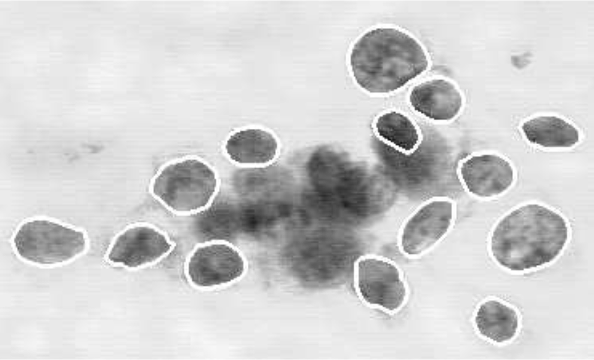

--- 
title: "Chapter 4"
output:
  bookdown::pdf_book:
    latex_engine: xelatex
    number_sections: true
    toc: true
    toc_depth: 2
    keep_tex: true
documentclass: report
bibliography:
  - book.bib
  - packages.bib
biblio-style: apalike
csl: "chicago-fullnote-bibliography.csl"
site: bookdown::bookdown_site

---
```{r setup,include=FALSE,warning=FALSE,message=FALSE}
knitr::opts_chunk$set(echo=FALSE)
library(dplyr)
library(readr)
library(knitr)
library(kableExtra)
library(ggplot2)
library(tidyverse)
library(devtools)
library(plotly)
install_github("Tanvi-Jindal/myfirstpackage")
library(myfirstpackage)
theme_set(
  theme_minimal(base_family = "Latin Modern Roman") +
    theme(
      plot.title = element_text(size = 24, face = "bold"),
      axis.title = element_text(size = 12),
      plot.caption = element_text(size = 10, hjust = 0)
    )
)
```

# Categorical Data Analysis: Is a Tumor Malignant or Benign?


<span style="float:right;"> *It is commonly believed that anyone who tabulates numbers is a statistician. This is like believing that anyone who owns a scalpel is a surgeon.*</span>  
<span style="float:right;"> —Robert Hooke1</span>

<br> <br>


This chapter introduces inference techniques for data in which both the explanatory and
response variables are categorical. The term categorical data analysis often refers to
analysis of data in which the response variable is categorical. However, in this chapter
we will restrict our focus to cases where both the explanatory and the response variables are
categorical and where there is no natural ordering to the categories.

Most of the hypothesis tests discussed in previous chapters use the normal distribution to
model the mean response. In this chapter, proportions, odds ratios, and relative risk will be
used to summarize categorical data. We will start by looking at cancer cell data to determine
if there is a relationship between the shape of the cell nuclei and the proportion of malignant
cells. In this chapter, we will discuss how to do the following:

* Conduct a simulation study, chi-square test, and Fisher’s exact test
* Calculate and properly interpret summary statistics such as relative risk and the odds ratio
* Determine which test to use based on various sampling schemes and questions of interest

## **Investigation: Is Cell Shape Associated with Malignancy?**

Cancer is a disease that occurs when abnormal cells grow in the body. When DNA (a substance in every
cell) is damaged, normal cells will often repair the damaged DNA. Cancer cells are cells in which the
DNA is not repaired. DNA can be damaged by many things, including viruses, tobacco smoke, alcohol,
and too much sunlight. Cells with damaged DNA can also be inherited. Cancer cells can continue to grow
and divide and usually form tumors (a lump or mass) somewhere in the body. Cancer cells can also outlive
It is important to note that not all tumors are cancerous. If a lump is detected, part of it can be removed
surgically and a biopsy conducted to determine if the mass is benign or malignant. Benign tumors are scar
tissue or abnormal growths that do not spread and are typically harmless. Malignant (or invasive) cancer
cells are cells that can travel, typically through the bloodstream or lymph nodes, and begin to replace normal
cells in other parts of the body. If a tumor is malignant, it is essential to remove or destroy all cancerous cells
in order to keep them from spreading. If a tumor is benign, surgery is typically not needed and the harmless
tumor can remain.

A biopsy requires surgery to remove a section (or all) of the tumor and will leave a scar. Fine needle
aspiration (FNA) is a technique in which a small sample of the tumor is taken using a needle and visually
inspected through a microscope. Since many tumors are benign, it is often preferable to have an FNA, which
is less invasive and less traumatic than a biopsy.

Breast cancer is the second leading cause of cancer death among women in the United States. The
American Cancer Society estimated that, in the United States in 2010, 39,840 women and 390 men died from
breast cancer and 207,090 women were diagnosed with breast cancer.2 This type of cancer is often detected
by finding a lump (or mass) in the breast.

Wolberg and Mangasarian developed a technique to accurately diagnose breast masses using only visual
characteristics of the cells within the tumor.3 This system is used at University of Wisconsin hospitals to assist
doctors in diagnosis of breast cancer.4 Each FNA sample is placed on a slide, and characteristics of the cellular
nuclei within the tumor are examined under a microscope. Several measurements, such as size, shape, and
texture, are collected for each of the nuclei visible on the slide, and then an algorithm is used to determine the
likelihood that a mass is benign or malignant.

In this chapter, we will focus on just a few characteristics from a relatively small data set that was col-
lected at University of Wisconsin hospitals in Madison. We will start by determining if the shape of a cell
nucleus can help us to determine whether a tumor is malignant or benign.
Typically, healthy cell nuclei have round or ellipsoid shapes.Figure 6.1 shows a sample of malignant cells that appear to have grown such that the perimeters of the cell nuclei have somewhat concave points.

```{r fig6.1, echo=FALSE, out.width="80%", fig.align="center", fig.cap="Segmented bar graph of nucleus shape and malignancy."}

```

Figure 6.1 An image of malignant cells where nuclei are outlined with a curve-fitting program.  Reprinted by permission. Mangasarian, Street & Wolberg, “Breast Cancer Diagnosis and Prognosis via Linear Programming,” INFORMS Journal Operations Research, 43.4, 1995. © 1995, Institute for Operations Research and the Management Sciences (INFORMS).

## **Summarizing Categorical Data**

Table 6.1 shows data from 37 FNA slide samples. Slides with smooth ellipsoid-shaped nuclei were classified
as round, and slides with poorly shaped cell nuclei were classified as concave. A biopsy was also conducted
on each of these samples to determine if each was malignant or benign.

```{r tab6.1, echo=FALSE, results='asis'}
tab6.1 <- data.frame(
  Shape = c("Round","Concave","Total"),
  Benign = c(9,4, 13),
  Malignant = c(7, 17, 24),
  Total = c(16, 21, 37),
  check.names = FALSE,
  stringsAsFactors = FALSE
)

cat(
  kable(
    tab6.1,
    format = "latex",
    booktabs = TRUE,
    escape = FALSE,
    caption = "Table 6.1 The numbers of benign and malignant tumors for round and concave cell nuclei.",
    align = c("l","r","r","r")
  ) %>%
  add_header_above(c(" "=1, "Type"=2, " "=1)) %>%
  kable_styling(latex_options="HOLD_position")
)
```

In Table 6.1, both the variables are categorical. A **categorical variable** is one for which the measurement
consists of categories, such as college major, political affiliation, personality type, gender, or pass/fail grade.
When a variable is categorical, each subject or unit must fit in one and only one category. A **binary variable**
is a special type of categorical variable that has just two possible categories.

Summarizing quantitative data such as age, weight, and income often includes calculating the mean value.
However, Table 6.1 cannot be used to calculate the mean Shape or mean Type value. Since these categorical
variables have no ordinal or interval meaning, it is not appropriate to focus on the mean response; rather, we
focus on the proportion (or percent) of responses that fall into each category.

A table that counts the number of observations in each group, such as Table 6.1, is called a **contingency table** (or cross-tabulation table). A contingency table with two variables is called a **two-way contingency table**. Table 6.1 is also called a **2 x 2 table**, since there are two row groups and two column groups. In Table
6.1, the Shape of the cell is called the **row variable**, since each horizontal row represents one shape group.
Similarly, the Type of the cell is called the **column variable**.

\large
\textbf{NOTE:}
Categorical data that have a natural ordering, such as level of agreement (strongly disagree, disagree,
indifferent, agree, strongly agree) or evaluation of a product (poor, fair, good, or excellent), are called
**ordinal data**. Categorical data that do not have a natural ordering, such as gender or major, are called
**nominal data**. Techniques for nominal data will give identical results for any ordering of the categories,
whereas results based on techniques for ordinal data do depend on the ordering of the data. This chapter
is restricted to examples of nominal data analysis techniques.
\normalsize

\Large
\textbf{\textcolor{red}{Key Concept:}}
\textcolor{red}{Analysis of categorical response variables requires calculating the proportion of responses in each
category rather than calculating means.}
\normalsize

## Activity: Descriptive Statistics and Graphs {-}
>1. Identify the observational units, the explanatory variable, and the response variable in the cancer cell
data in Table 6.1.
2. Calculate the proportion of round cell samples that are malignant and the proportion of concave cell
samples that are malignant.
3. Create a segmented bar graph using Table 6.1. Typically, the explanatory variable should be along the
horizontal axis. Assuming this is a random sample from a larger population, does the graph show evi-
dence that nucleus shape is related to the likelihood of a cell being malignant? Explain.

Bar graphs are often useful in comparing two categorical variables. Figure 6.1 shows a **segmented bar graph** (also called a stacked bar graph) for the cancer cell data. This graph shows the conditional percentages
for each nucleus shape. About 80% of the concave nuclei are malignant, whereas about 45% of the round
nuclei are malignant.

```{r fig6.2, echo=FALSE, fig.width=6, fig.height=4, message=FALSE, fig.cap="Figure 6.2 Segmented bar graph of nucleus shape and malignancy."}
library(ggplot2)
library(tidyr)
library(scales)

#df <- read.csv("Table6.1.csv", stringsAsFactors = FALSE)
data("C6Table6.1")
df<-C6Table6.1
colnames(df)[1] <- "Shape"
df_long <- pivot_longer(
  df,
  cols      = c("Benign", "Malignant"),
  names_to  = "Diagnosis",
  values_to = "Count"
)
df_long$Shape <- factor(df_long$Shape, levels = c("Round", "Concave"))

ggplot(df_long, aes(x = Shape, y = Count, fill = Diagnosis)) +
  geom_col(position = "fill", color = "black", width = 0.6) +
  scale_y_continuous(labels = percent_format(accuracy = 1), expand = c(0, 0)) +
  scale_fill_manual(
    "",
    values = c(
      "Benign"    = "#00BFC4",
      "Malignant" = "gray30"
    )
  ) +
  labs(x = NULL, y = "Percent") +
  theme_minimal(base_family = "serif") +
  theme(
    panel.background   = element_rect(fill = "white", colour = "black", linewidth = 1),
    panel.border       = element_rect(fill = NA,       colour = "black", linewidth = 1),
    plot.background    = element_rect(fill = "grey90", colour = "black", linewidth = 1),
    legend.background  = element_rect(fill = "white",  colour = "black"),
    legend.position    = "inside",                             # new
    legend.position.inside = c(0.85, 0.8),                     # new
    plot.margin        = margin(20, 20, 20, 20)
  )

```

## **A Simulation Study: How Likely Is It That the Observed Sample Would Occur by Chance?**

Figure 6.2 shows that our sample of 37 slides indicates a relationship between the shape of the cell nuclei and malignancy. However, statistical inference is needed to draw conclusions about the entire population from which these samples were selected. In this section, we will conduct a hypothesis test to determine if the sample data provide evidence that the proportion of malignant cells is greater for concave nuclei than for round nuclei.

The hypothesis test in this example is one-sided because we have a medical reason to suspect that concave nuclei are more likely to be malignant. For this example, the null and alternative hypotheses can be written as

\begin{align}
H_0: p_C = p_R \quad\text{vs.}\quad H_a: p_C > p_R 
\tag{6.1}
\end{align}

where $p_C$ is the true proportion of concave nuclei that are malignant and $p_R$ is the true proportion of round nuclei that are malignant.

If the null hypothesis, $H_0$, is true, the two populations (of concave and round cells) have the same proportion of malignant cells and the observed difference between round and concave cells in our sample is due simply to the random sampling process. In other words, the samples just randomly happened to have more malignant cells in the concave nucleus population than in the round nucleus group.

The **$p$-value** for this test is the probability of obtaining a difference in sample proportions ($\hat p_C - \hat p_R$) as large as or larger than the one observed in this sample when the null hypothesis is true. If the $p$-value is small, it is unlikely that the null hypothesis is true and we conclude that the alternative hypothesis ($p_C > p_R$) is true.

One way to estimate this $p$-value is to simulate taking samples many times under the following three conditions:

• Assume that malignancy is unrelated to cell nucleus shape (i.e., assume that both cell nucleus shapes have the same proportion of malignant cells).  
• A total of 13 benign and 24 malignant cells were observed.  
• A total of 16 round cell nuclei and 21 concave cell nuclei were observed.


## Activity: Conducting a Simulation Study with Cards {-}
>4. Use 37 index cards to represent this sample of 37 cancer cells. On 24 of the cards write M for “malig-
nant,” and on 13 of the cards write B for “benign.” Shuffle the cards and randomly select 21 cards. These
21 cards can represent the concave nucleus group. How many of the 21 concave cards are also malignant?
5. Repeat the simulation process in Question 4 nine more times. Does it seem likely that 17 or more
malignant cells would occur in the concave group by chance alone?

While simulations can be done by hand with cards, this process is very time consuming, as a large number
of simulations are needed to get a true feel for the likelihood of an outcome (many statisticians suggest
10,000 simulations). Instead of repeating the above process 10,000 times by hand, we will use a computer
program to conduct a simulation.

## Activity: Computer Simulation {-}
>6. Use the technology instructions provided on the CD to conduct one simulation. In this simulation, you
should have one column listing 24 malignant and 13 benign cells. Randomly select 21 rows to represent
the concave nucleus shapes. Count the number of observations that fall into the concave malignant group.
7. Repeat the computer simulation process in Question 6 nine more times, each time recording the num-
ber of malignant cells you sampled in the concave nucleus group. How does this simulation compare to
your index card simulation? Would you expect to get exactly the same number of samples with 17 or
more malignant cells? Why or why not?
8. Use the software instructions to repeat the computer-simulated randomization process a total of 10,000
times. Create a histogram of the 10,000 simulated counts in the concave malignant group. Estimate the
p-value by dividing the number of counts greater than or equal to 17 by 10,000.

```{r tab6.2, echo=FALSE, results='asis'}
cols <- c("0", "...", "7", "8", "9", "10", "11", "12",
          "13","14","15","16","17","18","19","20","21")
row1 <- c("0","...","0","1","8","118","551","1508",
          "2483","2655","1734","722","197","21","2","0","0")
df6.2 <- rbind(
  "Concave Malignant Cells"   = cols,
  "Observed Number of Trials" = row1
)
colnames(df6.2) <- cols

raw_tbl <- kable(
  df6.2,
  format = "latex",
  booktabs = TRUE,
  escape = FALSE,
  col.names = rep("", ncol(df6.2)),
  align = c("l", rep("r", ncol(df6.2))), 
  caption = paste0(
      "Table 6.2 10,000 simulated trials based on Question 8. ",
      "The $p$–value is $P(X\\ge17)=0.022=(2+21+197)/10,000$, where $X$ ",
      "is the number of concave malignant cells.")
) %>% column_spec(1, width = "2cm") 

lines <- strsplit(raw_tbl, "\n")[[1]]
lines <- lines[!grepl("^\\s*&", lines)]
cat(paste(lines, collapse="\n"), "\n")
```

Table 6.2 shows 10,000 simulated trials, based on Question 8. This simulation had 220 observations
greater than or equal to 17, providing a p-value of $P(X \geq 17)= 0.022$, where X is the number of concave
malignant cells. Thus, we can conclude that if the null hypothesis were true (the proportion of malignant cells
was the same for cells with round and concave nuclei), the likelihood of finding 17 or more malignant cells
out of the 21 cells with concave nuclei would be approximately 220 out of 10,000. This small p-value shows
that the difference in our sample proportions is so large that it is unlikely to have occurred by chance. Thus,
we reject the null hypothesis and conclude that cells with concave nuclei are more likely to be malignant than
cells with round nuclei.

Using simulations to approximate p-values has many advantages. Often simple programs or mac-
ros can be written to quickly simulate thousands of samples. Computer programs can be modified to
fit a variety of situations, while parametric tests with theoretical assumptions can be somewhat rigid
and require large sample sizes. Simulations only provide approximate p-values. However, increasing
the number of simulations improves the precision of the p-value; 10,000 simulations usually provides
precise p-values.

\large
\textbf{NOTE:}
\textcolor{black}{This simulation study is an example of a permutation test. Chapter 1 describes that permutation hypothesis
tests are significance tests that simulate the act of randomly rearranging units into groups.}
\normalsize

\Large
\textbf{\textcolor{red}{Key Concept:}}
\textcolor{red}{Simulation studies are gaining in popularity because computer simulations can quickly and easily find
accurate p-values. In addition, unlike most tests that have distributional assumptions, simulation studies
do not have minimum sample size requirements and are often more accurate than distribution-based
tests for studies with small sample sizes.}
\normalsize

## **Fisher’s Exact Test**

While the use of simulations to determine $p$-values is quickly gaining in popularity, sometimes the exact $p$-value can be calculated based on an appropriate probability model. **Fisher’s exact test** uses the **hypergeometric distribution** to calculate exact probabilities.

Just as in the simulation study, we are interested in testing $H_0: p_C = p_R$ vs. $H_a: p_C > p_R$. In addition, we use the same three assumptions to find the $p$-value, the probability that 17 or more of the malignant cells occur in the concave nucleus group when $H_0$ is true. Table 6.3 provides the same data as Table 6.1, but notation has been included to extend this test to any 2 × 2 table.

In any 2 × 2 table, there are a total of $N$ observations that can be classified as either a success or a failure. $M$ represents the number of success, and thus $N - M$ is the number of failures. We are interesting in finding the probability of observing $x$ successes in a random selection of $n$ observations. For the cancer cell data in

```{r tab6.3, echo=FALSE, results='asis'}
tab6.3 <- data.frame(
  Shape     = c("Round", "Concave", "Total"),
  Benign    = c("9", "4", "13"),
  Malignant = c("7", "$17 = x$", "$24 = M$"),
  Total     = c("16", "$21 = n$", "$37 = N$"),
  check.names      = FALSE,
  stringsAsFactors = FALSE
)

cat(
  kable(
    tab6.3,
    format = "latex",
    booktabs = TRUE,
    escape = FALSE,
    caption = "Table 6.3 The numbers of benign and malignant tumors for round and concave cell nuclei.",
    align = c("l","r","r","r")
  ) %>%
  add_header_above(c(" "=1, "Type"=2, " "=1)) %>%
  kable_styling(latex_options="HOLD_position")
)
```

Table 6.3, $x$ represents the event of interest (observing 17 concave malignant cells), $N = 37$ represents the total number of observations, $M = 24$ is the total number of malignant cells (number of successes), and $n$ is the total number of observations in the concave group.

\large
\textbf{MATHEMATICAL NOTE:}  
In this section, we simply discuss how to conduct Fisher’s exact test with statistical software. The extended activities shows that Fisher’s exact test uses the hypergeometric distribution to calculate exact $p$-values. For any 2 × 2 contingency table when there are $N$ total observations with $M$ total successes, the probability of observing $x$ successes, $P(X = x)$, in a sample of size $n$ is
\normalsize

\begin{align}
\frac{\text{number of ways to select $x$ successes and $n - x$ failures}}{\text{number of ways to select $n$ subjects}}
 &= \frac{\binom{M}{x}\,\binom{N - M}{n - x}}{\binom{N}{n}} \notag
\end{align}

where $\binom{M}{x} = M \text{“choose”} x = \frac{M!}{x!(M - x)!}$.^[For any positive integer, the notation n! is read “n factorial” and is defined as $n!= n(n- 1)(n- 2) \cdot\cdot\cdot (3)(2)(1)$. For example, “3 factorial” is $3 \times 2 \times 1= 6$ and “four factorial” is $4!= 4 \times 3 \times 2 \times 1= 24$. In addition, $0!= 1$.] Similar calculations hold for $\binom{N - M}{n - x}$ and $\binom{N}{n}$."

## Activity: Calculating Fisher’s Exact Test {-}
>9. In this cancer study, assume N= 37 observations with M = 24 successes. If n = 21 observations
are selected, use the technology instructions provided on the CD to calculate the exact probabilities
P(X = 17), P(X = 18), P(X = 19), P(X = 20), and P(X= 21).
10. Assuming N= 37, M= 24 successes, and n = 21, create a histogram of the probabilities for x. Com-
pare the probabilities in Question 9 to the probabilities in Question 8. Since Question 8 was a simula-
tion of the hypergeometric distribution, these histograms should look very similar.
11. What is the exact p-value P(X $\geq$ 17)? How does this exact p-value compare to the simulated
p-value?
12. There is nothing special about how a success or failure is defined. Assume we have a table of
N = 37 observations with M = 13 successes (here a benign cell is considered a success). For a
sample of size 16 (round nuclei), find P(X $\geq$ 9). How does this answer compare to your answer in
Question 11?
13. Assume we have a table of N = 37 observations with M = 13 successes (here a benign cell is consid-
ered a success). For a sample of size 21 (concave nuclei), find P(X $\geq$ 4). How does this answer com-
pare to your answer in Question 11?


Both the simulation in Section 6.3 and Fisher’s exact test can be considered permutation tests. The simu-
lation study provides an approximation to Fisher’s exact test. Fisher’s exact test provides a $p$-value for this
problem of $P(X \geq 17)= 0.0225$. If there truly were no difference between the likelihood of malignancy for
the two nucleus shapes (which would mean the null hypothesis $H_0$ was true), random sampling would produce
this outcome (17 or more malignant cells in the concave group) 2.25% of the time. This small probability
provides evidence that $H_0$ should be rejected.

\large
\textbf{MATHEMATICAL NOTE:}  
Fisher’s exact test and the corresponding simulation study were derived here using a rather strong assump-
tion about the null hypothesis. Both tests were completed under the assumption that we had observed 13
benign and 24 malignant cells and that these totals would be the same in every randomization. Statisti-
cians call this a **conditional test of independence**. In other words, both the row and the column totals
are known (fixed) before the study is conducted. However, the extended activities will show that Fisher’s
exact test can be used for any 2 $\times$ 2 table, even when the margin totals are not fixed.$^5$
\normalsize 

\Large
\textbf{\textcolor{red}{Key Concept:}}
\color{red}Fisher’s exact test uses the hypergeometric distribution to provide exact p-values even for small sample sizes and succes/failure proportions near 0% or 100%
\color{black}
\normalsize

## **Two-Sided Hypothesis Tests**

In Fisher’s exact test and the simulation study, 17 or more concave malignant cells corresponded to a difference in sample proportions of $\hat p_C - \hat p_R = 0.8095 - 0.4375 = 0.372$ or more. The $p$-value was the probability of calculating a sample statistic *greater than or equal to* $\hat p_C - \hat p_R = 0.372$ given that $p_C = p_R$.

Before this sample was collected, the researchers had medical reasons to believe that the cells with concave nuclei (i.e., the malformed nuclei) might be more likely to be malignant. If there had been no specific reasoning to justify a one-sided hypothesis, a two-sided hypothesis test would have been more appropriate:

\begin{align}
H_0: p_C = p_R \quad\text{vs.}\quad H_a: p_C \neq p_R 
\tag{6.2}
\end{align}

The $p$-value for a two-sided hypothesis is the probability of calculating a sample statistic *at least as extreme as* $\hat p_C - \hat p_R = 0.372$ given that $p_C = p_R$. That is, if the null hypothesis is true, what is the probability that $\hat p_C - \hat p_R \ge 0.372$ or $\hat p_C - \hat p_R \le -0.372$.

Question 14 helps to show that the difference in proportions, $\hat p_C - \hat p_R \le -0.372$, corresponds to 10 or fewer concave malignant cells. Table 6.2 can then be used to calculate the approximate $p$-value for the two-sided hypothesis test:

\begin{align}
\text{p-value}
&= P(\hat p_C - \hat p_R \le -0.372) + P(\hat p_C - \hat p_R \ge 0.372) \notag \\ \notag
&= P(X \le 10) + P(X \ge 17) \\ \notag 
&= \frac{1 + 8 + 118 + 197 + 21 + 2}{10{,}000} \\ \notag
&= 0.0347 \notag
\end{align}

Based on this simulation, the two-sided hypothesis test should reject the null hypothesis and conclude that $p_C \neq p_R$.

## Activity: Calculating a Two-Sided Hypothesis Test {-}
>14. The three conditions in Section 6.3 stay the same for both the one-sided and the two-sided tests. The total number of malignant cells must be 24, the number of concave cells is 21, and the number of round cells is 16. Thus, when $Y =$ the number of concave malignant cells, $\hat p_C - \hat p_R = Y/21 - (24 - Y)/16$.  
a. Find $\hat p_C - \hat p_R$ when $Y = 17$.  
b. Find $\hat p_C - \hat p_R$ when $Y = 9, Y = 10,$ and $Y = 11$.  
Notice that the two-sided test is not completely balanced; there is no count, $Y$, that exactly corresponds to $\hat p_C - \hat p_R = -0.372$. However, any $Y \le 10$ will satisfy $\hat p_C - \hat p_R \le -0.372$.  
>15. Repeat Question 8 to estimate the $p$-value for the two-sided hypothesis test.  
>16. Use the hypergeometric distribution to find the $p$-value for the two-sided hypothesis test.

\large  
\textbf{NOTE:}  
Two-sided tests can be somewhat cumbersome. Many statisticians suggest simply approximating a two-sided $p$-value by doubling the one-sided $p$-value. For example, the $p$-value for $H_0: p_C = p_R$ vs. $H_a: p_C \neq p_R$ is $2 \times P(X \ge 17) = 2(0.0225) = 0.045$.  
\normalsize

## **Chi-Square Test**

Fisher’s exact test has the advantage of providing exact p-values. Before technology was available to provide
quick and easy ways to conduct Fisher’s exact test and simulation studies, the chi-square test was typically
used.

You may recall from previous statistics courses that the chi-square test requires that certain assumptions
be met before any analysis is done. For example, large sample sizes are needed, especially if the proportion
of successes in either group is close to 0% or 100%. If the sample size is large enough, the distribution of the
chi-square test statistic will resemble the chi-square distribution.

\Large
\textbf{\textcolor{red}{Key Concept:}}
\textcolor{red}{The steps to conduct a chi-square test are similar to those for the hypothesis tests discussed in most introductory statistics classes.^[For 2 × 2 tables, the chi-square test statistic is identical to the square of the Z-statistic when testing for equal population proportions. In addition, the $p$-values for the two tests will be identical.] To conduct a chi-square test you will need to do the following:}

\textcolor{red}{$\bullet$ State the null and alternative hypotheses.}

\textcolor{red}{$\bullet$ Calculate the test statistic.}

\textcolor{red}{$\bullet$ Calculate the p-value.}

\textcolor{red}{$\bullet$ Check model assumptions.}

\textcolor{red}{$\bullet$ Draw conclusions within the context of the study.}
\normalsize

**Step 1: State the null and alternative hypotheses:**

The null and alternative hypotheses can be written in exactly the same terms as for the two-sided per-
mutation test:

\begin{align}
H_0: p_C &= p_R \quad\text{vs.}\quad H_a: p_C \neq p_R 
\notag
\end{align}


The null hypothesis is equivalent to stating that the distributions (of malignant cells) are the same
across all groups of nucleus shapes. This test is often called a test of homogeneity.

\large
\textbf{MATHEMATICAL NOTE:}
Some texts suggest using the chi-square test for homogeneity if separate samples are selected from
more than one population and using the chi-square test for independence when data are collected from
a single sample. Even though this study is based on one sample of 37 slides, the extended activities will
show that both the test of homogeneity and the test of independence are appropriate. The calculations
for both tests are identical; however, the hypotheses and conclusions are different. We choose to present
the test of homogeneity in this section so that the hypotheses and conclusions coincide with those for the
two-sided permutation tests.
\normalsize

**Step 2: Calculate the test statistic:**

The chi-square test statistic is a measure of the difference between the observed counts in Table 6.1
and the expected counts that are calculated under the assumption that the null hypothesis is true (shown
in Table 6.4).

In this study, 7 out of the 16 round nuclei were malignant ($\hat p_R = 7/16= 0.4375$) and 17 out of the
21 concave nuclei were malignant ($\hat p_C = 17/21= 0.8095$). Assuming that the proportion of malignant
cells is the same for both nucleus shapes, the best estimate of the overall proportion of cells that are
malignant is $(7 + 17)/(16 + 21)= 24/37= 0.64865$.

Each expected cell count is calculated by multiplying the estimated proportion times the
­ appropriate sample size (the total number of concave nuclei or total number of round nuclei).
There are 16 round nuclei in our study, so the expected count of round malignant cell nuclei is
$16(24/37)= 10.38$. In general, the expected counts are calculated as row total $\times$ column total/
overall total.

## Activity: Calculating Expected Counts {-}
> 17. Calculate the expected count of concave malignant cell nuclei.  
> 18. Assuming the null hypothesis is true, what is the estimated proportion of benign cells in the population? If you select a sample with 16 round cells, what is the expected count of round benign cells?

Table 6.4 shows a table of expected counts under the assumption that the null hypothesis is true: the different cell nucleus shapes have the same proportion of malignant cells. Where:

\begin{align}
\text{expected count} \;=\; \frac{\text{row total} \times \text{column total}}{\text{overall total}}.
\notag
\end{align}

For example:

\begin{align}
10.38 = \frac{16 \times 24}{37}, \notag
\quad
5.62 = \frac{16 \times 13}{37}. \notag
\end{align}

```{r tab6.4, echo=FALSE, results='asis'}
library(knitr)
library(kableExtra)

# Table 6.4: expected counts
tab6.4 <- data.frame(
  Shape = c("Round",    "Concave", "Total"),
  Benign = c(  5.62,       7.38,     13),
  Malignant = c( 10.38,      13.62,     24),
  Total= c( 16,      21,     37),
  check.names = FALSE,
  stringsAsFactors = FALSE
)

kable(
  tab6.4,
  format = "latex",
  booktabs = TRUE,
  caption = "Table 6.4 Table of expected counts for the cancer cell study.",
  align = c("l","r","r","r","r"),
  escape = FALSE
) 
```

\large  
\textbf{NOTE:}  
In a chi-square test, the expected counts are calculated from the totals of the observed data. Totals in the table of observed counts (like Table 6.1) and the table of expected values (like Table 6.4) are identical, except for possible round-off error.  
\normalsize

The chi-square test statistic is calculated to measure if the observed data are consistent with the null
hypothesis. The chi-square statistic is

\begin{align}
\chi^2 = \sum \frac{(\text{observed count} - \text{expected count})^2}{\text{expected count}} 
\tag{6.3}
\end{align}

This statistic is the sum of each squared difference between the observed count and the expected count,
weighted by the expected count. The *observed count* represents the observed cell count from Table 6.1, and
the *expected count* represents the expected cell count from Table 6.4.

The chi-square statistic for the cancer cell study is

\begin{align}
\chi^2
&= \frac{(9 - 5.62)^2}{5.62} + \frac{(7 - 10.38)^2}{10.38} + \frac{(4 - 7.38)^2}{7.38} + \frac{(17 - 13.62)^2}{13.62} \\[6pt] \notag
&= 2.03 + 1.10 + 1.55 + 0.84 = 5.52 \notag
\end{align}

The chi-square test statistic is always positive. If the observed and expected counts are identical, then
the test statistic $\chi^2 = 0$. If the observed data are far from the expected data, the test statistic will be large
and the null hypothesis will be rejected. The chi-square test is not used to show that one proportion is greater
or less than another proportion, but to show that the proportions are not equal. Thus, the chi-square test is a
two-sided test.

\large
\textbf{NOTE:}
The chi-square test can be extended to categorical data with more than two rows and more than two col-
umns. Notice that the table of expected values and the chi-square test statistic in Equation (6.3) can be
calculated with additional rows and columns
\normalsize

**Step 3: Calculate the *p*-value:**
The p-value will help us determine if a test statistic of $\chi^2 = 5.52$ or larger is likely to occur by chance. If
the null hypothesis is true, the $\chi^2$ test statistic will follow a chi-square distribution where the degrees of
freedom are calculated as (number of rows - 1) $\times$ (number of columns - 1). In the cancer cell study,
there are two rows of data (round and concave) and two columns of data (benign and malignant); thus,
the test statistic has $(2- 1) \times (2- 1) = 1$ degree of freedom.

## Activity: Conducting a Chi-Square Test {-}
>19. Use a statistical software package to conduct a chi-square test for the cancer cell data.
a. Submit the computer output showing the observed and expected tables, the test statistic, and the
p-value.
b. Assuming the data were a simple random sample from a larger population, what conclusions can
you draw about the population?
c. Can you conclude that the shape of the cell nucleus causes a change in the likelihood that a cancer
cell is malignant? Why or why not?
>

**Step 4: Check model assumptions:**

Just like most hypothesis tests, the chi-square test requires that each observation be independent. In addition, the chi-square test requires a large enough sample size in each of the cells to ensure that the test statistic can be accurately represented by the chi-square distribution. Some statisticians have slightly different technical assumptions for the sample size needed, but here are two general rules:  
• For 2 × 2 contingency tables, the sample size should be large enough that the expected count in each of the 2 × 2 cells in the table is at least 5.  
• For tables with more than two rows or two columns, all expected counts should be greater than 1 and the average expected count should be greater than or equal to 5.

In the cancer cell study, all the expected counts are greater than 5, so it is appropriate to use the chi-square test.

\large  
\textbf{NOTE:}  
In this example, some of the expected counts are just slightly greater than 5. In this case, some texts might suggest using a chi-square test with a continuity correction. However, simulation studies and Fisher’s exact test can now be easily calculated with computers and provide more accurate p-values. Thus, there really is no longer a need to use a chi-square continuity correction to estimate the p-value.  
\normalsize

**Step 5: Draw conclusions within the context of the study:**

The chi-square test provides a p-value of 0.019 for the cancer cell study. This indicates that we should reject the null hypothesis in favor of the alternative. Thus, the chi-square test leads to the same conclusion as the two-sided simulated permutation test and the two-sided Fisher’s exact test: Each nucleus shape has a different proportion of malignant cells.

The p-value of 0.019 for the chi-square test is somewhat close to the result of the simulation study conducted in Section 6.3, where we found a two-sided p-value of 0.0347. Every person conducting a chi-square test on the data in Table 6.1 should get the same p-value, while each simulation study will provide a slightly different p-value. Many students mistakenly assume that the variation in the p-value for the simulation study indicates that it is less accurate than the p-value for the chi-square test. But, in fact, the simulation study is more accurate than the chi-square test. Fisher’s exact test shows that the two-sided hypothesis test for the cancer cell study has an exact p-value of 0.0357. With larger sample sizes, the p-values for chi-square tests will be closer to the exact p-values.

## Activity: Simulating the Chi-Square Test Statistic {-}
>20. **Degrees of Freedom** Create a 2 × 2 contingency table with the same totals in the margins as in Table 6.1. Assume you counted 16 concave malignant nuclei in Question 6. Fill in the rest of the table cells. Note that you can complete the other three table counts (the concave benign, round malignant, and round benign) with just one known count value. Thus, only one table cell count is truly free—once one cell is determined, the other three are fixed. This demonstrates why 2 × 2 contingency tables have only 1 degree of freedom.  
>21. **Degrees of Freedom** Create a 3 × 2 contingency table with row totals of 25, 30, and 25 and column totals of 30 and 50. How many table cell counts are truly free (i.e., what is the smallest number of table cell counts that, when filled in, will completely specify the rest of the cells)? Describe how the formula (number of rows - 1) × (number of columns - 1) relates to the number of free cells in a two-way contingency table of any size. It may be helpful to create a 3 × 3 table or a 3 × 4 table to convince yourself that this rule continues to hold.

## **What Can We Conclude from the Cancer Study?**

The cancer cell data in Table 6.1 were analyzed with a simulation study (more specifically, a permutation test), a chi-square test, and Fisher’s exact test. All tests suggested that the null hypothesis should be rejected, and thus we conclude that concave and round cell nuclei are associated with different proportions of malignant cells.

This study was not an experiment, since there was no random allocation of units to particular conditions. Thus, while we expect that there is an association between nucleus shape and malignancy, we cannot conclude that nucleus shape *causes* different proportions of malignancy.

The individuals who provided these 37 slide samples were not a true random sample of all North Americans, but a sample of patients who volunteered to be part of the study at the University of Wisconsin hospitals. Subjects in medical studies are rarely true random samples from the general population. We cannot be certain that these results hold for a larger population of people. However, it seems reasonable for researchers to believe that cancer cells from patients in Wisconsin are similar to cancer cells from other patients in other hospitals. Thus, we can cautiously conclude that this study provides some evidence that the different nucleus shapes are associated with different proportions of malignant cells.

## **Relative Risk and the Odds Ratio**

The **proportion** of malignant nuclei in this study is 24/37 = 0.6486. This overall proportion of malignancy is often called the **risk** (or baseline risk) of malignancy. The **conditional proportion** is the proportion of malignant cells calculated for each cell shape. Thus, the round nuclei have a conditional proportion (of malignancy) = 7/16 = 0.4375, and the concave cells have a conditional proportion (of malignancy) = 17/21 = 0.8095.

The hypothesis tests in this chapter have focused on determining whether concave and round nuclei have the same proportion of malignancy. However, it is important to recognize that there are limitations in testing for differences in proportions. For example, assume that we have two studies. In the first study,

\begin{align}
\hat p_1 - \hat p_2 &= 0.52 - 0.48 = 0.04
\notag
\end{align}

In the second study,

\begin{align}
\hat p_1 - \hat p_2 &= 0.05 - 0.01 = 0.04 
\notag
\end{align}

Both studies could test whether an observed difference in proportions of 0.04 is significant. However, in the second study *$\hat p_1$* is five times larger than *$\hat p_2$*.

An alternative calculation that is commonly used for data with categorical response and explanatory variables is the relative risk. In the following calculations, we arbitrarily decided to define a malignant cell as a success.

\begin{align}
\text{Relative risk} &= \frac{\text{proportion of successes in group 1}}{\text{proportion of successes in group 2}} = \frac{\hat p_1}{\hat p_2} \tag{6.4}
\end{align}

In the cancer cell study, the relative risk is 0.8095/0.4375 = 1.85. Thus, the risk of malignancy is 1.85 times greater for the concave group than for the round group.


The **odds** (more specifically, odds of success) can also be used to compare proportions and tend to have meaning over a broader range of potential outcomes.

\begin{align}
\text{Odds} &= \frac{\text{number of successes}}{\text{number of failures}} \tag{6.5}
\end{align}


The odds of malignancy in the concave group are 17 to 4, meaning that we expect 17 successes (malignant cells) for every 4 failures (benign cells). This is often stated as follows: The odds of malignancy in the concave group are 4.25 (17 ÷ 4) to 1 (4 ÷ 4). The odds of malignancy in the round group are 7 to 9. The **odds ratio** is used to compare the odds of two groups.

\begin{align}
\text{Odds ratio} &= \frac{\text{odds of group 1}}{\text{odds of group 2}} = \frac{\hat\theta_1}{\hat\theta_2} \tag{6.6}
\end{align}

The odds ratio in the cancer cell study is $\frac{17/4}{7/9} = 5.5.$. Thus, the odds of malignancy are 5.5 times greater for the concave group than for the round group. When the odds ratio = 1, the odds for both groups are equal.

\large  
\textbf{NOTE:}  
In relative risk and odds ratio calculations, the group that has the lower proportion (or lower odds) is typically considered group 2 (in the denominator). That way, the relative risk and odds ratio are always numbers larger than one and easier to interpret.  
\normalsize

\Large
\textbf{\textcolor{red}{Key Concept:}}
\textcolor{red}{In studies where the proportions are far away from 0.5, the hypothesis test for the difference in proportions may not best represent your question of interest. When both conditional proportions are small, the relative risk and odds ratio are preferable, since they take the base line rate (overall proportion of successes) into account.} 
\normalsize

## Extended Activity: Calculating Additional Summary Statistics {-}
Data set: Table 6.1  
22. Use the data from Table 6.1 and define a benign cell as a success and round cells to be group 1. Calculate and interpret the relative risk and the odds ratio.  
23. Show that the null hypothesis $H_0: p_1 = p_2$ is mathematically equivalent to the null hypothesis $H_0: \theta_1/\theta_2 = 1$, where $p$ represents the proportion successful and $\theta$ represents the odds of success for any two groups (labeled 1 and 2).  
24. **Shortcut for Calculating the Odds Ratio** Use the counts in Table 6.1 to calculate the following:

\begin{align}
\frac{\text{(count of round benign)(count of concave malignant)}}{\text{(count of round malignant)(count of concave benign)}}
\notag
\end{align}

   Does this calculation match any statistic in Question 22? This product of diagonals can always be used as a shortcut to calculate the odds ratio.

\large  
\textbf{NOTE:}  
The odds ratio does not depend on the choice of success or failure. In addition, the odds ratio provides identical results when the explanatory and response variables are switched.  
\normalsize


## Cautions About Relative Risk Reduction in Medical Studies {-}

Zocor is a drug used to lower cholesterol in order to reduce the chances of a heart attack. A five-year study was conducted to investigate the effectiveness of Zocor, using 4444 people.$^6$ People in this study were aged 35-70 and had a high risk of heart attack. In addition, all the subjects were Caucasian and 81% were males. Based on this study, television and print advertisements stated, “A clinical study among people with high cholesterol and heart disease found 41% fewer deaths from heart attack among those taking Zocor.$^7$

## Extended Activity: Comparing Relative and Absolute Risk Reduction {-}
Data set: Table 6.1  

25. Does the advertisement claim that the study shows a 41% reduction in heart attacks among all people that use Zocor? Explain.  

26. What does 41% fewer deaths mean in terms of the chances of having a heart attack? (Select one.)  
a. 2222 died from heart attacks in the placebo group, and 41% fewer (1289 out of 2222) died from heart attacks in the treatment group.  
b. 1000 died from heart attacks in the placebo group, and 41% fewer (580) died from heart attacks in the treatment group.  
c. 100 died from heart attacks in the placebo group, and 41% fewer (58) died from heart attacks in the treatment group.  
d. It is impossible to tell based on the quote from the advertisement.  

27. The actual study found that 189 out of 2223 in the placebo group died from heart attacks and 111 out of 2221 in the treatment (Zocor) group died from heart attacks.  
a. Use the Zocor study data to create a two-way table. Use Placebo and Treatment (Zocor) as the row variables. Use Death and Survival as the column variables.  
b. Calculate the percentage of deaths in the placebo group and the percentage of deaths in the treatment group.  
c. Calculate the difference between the two percentages calculated in Part b.  
d. Calculate and interpret the relative risk of death from a heart attack.

The difference between the two percentages calculated in Question 27b, 8.5% - 5% = 3.5%, is called the **absolute risk reduction**. The 41% fewer deaths is actually calculated as


\begin{align}
\frac{8.5\% - 5\%}{8.5\%} \approx 41\% 
\notag
\end{align}


The statistic 41% is called the **relative risk reduction**. While both statistics, 3.5% and 41%, are appropriate, it is important to recognize how easily these numbers can be misunderstood. The advertisement states things so as to make the reduction in deaths due to heart attacks appear greater than it is in absolute terms: a reduction of 8.5% to 5% for the risk of death from heart attack for the next five years for a restricted sample of people with heart disease.

## **Sampling Designs**

Contingency tables are widely used and easy to interpret. However, it is important to recognize that the appropriate statistical analysis cannot be determined simply by looking at a table of data; it is determined by how the data were collected. While there are numerous ways to collect data, this section will focus on three key sampling designs often used in observational studies.

1. In **cross‑classification studies**, information is collected simultaneously on both variables in the study. This often occurs when all data are collected from one sample and then placed into a classification table. The row totals and the column totals are not known prior to the data collection. The total sample size, N, may or may not be known before the data are collected.  
2. In **cohort studies**, individuals (or units) who differ with respect to a certain explanatory variable are selected (or assigned to groups) and then a response variable is measured. These predetermined groups are called cohorts, and if the response variable is measured over time the design is called a prospective design.* In cohort studies, the totals corresponding to the explanatory variable are known before the responses are collected.  
3. In **case‑control studies**, individuals (or units) are selected according to a response variable (and often called the cases and the controls). Then the individuals are classified according to some explanatory variable. Case‑control studies are often retrospective studies, since historical data are typically used to collect information on the explanatory variable. In case‑control studies, the totals corresponding to the response variable are known before data are collected on the explanatory variable.  

Prospective studies typically provide stronger evidence of a relationship between the explanatory variable and the response variable. However, they tend to be expensive, to require a long time to gather data, and to be sensitive to attrition. When responses can be rare, such as getting lung cancer, case‑control studies are preferred over cohort studies because case‑control studies can ensure a large enough sample size within each group of responses. However, when data are selected based on the response variable, such as in case‑control studies, studies can be particularly susceptible to difficulties with confounding.

## Extended Activity: Retrospective Studies and the Odds Ratio {-}

In a retrospective study of lung cancer patients in 20 London hospitals, Richard Doll identified a relationship between smoking and lung cancer.^[Retrospective cohort studies also exist. In these designs, past (medical) records are often used to collect data. As with prospective cohort studies, the objective is to first establish groups based on an explanatory variable. However, since these are past records data on the response variable can be collected at the same time.] Table 6.5 shows a partial set of data from his study. The data were collected on 60 female patients with lung cancer and 60 control females.

```{r tab6.5, echo=FALSE, results='asis'}
library(knitr)
library(kableExtra)

# Table 6.5: Doll’s case‐control smoking data
tab6.5 <- data.frame(
  Females = c("Smoker", "Nonsmoker", "Total"),
  Yes = c(41, 19, 60),
  No = c(28, 32, 60),
  Total= c(69, 51,120),
  check.names = FALSE,
  stringsAsFactors = FALSE
)

kable(
  tab6.5,
  format = "latex",
  booktabs = TRUE,
  caption = "Table 6.5 Data from Richard Doll’s case‐control study on smoking and lung cancer.",
  align = c("l","r","r","r"),
  escape = FALSE
) %>%
  add_header_above(c(" "=1, "Have Lung Cancer"=3)) %>%
  kable_styling(latex_options="hold_position")
```

28. What is the proportion of females in this study who have lung cancer? What is the proportion of smokers who got lung cancer? What is the proportion of nonsmokers who got lung cancer? What is the relative risk when having lung cancer is defined as a success?  
29. Notice that Doll predetermined the distribution of the response variable (this is done in case‑control studies). Explain why each of the proportions in Question 28 cannot appropriately be extended to a larger population. (Hint: Is it appropriate to conclude that 60/120 = 50% of female patients in the 20 London hospitals have lung cancer? Is it appropriate to assume that a good estimate of the percentage of female nonsmoking patients in the hospitals who have lung cancer is 37.2%?)  

Note that tests for equal proportions are not appropriate if the response totals are fixed prior to the study. In addition, the next section will show that since the response totals are not random, a test of independence should not be used. Fisher’s exact test and a simulation study could be used. The following questions will show why it is appropriate to conduct a hypothesis test about the odds ratio.


30. Calculate the odds of lung cancer for smokers. Calculate the odds of lung cancer for nonsmokers. Calculate and interpret the odds ratio of lung cancer. Does the odds ratio indicate a relationship between smoking and lung cancer?  
31. Calculate and interpret the odds ratio of being a smoker. Does the odds ratio depend on what variable is considered the response?

\Large
\textbf{\textcolor{red}{Key Concept:}}
\textcolor{red}{The statistics used to estimate an overall proportion (and risk) cannot be interpreted or generalized to a larger population in studies where the response totals (i.e., the distribution of the response variable) are fixed by the researcher. Thus, the conditional proportions and relative risk cannot be generalized to a larger population. Since the odds ratio is invariant to the choice of explanatory and response variables, it can be used when the totals of the response variable are controlled by the researcher. For 2 × 2 contingency tables, Fisher’s exact test can be used with any sampling design and any sample size.}
\normalsize

## Tests for the Homogeneity of Odds {-}

Questions 28–31 showed that when the response variable totals are fixed before the study is conducted, the proportions are not representative of a larger population. Thus, tests for the homogeneity of proportions are not appropriate. This section shows the steps in a test for the homogeneity of odds using the data in Table 6.5.

**Step 1: State the null and alternative hypotheses:**

\begin{align}
H_0: \frac{\theta_S}{\theta_N} &= 1 \notag \\ 
H_a: \frac{\theta_S}{\theta_N} &> 1 \notag
\end{align}

**Step 2: Calculate the test statistic:**

We calculate the odds of cancer for the smoking group to be

\begin{align}
\hat\theta_S = \frac{\hat p_S}{1 - \hat p_S} = 1.46 \notag
\end{align}

Similarly, the odds of cancer for the nonsmoking group are

\begin{align}
\hat\theta_N = \frac{\hat p_N}{1 - \hat p_N} = 0.594 \notag
\end{align}

The odds ratio is $\frac{\hat\theta_S}{\hat\theta_N} = 2.466.$

It can be shown (in more advanced texts) that when sample sizes are large, the natural log of the odds ratio is approximately normal with the following standard deviation:

\begin{align}
S_{LO} 
&= \sqrt{\frac{1}{n_S\,\hat p\,(1 - \hat p)} + \frac{1}{n_N\,\hat p\,(1 - \hat p)}} 
= \sqrt{\frac{1}{69(0.5)(0.5)} + \frac{1}{51(0.5)(0.5)}} = 0.3693
\notag
\end{align}

where $n_S$ and $n_N$ are the total number of smokers and the total number of nonsmokers in the study, respectively, and $\hat p$ is the overall proportion of people with lung cancer in the study. Also recall that testing whether $\theta_S/\theta_N = 1$ is equivalent to testing whether $\ln(\theta_S/\theta_N) = 0$.

Thus, a test statistic is calculated as

\begin{align}
Z 
&= \frac{\ln\bigl(\hat\theta_S / \hat\theta_N\bigr) - 0}{S_{LO}}
= \frac{0.90266}{0.3693} = 2.44 \notag
\end{align}

**Step 3: Calculate the p-value:**

\begin{align}
P(Z > 2.44) = 0.0073 
\notag
\end{align}

**Step 4: Check model assumptions:**

It is reasonable to assume that each patient in the study is independent of the others. A general rule is that as long as the sample size in each cell is greater than or equal to 5, the normality assumption is appropriate.

**Step 5: Draw conclusions within the context of the study:**

In this study, the small p-value leads us to reject the null hypothesis and conclude that the odds ratio is greater than one. In other words, if the population odds of cancer were identical for both smokers and nonsmokers, a sample odds ratio as large or larger than 2.466 was very unlikely to occur by random chance. This study is not an experiment; thus, it is inappropriate to conclude that smoking causes larger odds of cancer. This is not a true random sample of patients in the 20 London hospitals. However, it is reasonable to cautiously expect that these patients are representative of all hospital patients in the 20 London hospitals.

## **Comparing Tests of Homogeneity and Independence**

The calculations involved in the tests of homogeneity and independence are identical; however the type of question asked will impact the conclusions that can be drawn.

The **test of homogeneity** is used to determine if proportions are equal across two or more populations. The hypothesis test related to the cancer cell study

\begin{align}
H_0: p_L &= p_H \notag \\ 
H_a: p_L &\neq p_H \notag
\end{align}

fits this situation. Tests of homogeneity are appropriate whenever one of the variables is clearly defined as the response variable. As shown in the previous section, a test of homogeneity of proportions is not acceptable when the response totals are known in advance. However, a test of the homogeneity of odds is appropriate even if the response totals are fixed.

The **test of independence** is used to determine if two random variables within a population are independent. It is not necessary to determine which variable is the explanatory variable and which is the response variable. If any of the marginal (i.e., row or column) totals are known (fixed) in advance, at least one of the variables is not random, and thus the test of independence is not appropriate. The null and alternative hypotheses can be written as

\begin{flalign*}
  &H_0:\;\text{the row and column variables are independent (more specifically, }H_0:\text{ nucleus shape and malign-} && \\
  & \text{ancy are independent)} &&\\
  &H_a:\;\text{the two variables are not independent} &&
\end{flalign*}

\large
\textbf{NOTE:}
Tests of homogeneity and independence are not restricted to chi-square tests. For example, the two-proportion z-test is also a test of homogeneity.
\normalsize

In both tests, the null hypothesis is that there is no relationship between the row variable and the column variable. Tests of independence are essentially testing if the probability of a success for one variable depends on the value of a second variable. They are appropriate whenever both the row and the column variables are random (e.g., the column totals are not predetermined by the researcher), as in cross-classification studies.

Tests of homogeneity are appropriate whenever it is clear that one variable should be treated as the response and the other as the explanatory variable. Thus, tests of homogeneity can be used with all three study designs listed earlier. However, case-control study designs (where the response totals are fixed) are appropriate only for testing homogeneity of odds (not homogeneity of proportions). Table 6.6 summarizes the appropriate hypothesis tests for each sampling design. Specific examples of each type of sampling design are provided in the end-of-chapter exercises.


```{r tab6.6, echo=FALSE, results='asis'}
tab6.6 <- data.frame(
  `Marginal Totals` = c(
    "Total N Fixed", "Response Totals Fixed", "Explanatory Totals Fixed","Hypothesis Test",
    "Test of Independence","Test of Homogeneity of Proportions","Test of Homogeneity of Odds","Fisher's Exact Test"
  ),
  `Cross-Classification` = c("Either is OK","No","No","Cross-Classification","Yes","Yes","Yes","Yes"),
  `Cohort` = c("Yes","No","Yes","Cohort","No","Yes","Yes","Yes"),
  `Case-Control`= c("Yes","Yes","No","Case-Control","No","No","Yes","Yes"),
  `Hypergeometric Experiment` = c("Yes","Yes","Yes","Hypergeometric Experiment","No","No","No","Yes"),
  `Randomized Experiment` = c("Yes","No","Yes","Randomized Experiment","No","Yes","Yes","Yes"),
  check.names = FALSE,
  stringsAsFactors = FALSE
)

kable(
  tab6.6,
  format= "latex",
  booktabs = TRUE,
  caption = "Table 6.6 Sampling designs and appropriate hypothesis tests.",
  align = c("l", rep("c", ncol(tab6.6)-1)),
  escape = FALSE
) %>%
  add_header_above(c(" "=1, "Sampling Designs"=5), bold = TRUE) %>%
  column_spec(1, width = "2cm") %>%    
  column_spec(5, width = "3cm") %>%    
  column_spec(6, width = "2.5cm") %>%   
  row_spec(4, bold = TRUE) %>%   
  kable_styling(latex_options="hold_position")

```

In the cancer cells study, we concluded that different cell nucleus shapes are associated with different
proportions of malignant cells. In this study, the researchers had a clear explanatory variable ($Shape$) and
response variable ($Type$). Thus, the test of homogeneity is appropriate. However, a test of independence is
also appropriate, since each subject was selected from one larger population: patients with suspicious tumors
at the University of Wisconsin hospitals. After the patients were selected, the biopsy and FNA were conducted
and each observed slide was classified as either malignant or benign and either round or concave.

\Large
\textbf{\textcolor{red}{Key Concept:}}
\textcolor{red}{Although chi-square tests homogeneity and independence involve exactly the same mathematical calculations, the conclusions can be different. The choice of test is based on (1) how the sampling was conducted and (2) whether there are clearly defined explanatory and response variables. A test of homogeneity is appropriate whenever the response variable is clearly defined from the beginning of the study. If one sample is selected from one population and each observation is grouped into categories for both variables (i.e., neither explanatory nor response totals are known in advance), the test of independence is appropriate.}
\normalsize

While the chi-square test of independence is frequently used, the conclusions from this test are not very
informative. The test does not prove that two variables are independent, but only identifies that we have
significant evidence that two variables are dependent. No measurement of the degree of independence (or
indication of whether this level of dependence is of practical importance) is given.

## **Chi-Square Goodness-of-Fit Tests**

Many statistical techniques are based on specific model assumptions. For example, many procedures discussed throughout this text for calculating hypothesis tests and confidence intervals assume that the error terms follow a normal distribution. If the model assumptions are violated, the tests should not be considered reliable.

Goodness-of-fit tests are used to determine how well our observed data “fit” the model assumptions. In other words, we want to determine how “close” the observed values are to those values that we would expect under a specific (theoretical) distribution.

Before a goodness-of-fit test can be used, we need some prior knowledge (or benchmark values) about a theoretical model. The chi-square goodness-of-fit test is applied to data that are placed into groups. Sample data are placed into classes (observed groups), and a theoretical model is used to calculate the expected number of observations in each group. In this section, we will use goodness-of-fit tests to determine if the observed counts (or proportions) are consistent with hypothetical counts (or proportions).

\Large
\textbf{\textcolor{red}{Key Concept:}}
\textcolor{red}{In a chi-square goodness-of-fit test with $n$ observations:}

\textcolor{red}{$\bullet$ Each of the $n$ observations fits into exactly one of $G$ categories.}   
\textcolor{red}{$\bullet$ The null hypothesis specifies the expected probability ($p_i$) for each cell.}   
\textcolor{red}{$\bullet$ Expected counts are calculated as $n$ × $p_i$.}  
\textcolor{red}{$\bullet$ The test statistic is $\chi^2 = \sum \frac{(\text{observed count} - \text{expected count})^2}{\text{expected count}}$.}   
\textcolor{red}{$\bullet$ If each of the expected cell counts is at least 5, the $p$-value is calculated from the chi-square distribution with $G$ – 1 degrees of freedom.}
\normalsize

## Extended Activity: Playing a Dice Game {-}

Your friend offers to play a simple game with you. He has a six‑sided die and will roll it 30 times. Each time he rolls a 5 or 6, you will pay him \$5. Each time he rolls a 1, 2, 3, or 4, he will pay you \$5. The results of your friend’s 30 rolls for this game are shown in Table 6.7.

```{r tab6.7, echo=FALSE, results='asis'}
# Table 6.7: one‐row table
df6.7 <- data.frame(
  `1` = 2, `2` = 5, `3` = 3,
  `4` = 3, `5` = 8, `6` = 9,
  check.names = FALSE
)
rownames(df6.7) <- "Observed"

kable(
  df6.7,
  format = "latex",
  booktabs  = TRUE,
  caption = "Table 6.7 Observed results of 30 rolls of a die.",
  align = c("l", rep("r", 6)),
  row.names = TRUE,
  escape = FALSE
) %>%
  kable_styling(latex_options = "hold_position")
```

If you had agreed to play this game, you would have owed your friend some money. Table 6.7 is called a one-way table with six cells. We can consider these results a random sample from all possible rolls of this die, and we can assume that each roll is independent. If the die was fair, we would assume (our null hypothesis would be) that each of the six outcomes was equally likely.

32. From visual inspection of the results, do you have any reason to suspect the die wasn’t fair? Explain.  
33. In this example, there are *G* = 6 groups (cells). Assuming the die is fair, the probability that a roll results in a 1 is $p_1 = 1/6$, the probability that a roll results in a 2 is $p_2 = 1/6$, etc. In goodness-of-fit tests, the expected values are found from some hypothesized distribution that determines the probability for each of the *G* groups.  

In this case, we assume $p_1 = p_2 = p_3 = p_4 = p_5 = p_6 = 1/6$. The expected count for each of the 6 groups can be found from *n* × *p*<sub>i</sub>. Assuming all outcomes are equally likely, fill out the expected counts in Table 6.8.

```{r tab6.8, echo=FALSE, results='asis'}
# Table 6.8: two‐row table (Observed vs Expected)
df6.8 <- data.frame(
  `1` = c(2, ""),
  `2` = c(5, ""),
  `3` = c(3, ""),
  `4` = c(3, ""),
  `5` = c(8,""),
  `6` = c(9, ""),
  check.names = FALSE
)
rownames(df6.8) <- c("Observed", "Expected")

kable(
  df6.8,
  format  = "latex",
  booktabs = TRUE,
  caption = "Table~6.8 Observed and expected results of 30 rolls of a die.",
  align = c("l", rep("r", 6)),
  row.names = TRUE,
  escape = FALSE
) %>%
  kable_styling(latex_options = "hold_position")
```

34. Conduct a chi-square test to determine if there is a significant difference between what was observed and what was expected.  
a. State the null and alternative hypotheses in words.  
b. Calculate the chi-square statistic using Equation (6.3).  
c. In goodness-of-fit tests such as this, where all parameters are well defined, the *degrees of freedom is equal to the number of cells minus 1*. In this example, if we know how many 1s, 2s, 3s, 4s, and 5s were rolled, the number of 6s is fixed. Calculate the *p*-value for this study.  
d. Are there enough observations to assume the chi-square distribution is appropriate?  
e. Do you have evidence to believe your friend used an unfair die? Clearly state your conclusions.

\large
\textbf{CAUTION:}
The chi-square goodness-of-fit test is applied to grouped data (i.e., data put into classes). Continuous data can easily be placed into groups. However, it is important to recognize that the value of the chi-square test statistic depends on how the data are grouped.
\normalsize

## **Chapter Summary**

This chapter focused on analyzing and drawing conclusions from categorical data. Fisher’s exact test, simulation studies, and chi-square tests were used to analyze various data sets. Like most hypothesis tests, each of these tests is valid only if care is taken to ensure that the appropriate assumptions are met. All tests assume that the observations are independent.

**Fisher’s exact test** is appropriate for any sample size and any sampling design involving 2 × 2 contingency tables. **Simulation studies** are used to approximate Fisher’s exact test. While simulation studies are approximate, conducting 10,000 iterations will typically provide precise p‑values.

Simulation studies have the advantage of being very adaptable. For example, they can easily be modified to any number of categories within a study. (The research project at the end of the chapter provides an example of a simulation study where the independent observation assumption is violated.)

When sample sizes are large enough, the chi-square test statistic will follow the chi-square distribution. In order for the p‑values from **chi-square tests** to be appropriate, the following conditions should be satisfied:   

* For 2 × 2 contingency tables, the sample size should be large enough that the expected count in each cell of the table is at least 5.
* For tables with more than two rows or two columns, all expected counts should be greater than 1 and the average expected count should be greater than or equal to 5.

Chi-square tests are always two‑sided hypothesis tests. However, they can be easily extended to contingency tables with more than two rows and two columns. If there are more than two rows and two columns, the chi-square test does not specifically test the significance of each cell. However, the end‑of‑chapter exercises show that it is reasonable to look at each cell’s contribution to the chi-square statistic.

Three key sampling designs were described in this chapter.   

* In a **cross-classified design**, information is collected simultaneously on both variables in the study. The row totals and the column totals are not known prior to the data collection.
* In **cohort studies**, the totals corresponding to the explanatory variable are known before the responses are collected.
* In **case-control studies**, the totals corresponding to the response variable are known before data are collected on the explanatory variable.

Testing the **equivalence of two proportions** ($H_0: p_1 = p_2$) is mathematically equivalent to testing whether the **odds ratio** is equal to 1 ($H_0: \theta_1/\theta_2 = 1$), where $p$ represents the proportion successful and $\theta$ represents the odds of success for any two groups (labeled 1 and 2). However, when the proportions of interest are very small, it may be more appropriate to look at the odds ratio than at the proportions. Tests for equal proportions are not appropriate for case-control studies, because the fixed response totals cause the sample proportions to not accurately represent the population.

Chi-square tests for homogeneity and independence involve exactly the same mathematical calculations; however, the hypotheses and conclusions are different. A **test of homogeneity of proportions** is appropriate whenever the explanatory and response variables are clearly defined from the beginning of the study. While the explanatory totals may be known in advance, the response totals cannot be fixed before the data are collected. **Tests of independence** are appropriate if one sample is selected from one population, and thus neither explanatory nor response totals are known in advance (i.e., both explanatory and response totals can be considered random).

This chapter was limited to studies involving only one categorical explanatory variable and one categorical response variable. Additional tests such as the Mantel–Haenszel procedure can be used to test for equal proportions or odds with two explanatory variables. The following chapters discuss more general procedures, using logistic and Poisson regression to analyze data with a categorical response variable and multiple categorical or quantitative explanatory variables.

[[[ This part not working. All the text under the heading is not showing up
## **Exercises**{-}
\vspace{-2em}
\noindent\rule{\linewidth}{0.4pt}

\newcounter{excount}
\renewcommand{\theexcount}{E\arabic{excount}}

\begin{list}{\theexcount.}{\usecounter{excount} \setlength{\itemsep}{0.5em}}

  \item \textbf{Cancer and Smoking: Fisher’s Exact Test and Simulation Studies}    

  Data set: Table 6.5    

  Answer the following questions for the data displayed in Table 6.5.  
  \begin{enumerate}
    \item Was either the explanatory (row) or the response (column) variable fixed before the study was conducted?
    \item Is this an example of an experiment or an observational study?
    \item Is this a cross-classification, cohort, or case-control study? Explain.
    \item Create a segmented bar chart for the data.
    \item Create a simulation study to test the one-sided hypothesis that smokers are more likely to have lung cancer. Provide a \textit{p}-value and state your conclusions.
    \item Use Fisher’s exact test to test the one-sided hypothesis that smokers are more likely to have lung cancer. Provide a \textit{p}-value and state your conclusions.
  \end{enumerate}

  \item \textbf{Statistics Enrollment for Humanities and Science Majors}    

  Data set: Table 6.9    

  A study was conducted by introductory statistics students to see whether majors in the sciences are as likely to take a statistics course as majors in the humanities. They sampled 50 seniors from among humanities majors and another 50 seniors from among science majors and asked if they had taken a statistics course or were scheduled to take one before they graduated. Their data are provided in Table 6.9.  
  
```{r tab6.9, echo=FALSE, results='asis'}
# Table 6.9: enrollment study
df6.9 <- data.frame(
  Yes = c(23, 32),
  No  = c(27, 18),
  check.names = FALSE
)
rownames(df6.9) <- c("Humanities Major", "Science Major")

kable(
  df6.9,
  format = "latex",
  booktabs  = TRUE,
  caption = "Table 6.9 Results from the statistics enrollment study.",
  align = c("l", "r", "r"),
  row.names = TRUE,
  escape = FALSE
) %>%
  kable_styling(latex_options = "hold_position")
```

  \begin{enumerate}
    \item Was either the explanatory (row) or the response (column) variable fixed before the study was conducted?
    \item Is this an example of an experiment or an observational study?
    \item Is this a cross-classification, cohort, or case-control study?
    \item Create a segmented bar chart for the data.
    \item Create a simulation study to test the one-sided hypothesis that science majors are more likely to take a statistics course. Provide a \textit{p}-value. Assuming that students took care to collect a simple random sample of seniors from each division, what conclusions can be drawn?
    \item Use Fisher’s exact test to test the one-sided hypothesis that science majors are more likely to take a statistics course. Provide a \textit{p}-value. Assuming that students took care to collect a simple random sample of seniors from each division, what conclusions can be drawn?
  \end{enumerate}

  \item \textbf{Statistics Enrollment for Humanities and Science Majors 2}    

  Data set: Table 6.9    
  \begin{enumerate}
    \item Use Exercise E2 to determine if a chi-square test of homogeneity or a test of independence is appropriate for the data in Table 6.9. Give an explanation for your answer.
    \item Use the data in Table 6.9 to determine if the same proportion of humanities and science majors take a statistics course. Assuming that students took care to collect a simple random sample of seniors from each division, what conclusions can be drawn?
    \item Use a simulation study to determine if a difference in proportions at least as large as the one in the sample data is likely to occur by chance (using a two-sided hypothesis test). Assuming that students took care to collect a simple random sample of seniors from each division, what conclusions can be drawn?
  \end{enumerate}

  \item \textbf{A Lady Tasting Tea}    

  Data set: Table 6.10    

  At a summer tea party in the late 1920s, a lady claimed that she could determine by taste if tea had been poured into the milk or if milk had been poured into the tea. Sir Ronald Fisher discussed how to test this lady’s claim. The lady was asked to taste several cups in random order and identify each as tea first or milk first. Although the actual results were not published, rumor has it that the lady correctly identified every single cup. 
  
  Let’s assume that the lady was given 14 cups in random order. She was told that half the cups had tea first and the other half had milk first. Table 6.10 provides hypothetical results.  
  
```{r tab6.10, echo=FALSE, results='asis'}
df6.10 <- data.frame(
  `Lady Guesses Tea First` = c( 7, 0,  7),
  `Lady Guesses Milk First` = c( 0, 7,  7),
  Total = c( 7, 7, 14),
  check.names = FALSE
)
rownames(df6.10) <- c("Tea First", "Milk First", "Total")

kable(
  df6.10,
  format = "latex",
  booktabs = TRUE,
  caption = "Table 6.10 Results of the hypothetical tea‐tasting study.",
  row.names = TRUE,
  escape = FALSE
) %>%
  kable_styling(latex_options = "hold_position") %>%
  column_spec(2, width = "2.5cm") %>% 
  column_spec(3, width = "2.5cm")   
```  
  Note that the study was designed with exactly seven tea first and seven milk first cups; thus, the row
totals are fixed. In addition, since the lady was told this, it is reasonable to set her answers to have
exactly seven tea first guesses and seven milk first guesses. Thus, the column totals are also fixed.

  \begin{enumerate}
    \item Use Table 6.6 to determine the name of this type of study design.
    \item Which type of statistical tests can be used with this study design?
    \item Conduct a hypothesis test to determine if the lady could correctly identify the order in which items were poured into a cup. Submit a \textit{p}-value and clearly state your conclusions.
    \item Conduct a hypothesis test to determine if the lady could correctly identify the order in which items were poured into a cup. However, instead of using Table 6.10, assume she made four mistakes: two mistakes in each direction. Based on these new data, submit a \textit{p}-value and clearly state your conclusions.
  \end{enumerate}

  \item \textbf{Donner Party}    

  Data set: Table 6.11    

  Members of the Donner party attempted a new route between Fort Bridger, Wyoming, and the Humboldt River, Nevada. This new route took much longer than expected, and the entire party was trapped in the Sierra Nevada in the winter of 1846–1847. By the time they were rescued in the spring, many members had died. Table 6.11 lists the gender and survival status of all adults who were trapped during this trip.  
  \begin{enumerate}
    \item Plot the data with a segmented bar graph. Describe the overall patterns seen in the data.
    \item Is this an example of an experiment or an observational study?
    \item Is this a cross-classification, cohort, or case-control study?
    \item Create a simulation study to test the one-sided hypothesis that females were more likely to survive. Provide a \textit{p}-value and clearly state your conclusions
```{r tab6.11, echo=FALSE, results='asis'}
# Table 6.11: survivor status of Donner party
df6.11 <- data.frame(
  Survived = c(23, 25, 48),
  Died     = c(30,  9, 39),
  Total    = c(53, 34, 87),
  check.names = FALSE
)
rownames(df6.11) <- c("Male", "Female", "Total")

kable(
  df6.11,
  format = "latex",
  booktabs = TRUE,
  caption = "Table 6.11 Survival status of Donner party members.",
  align = c("l", "c", "c", "c"),
  row.names = TRUE,
  escape = FALSE
) %>%
  kable_styling(latex_options = "hold_position")
```
    \item Use Fisher’s exact test to test the one-sided hypothesis that females were more likely to survive. Provide a \textit{p}-value and clearly state your conclusions.
    \item D. K. Grayson stated, “The differential fate of the members of the Donner Party lends strong support to the argument that females are better able than males to withstand conditions marked by famine and extreme cold.” Does the small \textit{p}-value lead us to conclude that females have stronger survival abilities than males? Can you suggest any other reasonable explanation?
  \end{enumerate}

  \item \textbf{Statistics Enrollment: Testing for Homogeneity of Odds}    

  Data set: Table 6.9    
  
  \begin{enumerate}
    \item Calculate and interpret the odds ratio for the data in Table 6.9.
    \item Use the data from Table 6.9 and define taking a statistics course (yes) as a success. Conduct a hypothesis test for the homogeneity of odds. State the one-sided null and alternative hypotheses.
    \item Calculate the test statistic (the \textit{Z} statistic).
    \item Provide the \textit{p}-value and state your conclusions within the context of the study.
  \end{enumerate}

  \item \textbf{Cancer Cells: Testing for Homogeneity of Odds}    

  Data set: Table 6.1    
  
  Use the data from Table 6.1 and define a benign cell as a success. Conduct a hypothesis test for the homogeneity of odds.  
  \begin{enumerate}
    \item State the null and alternative hypotheses.
    \item Calculate the odds ratio and the test statistic (the \textit{Z} statistic).
    \item Provide the \textit{p}-value and state your conclusions within the context of the study.
  \end{enumerate}

  \item \textbf{Playing a Dice Game}    

  In the extended activity in Section 6.10, you conducted a goodness-of-fit test to determine if the die was fair. Now conduct a simulation study to determine if there is a significant difference between what was observed and what was expected. Simulate rolling 30 dice 10,000 times. Count the number of times you have 17 or more 5s and 6s in the 30 rolls. Calculate a \textit{p}-value and explain why it is not surprising that the \textit{p}-value is very different than what was observed in Question 34.

  \item \textbf{Comparing Treatments for Drug Addiction: A 3 × 2 Contingency Table}    

  Data set: Table 6.12    
  
  Many people with cocaine addictions also suffer from mood disorders like depression or a manic-depressive disorder. To aid in the process of trying to break a patient’s addiction to cocaine, a common antidepressant known as lithium is often given to patients in drug treatment centers. A randomized, comparative experiment was performed to determine whether another commonly prescribed antidepressant, desipramine, could be used to reduce the likelihood of patients’ using cocaine again or whether antidepressant therapy helped at all. The 72 patients selected for study over a 3-year period were randomly assigned to one of three treatments: desipramine, lithium, or a placebo. After the end of the 6-week treatment period, these patients were interviewed to determine if they had been successful in stopping their cocaine habit. A success was defined as having stopped using cocaine for 3 weeks or more during the 6-week treatment period. The data from the study are shown in Table 6.12.  
  
  The null and alternative hypotheses can be written as  
  \begin{flalign*}
  &H_0: p_D = p_L = p_C&& \\
  &H_a: \text{at least one treatment group has a different proportion of successes than the others}&&
  \end{flalign*}
  
```{r tab6.12, echo=FALSE, results='asis'}
# Table 6.12: antidepressant study
df6.12 <- data.frame(
  Success = c(14,  6,  4, 24),
  Failure = c(10, 18, 20, 48),
  Total   = c(24, 24, 24, 72),
  check.names = FALSE
)
rownames(df6.12) <- c(
  "Disipramine (D)",
  "Lithium (L)",
  "Placebo/Control (C)",
  "Total"
)

cat(
  kable(
    df6.12,
    format   = "latex",
    booktabs = TRUE,
    escape   = FALSE,
    caption  = "Table 6.12 Results from a study of the effect of treatment with different antidepressant drugs (or a placebo) on the success of cocaine addicts in remaining drug-free for at least 3 weeks during a 6-week treatment period.",
    align    = c("l", "c", "c", "c"),
    row.names= TRUE
  ) %>%
  kable_styling(latex_options="hold_position")
)
```

  where $p_D$, $p_L$, and $p_C$ represent the true proportions of successes in the D, L, and C groups,
respectively.
  \begin{enumerate}
    \item Was either the explanatory (row) or the response (column) variable fixed before the study was conducted?
    \item Is this an example of an experiment or an observational study?
    \item Use Part (a) to determine if a chi-square test of homogeneity or a test of independence is appropriate for this study.
    \item Create a segmented bar chart for the data.
    \item Conduct a chi-square test to determine if this difference between success rates is likely to occur by chance. Calculate a table of expected counts assuming that the null hypothesis is true. (If the
treatment group makes no difference in the success or failure of the patient in remaining free
from cocaine, we would expect the success rates of all three groups to be the same.)
    \item Are the sample sizes large enough to assume that the chi-square distribution is appropriate? Explain.
    \item What are the test statistic, the degrees of freedom, and the \textit{p}-value?
    \item Can we conclude that for this group of 72 people the treatment did cause a difference in success rates?
    \item These 72 people were not randomly selected from a larger population. Can we conclude that these results hold for a larger group of people?
  \end{enumerate}

  \item \textbf{Friday Night Collisions: Drawing Conclusions from a Goodness-of-Fit Test}    

  Data set: Table 6.13    
  
  A local organization conducted a traffic study to determine if traffic collisions were more likely on Friday and Saturday nights than on other nights. The city council was considering a proposal that bars in a specific district be closed earlier in an effort to reduce late-night accidents in the area. The assumption was that a larger number of traffic accidents would correspond to the heaviest bar traffic (which occurred on the weekends). Table 6.13 shows data collected on traffic accidents that had occurred in that district over the past two years.  
  
```{r tab6.13, echo=FALSE, results='asis'}
# Table 6.13: collision study
df6.13 <- data.frame(
  Sun = 5,
  Mon = 7,
  Tues = 3,
  Wed = 11,
  Thurs = 8,
  Fri = 16,
  Sat = 12,
  check.names = FALSE
)
rownames(df6.13) <- "Observed Collisions"

cat(
  kable(
    df6.13,
    format = "latex",
    booktabs = TRUE,
    escape = FALSE,
    caption = "Table 6.13 Results from the collision study.",
    align = c("l", rep("r", 7)),
    row.names= TRUE
  ) %>%
  kable_styling(latex_options="hold_position")
)
```
  \begin{enumerate}
    \item Conduct a chi-square test to determine if the proportion of accidents is the same each day of the week. Write the null and alternative hypotheses and clearly state your conclusions. Do we have evidence to show that weekends are more likely to have accidents than other days?
    \item Which day contributes most to the chi-square statistic? In other words, of the seven days, which day has the largest \((\text{observed} - \text{expected})^2/\text{expected}\) value? Note that taking the square root of
this value has some similarities to calculating standardized residuals.
    \item Another way to conduct the study would be to start with the null hypothesis that weekends are twice as likely to have accidents as weekdays. Thus, the null hypothesis states that 1/9 of the accidents occur on each weekday, 2/9 of the accidents occur on Friday, and 2/9 of the accidents occur on Saturday. Conduct a chi-square test and clearly state your conclusions.
  \end{enumerate}

  \item \textbf{Zocor Again}    

  Data set: Table 6.14    
  
  The extended activities in Section 6.7 discussed a clinical study on Zocor, a drug used in lowering cholesterol, to determine if there was a difference between the treatment (Zocor) and the placebo in reducing the number of deaths from heart attacks. Table 6.14 shows the original data from this study.  
  
```{r tab6.14, echo=FALSE, results='asis'}
# Table 6.14: Zocor study
df6.14 <- data.frame(
  Died = c(189, 111, 300),
  Survived = c(2034, 2110, 4144),
  Total = c(2223, 2221, 4444),
  check.names = FALSE
)
rownames(df6.14) <- c("Placebo", "Treatment", "Total")

cat(
  kable(
    df6.14,
    format = "latex",
    booktabs = TRUE,
    escape = FALSE,
    caption = "Table 6.14 Results of the Zocor study.",
    align = c("l", "r", "r", "r"),
    row.names = TRUE
  ) %>%
  kable_styling(latex_options="hold_position")
)
```
  
  \begin{enumerate}
    \item Conduct a chi-square test to test the hypothesis that the proportion of deaths is different depending on the drug (treatment or placebo). Write the null and alternative hypotheses and clearly state your conclusions.
    \item The extended activities showed that the percentage of deaths from heart attacks only changed from 8.5\% to 5\% over a five-year time period. Is this difference of 3.5\% too small to be of practical importance? Why or why not?
  \end{enumerate}

  \item \textbf{The Pill Scare: Understanding Relative Risk Reduction}    

  Data set: Table 6.15 
  
  In October 1995, the United Kingdom Committee on Safety of Medicines (CSM) issued a warning to 190,000 general practitioners, pharmacists, and directors of public health about oral contraceptive pills containing gestodene or desogestrel. The warning, based on three unpublished epidemiological research studies, stated, “It is well known that the pill may rarely produce thrombosis (blood clots) involving veins of the legs. New evidence has become available indicating that the chance of thrombosis occurring in a vein increases about two-fold for some types of pills compared to others.”$^{12}$ Table 6.15 provides data from one of the studies.  

```{r tab6.15, echo=FALSE, results='asis'}
# Table 6.15: venous thrombosis
df6.15 <- data.frame(
  Yes = c(127, 132, 259),
  No = c(249, 402, 651),
  Total = c(376, 534, 910),
  check.names = FALSE
)
rownames(df6.15) <- c(
  "Third Generation Pill\n(contains gestodene or desogestrel)",
  "Second Generation Pill\n(does not contain gestodene or desogestrel)",
  "Total"
)

cat(
  kable(
    df6.15,
    format  = "latex",
    booktabs = TRUE,
    escape = FALSE,
    caption = "Table 6.15 Impact of third generation contraceptive pills on venous thrombosis.",
    align = c("l", "r", "r", "r"),
    row.names = TRUE
  ) %>%
  add_header_above(c(" "=1, "Venous Thrombosis"=2, " "=1)) %>%
  kable_styling(latex_options="hold_position") %>%
  column_spec(1, width = "6cm")  
)
```

Since the occurrence of venous thrombosis is very rare (1 in 7000 for people using the second
generation pill),$^{13}$ 259 subjects were selected who had thrombosis and 651 similar subjects (from
hospitals and community) who did not have thrombosis. Then these subjects were classified by the
type of contraceptive they used.

  \begin{enumerate}
    \item Was either the explanatory (row) or the response (column) variable fixed before the study was conducted?
    \item Is this an example of an experiment or an observational study?
    \item Is this a cross-classification, cohort, or case-control study?
    \item Create a segmented bar chart for the data.
    \item Use a two-sided hypothesis and Fisher’s exact test to determine if the type of contraceptive impacts the likelihood of thrombosis. Do you expect that researchers took care to collect a simple random sample of subjects? What conclusions can be drawn?
    
    The warning contained no numerical information other than the fact that the chance of blood clots
was likely to double when birth control pills contained gestodene or desogestrel. This warning was
widely publicized throughout the press, and evidence suggests that, as a result of this warning, many
women ceased contraception altogether. Evidence shows a strong association between the warn-
ing and an increase in the number of unintended pregnancies and abortions (especially in women
younger than 20 years old). This resulted in an estimated increase in cost of £21 million for maternity
care and £4 to £6 million for abortion provision.$^{14}$
    \item Remember that the actual occurrence of venous thrombosis is only 1 in 7000. If third-generation pills double the chances of venous thrombosis, the likelihood of occurrence is still only 2 in 7000. Explain the difference between absolute risk reduction and relative risk reduction in this study.
    \item Death from venous thrombosis related to third-generation pills is estimated to be 1 in 11 million, much lower than the probability of death resulting from pregnancy.$^{15}$ In 2005, the lifetime risk of maternal death in developed countries was 1 in 7300.$^{16}$ The CSM warning did suggest that patients see a doctor before altering their contraceptives; however, it appears that many women simply stopped taking any contraceptives. Write a brief statement to the press, general practitioners, pharmacists, and directors of public health about this study.
  \end{enumerate}

  \item \textbf{Baby Weights: Goodness-of-Fit Tests with Quantitative Data}    

  Data set: \texttt{BabyWeight}    
  
  The file \texttt{BabyWeight} provides newborn weights for a simple random sample of 135 infants born in the United States in 1995. Can we conclude that the population from which this sample came is normally distributed?  
  \begin{enumerate}
    \item Find the 10th, 20th, 30th, … percentiles of the standard normal distribution. For example, the 10th percentile of the standard normal distribution is –1.28155.
    \item Standardize the sample data (subtract the sample mean and divide by the sample standard deviation). Place the sample data into categories based on the standard normal percentile groups, and report the number of data values in each category. For example, in the first group you would count the number of standardized sample observations that are less than or equal to –1.28155 to get the observed number of data points for that group. How many data points would you expect in each group?
    \item Conduct a chi-square goodness-of-fit test and clearly state your conclusions.
    
    With this goodness-of-fit test, we are testing the form of the distribution instead of particular param-
eter values. Before doing many types of hypothesis tests or calculating confidence intervals, it is
appropriate to determine if the data fit certain model assumptions, such as a certain distributional
form. Often this process includes determining if the data were sampled from a normal distribution, as
in this question. The steps in conducting a goodness-of-fit tests are as follows:
  
  $\bullet$ Group the observed responses ( y) into k arbitrarily chosen classes. In this exercise, we used evenly
  spaced percentiles of the normal distribution to create classes, but other classes (and more or fewer
  classes) could also be used. Classes must be distinct so that each observation can fall into only one
  class. If the result of the test is very sensitive to the choice of classes, then you cannot have much
  confidence in your conclusions.
  
  $\bullet$ Calculate the expected frequencies based on some theoretical assumption about the distribution of
  the population (the random variable Y).
  
  $\bullet$ Calculate the chi-square statistic. If the observed frequencies are very different from the expected frequencies, the test       statistic will be large and we can reject the theoretical model.
  
  Note that we can never prove that the population actually follows a normal (or any other theoretical)
  model. We can only prove that a proposed model is wrong or fail to reject the model. Care should be
  taken not to state that we have proven that any population actually follows a particular distribution.

  \end{enumerate}

  \item \textbf{Simulating the Chi-Square Distribution}    

  Data set: Table 6.1    
  
  \begin{enumerate}
    \item Calculate the chi-square test statistic for the simulated table in Question 20. Since the table cell counts (at least for the concave malignant group) were assumed to be randomly generated, this test statistic can be thought of as one random sample drawn from a chi-square distribution with 1 degree of freedom.
    \item Use software to generate 10,000 possible counts for the concave malignant group, using the cancer cell data. Calculate the chi-square test statistic for each of the 10,000 simulations. Create a histogram of the 10,000 chi-square test statistics. Describe the shape of this simulated chi-square distribution with 1 degree of freedom. Since 37 observations is still a fairly small sample size, the simulated distribution does not look completely like the theoretical chi-square distribution. Larger sample sizes will cause the simulated distribution to look much more like the true chi-square distribution.
    \item Use statistical software to randomly generate 10,000 values from a chi-square distribution with 1 degree of freedom. Compare this distribution to the one generated in Part (b). Do they look the same?
    \item Repeat Part (b) for a larger sample size. Assume that there are 160 round and 210 concave nuclei. In
addition, assume that there are 240 malignant and 130 benign cells. As in Part (b), generate 10,000
possible counts for the concave malignant group for this new table. Calculate the chi-square test
statistic for each of the 10,000 simulations. Create a histogram of the 10,000 chi-square test statis-
tics. Describe the shape of this simulated chi-square distribution with 1 degree of freedom.
The theoretical chi-square distribution is continuous. As shown in Part (b) and (c), when the
number of counts in each cell is small, the test statistic does not accurately follow a chi-square
distribution. While the chi-square test works best with large sample sizes, most statisticians agree
that the cell counts in Part (b) are sufficient to be modeled by the chi-square distribution.
  \end{enumerate}
  
\end{list}

[[[ This part not working. All the text under the heading is not showing up
## Endnotes {-}

\begin{enumerate}

\item R. Hooke (1918–2003) from his book \textit{How to Tell the Liars from the Statisticians} (New York: Marcel-Dekker, 1983),
\item American Cancer Society, \textit{Cancer Facts and Figures 2008}, Atlanta, GA, http://www.cancer.org/acs/groups/con-
tent/@epidemiologysurveilance/documents/document/acspc026210.pdf? accessed 2/25/11.
\item W. Wolberg and O. Mangasarian, “Multisurface Method of Pattern Separation for Medical Diagnosis Applied to
Breast Cytology,” \textit{Proceedings of the National Academy of Sciences of the United States of America}, 87.23 (Dec.
1990): 9193–9196.
\item N. Street, W. Wolberg, and O. Mangasarian, “Nuclear Feature Extraction for Breast Tumor Diagnosis,” \textit{International
Symposium on Electronic Imaging: Science and Technology}, 1905 (1993): 861–870.
\item For a more complete discussion of sampling schemes and appropriate tests see F. Ramsey and D. Schafer, \textit{The
Statistical Sleuth} (Pacific Grove, CA: Duxbury, 2002) or A. Agresti, “A Survey of Exact Inference for Contingency
Tables,” \textit{Statistical Science}, 7. 1 (1992): 131–177.
\item T. R. Pedersen et al., “Randomized Trial of Cholesterol Lowering in 4444 Patients with Coronary Heart Disease:
The Scandinavian Simvastatin Survival Study (4S),” \textit{Lancet}, 344 (1994): 1383–1389.
\item S. Woloshin, L. Schwartz, and H. G. Welch, \textit{Know Your Chances: Understanding Health Statistics} (Berkeley: Uni-
versity of California Press, 2008), p. 42.M06\_KUIP6018\_01\_SE\_C06.indd 202 18/08/11 3:59 PM Endnotes 203
\item R. Doll and A. B. Hill, “Smoking and Carcinoma of the Lung: Preliminary Report,” \textit{British Medical Journal}, 2.4682
(1950): 739–748.
\item D. Salsburg, \textit{The Lady Tasting Tea} (New York: Freeman, 2001).
\item “Donner Party Deaths: A Demographic Assessment,” \textit{Journal of Anthropological Research}, 46 (1990): 223–242.
\item D. M. Barnes, “Breaking the Cycle of Addiction,” \textit{Science}, 241 (1988): 1029–1030.
\item A. Furdei, “The Public Health Implications of the 1995 ‘Pill Scare,’” \textit{Human Reproduction Update}, 5.6 (1999): 621–626.
\item G. Gigerenzer et al., “Helping Doctors and Patients Make Sense of Health Statistics,” \textit{Psychological Science in the
Public Interest}, Oct. 8, 2008.
\item A. Furdei, “The Public Health Implications of the 1995 ‘Pill Scare,’” \textit{Human Reproduction Update}, 5.6 (1999):
621–626.
\item Ibid.
\item \textit{Maternal Mortality in 2005}, http://www.who.int/whosis/mme\_2005.pdf, accessed 11/3/10.
\item N. J. Gotelli and G. R. Graves, \textit{Null Models in Ecology} (Washington, DC: Smithsonian Institution Press, 1996).
Gotelli and Graves define their concept this way: “[A] null model is a pattern-generating model that is based on
randomization of ecological data or random sampling from a known or imagined distribution. The null model is
designed with respect to some ecological or evolutionary process of interest. Certain elements of the data are held
constant, and others allowed to vary stochastically to create assemblage patterns. The randomization is designed to
produce a pattern that would be expected in the absence of a particular ecological mechanism” (pp. 3–4). Gotelli
and Graves motivate the scientist’s interest in null models, stating that if the data are consistent with a properly
constructed null model, we can infer that the biological mechanism is not operating, but if the data are inconsistent
with the null model, “this provides some positive evidence in favor of the mechanism” (p. 6).

\end{enumerate}

