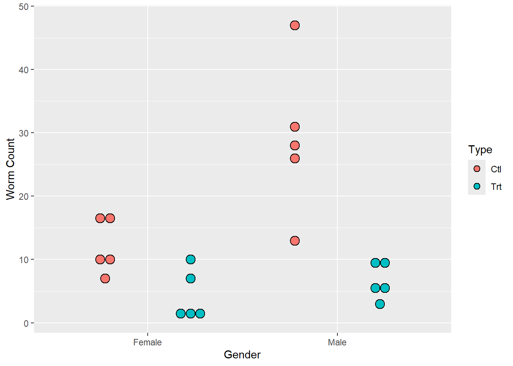

--- 
title: "A Book Chapter Example"
author: "Your Name"
output:
  bookdown::pdf_book:
    latex_engine: xelatex
    number_sections: true
    toc: true
    toc_depth: 2
    keep_tex: true
documentclass: book
bibliography:
  - book.bib
  - packages.bib
biblio-style: apalike
csl: "chicago-fullnote-bibliography.csl"
site: bookdown::bookdown_site

---

# An Introduction to Nonparametric Methods: Schistosomiasis

*Using statistics is no substitute for thinking about the problem*
-Douglas Montgomery^[Douglas Montgomery, Design and Analysis of Experiments, Fifth edition, Wiley, 2003,  page 21.]  

Randomization tests, permutation tests, and bootstrap methods are quickly gaining in popularity as methods for conduct statistical inference. Why? These nonparametric methods require fewer assumptions and provide results that are often more accurate than those from traditional techniques using well-known distributions (such as the normal, t, or F distribution). These methods are based on computer simulations instead of distributional assumptions and thus are particularly useful when the sample data are skewed or if the sample size is small. In addition, nonparametric methods can be extended to other parameters of interest, such as the median or  standard deviation, while the well known parametric methods described in introductory statistics courses are often restricted to just inference for the population mean. 

|     We begin this chapter by comparing two treatments for a potentially deadly disease called Schistosomiasis (shis-tuh-soh-mahy-uh-sis). We illustrate the basic concepts behind nonparametric methods by using randomization tests to:

*	Provide an intuitive description of statistical inference.
*	Conduct a randomization test by hand
*	Use software to conduct a randomization test
*	Compare one-sided and two-sided hypothesis tests
*	Making connections between randomization tests and conventional terminology

After working through the schistosomiasis investigation, you will have the opportunity to
analyze several other data sets using randomization tests, permutation tests, bootstrap methods,
and rank-based nonparametric tests.

## **Investigation: Can a New Drug Reduce the Spread of Schistosomiasis?**

Schistosomiasis is a disease occurring in humans caused by parasitic flatworms called schistosomes (skis’-tuhsohms).
Schistosomiasis affects about 200 million people worldwide and is a serious problem in sub-Saharan
Africa, South America, China, and Southeast Asia. The disease can cause death, but more commonly results
in chronic and debilitating symptoms, arising primarily from the body’s immune reaction to parasite eggs
lodged in the liver, spleen, and intestines.

|  Currently there is one drug, praziquantel (prā'zĭ-kwän'těl'), in common use for treatment of schistosomiasis; it is cheap and effective. However many organizations are worried about relying on a single drug to treat a serious disease which affects so many people worldwide. Drug resistance may have prompted a 1990s outbreak in Senegal, where cure rates were low.  In 2007, several researchers published work involving a promising drug called K11777  that, in theory, might also treat schistosomiasis. 

|  In this chapter, we will analyze data from this study where the researchers wanted to find out whether K11777 helps to stop schistosome worms from growing. In one phase of the study, 10 female laboratory mice and 10 male laboratory mice were deliberately infected with the schistosome parasite. Seven days after being infected with schistosomiasis, each mouse was given injections every day for 28 days. Within each sex, 5 mice were randomly assigned to a treatment of K11777 whereas the other 5 mice formed a control group injected with an equal volume of plain water. At day 49, the researchers euthanized the mice and measured both the number of eggs and the numbers of worms in the mice livers. Both numbers were expected to be lower if the drug was effective.

| Table 1.1 gives the worm count for each mouse. An individual value plot of the data is shown in Figure 1.1. Notice that the treatment group has fewer worms than the control group for both females and males.

\begin{table}[!h]

\caption{(\#tab:table1)Worm count data for the schistosomiasis study. Treatment is a regimen of K11777 injections from day 7 to day 35. Control is the same regimen, but with a water solution only.}
\fontsize{10}{12}\selectfont
\begin{tabular}[t]{cccc}
\toprule
\multicolumn{2}{c}{Female} & \multicolumn{2}{c}{Male} \\
\cmidrule(l{3pt}r{3pt}){1-2} \cmidrule(l{3pt}r{3pt}){3-4}
Treatment & Control & Treatment & Control\\
\midrule
\cellcolor{gray!10}{1} & \cellcolor{gray!10}{16} & \cellcolor{gray!10}{3.0} & \cellcolor{gray!10}{31}\\
2 & 10 & 5.0 & 26\\
\cellcolor{gray!10}{2} & \cellcolor{gray!10}{10} & \cellcolor{gray!10}{9.0} & \cellcolor{gray!10}{28}\\
10 & 7 & 10.0 & 13\\
\cellcolor{gray!10}{7} & \cellcolor{gray!10}{17} & \cellcolor{gray!10}{6.0} & \cellcolor{gray!10}{47}\\
\addlinespace
\textbf{Mean 4.4} & \textbf{12} & \textbf{6.6} & \textbf{29}\\
\bottomrule
\end{tabular}
\end{table}

(\#fig:graph1)Individual value plot of the worm count data

\newpage

>**NOTE**
There is a difference between individual value plots and dotplots. In dotplots (such as Figures 1.3 and
1.4 shown later in this chapter), each observation is represented by a dot along a number line (x-axis).
When values are close or the same, the dots are stacked. Dotplots can be used in place of histograms
when the sample size is small. Individual value plots, as shown in Figure 1.1, are used to simultaneously
display each observation for multiple groups. They can be used instead of boxplots to identify outliers and distribution shape, especially when there are relatively few observations.

