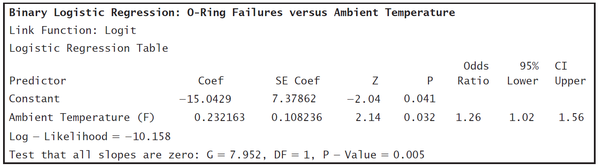

# Logistic Regression: The Space Shuttle Challenger

 *The best thing about being a statistician is that you get to play in everyone’s backyard.*  
 —John Tukey^[D. Leonhardt, “John Tukey, 85, Statistician, Coined the Word ‘Software’,” New York Times Archives on the Web, 7/28/2000, stat.bell-labs.com/who/tukey/nytimes.html. John Tukey (1915–2000) had a formal background in chemistry and mathematics. Conducting data analysis during World War II peaked his interest in statistics, and he became one of the most influential statisticians of the 20th century.]

   

There are many investigations where a researcher is interested in developing a regression model when the response variable is dichotomous (has only two categories). Dichotomous responses can be represented with binary data (data with values of only zero or one). Logistic regression is used to examine the relationship between one or more explanatory variables and a binary response variable.

In this chapter, we will look at several studies, including O-ring failure data provided by the National Aeronautics and Space Administration (NASA) after the space shuttle Challenger disaster, in order to introduce the following logistic regression techniques:

* Calculating and interpreting the logistic regression model  
* Using the Wald statistic and likelihood ratio tests to determine the significance of individual explanatory variables  
* Calculating the log-odds function and maximum likelihood estimates  
* Conducting goodness-of-fit tests to evaluate model appropriateness  
* Assessing regression model performance by looking at a classification table, showing correct and incorrect classification of the response variable  
* Extending logistic regression to cases with multiple explanatory variables  

## **Investigation: Did Temperature Influence the Likelihood of an O-Ring Failure?**

On January 28, 1986, the NASA space shuttle program launched its 25th shuttle flight from Kennedy Space Center in Florida. Seventy-three seconds into the flight, the external fuel tank collapsed and spilled liquid oxygen and hydrogen. These chemicals ignited, destroying the shuttle and killing all seven crew members on board. Reports to President Reagan and videos of the event are available at the Kennedy Space Center website.*  

Investigations showed that an O-ring seal in the right solid rocket booster failed to isolate the fuel supply. Figure 7.1 shows the space shuttle Challenger just after ignition with the fuel tank and two 149.16-foot-long solid rocket boosters. Figure 7.2 shows a diagram of a solid rocket booster. Because of its size, the rocket boosters were built and shipped in separate sections. A forward, center and aft field joint connected the sections. Two O-rings (one primary and one secondary), which resemble giant rubber bands 0.28 inch thick but 37 feet in diameter, were used to seal the field joints between each of the sections.

An O-ring seal was used to stop the gases inside the solid rocket booster from escaping. However, the cold outside air temperature caused the O-rings to become brittle and fail to seal properly. Gases at 5800 °F escaped and burned a hole through the side of the rocket booster.

(\#fig:fig7.1)Picture of the space shuttle Challenger just after ignition. Each solid rocket booster had six O-rings, two at each field joint. The O-rings at the right aft field joint failed.

*The Report of the Presidential Commission on the Space Shuttle Challenger Accident*, also known as the Rogers’ Commission Report, states:

> ““O-ring resiliency is directly related to its temperature. . . . A warm O-ring that has been compressed
will return to its original shape much quicker than will a cold O-ring when compression is relieved.
. . . A compressed O-ring at 75 degrees Fahrenheit is five times more responsive in returning to its
uncompressed shape than a cold O-ring at 30 degrees Fahrenheit. . . . At the cold launch temperature
experienced, the O-ring would be very slow in returning to its normal rounded shape. . . . It would
remain in its compressed position in the O-ring channel and not provide a space between itself and the
upstream channel wall. Thus, it is probable the O-ring would not . . . seal the gap in time to preclude
joint failure due to blow-by and erosion from hot combustion gases. . . . Of 21 launches with ambient 
temperatures of 61 degrees Fahrenheit or greater, only four showed signs of O-ring thermal distress:
i.e., erosion or blow-by and soot. Each of the launches below 61 degrees Fahrenheit resulted in one
or more O-rings showing signs of thermal distress.”$^2$

(\#fig:fig7.2)Diargam of a solid rocket booster.

A lamentable aspect of this disaster is that the problem with the O-rings was already understood by
some engineers prior to the Challenger launch. In February 1984, the Marshall Configuration Control
Board sent a memo about the O-ring erosion that occurred on STS 41-B (the 10th space shuttle flight and
the 4th mission for the Challenger shuttle). Messages continued to increase in intensity, as evidenced by
a 1985 internal memo from Thiokol Corporation, the company that designed the O-ring. Employees from
Thiokol wrote the following to their Vice President of Engineering: “This letter is written to ensure that
management is fully aware of the seriousness of the current O-Ring erosion problem in the SRM joints
from an engineering standpoint.”$^3$

With the temperature on January 28, 1986, expected to be 31°F, Thiokol Corporation recommended
against the Challenger launch. However, this flight was getting significant publicity because a high school
teacher, Christa McAuliffe, was on the flight. The flight had already been delayed several times, and there
was no quick solution to the O-ring concern. The engineers were overruled, and the decision was made to go
ahead with the launch. The eventual presidential investigation stated,
>“The decision to launch the Challenger was flawed. Those who made that decision were unaware of
the recent history of problems concerning the O-rings and the joint and were unaware of the initial
written recommendation of the contractor advising against the launch at temperatures below 53
degrees Fahrenheit and the continuing opposition of the engineers at Thiokol after the management
reversed its position. They did not have a clear understanding of Rockwell’s concern that it was not
safe to launch because of ice on the pad. If the decision makers had known all of the facts, it is highly
unlikely that they would have decided to launch 51-L on January 28, 1986.”$^4$

It seems that even though some engineers did comprehend the severity of the problem, they were unable
to properly communicate the results. Prior to the ill-fated Challenger flight, the solid rocket boosters for 24
shuttle launches were recovered and inspected for damage. Even though O-ring damage was present in some
of the flights, the O-rings were not damaged enough to allow any gas to escape. Since damage was very
minimal, all 24 prior flights were considered a success by NASA.

\begin{table}[!h]
\centering
\caption{(\#tab:tab7.1)Table 7.1 O‑ring damage on 24 space shuttle launches.}
\centering
\begin{tabular}[t]{>{\centering\arraybackslash}p{2cm}c>{\centering\arraybackslash}p{3cm}>{\centering\arraybackslash}p{2cm}}
\toprule
Flight Number & Date & Ambient Temperature (°F) & Successful Launch\\
\midrule
1 & 4/12/1981 & 66 & 1\\
2 & 11/12/1981 & 70 & 0\\
3 & 3/22/1982 & 69 & 1\\
4 & 6/27/1982 & 80 & *\\
5 & 11/11/1982 & 68 & 1\\
\addlinespace
6 & 4/4/1983 & 67 & 1\\
7 & 6/18/1983 & 72 & 1\\
8 & 8/30/1983 & 73 & 1\\
9 & 11/28/1983 & 70 & 1\\
10 & 2/3/1984 & 57 & 0\\
\addlinespace
11 & 4/6/1984 & 63 & 0\\
12 & 8/30/1984 & 70 & 0\\
13 & 10/5/1984 & 78 & 1\\
14 & 11/8/1984 & 67 & 1\\
15 & 1/24/1985 & 53 & 0\\
\addlinespace
16 & 4/12/1985 & 67 & 1\\
17 & 4/29/1985 & 75 & 1\\
18 & 6/17/1985 & 70 & 1\\
19 & 7/29/1985 & 81 & 1\\
20 & 8/27/1985 & 76 & 1\\
\addlinespace
21 & 10/3/1985 & 79 & 1\\
22 & 10/30/1985 & 75 & 0\\
23 & 11/26/1985 & 76 & 1\\
24 & 1/12/1986 & 58 & 0\\
\bottomrule
\end{tabular}
\end{table} 

* Flight 4 is a missing data point because the rockets were lost at sea.

Table 7.1 shows the temperature at the time of each launch and whether any damage was visible in any of the O‑rings. In this chapter, we will define a successful launch as one with no evidence of any O‑ring damage. In Table 7.1, **Successful Launch** is a categorical variable, with 0 representing a launch where O‑ring damage occurred and 1 indicating a successful launch with no O‑ring damage. Throughout the rest of this investigation, the relatively small data set in Table 7.1 will be used to demonstrate techniques that can be used to determine if the likelihood of O‑ring damage is related to temperature.

## Activity: Describing the Data{-}
>1. Based on the description of the Challenger disaster O‑ring concerns, identify which variable in the space shuttle data set in Table 7.1 should be the explanatory variable and which should be the response variable.  
2. Imagine you were an engineer working for Thiokol Corporation prior to January 1986. Create a few graphs of the data in Table 7.1. Is it obvious that temperature is related to the success of the O‑rings? Submit any charts or graphs you have created that show a potential relationship between temperature and O‑ring damage.  

In this chapter, we will develop a regression model using a binary response variable, Successful Launch. For
the space shuttle data set, y = 1 represents a successful flight with no O-ring damage and y = 0 represents a
flight with some O-ring damage. Binary response data occur in many fields; for example, we may want to know

* whether a disease is present or absent
* whether or not a person is a good credit risk for a loan
* whether or not a high school student should be admitted to a particular college
* whether or not an individual is involved in substance abuse

The next section describes why the least squares regression model is not appropriate when the response is
binary. Logistic regression is used to examine the relationship between one or more explanatory variables
and a binary response variable. Like other regression models, logistic regression models often have explana-
tory variables that are quantitative, but they can be categorical as well

## **Review of the Least Squares Regression Model**

In Chapters 2 and 3, you saw that the ordinary least squares regression model has the form
\begin{align}
y_i &= \beta_0 + \beta_1 x_i + \epsilon_i
\quad\text{for } i = 1, 2, 3, \dots, n
\tag{7.1}
\end{align}

where $n$ is the number of observations, $y_i$ is the $i$th value of a \textit{continuous response variable}, $\beta_0$ and $\beta_1$ are regression coefficients, $x_i$ is the $i$th value of the explanatory variable, and $\epsilon_i$ represents normally distributed errors with a constant variance. Equation (7.2) states that the mean response (the expected response at each particular $x_i$) is equal to the linear predictor $\beta_0 + \beta_1 x_i$ for each observed value $x_i$:

\begin{align}
E(Y_i \mid x_i) &= \beta_0 + \beta_1 x_i 
\quad\text{for } i = 1, 2, 3, \dots, n
\tag{7.2}
\end{align}

where $\beta_0$ and $\beta_1$ are parameters that can be estimated with sample data. In addition to assuming that the regression model has a linear predictor, we assume that the error terms in the least squares regression model are independent and follow the normal distribution with a zero mean and a fixed standard deviation:

\begin{align}
\epsilon_i &\overset{\mathrm{iid}}{\sim} N(0, \sigma^2) 
\quad\text{for } i = 1, 2, 3, \dots, n
\tag{7.3}
\end{align}

Equation (7.3) states that each independent and identically distributed error term follows a normal probability
distribution that is centered at zero and has a constant variance.

\large
\textbf{NOTE:} 
When there is only one explanatory variable, as in Equation (7.1), ordinary least squares regression is often called simple linear regression. As shown in Chapter 3, the model is called least squares regression because the line minimizes the sum of the squared residuals (the difference between an observed value and the expected response). Least squares estimates for $\beta_0$ and $\beta_1$ (represented as $b_0 = \hat\beta_0$ and $b_1 = \hat\beta_1$) can be calculated even when the normality and equal variance assumptions are violated. However, these assumptions about the error terms are needed to conduct hypothesis tests and construct confidence intervals for $\beta_0$ and $\beta_1$.
\normalsize

## Activity: Building a Least Squares Regression Model{-}
>3. Use the data in Table 7.1 to create a scatterplot with a least squares regression line for the space shuttle data. Calculate the predicted response values $\hat y = b_0 + b_1 x$ when the temperature is 60°F and when the temperature is 85°F.

## **The Logistic Regression Model**

When the response variable is binary, the response is typically defined as a probability of success, instead of 0 or 1. For example, in Question 3, when the temperature is 60°F, the least squares regression line estimates that the probability of a successful launch is 0.338. The expected response at each particular $x_i$ is defined as

\begin{align}
\pi_i &= P(Y_i = 1) = \text{probability that a launch has no O-ring damage at temperature } x_i \notag \\
      &= E(Y_i \mid x_i) \notag \\
      &= \beta_0 + \beta_1 x_i \quad \text{for } i = 1,2,3,\dots,n \tag{7.4}
\end{align}

While the linear model ($\beta_0 + \beta_1 x_i$) in Equation (7.4) is simple, it is not appropriate to use, since probabilities must be between 0 and 1. For example, with a temperature value $x_i = 50$, the least squares regression model in Question 3 would predict a probability of $-0.036$. In order to restrict the predictions to values between 0 and 1, an S-shaped function called the log-odds function will be used.

Logistic regression uses the following model to fit an S-shaped relationship between $\pi$ and $x$:

\begin{align}
\ln\bigl(\frac{\pi_i}{1 - \pi_i}\bigr) &= \beta_0 + \beta_1 x_i 
\tag{7.5}
\end{align}

where ln represents the natural log, $\beta_0$ and $\beta_1$ are regression parameters, and $\pi_i$ is the probability of a successful launch for a given temperature ($x_i$). The ratio $\pi/(1 - \pi)$ is called the odds, the probability of success over the probability of failure. Thus, the function ln[$\pi/(1 - \pi)$] is called the log-odds of $\pi$ or the logistic or logit transformation of $\pi$.* Figure 7.3 shows both the least squares regression model and the logistic regres-
sion model for the space shuttle data.

\large
\textbf{MATHEMATICAL NOTE:}
In Chapter 6, the odds of an outcome are defined as $\pi/(1 - \pi)$, the probability of a success (no O-ring damage) over the probability of a failure (O-ring damage). For example, if a computer randomly selects a day of the week, the odds of selecting Saturday (Saturday is considered a success) are 1 to 6, since

\begin{align}
\text{odds} = \frac{\pi}{1 - \pi} = \frac{1/7}{(1 - (1/7))} = \frac{1}{6}.
\notag
\end{align}

Similarly, the odds are 6 to 1 against Saturday being selected (any day but Saturday is a success).
\normalsize

(\#fig:fig7.3)Figure 7.3 Space shuttle data with a simple linear regression model and a logistic regression model.

*?Throughout this chapter, we will use terms such as \textit{log-odds} or \textit{log-likelihood}, but we actually use natural logs (ln) in
our calculations.

Equation (7.5) can be solved for $\pi_i$ to show that

\begin{align}
\pi_i &= \frac{e^{\beta_0 + \beta_1 x_i}}{1 + e^{\beta_0 + \beta_1 x_i}} \tag{7.6}
\end{align}

\large
\textbf{MATHEMATICAL NOTE:}
Binary logistic regression assumes that for each $x_i$ value, the response variable $Y_i$ follows a Bernoulli distribution (described in the extended activities). This means we assume that (1) each $Y_i$ is independent, (2) each $Y_i$ falls into exactly one of two categories represented by either a zero or a one, and (3) for each $x_i$, $P(Y_i = 1) = \pi_i$ and $P(Y_i = 0) = 1 - \pi_i$ (more specifically written as $P(Y_i = 1 \mid x_i) = \pi_i$ and $P(Y_i = 0 \mid x_i) = 1 - \pi_i$). This third assumption states that for any given explanatory variable (a specific temperature value), the probability of success (no O-ring failures) is constant.
\normalsize 

It is possible to use least squares regression techniques to estimate $\beta_0$ and $\beta_1$ in logistic regression models. However, the assumptions needed for hypothesis tests and confidence intervals using the ordinary least squares regression model are not met. Specifically, even after the log-odds transformation, Figure 7.3 demonstrates that the residuals are not normally distributed and the variability of the residuals depends on the explanatory variable.

Residuals (observed values minus expected values) are used to estimate the error terms. Visual inspection of residual plots is often used to check for normality. Recall from previous work in regression that if the residuals are normally distributed, the scatterplot of the residuals versus the explanatory variable should resemble a randomly scattered oval of points. For example, it should resemble the random scatter you would see if you happened to drop 23 coins (one for each residual value).

In logistic regression, the residuals are $y_i - \hat\pi_i$. If the observed response $y_i = 0$, then the residual value is $-\hat\pi_i$. If the observed response $y_i = 1$, then the residual value is $1 - \hat\pi_i$. This leads to the two curves shown in Figure 7.4. When the temperature is low in the space shuttle data (around 55°F, as seen in Figure 7.3), the observed responses tend to be zero and the predicted responses ($\hat\pi_i$’s) are small positive numbers. Thus, the residual values ($-\hat\pi_i$’s) are negative and close to zero. When the temperature is high, the observed responses tend to be one, the predicted responses are close to one, and the residual values are positive and close to zero.

(\#fig:fig7.4)Figure 7.4 A scatterplot of the residuals from the space shuttle logistic regression model and a sample of what a scatterplot of normally distributed residuals might look like.

\Large
\textbf{\textcolor{red}{Key Concept:}}
\color{red}
When the response in a regression model is binomial, $\pi_i = P(Y_i = 1)$ is the probability of a success (a launch has no O-ring damage at temperature $x_i$). In simple linear regression models with a binomial response,

\begin{align}
y_i &= \pi_i + \epsilon_i = \beta_0 + \beta_1 x_i + \epsilon_i \quad \text{for } i = 1,2,3,\dots,n \tag{7.7}
\end{align}

With the logit transformation, logistic regression models with a binomial response have the following form:

\begin{align}
y_i &= \pi_i + \epsilon_i = \frac{e^{\beta_0 + \beta_1 x_i}}{1 + e^{\beta_0 + \beta_1 x_i}} + \epsilon_i \quad \text{for } i = 1,2,3,\dots,n \tag{7.8}
\end{align}

While the logit transformation results in a nice S-shaped curve, the error terms in Equations (7.7) and (7.8) are not constant and are not normally distributed. Thus, hypothesis tests and confidence intervals cannot be calculated using least squares regression.
\color{black}
\normalsize

## **The Logistic Regression Model Using Maximum Likelihood Estimates**

Logistic regression is a special case of what is known as a generalized linear model. Generalized linear models expand linear regression models to cases where the normal assumptions do not hold. All generalized linear models have three components:

\begin{itemize}
  \item \textbf{A linear predictor:} In the shuttle example, there is only one explanatory variable, $x = \text{Temperature}$, so the linear predictor in Equation (7.5) is $\beta_0 + \beta_1 x$. However, just as in other multiple regression models, the linear predictor can include many explanatory variables, including indicator variables and interaction terms as well as other transformed variables.
  \item \textbf{A random component:} Each error term is assumed to be independent. However, in generalized linear models, the error terms are not required to follow a normal distribution. In addition, generalized linear models do not require that the variability of the error terms be constant.
  \item \textbf{A link function:} A link function is a function that fits the expected response value to a linear predictor. In Equation (7.5), the link function is the log-odds function, $\ln[\pi/(1 - \pi)]$. The link function depends on the distribution of the response variable. In logistic regression, the response variable is binary. Other link functions for binary response data do exist, but the log-odds function is the most common because it is the easiest to interpret.
\end{itemize}

Generalized linear models can also be used when the response variable follows other distributions. For example, $y$ may follow a Poisson or gamma distribution. Textbooks on generalized linear models derive link functions for each of these types of response variables. In least squares regression where the response has a normal distribution, as in Equation (7.1), the link function is simply the identity function. In other words, the response needs no transformation in simple linear regression models.

Clearly the logistic regression model in Figure 7.3 is nonlinear. So it may seem somewhat surprising to consider logistic regression as a generalized linear model. The reason we still call this model linear is that the link function, the log-odds transformation, is modeled with a linear predictor, $\beta_0 + \beta_1 x$.

Instead of using least squares estimates, generalized linear models use the method of maximum likelihood to estimate the coefficients $\beta_0$ and $\beta_1$. The extended activities provide more detail on calculating maximum likelihood estimates in logistic regression. In the space shuttle example, we will simply use a computer software package to find maximum likelihood estimates of $\beta_0$ and $\beta_1$.

\large
\textbf{NOTE:} In least squares regression, we often transform the response variable ($y$) so that the data fit model assumptions. In addition to linearizing data, transforming $y$ impacts the variability and the distribution of the error terms. In generalized linear models, the link function transforms the expected response ($\pi$) to fit a linear predictor. For those who have had calculus, link functions are also differentiable and invertible.
\normalsize

## Activity: Using Software to Calculate Maximum Likelihood Estimates {-}
>4. Solve Equation (7.5) for $\pi_i$ to show that Equation (7.6) is true.  
>5. Use Equation (7.6) to create six graphs. In each graph, plot the explanatory variable ($x$) versus the expected probability of success ($\pi$) using $\beta_0 = -10$ and $-5$ and $\beta_1 = 0.5$, $1$, and $1.5$. Repeat the process for $\beta_0 = 10$ and $5$ and $\beta_1 = -0.5$, $-1$, and $-1.5$.  
>   a. Do not submit the graphs, but explain the impact of changing $\beta_0$ and $\beta_1$.  
>   b. For all of these graphs, what value of $\pi$ appears to have the steepest slope?  
>6. Use statistical software to calculate the maximum likelihood estimates of $\beta_0$ and $\beta_1$. Compare the maximum likelihood estimates to the least squares estimates in Question 3.

Figure 7.3 shows a logistic regression model using maximum likelihood estimates of $\beta_0$ and $\beta_1$. Using Equation (7.6) and the maximum likelihood estimates from Question 6, we can estimate the probability that a launch has no O-ring damage at temperature $x_i$:

\begin{align}
\hat\pi_i 
&= \frac{e^{b_0 + b_1 x_i}}{1 + e^{b_0 + b_1 x_i}} \\
&= \frac{e^{-15.043 + 0.232 x_i}}{1 + e^{-15.043 + 0.232 x_i}} \\
&\quad \text{for } i = 1,2,3,\dots,n \tag{7.9}
\end{align}

Notice that $\pi$ in Equation (7.6) has been replaced by $\hat\pi$ in Equation (7.9) because the parameters in the linear regression model ($\beta_0$ and $\beta_1$) have been estimated with our sample data; $b_0 = \hat\beta_0 = -15.043$ and $b_1 = \hat\beta_1 = 0.232$.

## Activity: Estimating the Probability of Success with Maximum Likelihood Estimates {-}
>7. Use Equation (7.9) to predict the probability that a launch has no O-ring damage when the temperature is 31°F, 50°F, and 75°F.

At this point, it seems reasonable to question why the O-rings were not considered a higher risk at the time of the 1986 Challenger launch. After all, the odds of a successful launch (no O-ring damage) at the expected temperature of 31°F are about 1 to 2555 and the predicted odds change dramatically based on temperature. It is important to recognize that the previous launches did not result in the same disaster as the Challenger launch because the O-rings showed only “minor” damage. This wasn’t enough for gas to escape—only an indicator that the O-rings might not be as resilient as expected.

\large
\textbf{CAUTION:} Estimating a value for a temperature of 31°F is extrapolating beyond our data set. Just as in least squares regression, caution should be used when making predictions outside the range of explanatory variables that are available.
\normalsize

## **Interpreting the Logistic Regression Model**

Interpretation of logistic regression models is often done in terms of the odds of success (odds of a launch with no O-ring damage). When the temperature is 59°F, the odds of a successful launch with no O-ring damage are $\hat\pi/(1 - \hat\pi) = 0.2066/(1 - 0.2066) = 0.2605 \approx 0.25 = 1/4$. Thus, at 59°F, we state that the odds of a successful launch are about 1 to 4. When the temperature is 60°F, the odds of a successful launch are $\hat\pi/(1 - \hat\pi) = 0.3285 \approx 0.333 \approx 1/3$. At 60°F, we state that the odds of a successful launch are about 1 to 3.

The slope is not as easy to interpret for a logistic regression model as for a simple linear regression model. While ordinary least squares regression focuses on $\beta_1$, logistic regression measures the change in the odds of success by the term $e^{b_1}$, which is called the odds ratio. If we increase $x_i$ by 1 unit in a logistic regression model, the predicted odds that $y = 1$ (i.e., the launch will not have any O-ring damage) will be multiplied by $e^{b_1}$. For example, when the temperature changes from 59°F to 60°F, the odds increase by a multiplicative factor of $e^{b_1} = e^{0.232} = 1.2613$. In other words,

\begin{align}
\text{odds of success at 59°F} \times e^{b_1} 
&= 0.2605(1.2613) \notag \\
&= 0.3285 \notag \\
&= \text{odds of success at 60°F} \notag
\end{align}

For any temperature value $x_i$, this relationship can also be stated as

\begin{align}
\text{odds ratio} = e^{b_1} &= \frac{\text{odds}(x_i + 1)}{\text{odds}(x_i)} \tag{7.10}
\end{align}

\large
\textbf{MATHEMATICAL NOTE:}
Taking the exponent of Equation (7.5), we can write the odds of success as
\begin{align}
\text{odds} = \biggl(\frac{\pi_i}{1 - \pi_i}\biggr) &= e^{\beta_0 + \beta_1 x_i} = e^{\beta_0}(e^{\beta_1})^{x_i} \tag{7.11}
\end{align}

Thus, as $x_i$ increases by 1,
\begin{align}
e^{\beta_0}(e^{\beta_1})^{x_i + 1} &= e^{\beta_0}(e^{\beta_1})^{x_i}(e^{\beta_1}) \tag{7.12}
\end{align}

\normalsize

\Large
\textbf{\textcolor{red}{Key Concept:}}
\color{red}
The slope in a logistic regression model is typically described in terms of the odds ratio $e^{b_1}$. If we increase $x_i$ by 1 unit, the predicted odds will be multiplied by $e^{b_1}$. In our example, if the temperature increases by one degree, we increase the odds of a successful launch by $e^{b_1} = e^{0.232} = 1.2613$ times. Similarly, if we decrease $x_i$ by 1 unit, the predicted odds will be multiplied by $e^{-b_1} = 1/e^{b_1}$.
\color{black}
\normalsize

## Activity: Interpreting a Logistic Regression Model {-}
>8. Calculate the odds of a launch with no O-ring damage when the temperature is 60°F and when the temperature is 70°F.  
>9. When $x_i$ increases by 10, state in terms of $e^{b_1}$ how much you would expect the odds to change.  
>10. The difference between the odds of success at 60°F and 59°F is about 0.3285 – 0.2605 = 0.068. Would you expect the difference between the odds at 52°F and 51°F to also be about 0.068? Explain why or why not.  
>11. Create a plot of two logistic regression models. Plot temperature versus the estimated probability using maximum likelihood estimates from Question 6, and plot temperature versus the estimated probability using least squares estimates from Question 3.

Thus far, we have developed a model to estimate the odds of a successful launch with no O-ring failures. However, we have not yet discussed the variability of the estimates or how confident we can be of the results. In the next section, we will discuss two hypothesis tests that can be used to determine if the odds of a successful launch are related to temperature. In other words, can we conclude that the logistic regression coefficient $b_1$ is not equal to zero?

\Large
\textbf{\textcolor{red}{Key Concept:}}
\color{red}
The probability, the odds, and the log-odds are three closely related calculations. Even though any of
the three could be used to express the concepts of interest, the log-odds are often used to estimate the
coefficients, while interpretation of logistic regression models typically relies on expected probabilities
and odds because they are easier to interpret.
\color{black}
\normalsize

## **Inference for the Logistic Regression Model**

## Assumptions for Logistic Regression Models {-}

Inference for logistic regression uses statistical theory that is based on limits as the sample size approaches infinity. The techniques, based on what is called asymptotic theory, work well with large sample sizes, but are only approximate with outliers or small sample sizes. It is common for logistic regression models to be developed for data sets of any size, but savvy statisticians will always use caution when interpreting the results for data sets with small sample sizes (such as the space shuttle example).

## The Wald Statistic {-}

Wald’s test is often used to test the significance of logistic regression coefficients. Just as in least squares regression, we set up a hypothesis test to determine if there is a relationship between the explanatory and response variables:

\begin{align}
H_0: b_1 = 0 \quad \text{vs.}\quad H_a: b_1 \neq 0
\end{align}

Wald’s test is similar to the one-sample Z-test seen in introductory statistics courses. The Wald statistic is calculated as

\begin{align}
Z = \frac{b_1 - 0}{\text{se}(b_1)} = \frac{0.232}{0.108} = 2.14 \tag{7.13}
\end{align}

\large
\textbf{NOTE:}
Some texts use a chi-square statistic instead of the Z-statistic given in Equation (7.13). Most probability textbooks explain that the square of the test statistic in Equation (7.13) follows a chi-square distribution with 1 degree of freedom. Both techniques provide identical p-values.
\normalsize

where $b_1$ is the maximum likelihood estimate of $\beta_1$ and se($b_1$) is the standard error of $b_1$. The maximum likelihood estimate, $b_1$, is asymptotically normally distributed (i.e., $b_1$ is normally distributed when the sample size is large). Thus, the Z-statistic in Equation (7.13) will follow a standard normal distribution when the null hypothesis is true and the sample size is large. In this model, we see that the estimated slope coefficient $b_1 = 0.232$ has a p-value of $P(|Z| \geq 2.14) = 0.032$.

Wald confidence intervals can also be created. In logistic regression, the confidence interval is often discussed in terms of the odds ratio. For example, a 95% confidence interval for $\beta_1$ is given as

\begin{align}
(e^{b_1 - Z^* \text{se}(b_1)}, e^{b_1 + Z^* \text{se}(b_1)}) = (e^{0.232 - 1.96(0.108)}, e^{0.232 + 1.96(0.108)}) = (e^{0.02}, e^{0.44}) = (1.02, 1.56) \tag{7.14}
\end{align}

where 1.96 = Z^* represents a value corresponding to a 95% confidence interval for a normal distribution with mean of 0 and standard deviation of 1. When $b_1 = 0$, and thus the odds ratio $e^{b_1} = 1$, the odds of success for temperature $x_i$ are the same as the odds of success for any other temperature. Thus, $e^{b_1} = 1$ tells us that there is no association between the explanatory variable and the response.

\Large
\textbf{\textcolor{red}{Key Concept:}}
\color{red}
When a 95% Wald confidence interval for the odds ratio does not contain 1, we reject the null hypothesis $H_0: \beta_1 = 0$ (using an alpha-level of 0.05) and conclude that the odds of success do depend on the explanatory variable $x_i$. If the interval does contain 1, we fail to reject $H_0: \beta_1 = 0$.
\color{black}
\normalsize

The Minitab output in Figure 7.5 shows Wald’s test and the corresponding confidence interval for the
odds ratio. In the space shuttle example, the 95% confidence interval does not include $e^{\beta_1} = 1$; thus, we can
reject the null hypotheses and conclude that the odds of a successful launch do depend on the temperature.
Even though computer software provided a small p-value and a confidence interval that does not include 1, it
is important to note that there are only 23 observations in this study. While Wald’s test is reasonable with very
large sample sizes, with smaller sample sizes it is known to have a tendency to result in a type II error—failing
to reject the null hypothesis when it should be rejected.^[?Recall that Z in Equation (7.13) is a statistic calculated from the sample data and Z* in Equation (7.11) is called a critical value. Z* represents a value based on a desired level of confidence. Z* is known before the data are collected, while Z is based on the sample data]

We can also calculate the odds ratio of a successful launch between 60°F and 70°F. When $x_i$
increases by 10°F, the odds are multiplied by $(e^{b_1})10 = 1.2613^{10} = 10.19$. Thus, we have approximately
10 times higher odds of a successful launch when the temperature is 70°F than when it is 60°F. A 95%
confidence interval for the odds ratio of a successful launch between 60°F and 70°F can be given by
$(1.02^10, 1.56^10) = (1.22, 85.40)$. This 95% confidence interval has a very wide range; the odds of success
at 70°F could be just slightly larger than the odds at 60°F or 85 times as large as the odds at 60°F. This
large range suggests that our estimate of the odds ratio, 10.19, is highly variable. More data are needed to
better understand the true odds ratio.

## Activity: Wald Confidence Intervals and Hypothesis Tests {-}
>12. Calculate the odds ratio of a successful launch between 31°F and 60°F. Provide a confidence interval
for this odds ratio and interpret your results.
>13. The coefficients in Equation (7.9) were calculated when a successful launch was given a value of 1. Con-
duct a logistic regression analysis where 1 indicates an O-ring failure and 0 represents a successful launch.
a. Explain any relationships between the model shown in Equation (7.9) and this new model.
b. How did the regression coefficients change?
c. How did the odds ratio change?
d. Create a 95% Wald confidence interval for the new odds ratio and interpret the results.

(\#fig:fig7.5)Minitab output for the space shuttle study.

## The Likelihood Ratio Test {-}

The **likelihood ratio test (LRT)** is derived by calculating the difference between the adequacy of the full and restricted log-likelihood models. A **full model** (sometimes called an **unrestricted model**) includes all parameters under consideration in the model. In this example, there are only two parameters, $\beta_0$ and $\beta_1$, but the full model could include more parameters if more explanatory variables were in the model. The **restricted model** (also called a **reduced model**) is a model with fewer terms than the full model. In our example, only $\beta_0$ is in the restricted model (no explanatory variables are in this model). When no explanatory variables are in the restricted model, the restricted model is also called a **null model**. If the full model has a significantly better fit (the expected values are closer to the observed values) than the restricted model, we reject the null hypothesis $H_0: \beta_1 = 0$ and conclude that $H_a: \beta_1 \neq 0$.

The log-likelihood (restricted) function, described in the extended activities, is a measure of the fit of the model that includes only the intercept:

\begin{align}
\text{Restricted Model:} \quad \pi_i = \frac{e^{\beta_0}}{1 + e^{\beta_0}}
\notag
\end{align}

For the restricted model, the null hypothesis is true and $\pi_i$ is constant for any x-value. The log-likelihood (full) function measures the fit of the model that includes all of the parameters of interest:

\begin{align}
\text{Full Model:} \quad \pi_i = \frac{e^{\beta_0 + \beta_1 x_i}}{1 + e^{\beta_0 + \beta_1 x_i}}
\notag
\end{align}

When the null hypothesis $H_0: \beta_1 = 0$ is true, it can be shown that

\begin{align}
G = 2 \times \text{log-likelihood(full model)} - 2 \times \text{log-likelihood(restricted model)} \sim \chi^2_1 
\tag{7.15}
\end{align}

The G-statistic measures the difference between the fits of the restricted and full models. In essence, we
are measuring how much better the fit is when an explanatory variable (temperature) is added to the logistic
model. If the p-value corresponding to the G-statistic is small, the difference in fits is so large that it is unlikely
to occur by chance, and thus we conclude that Ha: b1 0 (the fit of the full model is significantly better than
that of the restricted model).

Degrees of freedom for the LRT equal the number of parameters in the full model minus the number of
parameters in the restricted model. In our case, this is 2 - 1 = 1. Different software packages will present
this test in slightly different ways. In the Minitab output in Figure 7.5, the log-likelihood of the full model
(-10.158) and the G-statistic (7.952) are provided.

Other statistics packages may not give the G-statistic, but they will give enough information so that
the LRT can be calculated. The R output shown in Figure 7.6 gives the null deviance [K - 2 * log-
likelihood (restricted model)] and the residual deviance [K - 2 * log-likelihood (full model)], where
K is a constant value.

Note that
\begin{align}
G &= 2 \times \text{log-likelihood(full model)} - 2 \times \text{log-likelihood(restricted model)} \notag \\
&= \text{null (restricted model) deviance} - \text{residual (full model) deviance} \notag \\
&= 7.952. \notag 
\end{align}

## Activity: The Likelihood Ratio Test {-}
>14. Use statistical software to calculate the LRT for the space shuttle data. Submit the p-value and state your conclusions.

The G-statistic is relatively large, indicating that we have some evidence to reject $H_0: beta_1 = 0$ and conclude that temperature is related to the odds of a successful launch with no O-ring damage. When sample sizes are large and there is only one explanatory variable in the model, the p-values for the LRT and Wald’s test will be approximately the same. In the space shuttle example, the LRT and Wald’s test have somewhat different p-values.

The likelihood ratio test is more reliable and is often preferred over Wald’s test for small sample sizes. However, unlike the LRT, Wald’s test can have one-sided alternative hypothesis tests as well as nonzero hypothesized values. It is difficult to determine the actual sample size needed for Wald’s test or the LRT to perform well. Some statisticians suggest a minimum sample size of 100 observations.$^7$ Thus, it is best to label each p-value as approximate when using these tests with a small sample size.

\Large
\textbf{\textcolor{red}{Key Concept:}}
\color{red}
With a large sample size, Wald’s test and the likelihood ratio test provide accurate tests for $H_0: \beta_1 = 0$ versus $H_a: \beta_1 \neq 0$. While the LRT test tends to be more reliable with smaller sample sizes, use caution when interpreting the results for data sets with small sample sizes (such as the space shuttle example).
\color{black}
\normalsize

## **What Can We Conclude from the Space Shuttle Study?**

The space shuttle example is an observational study, since the launches were not “randomly assigned” to the temperature groups, so we cannot conclude solely from this data set that low temperatures caused O-ring damage. Wald’s test and the likelihood ratio test both provided some evidence that the odds of a successful launch are related to temperature. However, a sample size of 23 is not large enough for us to be confident that the p-values are reliable. The logistic regression model provides some indication that the probability of a successful launch is related to temperature. Other information, such as scientists understanding that cold temperatures cause O-rings to be more brittle, also strengthens the conclusion.

## **Logistic Regression with Multiple Explanatory Variables**

Wolberg and Mangasarian developed a technique to accurately diagnose breast masses using only visual characteristics of the cells within the tumor. A sample is placed on a slide, and characteristics of the cellular nuclei within the tumor, such as size, shape, and texture, are examined under a microscope to determine whether the cancer cells are benign or malignant. Benign tumors are scar tissue or abnormal growths that do not spread and are typically harmless. Malignant (or invasive) cancer cells are cells that can travel, typically through the bloodstream or lymph nodes, and begin to replace normal cells in other parts of the body. If a tumor is malignant, it is essential to remove or destroy all cancerous cells in order to keep them from spreading. If a tumor is benign, surgery is typically not needed and the harmless tumor can remain.

In Chapter 6, we used contingency tables with only two variables, cell shape and type, to better understand how to analyze two categorical variables. This section will describe the process of variable selection in logistic regression, using the radius and the concavity of cell nuclei to estimate the probability that a tumor is malignant. In this data set, radius is actually the average radius (in micrometers, $\mu$m) of all visible cell nuclei from a slide, but we will refer to this variable simply as the cell radius for the tumor. The concavity of the cell nuclei is an indicator of whether the visible cell nuclei from the sample have the nice round shape of typical healthy cells or whether cells appear to have grown in such a way that the perimeters of the cell nuclei tend to have concave points.

## Extended Activity: Estimating the Probability of Malignancy in Cancer Cells {-}

Data set: Cancer2

15. Create a logistic regression model using Radius and Concave as explanatory variables to estimate the probability that a mass is malignant.  
   a. Using Radius as the first explanatory variable, $x_1$, and Concave as the second explanatory variable, $x_2$, submit the logistic regression model. In other words, find the coefficients for the model

\begin{align}
   y_i &= \frac{e^{\beta_0 + \beta_1 x_{1,i} + \beta_2 x_{2,i}}}{1 + e^{\beta_0 + \beta_1 x_{1,i} + \beta_2 x_{2,i}}} + \epsilon_i \quad \text{for } i = 1,2,\dots,n
\end{align}

   b. Submit the likelihood ratio test results, including the log-likelihood (or deviance) values.  
   c. Concave = 0 represents round cells and Concave = 1 represents concave cells. Calculate the event probability when Radius = 4 and the cells are concave. Also calculate the event probability when Radius = 4 and the cells are not concave.

16. Create a logistic regression model using only Radius as an explanatory variable to estimate the probability that a mass is malignant.  
   a. Submit the logistic regression model and the likelihood ratio test results, including the log-likelihood (or deviance) values.  
   b. Calculate the event probability when Radius = 4.

When there are multiple explanatory variables in a logistic regression model, such as in the model created in Question 15, the likelihood ratio test compares the full model to the null model, which excludes the radius and concavity terms. Thus, the null hypothesis is that the coefficient corresponding to each of the explanatory variables is zero. In Question 15, the LRT is testing

$$H_0: \beta_1 = \beta_2 = 0 \quad \text{vs.}\quad H_a: \text{at least one of the coefficients is not zero}$$

The G-statistic for this hypothesis test is 527.42 with 3 - 1 = 2 degrees of freedom (the number of parameters in the full model minus the number of parameters in the restricted model) and a corresponding p-value < 0.001. Thus, we can reject $H_0$ and conclude that at least one of the explanatory variables is significantly related to the probability that the cells are malignant.

The coefficients in multiple logistic regression models are discussed in terms of the odds of success. Any coefficient ($b_j$) indicates how the response will change corresponding to the $j$th explanatory variable, conditional on all other explanatory variables in the model. When the $j$th explanatory variable is increased by one unit, the odds of success will be multiplied by $e^{b_j}$. When an explanatory variable ($x_j$) is binary, as Concave is, $e^{b_j}$ represents the odds ratio between the two groups. However, just as in ordinary least squares regression with multiple explanatory variables, these coefficients are conditional on the other terms in the model.

## **The Drop-in-Deviance Test**

Figure 7.7 provides the expected probabilities for the model created in Question 15. The probability of a cell being malignant appears to depend on Radius. In addition, it appears that concavity is an important variable in the model, since concave cells tend to have a higher estimated probability of being malignant. In Chapter 3, variable selection is described as a process of determining which explanatory variables should be included in a regression model. Ideally, we would like the simplest model (i.e., the model with the fewest terms) that best explains the response (i.e., the model that has the smallest residuals). In this example, we want to determine if the model in Question 16 can estimate the probability of malignancy just as accurately as the slightly more complex model in Question 15. If the models have similar abilities to estimate the probability of malignancy, then we will prefer the simpler model.

The logic for determining whether additional terms should be in a logistic regression model is essentially the same as for the LRT discussed in connection with the space shuttle study. The log-likelihood (or deviance) can be used to measure how well any model fits the data. If a full model with two explanatory variables, $x_1$ and $x_2$, has a much better fit than a restricted model with just one explanatory variable, $x_1$, we can conclude that $x_2$ is significant and should be included in the model.

If the LRT shows no significant difference between the full and the restricted model, the coefficient of
the second variable, $x_2$, can be set to zero and we can conclude that including the additional variable in the
model does not improve our ability to estimate the probability of success (in this case, success represents a
malignant cell).

In the cancer study, we can compare the full log-likelihood (or deviance) from the two-term model in
Question 15 to the restricted log-likelihood (or deviance) from the one-term model in Question 16.

\begin{align}
G &= 2 \times \text{log-likelihood (full model)} - 2 * \text{log-likelihood (restricted model)} \notag \\
&= 2(-112.008) - 2(-165.005) \notag \\
&= \text{null (restricted model) deviance} - \text{residual (full model) deviance} \notag \\
&= 105.994 \tag{7.16}
\end{align}

Just as in the LRT described in connection with the shuttle example, degrees of freedom are calculated as the
number of parameters in the full model minus the number of parameters in the restricted model. Thus, we can
test whether $Concave$ ($x_2$) should be included in the model by finding the $p$-value, which is the percentage of
the $\chi^2$ distribution with 3 - 2 = 1 degree of freedom that exceeds $G$. The $p$-value corresponding to Equation
(7.16) is less than 0.0001. We have strong evidence that the explanatory variable, $Concave$, is important in
the model when $Radius$ is already included. Thus, the logistic regression model in Question 15 is preferred
over the model in Question 16.

(\#fig:fig7.7)Figure 7.7 A scatterplot of the observed data and estimated probabilities for both round cells (Concave= 0) and concave cells (Concave= 1).

When the LRT is used for variable selection, it is often called the **change-in-deviance test** or **drop-in-deviance test**. This test is valid only when the restricted model is nested within the full model. A
restricted model is **nested** in a full model when every explanatory variable in the restricted model is also
in the full model.

\Large
\textbf{\textcolor{red}{Key Concept:}}
\textcolor{red}{To use the drop-in-deviance test to determine if $x_i$ should be included in a model:}

\textcolor{red}{1. Calculate the deviance (or $-2 \times$ log-likelihood) for the full (i.e., unrestricted) model with all variables of interest.}

\textcolor{red}{2. Calculate the deviance (or $-2 \times$ log-likelihood) for the reduced (i.e., restricted) model (e.g., the model including all the variables in step 1 except for $x_i$).}

\textcolor{red}{3. Calculate $G = 2 \times$ log-likelihood (full model) $-2 \times$ log-likelihood (restricted model) = deviance (restricted model) $-$ deviance (full model).}

\textcolor{red}{4. Calculate the degrees of freedom, the number of parameters in the full model minus the number of parameters in the restricted model.}

\textcolor{red}{5. Find the $p$-value, the percentage of the $\chi^2$ distribution that exceeds $G$.}

\textcolor{red}{6. If the $p$-value is small, reject $H_0: \beta_i = 0$ and conclude that $x_i$ should be included in the model. If the $p$-value is large, the explanatory variable, $x_i$, can be eliminated from the model.}
\normalsize

\large
\textbf{MATHEMATICAL NOTE:}
The drop-in-deviance can also be used to simultaneously test multiple variables. For example, let’s assume
that there were four Shape measurements (round, slightly concave, moderately concave, and severely
concave). These four levels would be used to create three indicator variables. If we are interested in
testing whether $Shape$ is important, we should test all three coefficients simultaneously. The steps in
testing three coefficients simultaneously are identical to the steps listed above except that instead of
just testing for $x_j$, we are simultaneously testing for $x_2$, $x_3$, and $x_4$. Then the null hypothesis would be
$H0: \beta_2 = \beta_3 = \beta_4 = 0$, where each of these coefficients corresponds to one $Shape$ indicator variable
in the full model.
\normalsize 

Drop-in-deviance tests are often used in combination with stepwise regression techniques in order to
identify the best model for prediction. In the end-of-chapter exercises, backward elimination procedures
analogous to those used in multiple least squares regression will be used to find an appropriate model. The
procedure starts with all explanatory variables of interest in the model. Variables that do not appear to be
significant (or do not significantly reduce the size of the residuals) are removed in a stepwise process. The
process is continued until all variables in the model are significant (or the model consists of only variables
that are important in reducing the size of the residuals).

Just as in least squares regression, there is often no “best” multivariate logistic regression model. Differ-
ent stepwise procedures, sampling variability, the desired balance between the accuracy and the simplicity
of the model, and choice of terms tested all can influence the final model that is selected. While there should
be careful justification for selecting a final model, caution should be used before stating that any selected
model is “the best.”

\large
\textbf{CAUTION:}
Recall that stepwise techniques are useful for developing models if the goal is to estimate or predict a
response. However, they are not appropriate if the goal of developing a regression model is theory test-
ing. Stepwise procedures involve multiple testing on the same variables. This leads to unreliable p-values
when testing the coefficients of individual explanatory variables. Thus, it is inappropriate to use stepwise
procedures to find a good model and then test each coefficient on your final model to determine if the
individual explanatory variables are significant.
\normalsize 

\large
\textbf{NOTE:}
Some software packages have programs that will automatically suggest a model for logistic regression
(just as is done for stepwise procedures in least squares regression). While this chapter focuses only on
the drop-in-deviance test, there are other techniques that can be used in variable selection.
\begin{align}
\textbf{Akaike’s Information Criterion (AIC)} &= -2 \times \text{log-likelihood} + 2 \times p \notag \\
\textbf{Bayesian Information Criterion (BIC)} &= -2 \times \text{log-likelihood} + p \times ln(n) \notag
\end{align}
where p is the number of estimated parameters (the number of explanatory variables plus 1) and n is the
sample size. Both the AIC and the BIC adjust for the number of parameters in the model and are more
likely to select models with fewer variables than the drop-in-deviance test. Both techniques suggest choos-
ing a model with the smallest AIC or BIC value
\normalsize 

## **Measures of Association**

When sample sizes are small, a model may have a strong association (a clear pattern is visible) but not have enough evidence to show that the independent variable is significant. Conversely, if there were thousands of observations in a data set, a hypothesis test might conclude that an independent variable was significant even though there was only a very weak association. Thus, researchers typically report both significance tests and a measure of association when discussing results. While there is no widely accepted equivalent to $R^2$ in logistic regression, this section will describe calculations that can be used to measure the strength of association.

To measure the strength of association in the space shuttle logistic regression model, pair each observed success with every observed failure. In the shuttle example, there are 16 successes and 7 failures; thus, there are $16 \times 7 = 112$ pairs. For each pair, use the logistic regression model to estimate the probability of success for both the observed success and the observed failure. If the observation corresponding to a success has a higher estimated probability, the pair is called a **concordant pair**. If the observation corresponding to a success has a lower estimated probability, the pair is called a **discordant pair**. **Tied pairs** occur when the observed success has the same estimated probability as the observed failure.

\begin{itemize}
  \item To find \textbf{Somers’ $D$}, take the number of concordant pairs minus the number of discordant pairs and then divide by the total number of pairs.
  \item To find \textbf{Goodman-Kruskal gamma} (also called Goodman and Kruskal’s gamma), take the number of concordant pairs minus the number of discordant pairs and then divide by the total number of pairs excluding ties.
  \item To find \textbf{Kendall’s tau-a}, take the number of concordant pairs minus the number of discordant pairs and then divide by the total number of pairs of observations including pairs with the same response value.
\end{itemize}

If all possible pairs were concordant, then Somers’ $D$ would equal 1. If the model had no predictive power, we would expect half the pairs to be concordant and half to be discordant. This would correspond to Somers’ $D = 0$. Thus, a value of 0 for Somers’ $D$ (as well as Goodman and Kruskal’s gamma) indicates no effect of the explanatory variable on the response variable.

## Extended Activity: Measures of Association {-}

Data set: $Shuttle$

19. The first and eleventh launches form a pair, since at 63°F there was an O-ring failure and at 66°F there was a success (no O-ring failure). This is a concordant pair, since the probability of success is higher when there was an observed success. Estimate the probability of success for each temperature.
20. Calculate the expected probabilities of the first (66°F) and 22nd (75°F) observations. Is this a concordant or discordant pair?
21. Identify two launches in the space shuttle data that represent a tied pair.
22. Various statistical software packages tend to provide different measures of association. Use statistical software to calculate the Goodman-Kruskal gamma, Somers’ $D$, or Kendall’s tau-a for the space shuttle data.

Minitab output for the space shuttle data is provided in Figure 7.8. The output shows that 75.9% of the pairs
were concordant, while 19.6% of the pairs were discordant. This provides some evidence of association
between temperature and probability of a successful launch.

\begin{align}
\text{Somers’ D} &= (85 - 22)/112 = 0.56 \notag \\
\text{Goodman-Kruskal gamma} &= (85 - 22)/(112 - 5) = 0.59 \notag \\
\text{Kendall’s Tau-a} &= (85 - 22)/(253) = 0.25 \notag \\
\text{where } 253 &= 23 \times 22/2, \text{the total number of pairs} \notag
\end{align}

Somers’ D and the Goodman-Kruskal gamma are very close to each for other because there are very
few tied pairs. There are no $p$-values corresponding to these measures, but they are useful for compar-
ing different models with different explanatory variables or comparing models based on different link
functions.

(\#fig:fig7.8)Minitab output showing measures of association for the space shuttle data.

## **Review of Means and Variances of Binary and Binomial Data**

If you have worked with discrete probability models, you will recognize that binary data follow a Bernoulli distribution if the following conditions are true:

- Each observation, $y_i$, is independent.
- Each $y_i$ falls into exactly one of two categories represented by either a zero or a one.
- The probability of success, $P(Y_i = 1) = \pi_i$, is constant for each observation.

The Bernoulli distribution can be displayed as in Table 7.2. 
Table 7.2 is often represented with the following mathematical function to model the Bernoulli distribution:

\begin{align}
P(Y = k) &= \pi^k (1 - \pi)^{1-k} \quad \text{for } k = 0, 1 \tag{7.17}
\end{align}

The expected value (mean) of $y$ is the average outcome:

\begin{align}
E(Y) &= 0 \times P(Y = 0) + 1 \times P(Y = 1) = 0 \times (1 - \pi) + 1 \times \pi = \pi \tag{7.18}
\end{align}

Note that each outcome is not equally likely. Thus, each outcome is weighted by its probability. The variance of $y$ is the average value of the squared deviation of the observed value, $y$, and the expected value, $\pi$:

\begin{align}
\mathrm{Var}(Y) &= E[(Y - \pi)^2] = (0 - \pi)^2 \times P(Y = 0) + (1 - \pi)^2 \times P(Y = 1) = \pi (1 - \pi) \tag{7.19}
\end{align}

\begin{table}[!h]
\centering
\caption{(\#tab:tab7.2)Table 7.2 The Bernoulli model.}
\centering
\begin{tabular}[t]{lcc}
\toprule
Value of y & 0 & 1\\
\midrule
Probability & $1 - \pi$ & $\pi$\\
\bottomrule
\end{tabular}
\end{table}

In the above equations, $\pi$ is the same for every observational unit and the results for each observational unit are independent of each other. However, in regression we focus on the expected value of $y$ given $x$, $E(Y \mid x_i)$. This represents the expectation that the probability of success depends on an explanatory variable. In the space shuttle example, the expected probability of a successful launch will change depending on the temperature. For any given temperature value, $x_i$, the probability of success is constant, $\pi_i$, and the observations are independent. Thus, for a particular $x_i$, the corresponding mean and variance are

\begin{align}
E(Y \mid x_i) &= \pi_i \quad \text{and} \quad \mathrm{Var}(Y \mid x_i) = \pi_i (1 - \pi_i) 
\tag{7.20}
\end{align}

Thus, in logistic regression with Bernoulli response variables, the variance of $Y$ will depend on $x$. This violates
the key assumption of constant variance in least squares regression models.

Logistic regression is also appropriate when the response is a count of the number of successes. A count follows a binomial distribution if the following conditions are true:

- There are $n_i$ independent observations at a given level of $x$ ($x_i$).
- $\pi_i = P(Y_i = 1 \mid x_i)$ is the probability of success, and this probability is constant for any given $x_i$ ($0 \le \pi_i \le 1$).
- Each response has only two possible outcomes. However, instead of recording a 0 or a 1 value for each outcome, we typically record $Y$ as the count of successes (or proportion of successes) at a particular $x_i$ value.

Many introductory textbooks show that if the data follow a binomial distribution, the probability that there are $k$ successes in $n_i$ independent observations is:

\begin{align}
P(Y = k \mid x_i) &= \binom{n_i}{k} \,\pi_i^k (1 - \pi_i)^{n_i - k} \quad \text{for } k = 0, 1, \dots, n_i \tag{7.21}
\end{align}

where $\displaystyle \binom{n_i}{k} = \frac{n_i!}{k!\,(n_i - k)!}$ is called the binomial coefficient and is read as “$n_i$ choose $k$.”

Using a technique similar to that for the Bernoulli distribution, it can be shown that the conditional mean (probability of success) and variance of binomial response variables are

\begin{align}
E(Y \mid x_i) &= n_i \times \pi_i \quad \text{and} \quad \mathrm{Var}(Y \mid x_i) = n_i \times \pi_i (1 - \pi_i) 
\tag{7.22}
\end{align}

## Extended Activity: Understanding the Binomial Distribution{-}

23. Assume that for a particular temperature $x_i = 70^\circ\mathrm{F}$ the true probability of success is $\pi_i = 0.75$. If there are four launches made at $x_i = 70^\circ\mathrm{F}$, use Equation (7.21) to find the probability that all four launches are successful, $P(Y_i = 4 \mid x_i = 70)$. Also find the probability that one of the four launches is successful, $P(Y_i = 1 \mid x_i = 70)$.

24. When there are four observations ($n_i = 4$) and $\pi_i = 0.75$, use the basic formula for calculating means  
to find  
\begin{flalign*}
E(Y_i \mid x_i) &= \mu_{x_i} = \sum_{k=0}^{4} k \times P(Y_i = k \mid x_i).
\end{flalign*}

25. When $n_i = 4$ and $\pi_i = 0.75$, find $\mathrm{Var}(Y_i \mid x_i)$.

## Calculating Logistic Regression Models for Binomial Counts

In the previous examples, $y$ was considered a binary random variable (either 0 or 1). In this example, logistic regression will be used when the response is a count of the number of successes (i.e., the response is binomial). Table 7.3 shows the cancer cell data with the $Radius$ variable grouped into five levels. Clearly grouping is not necessary for logistic regression, but this grouping is done to demonstrate how to conduct logistic regression when the response is binomial.

\begin{table}[!h]
\centering
\caption{(\#tab:tab7.3)Table 7.3 Cancer cell data classified into groups based on the size of the radius.}
\centering
\begin{tabular}[t]{rrrrrr}
\toprule
i & Median radius $(x_i)$ & Benign $(n_i - y_i)$ & Malignant $(y_i)$ & Total $(n_i)$ & Proportion Malignant\\
\midrule
1 & 2.5 & 113 & 2 & 115 & 0.017\\
2 & 3.5 & 140 & 12 & 152 & 0.079\\
3 & 4 & 85 & 34 & 119 & 0.286\\
4 & 4.5 & 17 & 43 & 60 & 0.717\\
5 & 6.5 & 2 & 121 & 123 & 0.984\\
\addlinespace
 & Total & 357 & 212 & 569 & \\
\bottomrule
\end{tabular}
\end{table}

## Extended Activity: Binomial Logistic Regression {-}

Data set: Table 7.3

26. Create a logistic regression model based on Equation (7.8) to predict the probability of a malignant cell from the grouped radius data in Table 7.3.  
a. What are the maximum likelihood estimates $b_0$ and $b_1$?  
b. Substitute $b_0$ and $b_1$ into Equation (7.9) to estimate the probability of malignancy when the radius is 4.5.  
c. Use Wald’s test and the $G$-statistic to determine if this model provides evidence that the probability of malignancy is related to cell radius.

Figure 7.9 plots the observed percentages of malignant cells and the corresponding logistic regression model.
Notice that the observed and expected probabilities are fairly close. However, the observed percentage of
malignant cells was higher than expected when the cell radius was 4.5.

(\#fig:fig7.9)Figure 7.9 A logistic regression model, with $\hat \pi_i$ estimated from Equation (7.8) using maximum likelihood estimates, plotted with the observed probability of malignancy for the grouped data in Table 7.3.

## Calculating Residuals for Logistic Models with Binomial Counts

When the response variable follows a binomial distribution as in Table 7.3, Pearson residuals and
deviance residuals are often calculated. These residuals are calculated to evaluate how well a model
fits the data. 

Using our estimate $\hat\pi_i = \frac{e^{b_0 + b_1 x_i}}{1 + e^{b_0 + b_1 x_i}}$ for $\pi_i$, we find the Pearson residual by taking the number of observed successes ($y_i$) minus the estimated number of expected successes ($n_i \times \hat\pi_i$) and then dividing by the estimated standard deviation:

\begin{align}
\text{Pearson residual for the $i$th radius value}
= \frac{y_i - n_i \,\hat\pi_i}{\sqrt{n_i \,\hat\pi_i\,(1 - \hat\pi_i)}}
\tag{7.23}
\end{align}

Since the variance is not constant, each residual is weighted by its own estimated standard deviation.

\large  
\textbf{NOTE:}
We can calculate the Pearson residual using count data because we know that for any individual radius, $x_i$, the response variable, $y_i$, follows a binomial distribution with an estimated mean $n_i \times \hat\pi_i$ and variance $n_i \times \hat\pi_i \times (1 - \hat\pi_i)$.  
\normalsize

## Extended Activity: Evaluating Residuals in Binomial Logistic Regression {-}

Data set: Table 7.3

27. Create a logistic regression model to predict the probability of a malignant cell from the grouped radius data in Table 7.3.  
a. Use software to calculate the Pearson residuals.  
b. Create a histogram and/or a normal probability plot of these residuals. Are the residuals normally distributed?  
c. Create a scatterplot of the Pearson residuals versus radius. How accurate are the estimates when radius is 2.5 and when radius is 4.5?

28. For each observation, the deviance residual measures the change in deviance from the full to the null model. Each deviance residual is the square root of the deviance goodness–of–fit statistic for each cell (or distinct radius value). The deviance residual is
\begin{align}
D_i \,\pm\, \sqrt{2 \Bigl[
y_i \ln\bigl(\tfrac{y_i}{n_i\,\hat\pi_i}\bigr)
\;+\;(n_i - y_i)\ln\bigl(\tfrac{n_i - y_i}{n_i - n_i\,\hat\pi_i}\bigr)
\Bigr]}
\tag{7.24}
\end{align}
where the sign is positive if the observed $y_i$ is higher than the estimated mean and negative if the
observed $y_i$ is less than the estimated mean. Repeat Question 27 but use the deviance residual instead
of the Pearson residual.

## **Assessing the Fit of a Logistic Regression Model with Binomial Counts**

A goodness‐of‐fit test measures how well a model fits the observed data. We will discuss three goodness‐of‐fit tests for logistic regression based on the chi‐square distribution. As discussed in Chapter 6, a chi‐square goodness‐of‐fit test is an asymptotic test that measures the accumulated distance between observed values and expected values (i.e., values predicted by our model). In each of the three tests, the null and alternative hypotheses are

\begin{align}
H_0:\;&\text{the logistic regression model provides an adequate fit to the data} \notag \\
H_a:\;&\text{the model does not adequately fit the data} \notag
\end{align}

If the predicted values in the model are relatively close to the observed data values (i.e., the model is a good fit for the data), then the test statistic will be small and the $p$-value will be large. If the test statistic is large, it suggests “lack of fit”; $H_0$ should be rejected and other models should be tried to better fit the data.

\large  
\textbf{\textcolor{red}{Key Concept:}}  
\color{red}
Goodness‐of‐fit tests assess the overall fit of a logistic regression model. If $H_0$ is rejected, the model is not a good fit. Failing to reject $H_0$ does not guarantee that the model is a “best fit” or even a good fit, but rather that we simply don’t have enough evidence to prove that it’s a poor fit.  
\color{black}
\normalsize

Test 1: The **Pearson chi‐square goodness‐of‐fit test** is the traditional chi‐square goodness‐of‐fit test seen in many introductory statistics courses. Degrees of freedom are calculated as the number of groups (classes) minus the number of parameters being estimated. In our case, groups are classified by median radius; we have five groups and are estimating two parameters ($\beta_0$ and $\beta_1$), so there are $5 - 2 = 3$ degrees of freedom.

Test 2: The **deviance goodness‐of‐fit test** (also called the likelihood ratio chi‐square test) is based on the sum of squared deviance residuals. The test statistic follows a chi‐square probability distribution where the degrees of freedom are calculated as the number of groups minus the number of parameters being estimated. The Pearson test statistic and the deviance test statistic tend to be similar. For determining a model, the deviance goodness‐of‐fit test is preferred over the Pearson test.$^9$

\large  
\textbf{NOTE:}  
The sum of squared Pearson residuals is equal to the Pearson chi‐square test statistic. When there is one explanatory variable, the likelihood ratio test is equivalent to the deviance goodness‐of‐fit test. The residual deviance and the degrees of freedom given in R are identical to those given in the deviance goodness‐of‐fit test statistic in Minitab.  
\normalsize

Test 3: Hosmer and Lemeshow developed a test similar to the Pearson chi‐square goodness‐of‐fit test. The key distinction is that the groups are formed differently. While the Pearson test uses the *explanatory variable* to form groups, the **Hosmer‐Lemeshow test** uses the *predicted values* to sort the data and form groups (the default is 10 groups). In Table 7.3, we predetermined the five groups, so the Pearson and Hosmer‐Lemeshow tests are identical in this example. However, when the explanatory variable is continuous (not grouped), the Hosmer‐Lemeshow test is more reliable than the Pearson chi‐square goodness‐of‐fit test.

## Extended Activity: Calculating Residuals by Hand {-}

Data set: $Cancercells$

29. Calculate the Pearson chi‐square goodness‐of‐fit test by hand for the Cancercells data.  
   a. Complete Table 7.4 by using the logistic regression model from Question 26 to calculate the expected (predicted) cell counts.  
\begin{table}[!h]
\centering
\caption{(\#tab:tab7.4)Table 7.4 Observed and expected values using the logistic regression model for the Cancercells data, where $\hat\pi_i$ is estimated from the logistic regression model $\hat\pi_i = e^{b_0 + b_1 x_i}/(1 + e^{b_0 + b_1 x_i})$.}
\centering
\begin{tabular}[t]{c>{\centering\arraybackslash}p{2cm}ccc>{\centering\arraybackslash}p{2.5cm}>{\centering\arraybackslash}p{2.5cm}c}
\toprule
\multicolumn{2}{c}{ } & \multicolumn{3}{c}{Observed} & \multicolumn{3}{c}{Expected} \\
\cmidrule(l{3pt}r{3pt}){3-5} \cmidrule(l{3pt}r{3pt}){6-8}
i & Median radius & Benign & Malignant & Total & Benign & Malignant & Total\\
\midrule
1 & 2.5 & 113 & 2 & 115 & 115($1-\hat\pi_1$) = 113.967 & 115($\hat\pi_1$) = 115(0.00898) = 1.033 & 115\\
2 & 3.5 & 140 & 12 & 152 &  & $152\hat\pi_2 = 16.13$ & 152\\
3 & 4 & 85 & 34 & 119 &  &  & 119\\
4 & 4.5 & 17 & 43 & 60 &  &  & 60\\
5 & 6.5 & 2 & 121 & 123 &  &  & 123\\
\addlinespace
 & Total & 357 & 212 & 569 & 357 & 212 & 569\\
\bottomrule
\end{tabular}
\end{table}
   b. Calculate the Pearson chi‐square test statistic:  
 \begin{align}
 \chi^2 &= \sum \frac{(\text{observed count} - \text{expected count})^2}{\text{expected count}}
 \tag{7.25}
 \end{align}
   using the observed count and expected count from Table 7.4. Note that there are 10 observed and 10 expected cells.  
   c. Find the $p$-value by using software or looking up the statistic in a chi‐square probability distribution table.  
   d. Interpret the results and clearly state how your conclusions are impacted by random sampling and random allocation to treatments in the original study design. Remember that a small $p$-value provides evidence that the model is *not* a good fit.

30. Calculate the deviance chi‐square goodness‐of‐fit test by hand for the Cancercells data given in Table 7.3. Expected counts, degrees of freedom, and $p$-values are found the same way as in the Pearson test. The only difference is in the calculation of the test statistic:  
   \begin{align}
   \text{Deviance chi-square test statistic} = D^2 = 2 \times \sum \biggl[\text{observed count} \times \ln\bigl(\frac{\text{observed count}}{\text{expected count}}\bigr)\biggr]
   \tag{7.26}
   \end{align}
   Describe differences (if any) between your conclusions here and those from the Pearson test in Question 29.

Figure 7.10 shows the Minitab output for the logistic regression model fit and the three goodness-of-fit tests.
Note that all three goodness-of-fit tests show small p-values, indicating that we can reject $H_0$ and con-
clude that the model is *not a good fit*. In addition, the cell counts shown in Question 29 reveal that the sample
size is large enough for us to believe the tests are reliable. Thus, other models should be tried. The logistic
regression model shown in Figure 7.10 looks reasonable, but there are many possible explanations as to why
the data are not considered a good fit:

* The groups based on median radius may not be appropriate. For example, radii of 1.51 and 2.49 were
considered part of the same group. We could create more groups with smaller class sizes. Clearly we lose
information whenever data are grouped into categories, so using the original data is likely the best option.

* Additional explanatory variables may need to be included in the model. Just as in ordinary regres-
sion, it may be appropriate to include interaction terms or transformations (such as the square, cube,
or log) of the explanatory variable(s).

* The binomial model may not appropriately model the response variable or a transformation other
than the logit transformation may need to be tried. *Notice that the logit model assumes symmetry; the curves in the S are the same shape and symmetric around the midpoint of the data.*   

(\#fig:fig7.10)Minitab output for the Cancercells study

* A few outliers may be significantly influencing the results. For example, when the median radius is
4.5, the observed probability is not very close to the expected value. This point greatly contributes to
the large chi-square statistics in Questions 29 and 30.

Since chi-square tests are based on asymptotic theory, the p-values are not reliable unless there is a large
enough sample size. A general rule for analyzing a 2 $\times$ 2 table of counts is that the expected count for each
cell must be at least 5. For larger tables, the expected counts for all cells must be at least 1, and the average
of expected cell counts should be greater than 5.

When the data are sparse (the observed, and therefore the expected, cell counts are too small), chi-square
tests may tend to fail to reject the null hypothesis which states that the model is a good fit for the data.$^10$ In other
words, these tests may not have good power for detecting particular types of lack of fit. The Hosmer-Lemeshow
test is designed to correct for this problem (when there are continuous explanatory variables) by grouping
the data. Hosmer and Lemeshow suggest that you have a sample size of at least 400 before using their test.$^11$

## Extended Activity: Goodness‐of‐Fit Tests for Continuous Explanatory Variables {-}

Data set: $Cancer2$

31. Use computer software to create a logistic regression model to predict the probability of a malignant cell using the continuous variable $Radius$ as the explanatory variable. Conduct the three goodness‐of‐fit tests for this model.

The goodness-of-fit tests in Question 31 look very different from those calculated with the grouped data
in Figure 7.10. Remember that for goodness-of-fit tests, the degrees of freedom are calculated as the number of
groups minus the number of parameters being estimated. There are two parameters estimated, and the stated 454
degrees of freedom for the Pearson and deviance tests indicate that 456 groups were formed (based on each distinct
radius value given in the data). Since there are 569 observations in this data set, the Pearson and deviance goodness-
of-fit tests do not meet the sample size requirements for a reliable test (most of the cells have only one observation).
In Question 31, the Pearson and deviance goodness-of-fit tests fail to reject $H_0$: the logistic regression
model provides an adequate fit to the data. However, the violation of the sample size requirement makes these
tests inappropriate to use.

The Hosmer-Lemeshow test in Question 31 has only 8 degrees of freedom, since the default is to form 10
groups based on the fitted values. To form the groups, statistical software sorts the estimated probabilities and
then attempts to create 10 groups of equal size. The observed and expected values are given in the software
output. Notice that there are still two cells with expected values less than 1. Recent studies have shown that
the Hosmer-Lemshow test is somewhat sensitive to the way groups are formed, and other more specific tests
have been developed.$^12$ However, since the p-value is much bigger than $\alpha = 0.05$, there does not appear to
be strong evidence that the model is not a good fit.

Hosmer and Lemeshow state that slight violations of the sample size requirements are acceptable.$^13$ They
suggest that if there is a sample size concern, you simply group a few columns. For example, in Question
31, grouping columns 1 and 2 and grouping columns 9 and 10 would satisfy the sample size requirements.

## Extended Activity: Goodness‐of‐Fit Tests for Continuous Explanatory Variables {-}

Data set: $Cancer2$

32. Conduct the Hosmer‐Lemeshow goodness‐of‐fit test again, but this time adjust the group size (or number of groups) so that the sample size requirement is not violated. Did the $p$-value of this new Hosmer‐Lemeshow test change your conclusions?

\large  
\textbf{\textcolor{red}{Key Concept:}}  
\color{red}
The Pearson, deviance, and Hosmer‐Lemeshow tests assess model fit with chi‐square tests. When one or more explanatory variables are continuous (which is often the case), the deviance and Pearson chi‐square tests are not useful because there are not enough observations in each observed and expected cell (the number of distinct values of the explanatory variable is nearly equal to the number of observations). The Hosmer‐Lemeshow test can be used with continuous explanatory variables because it uses the predicted values to group the data. 
\color{black}
\normalsize

## **Diagnostic Plots**

Just as in least squares regression, residual plots are useful in understanding logistic models. Goodness‐of‐fit tests are useful, but, as stated earlier, they tend to fail to reject the null hypothesis even when the model is not appropriate. When these chi‐square tests fail to conclude that a model is inappropriate, residual plots can be used to verify that the model fit is appropriate. In addition, if the goodness‐of‐fit tests do reject the null hypothesis (conclude that the model is not appropriate), residual plots can help identify where the issues of model fit occur.

Large residual values are useful in identifying observations that are not explained well by the model. In addition to residuals, several scatterplots can be used to identify outliers and influential observations. Before creating these plots, we will need to define a few additional terms.

A **covariate pattern** is a set of all observations with identical explanatory variables. In the space shuttle example, there are four observations where the temperature is 70°F. These four observations form a covariate pattern. In the Cancer2 data set, a covariate pattern is a group of observations with both the same *Radius* value and the same *Concave* value.

**Delta chi-square** ($\Delta \chi^2$) is a measure of the change in the Pearson goodness-of-fit statistic (x2) when a
particular observation (or covariate pattern if there is more than one observation with the same explanatory
values) is eliminated. In other words, for a particular xi value, delta chi-square is $\Delta \chi^2_i = \chi^2 \;-\;\chi^2_{(i)}$, where $\chi^2_{(i)}$ is the Pearson goodness‐of‐fit statistic with the $i$th observation (or covariate pattern) eliminated. 

**Delta deviance** ($\Delta D^2$) is a measure of the change in the deviance goodness-of-fit statistic (D2) when a
particular observation (or covariate pattern) is eliminated. In other words, for a particular $x_i$ value, delta chi-
square is $\Delta D^2_i = D^2 \;-\; D^2_{(i)}$, where $D^2_{(i)}$ is the deviance goodness‐of‐fit statistic with the $i$th observation (or covariate pattern) eliminated.

**Delta beta** measures the difference in the regression coefficient when a particular observation (or covariate pattern) is removed.

Figure 7.11 shows the delta chi‐square, delta deviance, and delta beta values plotted against the expected probabilities ($\hat\pi_i$). The determination as to whether or not an observation (covariate pattern) is an outlier or overly influential is somewhat subjective. Outliers typically appear as extreme values in the upper corners of the scatterplot. As a rough estimate, $\Delta\chi^2$ or $\Delta D^2$ greater than 4 and delta beta values greater than 1 may be considered unusual observations. With large sample sizes, $\Delta\chi^2$ and $\Delta D^2$ approximately follow the chi‐square distribution, and the 95th percentile of the chi‐square distribution with 1 degree of freedom equals 3.84. Figure 7.11 has one covariate pattern that has a fairly large $\Delta\chi^2$ and $\Delta D^2$ values. It corresponds to the two launches that occurred at 75°F. Notice in Figure 7.11 that a failure at 75°F appears to be somewhat unusual. In this example, the $\Delta\chi^2$ and $\Delta D^2$ values are not extreme enough to be of major concern (all values are close to or less than 4).

(\#fig:fig7.11)Figure 7.11 Scatterplots of delta deviance, delta chi-square, and delta beta values versus the expected probabilities from the space shuttle data. Circled values represent launches at 75°F.

Figure 7.12 shows the delta chi‐square and delta beta values plotted against the **leverage** values. Leverages are values between 0 and 1 that depend only on the explanatory variables (not the response). Large leverage values indicate that the observation (covariate pattern) has extreme explanatory values and may have a large influence on the regression coefficients.

(\#fig:fig7.12)Figure 7.12 Scatterplots of delta chi-square and delta beta values versus leverage from the space shuttle data. The extreme value along the y-axis represents the launches at 75°F. There do not appear to be any extreme leverage values.

\large  
\textbf{\textcolor{red}{Key Concept:}}  
\color{red}
The contribution of a single observation depends on both its residual and its leverage. The delta chi‐square and delta deviance values can be used to detect observations that have a strong influence on the goodness‐of‐fit statistics. A large delta beta value indicates a covariate pattern with large leverage and/or large residual values.  
\color{black}
\normalsize

## Extended Activity: Identifying Outliers and Influential Observations {-}

Data set: $Cancer2$

33. Run a logistic regression model with both explanatory variables *Radius* and *Concave*.  
   a. Create histograms of the standardized Pearson residuals and deviance residuals.  
   b. Create scatterplots of delta deviance, delta chi‐square, and delta beta (standardized) versus the expected probabilities.  
   c. Create scatterplots of delta deviance, delta chi‐square, and delta beta (standardized) versus the leverage.  
   d. Identify any observations (covariate patterns) that appear to be outliers or influential observations.

## **Maximum Likelihood Estimation in Logistic Regression***  

Maximum likelihood estimation is a fairly complex topic. The goal of this section is simply to provide an example of how to calculate maximum likelihood estimates with binomial data. After completing this section, you should have a better understanding of how the LRT and the deviance test are calculated. However, as stated earlier, maximum likelihood estimates are very computationally intensive and are best left to computer algorithms.

\large  
\textbf{MATHEMATICAL NOTE}  
When the assumptions about the residuals in the least squares regression model described in Section 7.2 are satisfied, the maximum likelihood estimates of $\beta_0$ and $\beta_1$ are identical to the least squares estimates.  
\normalsize

## Maximum Likelihood Estimator for Binary Data {-}

Consider a set of independent binary responses $y_1, y_2, \dots, y_n$. Since each observed response is independent and follows the Bernoulli distribution shown in Equation (7.17), the probability of a particular outcome can be found as  

\begin{align}
P(Y_1 = k_1,\,Y_2 = k_2,\,\dots,\,Y_n = k_n) 
&= P(Y_1 = k_1)\,P(Y_2 = k_2)\,\cdots\,P(Y_n = k_n) \notag \\
&= \pi^{k_1}(1 - \pi)^{1-k_1}\,\pi^{k_2}(1 - \pi)^{1-k_2}\,\cdots\,\pi^{k_n}(1 - \pi)^{1-k_n} \notag \\
&= \pi^{\sum_{i=1}^n k_i}\,(1 - \pi)^{\sum_{i=1}^n (1 - k_i)}
\tag{7.27}
\end{align}

where $k_1, k_2, \dots, k_n$ represent a particular observed series of 0 or 1 outcomes and $\pi$ is a probability, $0 \le \pi \le 1$. Once $k_1, k_2, \dots, k_n$ have been observed, they are fixed values. Maximum likelihood estimates are functions of sample data that are derived by finding the value of $\pi$ that maximizes the likelihood function. For a given observed data set $y_1, y_2, \dots, y_n$, when Equation (7.27) is a function of $\pi$, it is called the likelihood function and denoted $L(\pi)$.

\large  
\textbf{NOTE}  
Equation (7.27) is often called a joint probability function when considered as a function of the data. However, when the data are assumed to be fixed and Equation (7.27) is considered a function of $\pi$, it is called a likelihood function.  
\normalsize

The **maximum likelihood estimate** is the value of $\pi = P(Y = 1)$ that maximizes Equation (7.27). For simplicity, it is common to find the value of $\pi$ that maximizes the log of the likelihood function. Recall that the value of $\pi$ that maximizes the likelihood function, $L(\pi)$, will also maximize the log-likelihood function, $\ln L(\pi)$.

\begin{align}
\ln L(\pi)
&= \ln\!\bigl(\pi^{\sum_{i=1}^n k_i}\,(1 - \pi)^{\sum_{i=1}^n (1 - k_i)}\bigr) \notag \\
&= \sum_{i=1}^n k_i \ln(\pi)\;+\;\bigl(n - \sum_{i=1}^n k_i\bigr)\ln(1 - \pi)
\tag{7.28}
\end{align}

\large  
\textbf{Key Concept:}  
The principle of maximum likelihood estimation is to choose a value of $\pi$ such that the observed data set is most likely to occur (i.e., the likelihood function is maximized).  
\normalsize

To find the maximum value of $\ln L(\pi)$, we take the derivative of $\ln L(\pi)$ and set the first derivative equal to 0:

\begin{align}
\frac{d[\ln L(\pi)]}{d\pi}
&= \sum_{i=1}^n k_i \,\frac{1}{\pi} \;+\;\bigl(n - \sum_{i=1}^n k_i\bigr)\,\frac{-1}{(1 - \pi)} = 0
\tag{7.29}
\end{align}

*?Calculus required

Then we solve the following equivalent equation in terms of $\pi$:

\begin{align}
(1 - \pi)\sum_{i=1}^n k_i \;-\;\pi\bigl(n - \sum_{i=1}^n k_i\bigr) = 0
\tag{7.30}
\end{align}

This provides the maximum likelihood estimator of $\pi = P(Y = 1)$:

\begin{align}
\displaystyle \hat{\pi} = \frac{\sum_{i=1}^n k_i}{n}
\tag{7.31}
\end{align}

In this example, the maximum likelihood estimator is the same as our well-known frequentist approach to estimating $\pi = P(Y = 1)$. However, this is not always the case.

\large  
\textbf{MATHEMATICAL NOTE:}  
The second derivative of $\ln L(\pi)$ can also be calculated to show that the function is concave down. Thus, $\hat{\pi}$ is a local maximum and not a local minimum. Likelihood functions with just one parameter typically have only one critical value, which is the maximum value. When more than one parameter is involved, more care needs to be taken to ensure that the critical values are actually maximum likelihood estimates.  
\normalsize

## Extended Activity: Calculating Maximum Likelihood Estimates {-}

34. For binomial response data that follow the binomial distribution, the log-likelihood function for one observation ($y_1$) is  
\begin{align}
\ln[P(Y_1 = k)]
&= \ln\!\bigl(\binom{n_1}{k}\,\pi_1^k\,(1 - \pi_1)^{n_1 - k}\bigr) \notag \\
&= C \;+\;k\ln(\pi_1)\;+\;(n_1 - k)\ln(1 - \pi_1)
\tag{7.32}
\end{align}
Where $C$ is a constant that does not influence $\pi_1$, we can drop $C$ from the above equation without any impact on the maximum likelihood estimate. Assume that you observed $y_1 = 5$ malignant cells out of a sample of $n_1 = 12$. Substituting these values into Equation (7.32) and dropping $C$ simplifies the log-likelihood function to $\ln[P(Y_1 = 5)] = 5\ln(\pi_1) + 7\ln(1 - \pi_1).$
a. Plot the log-likelihood function for several values of $\pi_1$ between 0 and 1. Use the plot to estimate the value of $\pi_1$ that will maximize the log-likelihood function.  
b. If you have had calculus, set the derivative of the log-likelihood function to 0 and solve for $\pi_1$. What is the maximum likelihood estimate for $\pi_1$?

## Maximum Likelihood Estimator for Logistic Regression Models {-}

The previous example did not address cases in logistic regression where the observations depend on one or more explanatory variables. To use maximum likelihood estimation in logistic regression, from Equation (7.6) we see that  

\[
\pi_i = \frac{e^{\beta_0 + \beta_1 x_i}}{1 + e^{\beta_0 + \beta_1 x_i}}.
\notag
\]  

Replacing this value for $\pi$ in Equation (7.28) gives  

\begin{align}
\ln L(\beta_0, \beta_1)
&= \sum_{i=1}^n k_i \ln\!\bigl(\tfrac{e^{\beta_0 + \beta_1 x_i}}{1 + e^{\beta_0 + \beta_1 x_i}}\bigr)
\;+\;\bigl(n - \sum_{i=1}^n k_i\bigr)\ln\!\Bigl[1 - \bigl(\tfrac{e^{\beta_0 + \beta_1 x_i}}{1 + e^{\beta_0 + \beta_1 x_i}}\bigr)\Bigr]
\tag{7.33}
\end{align}

To find the maximum likelihood estimates of $\beta_0$ and $\beta_1$, take the derivative of Equation (7.33) with respect to $\beta_0$ and respect to $\beta_1$. This will provide two equations and two unknowns. However, the two equations will not be linear and cannot be solved directly.

\large  
\textbf{MATHEMATICAL NOTE:}  
Finding estimates for $\beta_0$ and $\beta_1$ that maximize the log-likelihood function is an iterative technique that quickly becomes complex even for small data sets and is not typically done by hand. Iterative techniques start with initial estimates of $\beta_0$ and $\beta_1$. An iterative technique such as the Newton–Raphson method repeatedly provides new estimates for $\beta_0$ or $\beta_1$ that increase the log-likelihood until the log-likelihood does not notably change.$^{15}$  
\normalsize

## **Chapter Summary**{-}

Throughout this chapter, we have discussed how to conduct logistic regression for binary response data. When the observed response variable is binary, $y_i = 1$ typically represents a success (or outcome of interest) and $y_i = 0$ represents a failure. In the logistic regression model, the estimated response is typically defined as the log-odds of the probability of a success:
\begin{align}
\ln\left(\frac{\pi_i}{1-\pi_i}\right) = \beta_0 + \beta_1 x_i \quad \text{for} \quad i = 1, 2, \ldots, n
\notag
\end{align}

where $\pi_i = E[y_i | x_i] = P(y_i = 1)$. Solving the above equation for $\pi_i$ shows that the \textbf{probability of success} can be calculated with the following equation:
\begin{align}
\hat{\pi}_i = \frac{e^{b_0 + b_1 x_i}}{1 + e^{b_0 + b_1 x_i}}
\notag
\end{align}

where $b_0$ and $b_1$ are **maximum likelihood estimates** of the regression coefficients. While the logit transformation can create a nice S-shaped curve, the model assumptions for least squares regression are violated. \textit{Thus, hypothesis tests and confidence intervals should not be calculated using least squares regression.} For hypothesis testing, both logistic and least squares regression assume a linear predictor and independent observations. In addition, outliers and highly correlated explanatory variables can influence hypothesis test results in both logistic and least squares regression. However, logistic regression does not assume that the error terms are normally distributed or have equal variances. Logistic regression hypothesis tests are based on asymptotic tests and require large sample sizes.

**Wald’s test** and the **likelihood ratio test** can be used to test the significance of individual explanatory variables. If Wald’s test and the likelihood ratio test provide different results, the results of the likelihood ratio test should be used. However, the likelihood ratio test can only test whether the slope is equal to zero ($H_0: \beta_1 = 0$ versus $H_a: \beta_1 \neq 0$) while Wald’s test allows us to test for any value of the slope and also allows for one-sided hypothesis tests and confidence intervals.

Goodness-of-fit tests, such as the **Pearson chi-square test**, the **deviance test**, and the **Hosmer-Lemeshow test**, can be used to assess how well the model fits the data. Only the Hosmer-Lemeshow test should be used when an explanatory variable is continuous. Even though there is no widely accepted equivalent to $R^2$ in logistic regression, **Somers’ $D$**, **Goodman-Kruskal gamma**, and **Kendall’s tau-a** are used to measure the strength of association by means of a classification table showing correct and incorrect classifications of the response variable.

The slope in logistic regression is typically described using the **odds ratio**, $e^{b_1}$. If we increase the explanatory variable by one unit, the predicted odds will be multiplied by $e^{b_1}$. If the explanatory variable is also categorical, $e^{b_1}$ is interpreted as the odds ratio between the two groups.

**Variable selection** is a process of determining which explanatory variables should be included in a regression model. We prefer to select the model with the fewest number of terms that still best explains the response. The **drop-in-deviance** test compares the log-likelihood (or deviance) of a full model (a model with several terms) and a restricted model (a model with a smaller subset of the terms from the full model). If the test shows no significant difference between the full and the restricted model, we conclude that the additional terms in the full model can be eliminated. The drop-in-deviance test can be used sequentially until all terms that do not improve the model have been removed from the model.

[[[ This part not working. All the text under the heading is not showing up
## **Exercises**{-}
\vspace{-2em}
\noindent\rule{\linewidth}{0.4pt}

\newcounter{excountlr}
\renewcommand{\theexcountlr}{E.\arabic{excountlr}}

\begin{list}{\theexcountlr.}{\usecounter{excountlr} \setlength{\itemsep}{1.2em}}

  \item \textbf{Bird Nest Study}

Data set: \texttt{Birdnest}

The file \texttt{Birdnest} contains data for 99 species of North American passerine birds. Passerine are “perching birds” and include many families of familiar small birds (e.g., sparrows and warblers), as well as some larger species like crows and ravens, but do not include hawks, owls, water fowl, wading birds, and woodpeckers. One hypothesis of interest was about the relationship of body size to type of nest. Body size was measured as average length of the species. Although nests come in a variety of types (see the \texttt{Nesttype} variable), in this data set nest type was categorized into either closed or open. “Closed” refers to nests with only a small opening to the outside, such as the tree cavity nest of many woodpeckers or the pendant-style nest of an oriole. “Open” nests include the cup-shaped nest of the American robin. (Note: closed? = 1 for closed nests; closed? = 0 for open nests.)

  \begin{enumerate}
    \item Create a logistic regression model using bird length (\texttt{Length}) to estimate the probability that a bird species has a closed nest type. Interpret the model in terms of the odds ratio.
    \item Use the Wald statistic to create a 95\% confidence interval for the odds ratio.
    \item Test $H_0$: $\beta_1 = 0$ versus $H_a$: $\beta_1 \ne 0$ using both Wald’s test and the likelihood ratio test. State your conclusion based on these tests.
    \item Conduct the Hosmer-Lemeshow test to assess how well the model fits the data.
    \item Explain why the Pearson chi-square test is not reliable for this example.
    \item Report and interpret Somers’ $D$, Goodman-Kruskal gamma, or Kendall’s tau-a for this logistic regression model.
  \end{enumerate}

  \item \textbf{Survival of the Donner Party: Logistic Regression and Chi-Square Tests}

Data set: \texttt{Donner}

In 1846, a group of 87 people (called the Donner Party) were heading west from Springfield, Illinois, for California.$^{16}$ The leaders attempted a new route through the Sierra Nevada and were stranded there throughout the winter. The harsh weather conditions and lack of food resulted in the death of many people within the group. Social scientists have used the data to study the theory that females are better able than men to survive harsh conditions.

  \begin{enumerate}
    \item Create a logistic regression model using \texttt{Gender} to estimate the probability of \texttt{Survival}.
    \item Interpret the model in terms of the odds ratio. Use the Wald statistic to create a 95\% confidence interval for the odds ratio.
    \item Calculate and interpret the likelihood ratio test.
    \item Test $H_0$: $\beta_1 = 0$ versus $H_a$: $\beta_1 \ne 0$ using both Wald’s test and the likelihood ratio test. State your conclusion based on these tests.
    \item Report and interpret Somers’ $D$, Goodman-Kruskal gamma, or Kendall’s tau-a for this logistic regression model.
    \item Create a two-way contingency table using \texttt{Gender} and \texttt{Survival} as row and column variables. Conduct a chi-square test for equal proportions (e.g., is the proportion of survival the same for males and females?). In addition, use this two-way table to create the odds ratio. How does the analysis of the two-way table compare to the logistic regression analysis?
    \item D. K. Grayson states, “The differential fate of the members of the Donner Party lends strong support to the argument that females are better able than males to withstand conditions marked by famine and extreme cold.” While there is some evidence that \texttt{Gender} is associated with \texttt{Survival}, explain why the data cannot be used to show that being female \textit{causes} a higher probability of survival.
  \end{enumerate}

  \item \textbf{Drug Treatment and Criminal Conviction: Logistic Regression and Two-Way Tables}

Data set: \texttt{Convict}

A study was conducted to determine if a relationship existed between criminal conviction and years of education.$^{17}$ Sixty people who had taken part in a drug rehabilitation program were classified by years of education. Each person was categorized as having a “short” education (15 years or less) or a “long” education (more than 15 years); also recorded was whether or not they had a post-treatment conviction.

  \begin{enumerate}
    \item Create a logistic regression model using years of education to estimate the probability of conviction. Interpret the model in terms of the odds ratio.
    \item Interpret the results of Wald’s test and the LRT.
    \item Conduct Fisher’s exact test and a chi-square test of independence (discussed in Chapter 6) using the \texttt{Convict} data. How do these tests compare to the logistic regression model?
    \item Report and interpret Somers’ $D$, Goodman-Kruskal gamma, or Kendall’s tau-a for this logistic regression model.
  \end{enumerate}

  \item \textbf{Severe Idiopathic Respiratory Distress}

Data set: \texttt{SIRDS}

A study was conducted to determine if a relationship existed between infant birthweight and the likelihood of that infant surviving severe idiopathic respiratory distress syndrome (SIRDS).$^{18}$ Data from 50 infants who displayed this syndrome are in the \texttt{SIRDS} file.

  \begin{enumerate}
    \item Create a logistic regression model using birthweight to estimate the probability of survival. Interpret the model in terms of the odds ratio.
    \item Use the Wald statistic to create a 90\% confidence interval for the odds ratio.
    \item Test $H_0$: $\beta_1 = 0$ versus $H_a$: $\beta_1 \ne 0$ using both Wald’s test and the likelihood ratio test. State your conclusion based on these tests.
    \item Conduct the Hosmer-Lemeshow test to assess how well the model fits the data. Ensure that you have appropriate sample sizes in each group.
    \item Explain why the Pearson and deviance goodness-of-fit tests are not appropriate.
    \item Report and interpret Somers’ $D$, Goodman-Kruskal gamma, or Kendall’s tau-a for this logistic regression model.
    \item Create histograms of the standardized Pearson residuals and deviance residuals.
    \item Create scatterplots of delta deviance, delta chi-square, and delta beta (standardized) versus the expected probabilities.
    \item Create scatterplots of delta deviance, delta chi-square, and delta beta (standardized) versus the leverage.
    \item Identify any observations (covariate patterns) that appear to be outliers or influential observations.
  \end{enumerate}

  \item \textbf{Tattoos: The Drop-in-Deviance Test}

Data set: \texttt{Tattoos}

Lunn and McNeil show a data set comparing two methods of surgical tattoo removal.$^{19}$ In addition to which method was used, the depth of the tattoo and the patient’s gender were recorded. In this data set, Removal = 1 represents a successful removal and Removal = 0 represents a poor removal.

  \begin{enumerate}
    \item Create a logistic regression model using \texttt{Method, Gender,} and \texttt{Depth} to estimate the probability that a tattoo was removed successfully. Based on Wald’s test, which variables appear to be significant? Based on the likelihood ratio test ($H_0$: $\beta_1 = \beta_2 = \beta_3 = 0$ versus $H_a$: at least one of the coefficients is not zero), can we conclude that at least one of these terms is significant?
    \item Create a logistic regression model using only \texttt{Gender} and \texttt{Depth} to estimate the probability that a tattoo was removed successfully. Based on Wald’s test, which variables appear to be significant? Based on the likelihood ratio test, can we conclude that at least one of these terms is significant?
    \item Use the drop-in-deviance test to compare the models in Parts (a) and (b). Can you conclude that \texttt{Method} is related to the probability of success?
    \item Construct a model using only \texttt{Method} to predict the probability of a successful removal. What do Wald’s test and likelihood ratio test reveal?
    \item Explain why the drop-in-deviance test in Part (c) is better than the approach in Part (d) for determining if \texttt{Method} is related to the probability of a successful tattoo removal.
  \end{enumerate}

  \item \textbf{Lung Cancer and Birdkeeping: The Drop-in-Deviance Test}

Data set: \texttt{Birdkeeping}

Hoskel, Kromhout, and Brand conducted a case-control study to determine if keeping birds increased the chances of getting lung cancer.$^{20}$ It is believed that people who keep birds may inhale more allergens and dust particles and thus may be more likely to get lung cancer. They collected data on 49 people with lung cancer and 98 people with similar demographics who did not have lung cancer.

\textit{Gender}: 1 represents females \\
\textit{Status}: 1 represents high economic status \\
\textit{Age}: owner’s age \\
\textit{Smoked}: number of years the person has been smoking \\
\textit{Cigarettes}: number of cigarettes smoked per day \\
\textit{Bird}: 1 represents owning a bird \\
\textit{LungCancer}: 1 represents having lung cancer

The first five variables (\texttt{Gender, Status, Age, Smoked, Cigarettes}) are known to impact the likelihood of having lung cancer and are assumed to be important in modeling the likelihood of having lung cancer. We are primarily interested in determining if the odds of lung cancer change based on whether an individual is a bird keeper.

  \begin{enumerate}
    \item Create a logistic regression model using all six explanatory variables to estimate the probability of having lung cancer. Based on Wald’s test, which variables appear to be significant? Based on the likelihood ratio test, can we conclude that at least one of these terms is significant?
    \item Create a logistic regression model using the first five variables (\texttt{Gender, Status, Age, Smoked, Cigarettes}) to estimate the probability of having lung cancer. 
    \item Use the drop-in-deviance test to compare the models in Parts (a) and (b). Can you conclude that birdkeeping is related to the probability of having lung cancer?
    \item Construct a model using only the variable \texttt{Bird} to estimate the probability of having lung cancer. What do Wald’s test and the likelihood ratio test reveal?
    \item Explain why the drop-in-deviance test in Part (c) is better than the approach in Part (d) for determining if birdkeeping is related to the probability of having lung cancer.
  \end{enumerate}

  \item \textbf{Surviving Third-Degree Burns}

Data set: \texttt{Burns}

Fan, Heckman, and Ward analyzed third-degree burn data from the University of Southern California General Hospital Burn Center.$^{21}$ In the \texttt{Burns} data set, 435 patients (adults ages 18–85) were grouped according to the size of the third-degree burns on their body. The explanatory variable is listed as the midpoint of set intervals: ln (area in square centimeters + 1). The response in this data set is whether or not the patient survived (1 represents a survival).

  \begin{enumerate}
    \item Create a logistic regression model using area to estimate the probability of survival.
    \item Calculate the observed and expected probabilities. Plot both of these probabilities against the median area.
    \item Interpret the model in terms of the odds ratio. Use the Wald statistic to create a 95\% confidence interval for the odds ratio.
    \item Test $H_0$: $\beta_1 = 0$ versus $H_a$: $\beta_1 \ne 0$ using both Wald’s test and the likelihood ratio test. State your conclusion based on these tests.
    \item Conduct the Pearson, deviance, and Hosmer-Lemeshow goodness-of-fit tests to assess how well the model fits the data. Interpret the results.
    \item Report and interpret Somers’ $D$, Goodman-Kruskal gamma, or Kendall’s tau-a for this logistic regression model.
    \item What conclusions can you draw from this study?
  \end{enumerate}

  \item \textbf{Multiple Explanatory Variables in the Bird Nest Study}

Data set: \texttt{Birdnest}

The \texttt{Birdnest} data discussed in Exercise 1 contain many characteristics of North American passerines (“perching birds”).

  \begin{enumerate}
    \item Create a logistic regression model using bird length (\texttt{Length}) and average number of eggs (\texttt{No.eggs}) to estimate the probability that a bird species has a closed nest type.
    \item Use the drop-in-deviance test to determine if the model with \texttt{Length} and \texttt{No.eggs} should be used instead of the model with only \texttt{Length} as an explanatory variable (as shown in Exercise 1).
    \item Use the drop-in-deviance test to create and interpret a best model to estimate the probability of the nest being closed (closed = 1). Start with a full model that includes body length in centimeters (\texttt{Length}), average number of eggs in a clutch (\texttt{No.eggs}), egg color (\texttt{Color}), incubation time of the eggs in days (\texttt{Incubation}), and number of days the chicks stay in the nest (\texttt{Nestling}).
  \end{enumerate}

  \item \textbf{Survival of the Donner Party: Multiple Explanatory Variables}

Data set: \texttt{Donner}

  \begin{enumerate}
    \item Create a logistic regression model using \texttt{Gender} and \texttt{Age} to estimate the probability of survival. Create a plot of the estimated probability of survival using \texttt{Age} as the explanatory variable and grouping the data by \texttt{Gender}. Use the plot and the model to interpret the coefficients in terms of the odds ratios.
    \item Create and interpret a logistic regression model using \texttt{Gender, Age,} and \texttt{Gender*Age} to estimate the probability of survival. Create a plot of the estimated probability of survival using \texttt{Age} as the explanatory variable and grouping the data by \texttt{Gender}.
    \item Explain any key differences between the plots created in Parts (a) and (b). Discuss how adding the interaction term \texttt{Gender*Age} impacts the model.
    \item Assuming that the model in Part (b) is your final model, use the Hosmer-Lemeshow test to assess the model goodness-of-fit.
  \end{enumerate}

  \item \textbf{Variable Selection Techniques and Multicollinearity}

Data set: \texttt{Cancer2}

  \begin{enumerate}
    \item Create a logistic regression model using \texttt{Radius, Concave, Radius*Radius,} and \texttt{Radius*Concave} as explanatory variables to estimate the probability that a mass is malignant. Submit the logistic regression model and the likelihood ratio test results, including the log-likelihood (or deviance) values.
    \item Even though Part (a) Wald’s test shows the highest $p$-value for \texttt{Radius}, it is typically best to attempt to keep the simplest terms in the model. Generally, keeping simpler terms in the model makes the model easier to interpret.\footnote{When several variables can potentially be in a model, many texts suggest conducting backward elimination on only the primary variables of interest. After backward elimination on these terms is complete, include appropriate interaction terms and terms for curvature and again conduct backward elimination on these more complex terms.} Thus, we suggest as a first attempt keeping \texttt{Radius} in the model and eliminating the variable with the next highest $p$-value. Create a logistic regression model using \texttt{Radius, Concave,} and \texttt{Radius*Concave} as explanatory variables to estimate the probability that a mass is malignant. Submit the logistic regression model and the likelihood ratio test results, including the log-likelihood (or deviance) values. Conduct the drop-in-deviance test to determine if \texttt{Radius*Radius} should be included in the model.
    \item Use a scatterplot to compare \texttt{Radius} to \texttt{Radius*Radius} and calculate the correlation between these two terms. Are these variables highly correlated?
    \item Chapter 3 discusses \textbf{multicollinearity} (highly correlated explanatory variables). Explain whether you believe \texttt{Radius} is important in the logistic regression model. Why is the $p$-value for \texttt{Radius} so large in Part (a) but very small in Part (b)?
    \item Create a logistic regression model using only \texttt{Radius} and \texttt{Concave} as explanatory variables to estimate the probability that a mass is malignant. Submit the logistic regression model and the likelihood ratio test results, including the log-likelihood (or deviance) values. Conduct the drop-in-deviance test to determine if \texttt{Radius*Concave} should be included in the model.
    \item Create a logistic regression model using only \texttt{Concave} as an explanatory variable to estimate the probability that a mass is malignant. Submit the logistic regression model and the likelihood ratio test results, including the log-likelihood (or deviance) values. Conduct the drop-in-deviance test to determine if \texttt{Radius} should be included in the model.
    \item Submit a final model and provide a justification for choosing that model.
  \end{enumerate}

  \item \textbf{\textit{(Challenge)} And the Winner Is...: Variable Selection Techniques}

Data set: \texttt{Oscars}

In 2009, three Grinnell students (Allie Greenberg, Hannah Lytle, and Phillip Brogdon) conducted an analysis to estimate the probability of winning the Academy Award for Best Picture. The Academy Awards, or “Oscars,” are given annually to honor high achievement in the film industry. The Academy consists of over 6000 members who nominate their colleagues and vote to decide on the winners of this prestigious award.

In their analysis, these students included all films nominated for Best Picture from 1979 to 2008. Winning Best Picture was considered the response (1 represents a win), and the explanatory variables included whether or not the picture won any of 17 other awards that were given out during that year’s ceremony.

  \begin{enumerate}
    \item Create a logistic regression model using all 17 explanatory variables. Which variables appear to be most significant?
    \item Create and compare multiple logistic regression models. Submit the model with the fewest number of terms that best estimates the probability of winning the Best Picture award.
    \item \textit{Academy Award for Best Picture in 2009 went to \textit{Hurt Locker}}. Use your final model in Part (b) to predict the likelihood that \textit{Hurt Locker} would win the Best Picture award. \textit{Avatar} and \textit{The Blind Side} were also nominated. Use your final model to estimate the probability that each of these movies would win Best Picture.
  \end{enumerate}

  \item \textbf{And the Winner Is... 2: Variable Selection Techniques}

Data set: \texttt{Oscars2}

While the previous information is interesting, there are some limitations in its use. The winners of the 17 other awards are known only a few minutes before the Best Picture award is announced. Instead of using other Academy Awards to predict the probability of Best Picture, it may be more useful to use other award ceremonies to predict the likelihood of winning Best Picture. Hannah, Allie, and Phillip also collected the following data:

Number of Golden Globe nominations \\
Number of Golden Globe wins \\
Number of Screen Actors Guild (SAG) nominations \\
Number of SAG wins

  \begin{enumerate}
    \item Create a logistic regression model using all four explanatory variables. Which variables appear to be most significant?
    \item Using only the \texttt{Oscars2} data set, submit the model with the fewest number of terms that best estimates the probability of winning the Best Picture award.
    \item Compare your model in Part (b) of Exercise 11 to the one from Part (b) above. Explain which model is better.
    \item Combine the \texttt{Oscars} and \texttt{Oscars2} data sets to include a total of 21 explanatory variables. Create the model with only a few variables that best estimates the probability of winning the Best Picture award. Is this new model better than the one created in Part (b) of Exercise 11?
  \end{enumerate}

\end{list}

[[[ This part not working. All the text under the heading is not showing up
## **Endnotes**{-}

\begin{enumerate}

\item D. Leonhardt, “John Tukey, 85, Statistician, Coined the Word ‘Software’,” New York Times Archives on the Web, 7/28/2000, stat.bell-labs.com/who/tukey/nytimes.html. John Tukey (1915–2000) had a formal background in chemistry and mathematics. Conducting data analysis during World War II peaked his interest in statistics, and he became one of the most influential statisticians of the 20th century.
\item \textit{Report of the Presidential Commission on the Space Shuttle Challenger Accident, in Compliance with Executive Order 12546 of February 3, 1986}, http://science.ksc.nasa.gov/shuttle/missions/51-l/docs/rogers-commission/table-of-contents.html.
\item \textit{Report of the Presidential Commission on the Space Shuttle Challenger Accident}, http://history.nasa.gov/
rogersrep/v4part7.htm.
\item \textit{Report of the Presidential Commission on the Space Shuttle Challenger Accident}, http://history.nasa.gov/
rogersrep/v1ch5.htm.
\item See S. Menard, \textit{Applied Logistic Regression Analysis}, 2nd ed. (Thousand Oaks, CA: Sage Publications, 2002).
\item See A. Agresti, \textit{An Introduction to Categorical Data Analysis}, 2nd ed. (New York: Wiley, 2007) or D. W. Hosmer and S. Lemeshow, \textit{Applied Logistic Regression}, 2nd ed. (New York: Wiley, 2007).
\item J. S. Long, \textit{Regression Models for Categorical and Limited Dependent Variables} (Thousand Oaks, CA: Sage Publications, 1997). Other texts will show that sometimes exact logistic regression models can be created in data sets with only a small number of observations for binary outcomes.
\item W. Wolberg and O. Mangasarian, “Multisurface Method of Pattern Separation for Medical Diagnosis Applied to Breast Cytology,” \textit{Proceedings of the National Academy of Sciences of the United States of America}, 87.23 (Dec. 1990): 9193–9196.
\item S. Menard, \textit{Applied Logistic Regression Analysis}, 2nd ed. (Thousand Oaks, CA: Sage Publications, 2002).
\item A. Agresti, \textit{An Introduction to Categorical Data Analysis}, 2nd ed. (New York: Wiley, 2007).
\item D. W. Hosmer and S. Lemeshow, \textit{Applied Logistic Regression}, 2nd ed. (New York: Wiley, 2000).
\item D. W. Hosmer, T. Hosmer, S. Le Cessie, S. Lemeshow, “A Comparison of Goodness-of-fit Tests for the logistic Regression Model,” Stat Med, 16 (1997): 965–980.
\item D. W. Hosmer and S. Lemeshow, \textit{Applied Logistic Regression} (New York: Wiley, 1989), p. 143.
\item Ibid.
\item For more details, see D. C. Montgomery, E. A. Peck, and G. G. Vining, \textit{Introduction to Linear Regression Analysis}, 4th ed. (Hoboken, NJ: Wiley, 2006), Appendix C.14.1.
\item D. K. Grayson, “Donner Party Deaths: A Demographic Assessment,” \textit{Journal of Anthropological Research}, 46, 3 (1990). Also see http://www.xmission.com/\~octa/DonnerParty/Roster.htm.
\item S. Wilson and B. Mandelbrote, “Drug Rehabilitation and Criminality,” \textit{British Journal of Criminology}, 18 (1978): 381–386.
\item P. K. van Vliet, and J. M. Gupta, “Sodium Bicarbonate in Idiopathic Respiratory Distress Syndrome,” \textit{Archives of Disease in Childhood}, 48 (1973): 249–255.
\item Data are modified from A. D. Lunn and D. R. McNeil, \textit{The SPIDA Manual} (Sydney: Statistical Computing Laboratory, 1988).
\item P. A. Holst, D. Kromhout, and R. Brand, “For Debate: Pet Birds as an Independent Risk Factor for Lung Cancer,” \textit{British Medical Journal}, 297.6659 (1988): 6659 1319–1321.
\item J. Fan, N. E. Heckman, and M. P. Wand, “Local Polynomial Kernel Regression for Generalised Linear Models and Quasi-Likelihood Functions,” \textit{Journal of the American Statistical Association}, 90 (1995): 47 141–150.
\item “Young Americans Say Alcohol, Marijuana, Cigarettes, and Lottery Tickets Are Easily Accessible,” Annenberg Public Policy Center of the University of Pennsylvania, http://www.appcpenn.org/Downloads/
Adolescent\_Risk/Tobacco/risk\_report.pdf, accessed 11/30/07.
\item G. C. Homans, “Social Behavior as Exchange,” in Peter Kivisto, ed., \textit{Social Theory: Roots and Branches}, 2nd ed. (Los Angeles: Roxbury, 2003), pp. 295–304.
\item Ibid, p. 297.
\item 2005 Iowa Youth Survey Report, http://www.iowayouthsurvey.org/images/2005\_county\_reports/79.Poweshiek.pdf, accessed 9/9/07.
\item D. L. Franko, D. Thompson, S. G. Affenito, B. A. Barton, and R. H. Striegel-Moore, “What Mediates the Relationship Between Family Meals and Adolescent Health issues?” \textit{Health Psychology}, 27.2 (2008): S109–S117.
\item Ibid, p. 3.
\item Ibid, p. 5.

\end{enumerate}

