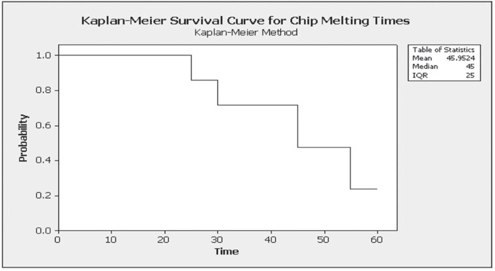
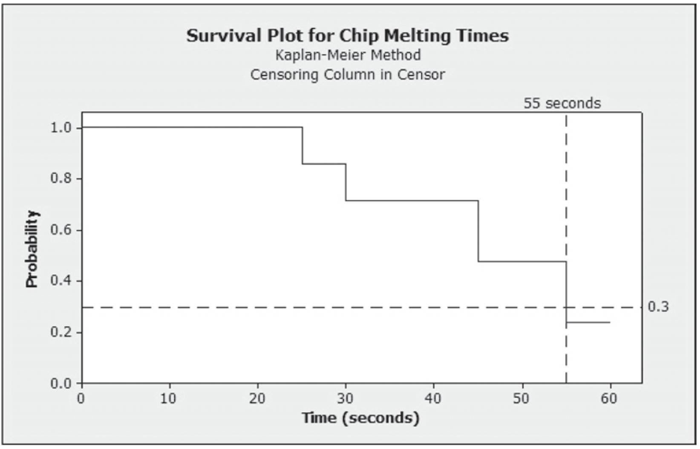
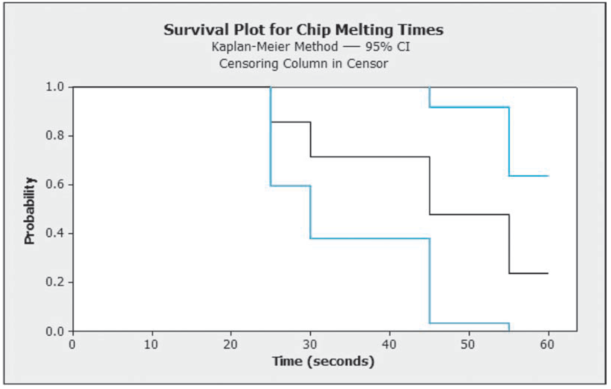
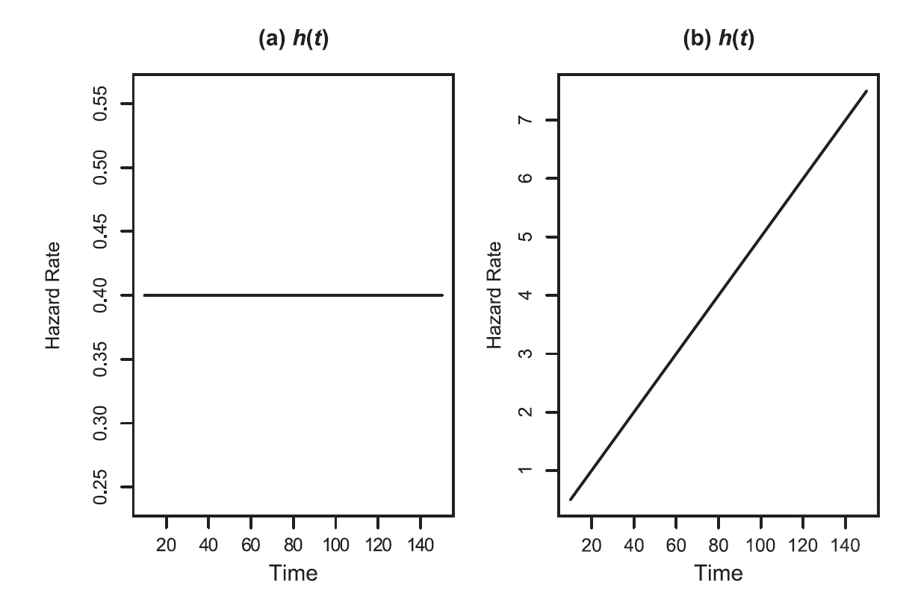
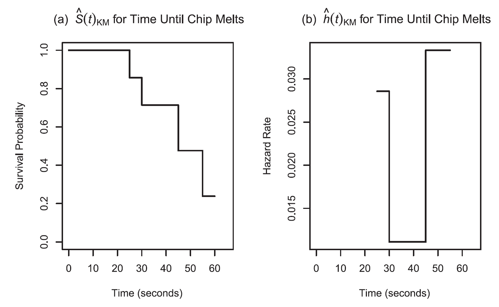
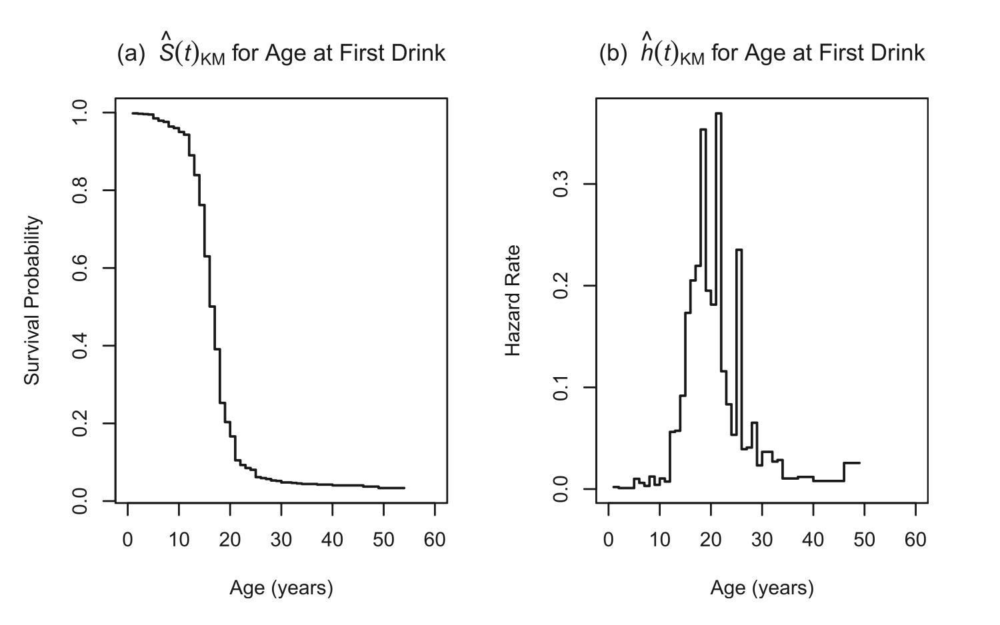
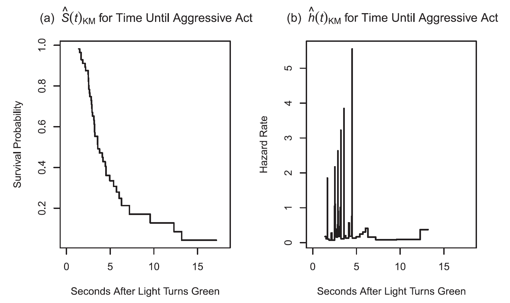
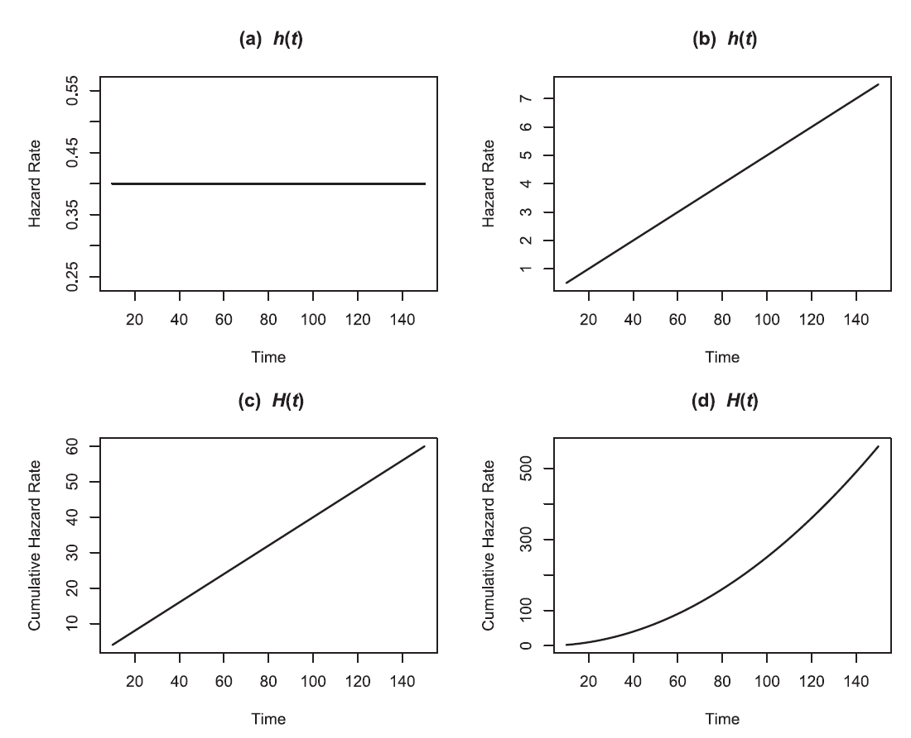
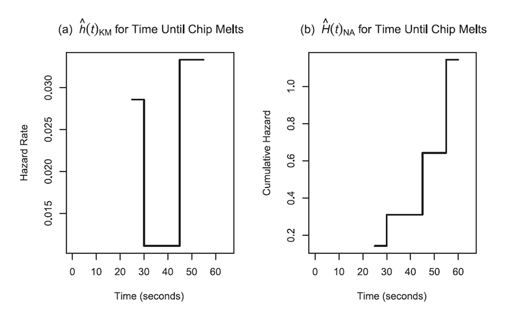
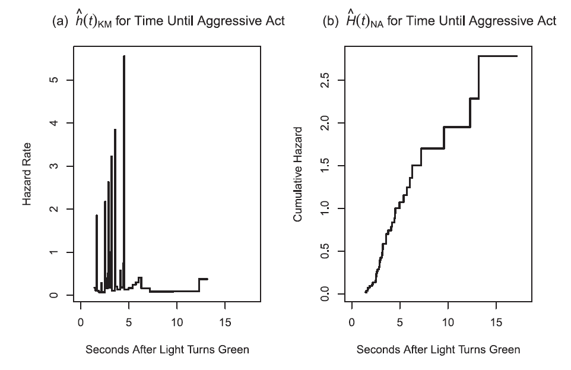

# Survival Analysis: Melting Chocolate Chips

*Far better an approximate answer to the right question, which is often vague, than the exact answer to the wrong question, which can always be made precise.*  
— John Tukey

Survival analysis methods are used to investigate the time until a target event of interest (e.g., death, drug relapse, or college graduation) occurs, and they are used in a variety of disciplines such as medicine, sociology, and education. Although survival analysis techniques do not get the same amount of exposure in the literature as other statistical methods such as regression analysis or analysis of variance, it is important to consider their use whenever the response variable of interest is the *time* until an event occurs.

In this chapter, you will have the opportunity to perform a simple experiment to investigate the time required for different types of chocolate chips to melt. A set of activities related to this experiment will introduce you to a variety of methods for exploring the times until a target event occurs, also referred to as survival or time-to-event data. Upon completion of the activities, you should be able to do the following:

* Recognize special characteristics of survival data  
* Summarize survival data and estimate survival probabilities using the Kaplan–Meier estimator  
* Compute descriptive statistics, including the mean and percentiles, for a sample of event times  
* Construct confidence intervals for survival probabilities  
* Compare survival experiences for different groups of subjects  
* Investigate periods of time when subjects are at low and high risk of experiencing an event of interest  

The extended activities and research project provide opportunities to evaluate research articles discussing applications of survival analysis, hazard functions, and various types of incomplete data.  

## **Investigation: How Long Does It Take for Chocolate Chips to Melt?**

If you enjoy eating chocolate chips, then you can probably appreciate their sweet flavor and smooth texture
as they melt in your mouth. Chocolatiers and food scientists are well aware that the material composition
of chocolate affects the flavor, texture, and duration of the melting process, thereby resulting in a “good” or
“bad” tasting experience. These individuals continually strive to improve the manufacturing process, as well
as the properties of chocolate. By developing heat-resistant varieties that can withstand higher temperatures,
they work to increase the time before the chocolate melts.2 For food scientists and chocolate confectioners,
melting chocolate can be serious business.

The purpose of the following investigation is to explore the time required for chocolate chips to melt. To
perform the study, we will conduct an experiment that requires students to place a chip in their mouth and
wait for it to melt. The experiment will be somewhat restrictive because the time allowed to run the study
will be limited. Suppose we allow only 60 seconds for the study. It is possible that not all the chocolate chips
will melt. For those chips that have not melted by the time 60 seconds has elapsed, we will have only partial
information on melting times, and we will indicate that these times are incomplete. As we’ll see, incomplete
times can create difficulties when we are trying to compute simple quantities like the average melting time or
trying to estimate the proportion of chips that take longer than a particular time to melt.

To obtain a larger set of chip melting times that you can use for the activities and extended activities
in this chapter, your class might participate in the following experiment to collect chocolate chip melting
times. In addition, you will then be able to examine differences in the melting times by the type of chocolate
chip (white or milk chocolate). In this experiment, you will place a chocolate chip in your mouth, hold it
between your tongue and the roof of your mouth, and record the time required for it to completely dissolve
(i.e., melt), without actually biting into the chip. Although this activity may appear rather trivial, it is meant
to serve as a simple, yet illustrative, approach to generating real time-to-event data and exploring methods
used to investigate survival data. Our hope is that when we examine additional examples of real survival data
later in the chapter, you will be able to relate the features of those examples back to the features of the chip
melting time data.

With the melting times for different types of chips and the methods you will learn in this chapter, you will be able to do the following:

* Estimate the proportion of chips that remain unmelted beyond a specific point in time  
* Estimate the average time it takes for white or milk chocolate chips to melt  
* Determine if the type of chip is related to the chip melting experience. For example, do milk and white chocolate chips melt at the same rates over time?  
* For those chocolate chips that have not melted by a particular time, determine at what rate they are melting in the next “instant” of time

\large  
\textbf{NOTE:}  
For this activity, you will need a time-keeping device that every student can clearly see, a bag of white chocolate chips, and a bag of milk chocolate chips.  
\normalsize

## Activity: Melting Chocolate Chips {-}

1. Perform the chocolate chip melting activity outlined below. Be sure to record chip color, melting time, and whether the chip completely melted by 60 seconds. Combine all class data into one data file for future analysis purposes, and name this file `MeltingChips`.  
   a. Devise a system for randomly assigning each student to have a white or milk chocolate chip (this can be done by flipping a coin, for example).  
   b. When the instructor gives approval, place the white or milk chocolate chip in your mouth and record the time until it completely melts. Note that the group should come to a reasonable consensus on a clear definition of “completely melts” prior to the activity to ensure consistency in the recorded times.  
   c. Create a data set in the following manner: Treat the study as if it could be done only for a specified period of time (you may need to experiment, but 60 seconds has worked well). If the actual time required for the chip to melt is less than 60 seconds, then the actual time will be complete and you submit (chip type, actual time, 1). If the chip has not melted by 60 seconds, then you regard the observation as incomplete and submit (chip type, 60, 0). Observations of any chips that are swallowed prior to 60 seconds should be regarded as incomplete as well, and you submit (chip type, actual swallowed time, 0).

\large  
\textbf{NOTE:}  
If your class does not perform the chip melting activity, then you can use the data set MeltingChipsJS
supplied by the authors to complete the activities and extended activities. Be certain to verify which
data set (MeltingChips or MeltingChipsJS) your instructor would like you to use in the following
activities.^[This data file contains the results of the chip melting activity administered by the second author of this textbook to his
introductory survival analysis course. The maximum time allowed was 75 seconds]
\normalsize

## **Overview of Survival Analysis Studies and Data**

The collection of lengths of times required for the chips to melt is an example of **survival data**, also called **time-to-event data** or **failure-time data**. Survival data are the times until individuals experience an event of interest. The specific event of interest can be, for example, death, graduation, or test completion, while the individual experiencing the event may be living, such as a person or an animal, or inanimate, such as a light bulb, computer, or chocolate chip.

**Survival analysis** is a field of statistics covering methods and techniques for examining and investigating survival data, and it is used in diverse fields including medicine, education, and psychology. In studies that use survival analysis techniques, the response variable of interest, denoted $T$, is the time until the event of interest occurs, also called the **failure time**, **survival time**, or **time-to-event random variable**. For example, the time taken for a chocolate chip to melt is a time-to-event random variable, and the recorded melting times are the observed values of $T$. In the material that follows, we will discuss many ways to summarize and describe the observed values of $T$ that you might get from an experiment or study. Additional examples of survival time random variables (with their related fields in parentheses) that will be discussed include:

* Time until drivers blocked by traffic honk their horn (sociology or psychology)  
* Time until students graduate from college (education)  
* Age at which first alcoholic drink is taken (public health)  
* Time until former inmates are rearrested (criminology)

When a study involves measuring the time until a target event occurs and when it possesses a clearly
defined **beginning of time** as well as a **meaningful scale** for measuring time, then it is appropriate to use
survival analysis methods and techniques. The beginning of time is a point at which no individual under study
has yet to experience the event (e.g., the date on which a student enrolls in a post-secondary institution when
the investigation concerns the time until college graduation), while a meaningful scale might be seconds,
minutes, days, weeks, and so on

\large  
\textbf{NOTE:}  
Time-to-event data are fundamentally different from time series data. **Time series data** are measurements on the same observational units collected at different time points. For example, time series data may be the number of chips that melt at 40 seconds, 50 seconds, and so on. Time-to-event data are time durations until the observational unit experiences the target event.  
\normalsize

\large  
\textbf{\textcolor{red}{Key Concept:}} 
\textcolor{red}{The response variable in a survival analysis study is the time until the event of interest occurs. Survival analysis methods are appropriate for data from experiments or studies that possess a well-defined event of interest, a clearly defined beginning of time, and a meaningful scale for measuring time.}
\normalsize

## Incomplete Event Times: Censoring {-}

One feature common to many survival data sets that needs to be appropriately addressed is that some event times are **incomplete**; i.e., we have only partial information about the time until the event of interest occurs. We’ll refer to event times that are known exactly as **complete**. There are several reasons why observations may be incomplete, but in this chapter we will focus on a mechanism called **right censoring**, which occurs when observation begins at a defined starting time and ends before the outcome of interest is observed. The chocolate chip data could have right-censored observations if a chip did not melt in the allotted time or if a student accidentally swallowed a chip. For example, a chip that did not melt by 60 seconds would have a right-censored (incomplete) time of 60 seconds. Other types of incomplete data will be discussed in the extended activities.

In written reports and journals, it is common to display a right-censored event time with a + placed to the right of the observed time. For example, a recorded melting time of 60+ seconds would indicate that the chip was observed for 60 seconds, but did not (completely) melt. Another way to record an event time is to assign a pair of numbers consisting of an observed value for the survival time variable, $T$, and a value for a censoring status variable, $C$. The censoring variable might, for example, take the value of 0 if the event of interest was not observed and the value of 1 if it was (this 0–1 coding choice is arbitrary, although common). Although more formal, this method of recording survival data is particularly relevant when the times need to be entered into data files. This coding scheme was adopted for the in-class chip melting activity performed earlier.

Incomplete observations can introduce systematic error, also called **bias**, into the estimated quantities (like the mean or median) if not handled appropriately—for example, if right-censored observations are treated as complete or are removed from the study. Descriptive statistics of survival time, such as the mean, may be grossly underestimated if right censoring is present but ignored. Survival analysis methods and techniques to accommodate data with incomplete observations have been developed, and some of these will be covered in the sections that follow.

\large  
\textbf{NOTE:}  
Be sure to read the description of any file containing survival data so that you know which value of the censoring variable corresponds to a right-censored time and which value corresponds to a complete time.  
\normalsize

## Activity: Melting Chocolate Chips {-}
2. For the chip melting study, describe the event of interest, the time-to-event random variable $T$, the beginning of time, and the scale for measuring time.  
3. Examine your class data. How many of your melting times are complete? How many are censored?

\large  
\textbf{\textcolor{red}{Key Concept:}}  
\color{red}
Survival data may contain right-censored observations; that is, an individual may not experience the event by the end of the study, or the individual may drop out of the study before the event time is observed. An event time that is right censored can be displayed with a + to the right of the recorded time or represented by using a pair of values that include the observed recorded time and a value to indicate that the time is censored.  
\color{black}
\normalsize

## **The Survival Function**

Now that we have discussed particular features of time-to-event data and looked at some notation and terminology, we turn to methods for examining and summarizing survival data. The primary function used to characterize the values of a time-to-event random variable $T$ is the survival function $S(t)$, given by

\begin{align}
S(t) &= P(T > t)
\notag
\end{align}

$S(t)$ provides the probability that a randomly selected individual in the population will survive (not experience the event of interest) beyond time $t$. Another interpretation of $S(t)$ is that it provides the proportion of subjects in a population who have yet to experience the event of interest by time $t$.

In the context of the chocolate chip melting times, the survival function $S(t) = P(T > t)$ provides the probability that a randomly selected chip in the population of all chips will take longer than the specified time $t$ to melt. So, for example, $S(45) = P(T > 45)$ gives the probability that a randomly selected chip will take longer than 45 seconds to melt. Equivalently, $S(45)$ provides the proportion of chips in the population that have not melted after 45 seconds.

At the beginning of time, no one has experienced the event, so the proportion of subjects in the population who have yet to experience the target event is 100% and $S(0) = 1$. Then as time progresses, individuals will experience the event (e.g., chocolate chips will melt, college students will graduate, former inmates will be arrested again), so the survival function will decline toward its lower bound of 0 (although it may not actually reach this value).

\large  
\textbf{\textcolor{red}{Key Concept:}}  
\color{red}
The survival function provides the probability that an individual will survive beyond a given time $t$—that is, the probability that an individual does not experience the event of interest until after time $t$. _Important:_ $S(t)$ does not indicate the probability that an individual experiences the event at time $t$.  
\color{black}
\normalsize

## The Empirical Survival Function {-}

To determine the exact proportion of chips that take longer than $t$ seconds to melt, we would need to know the melting times of the entire population of chips or know the exact probability distribution for $T$. In practice, we hardly ever know the exact probability distribution for $T$. In the real world, we will collect (or be given) a sample of survival times, and we will need to find an estimator for $S(t)$.

\large  
\textbf{NOTE:}  
This is very similar to what was done in your first statistics course. An exact value, such as the population mean $\mu$, is estimated using a function of sample data, $\bar x$.  
\normalsize

To illustrate the calculation of various quantities in the following sections, we will use a small sample
of melting times (in seconds) of milk chocolate chips for 7 students, where the maximum time allowed for
the experiment was 60 seconds. These times are displayed in Table 9.1. Statistical software will be used
for the in-class chip melting activity data, as well as the additional data sets described in the extended
activities.

\begin{table}[!h]
\centering
\caption{(\#tab:tab9.1)Table 9.1 Hypothetical chocolate chip melting times for a sample of 7 students.}
\centering
\begin{tabular}[t]{llcccccc}
\toprule
  &  &  &  &  &  &  & \\
\midrule
Student & 1 & 2 & 3 & 4 & 5 & 6 & 7\\
Time & 35 & 30 & 60 & 45 & 25 & 55 & 30\\
\bottomrule
\end{tabular}
\end{table}

To estimate the proportion of chocolate chips that have not melted after 45 seconds, $\hat S(45)$, we simply
calculate the sample proportion:

\begin{align}
\hat S(45) &= \frac{\text{number of chips that have not melted after 45 seconds}}{\text{total number of chips in the sample}} \notag \\
&= \frac{2}{7} \notag
\end{align}

When all observations are complete, we can generalize this calculation to any time $t$ using an estimator of $S(t)$ called the empirical survival function, denoted by $\hat S(t)_{E}$ and given by

\begin{align}
\hat S(t)_{E}
&= \frac{\text{number of individuals yet to experience the event at time }t}{\text{total number of individuals in the study}} \notag \\
&= \frac{\text{number of event times greater than }t}{\text{total number of individuals in the study}}
\tag{9.1}
\end{align}

When all observations are complete, the empirical survival function works well. However, this estimator may not be as precise when the data contain censored (i.e., incomplete) observations.

Now suppose that some of the milk chocolate chip melting times displayed in Table 9.1 are incomplete. Let’s assume that students 1 and 7 withdrew from the study (they accidentally swallowed the chips before they melted), while student 3 had not experienced a melted chip by the end of the experiment. Then students 1, 3, and 7 have censored times, and the melting times can be displayed as shown in Table 9.2, where the + denotes right-censored observations.

\begin{table}[!h]
\centering
\caption{(\#tab:tab9.2)Table 9.2 Hypothetical chocolate chip melting times for a sample of 7 students, with incomplete times for students 1, 3, and 7.}
\centering
\begin{tabular}[t]{llcccccc}
\toprule
  &  &  &  &  &  &  & \\
\midrule
Student & 1 & 2 & 3 & 4 & 5 & 6 & 7\\
Time & 35+ & 30 & 60+ & 45 & 25 & 55 & 30+\\
\bottomrule
\end{tabular}
\end{table}

## Activity: Empirical Survival Function {-}

4. Use Equation (9.1) and the 7 milk chocolate melting times in Table 9.1 to compute $\hat S(25)_{E}$, $\hat S(30)_{E}$, $\hat S(40)_{E}$, and $\hat S(60)_{E}$.  
5. With the melting times provided in Table 9.2, use the following two approaches to calculate the estimated probability that it takes more than 45 seconds for a chocolate chip to melt, based on the empirical survival function $\hat S(45)_{E}$:  
   a. Treat all the censored times as complete (actual observed) times, and use Equation (9.1) to calculate $\hat S(45)_{E}$.  
   b. Eliminate all censored observations, and then use Equation (9.1) and the remaining complete observations to calculate $\hat S(45)_{E}$.  

Note the different answers obtained in Parts (a) and (b) of Question 5. By treating the censored times as complete times, we assume that the event times are shorter than they actually are, thereby underestimating the true probability of survival (not melting). By disregarding the censored times, we lose information about melting times from the sample (consider the extreme case where all melting times are 60+). Treating the censored observations as complete or ignoring them will _bias_ any estimates based on the remaining complete times.

## The Kaplan–Meier Estimator {-}

When a data set contains incomplete observations, the best estimator of the survival function is the **Kaplan–Meier estimator**, $\hat S(t)_{\text{KM}}$. While this estimator is typically calculated with statistical software, this section will describe the logic behind how the Kaplan–Meier estimator is put together.

The first step in creating the Kaplan-Meier estimator is to establish a series of time intervals. Order the
complete event times from smallest to largest and label the smallest complete time as $t_1$, the second smallest
as $t_2$, and so on. We will denote the number of distinct *complete* event times by m, where m is less than or
equal to n, the total number of *observed* event times (complete and incomplete).

The complete times, $t_1$ through $t_m$, are used to define intervals beginning at one complete event time and
ending just prior to the next complete event time, with some minor modifications for the first and last intervals
as outlined below:

* By convention, the 0th interval begins at time $t_0 = 0$ and ends just prior to the time when the first event occurs, time $t_1$. This interval is given by $[0,\,t_1)$.
* The next interval begins with the complete time $t_i$ and ends just prior to the next complete event time $t_{i+1}$. Time intervals of the form $[t_i,\,t_{i+1})$ are created for $i = 1,2,\dots,m-1$.
* If the largest observed event time is censored, then this time is denoted by $t_m$ and the interval extends to $t_m$ and is open on the right; i.e., the interval is given by $[t_m,\,t_n)$. If the largest observed event time is complete, then the last interval is technically not an interval and just consists of a single point; that is, the interval is given by $[t_m,\,t_m]$.

## Activity: Time Intervals for the Chip Melting Times {-}

6. Consider the chocolate chip melting time data in Table 9.2. What is $m$? List $t_1$ through $t_m$ for the chip melting times.  
7. The first two intervals for the chocolate chip melting times are $[0,25)$ and $[25,30)$. Write out the remaining intervals. Notice that any incomplete times, such as 30+ and 35+, are ignored in creating intervals.  
8. Determine $d_i$, the number of melted chips in each interval, and $n_i$, the number of chips at risk of melting in each interval (all chips with complete or censored times that have not yet occurred), for $i = 0,1,2,3,4$.

\begin{table}[!h]
\centering
\caption{(\#tab:tab9.3)Table 9.3 Counts and estimated probabilities of melting for melting times.}
\centering
\begin{tabular}[t]{rlcc>{\centering\arraybackslash}p{2.5cm}ccc}
\toprule
Interval i & Time Interval & Number at Risk $(n_i)$ & Number Censored & Number of Events that Occured $(d_i)$ & $\hat{p}_i$ & $1 - \hat{p}_i$ & $\hat{S}(t)_{KM}$\\
\midrule
0 & {}[0,25) & 7 & 0 & 0 & 0/7 & 1 & 1\\
1 & {}[25,30) & 7 & 0 & 1 & 1/7 & 6/7 & 6/7\\
2 & {}[30,45) & 6 & 2 & 1 & 1/6 & 5/6 & 5/7\\
3 & {}[45,55) &  &  &  &  &  & \\
4 & {}[55,60) &  &  &  &  &  & \\
\bottomrule
\end{tabular}
\end{table}

Table 9.3 displays some of the quantities required to compute the Kaplan–Meier estimates. After the time intervals, the number of events of interest ($d_i$) and the number at risk ($n_i$) have been calculated, three more calculations are still needed for each interval: $\hat p_i$, $1 - \hat p_i$, and $\hat S(t_i)_{\text{KM}}$.

After the time intervals have been appropriately defined, we estimate $\hat p_i$, the conditional probability of experiencing the event in the $i$th time interval, given that the event has not occurred by the start of the interval. That is, we compute

\begin{align}
\hat p_i &= \frac{d_i}{n_i}
\notag
\end{align}

where $d_i$ is the number of subjects who experienced the target event in interval $i$ and $n_i$ is the total number of subjects (with complete and censored times) who are eligible (at risk) to experience the target event at the *beginning* of the $i$th time interval.

Now if $\hat p_i$ is the probability of an individual experiencing the event in the $i$th time interval, given that the
individual has not experienced the event in the previous time intervals, then $1 - \hat p_i$
i is the probability of *not* experiencing the event (i.e., *surviving*) through the ith time interval, given that the individual has not experienced the event prior to the $i$th time interval.

For example, the estimate of the conditional probability that a chip will *not* melt between the 25th second
and the 30th second, given that it has remained unmelted through the 25th second, is given by

\begin{align}
1 - \hat p_1 &= 1 - \frac{d_1}{n_1} \notag \\
&= 1 - \frac{1}{7} \notag \\
&= \frac{6}{7} \notag
\end{align}

That is, $6/7$, or about 86%, of the chips that have not melted just prior to the 25th second will remain unmelted (survive) between the 25th and the 30th second.

## Activity: Estimated Conditional Melting Probabilities {-}

Use the chocolate chip data in Table 9.2 to answer the following questions:

9. What is the value of $\hat p_1$? Interpret this value.  
10. $\hat p_1$ is the estimate of the conditional probability that a chip will melt between the 25th second and the 30th second, given that it has remained unmelted through the 25th second. Show that about 14% of the chips that have not melted just prior to the 25th second will melt between the 25th and the 30th second.  
11. Calculate the remaining estimated conditional probabilities $\hat p_3$ and $\hat p_4$. Place these values in the appropriate cells in Table 9.3 and interpret the values.  
12. Calculate the remaining estimated conditional probabilities $1 - \hat p_3$ and $1 - \hat p_4$. Place these values in the appropriate cells in Table 9.3 and interpret the values.

The final step in constructing the Kaplan–Meier estimated survival probabilities is to multiply together each conditional probability of surviving through the $i$th time interval to get the *unconditional* probability of surviving through the $i$th time interval.

For example, the Kaplan–Meier estimate of the probability that a chip will remain unmelted through the 25th second is given by

\begin{align}
\hat S(25)_{\mathrm{KM}} = (1 - \hat p_0)\,(1 - \hat p_1) &= (1)\,\bigl(1 - d_1/n_1\bigr) \notag \\
&= 1 - \tfrac{1}{7} \notag \\ 
&= \tfrac{6}{7} \notag
\end{align}

Therefore, 6/7, or about 86%, of the chips remain unmelted (survive) beyond the 25th second.

\large  
\textbf{\textcolor{red}{Key Concept:}}  
\color{red}
The Kaplan–Meier estimator provides the proportions of subjects in the sample that survive beyond a given time. To compute the Kaplan–Meier estimator for a data set with $n$ individuals, define the following quantities:  
  $m$: the number of distinct uncensored event times, where $m \le n$. By distinct we mean that two or more identical times contribute only once to determine $m$.  
  $t_1, t_2, \dots, t_m$: the ordered complete times (i.e., those times when the event of interest actually occurred), ordered from smallest to largest. By convention, $t_0 = 0$.  
  $n_i$: the number at risk of experiencing the event at time $t_i$ (i.e., just prior to the start of the time interval $[t_i,\,t_{i+1})$), for $i = 0,1,\dots,m-1$.  
  $d_i$: the number experiencing the event at time $t_i$ (i.e., in time interval $[t_i,\,t_{i+1})$), for $i = 0,1,\dots,m-1$.  
  
Then the Kaplan–Meier estimator of the survival function is given by

\begin{align}
\hat S(t)_{\mathrm{KM}} &= \prod_{t_i \le t} \bigl(1 - d_i/n_i\bigr)
\tag{9.2}
\end{align}

where $\prod$ is the symbol for taking the products of terms $(1 - d_i/n_i)$ for all $i$ such that the complete event times $t_1,\dots,t_m$ are less than or equal to the time of interest $t$. Also, $\hat S(t)_{\mathrm{KM}} = 1$ for all times $t < t_1$.
\color{black}
\normalsize

\large  
\textbf{MATHEMATICAL NOTE}  
The Kaplan–Meier estimator is derived using the multiplication rule from introductory probability. Let $A_i$ be defined as any event occurring after interval $i$. Then, for example,
\begin{align}
\hat S(25)_{\mathrm{KM}} &= (1 - \hat p_1)\,(1 - \hat p_0) \\
&= P(A_1 \mid A_0)\,P(A_0)
\end{align}
and
\begin{align}
\hat S(30)_{\mathrm{KM}} &= (1 - \hat p_2)\,(1 - \hat p_1)\,(1 - \hat p_0) \\
&= P(A_2 \mid A_1)\,P(A_1 \mid A_0)\,P(A_0)
\end{align}
\normalsize

## Activity: Kaplan–Meier Estimates {-}
Refer to the entries in Table 9.3 to answer the following questions.  
13. Use the remaining chocolate chip melting times to complete Table 9.3.  
14. What is the estimate for $S(45)$ in Table 9.3? That is, what proportion of chips in the sample has not melted after 45 seconds?  
15. Use the entries in Table 9.3 to estimate the proportion of chips that have melted by 35 seconds.  
16. Use the entries in Table 9.3 to estimate the proportion of chips that have not melted after 50 seconds.  
17. Assume that no censoring is present in the melting times (see the entries in Table 9.1). Estimate $S(25)$, $S(30)$, $S(45)$, and $S(55)$ using both the empirical survival function and the Kaplan–Meier estimator, and compare your answers. What do your answers suggest about the Kaplan–Meier estimator when no censoring is present?

## Graphing the Kaplan–Meier Curve {-}

Once the survival probabilities have been estimated, a graph of the Kaplan–Meier curve can be constructed to display the relationship between time and the estimated probability of surviving. The Kaplan–Meier curve is an approximation to the true survival curve, which is a graphical representation of $S(t)$. The values of $\hat S(t)_{\mathrm{KM}}$ are plotted against the complete event times $t_1, t_2, \dots, t_m$. Figure 9.1 shows the Kaplan–Meier curve for the chocolate chip melting times displayed in Table 9.2.

Notice that the value of $\hat S(30)_{\mathrm{KM}}$ remains the same across each time interval. From Table 9.3, we see that, for example, $\hat S(30)_{\mathrm{KM}} = 5/7$; i.e., the proportion of chips in the sample that have not melted after 30 seconds is 5/7, or 71%. This value remains constant for time $t$ in the interval $[30,45)$. From Figure 9.1 we can observe that the Kaplan–Meier curve is a decreasing series of steps, with drops occurring at each complete event time $t_i$. This type of plot is called a *step function* because it looks like a series of steps. The height of each step corresponds to the value of $\hat S(t_i)_{\mathrm{KM}}$ for $t$ inside $[t_i,\,t_{i+1})$, where $i = 0,\dots,m-1$ (with the convention that $t_0 = 0$).

We can see that the estimated probability that a randomly selected chip remains unmelted decreases as time increases or, stated another way, the proportion of unmelted chips decreases over time. Another feature of Figure 9.1 is that the proportion of chips that remain unmelted after 60 seconds is nonzero, so the last step of the Kaplan–Meier curve extends to the right up to 60 seconds.

You’ll notice a box to the right of the graph, labeled “Table of Statistics,” that contains the mean and
median survival times for the sample, as well as the interquartile range (IQR). We’ll discuss these descriptive
statistics in Section 9.4.

(\#fig:fig9.1)Kaplan-Meier estimated proportions (estimated survival probabilities) of chocolate chips.

## Activity: Kaplan–Meier Curves {-}
>18. Compare the values of $\hat S(t)_{\mathrm{KM}}$ in Table 9.3 to those in Figure 9.1. How would the Kaplan–Meier curve in Figure 9.1 change if the largest observed melting time were not censored?  
>19. Use the technology instructions provided on the CD to construct the Kaplan–Meier curve for the white and the milk chocolate chips from the chocolate chip melting activity. Compare these two curves. Do the melting proportions for the different types of chips appear similar over time? We’ll discuss formal methods for comparing survival curves for the populations of white and milk chocolate chips in Section 9.6.

## Additional Chip Melting Experiences {-}

In the class data, you observed two possible chip melting *experiences* over time, corresponding to the milk and white chocolate chips. Figure 9.2 presents four additional Kaplan–Meier curves corresponding to different chip melting experiences.

The Kaplan–Meier curve corresponding to the first scenario, displayed in Part (a), reveals that no chips melt until after the 49th second. Then for any time, say $t$, between the 49th and the 87th second, the estimated proportion of chocolate chips that remain unmelted decreases somewhat slowly, indicating a possible resistance by the chocolate chips to melt. For the period of time between the 87th and the 96th second, the estimated proportion of chips that remain unmelted decreases rapidly, suggesting that the chocolate chips are very susceptible to melting. For any time beyond the 96th second, the estimated proportion of chips that remain unmelted remains constant at about 20%. This means that there are some chips that have not melted by the end of the observation period (i.e., their melting times are censored); however, note that 20% does not necessarily refer to the proportion of chips with censored melting times.

The Kaplan–Meier curve corresponding to the second melting scenario, displayed in Part (b), shows that chips begin completely melting after 30 seconds, and the proportion of chips that remain unmelted beyond any time between 30 and 65 seconds decreases rapidly, indicating a period of time when the chips are melting quite quickly. The estimated probability that a chip remains unmelted beyond the 65th second is 0, since all chips have melted by this point.

Part (c) displays the Kaplan–Meier curve for the third melting scenario, and we can observe that the chips do not begin completely melting until after 35 seconds. Then during the next 5 seconds, the estimated proportion of chips that remain unmelted declines rapidly (approximately 50% of the chips melt between the 35th and the 40th second). Then for an extended period of time between the 40th and the 85th second, the melting stabilizes, so the proportions of chips that survive are identical. Then melting resumes for the next 15 seconds. For any time beyond the 100th second, it is estimated that about 9% of the chips have not melted.

(\#fig:fig9.2)Kaplan-Meier survival curves for different chip melting experiences.

## Activity: Chip Melting Experiences {-}
>20. Discuss the fourth chip melting scenario, illustrated by the Kaplan–Meier curve in Part (d) of Figure 9.2.

## **Descriptive Statistics for Survival Data**

So far we have focused on using the Kaplan–Meier curve to estimate the proportion of chips that remain unmelted after 25 seconds, after 30 seconds, and so on. While the survival function is useful, we may also be interested in finding an estimate for the *mean* and *median* time-to-event for a population of individuals. For example, what is the typical time required for a chocolate chip to melt? Or how long does it take for half of the chips to melt?

It may seem odd that we have spent a great deal of time discussing survival probabilities and their estimates *before* discussing descriptive statistics. The primary reason for this ordering of topics in survival analysis is that descriptive measures of survival data require the Kaplan–Meier estimated survival probabilities.

It may be tempting to use the same calculations for means and medians that you learned in your previous statistics course. However, consider the mean time until a chocolate chip melts. If we use the sample mean $\bar x$ to estimate this quantity, then once again we run into the same problem as when we estimated chip melting rates—how are censored observations to be treated? For example, if censored observations are treated as complete, then the resulting estimate of the mean melting time will *underestimate* the true average melting time. We will need to incorporate the Kaplan–Meier estimated survival probabilities to deal with censored observations.

## Estimating the Mean Survival Time {-}

The estimated mean survival time is the total area under the Kaplan–Meier curve. This can be found by adding up the areas of the bars formed by the height of the curve between two adjacent complete survival times, with a slight adjustment if the largest observed event time is censored. Consider the rectangular bars displayed in Figure 9.3. The area of each bar is found by taking the width of each interval $t_{i+1} - t_i$ (the duration of each time period) and multiplying by the estimated probability of surviving through the interval $\hat S(t_i)_{\mathrm{KM}}$ (the height of the bar). If the largest observed event time is censored (i.e., $t_n > t_m$), then the last interval extends from $t_m$ to $t_n$. Hence, we have the following expressions for computing the estimated mean survival time:

If the largest observed event time is complete (i.e., $t_n = t_m$), then the estimator of the mean survival time, denoted by $\hat \mu$, is given by

\begin{align}
\hat \mu 
&= \sum_{i=0}^{m-1} \hat S(t_i)_{\mathrm{KM}} \,\bigl(t_{i+1} - t_i\bigr) \notag \\
&= \hat S(t_0)_{\mathrm{KM}}(t_1 - t_0) + \hat S(t_1)_{\mathrm{KM}}(t_2 - t_1) + \dots + \hat S(t_{m-1})_{\mathrm{KM}}(t_m - t_{m-1})
\tag{9.3}
\end{align}

If the largest event time $t_n$ is censored (i.e., $t_n > t_m$), then the estimator of the mean survival time is given by

\begin{align}
\hat \mu 
&= \sum_{i=0}^{m-1} \hat S(t_i)_{\mathrm{KM}} \,(t_{i+1} - t_i) + \hat S(t_m)_{\mathrm{KM}}(t_n - t_m)
\tag{9.4}
\end{align}

Equations (9.3) and (9.4) can be thought of as a weighted average of the time-to-event data, where the Kaplan–Meier curve $\hat S(t_i)_{\mathrm{KM}}$ acts as weights (probabilities) for the time-to-event intervals. Each term in the summation of Equations (9.3) and (9.4) represents the area of a rectangle formed by the width of the $i$th time interval $t_{i+1} - t_i$ and the height of the Kaplan–Meier curve $\hat S(t_i)_{\mathrm{KM}}$. For example, the width of the left-most rectangle in Figure 9.3 outlined by the vertical dotted line is 25 seconds, and the height of the rectangle is 1. So the first term in the sum of Equation (9.3) is $\hat S(t_0)_{\mathrm{KM}}(25 - 0) = (1)(25) = 25$.

(\#fig:fig9.3)Kaplan-Meier estimated proportions. Vertical lines appear at the complete melting times, and grid marks are overlaid on the graph. The dimension of each square in the grid is 5 seconds (width) by 0.1 (height).

\large  
\textbf{\textcolor{red}{Key Concept:}}  
\color{red}
The mean survival time is estimated using the time intervals and the Kaplan–Meier estimated probabilities.  
\color{black}
\normalsize

## Activity: Estimated Mean Chip Melting Time {-}
>21. Examine Figure 9.3. Visually estimate the mean survival time (i.e., the estimated average time taken for the chocolate chips in the sample to melt) by computing a rough approximation to the area under the Kaplan–Meier curve.  
>22. For the sample of chocolate chip melting times in Table 9.2, which equation, (9.3) or (9.4), is appropriate for estimating the mean survival time of the chips? Based on your answer, calculate the estimated mean using the quantities in Table 9.3.

## Estimating Percentiles of the Survival Time Distribution {-}

Suppose we want the time at which 50% of the chocolate chips have melted. This quantity is called the median survival time (or, more precisely, the *estimated median survival time*, since we are working with a sample of survival times). Other times at which a certain percentage of subjects have experienced the event of interest are known as *percentiles of the survival time distribution*.

The $p$th percentile of the distribution for the survival time random variable $T$ is defined to be the time by which $p\%$ of the subjects in the population have experienced the target event. The estimate of the $p$th percentile, denoted by $\hat t_{(p)}$, is defined to be the smallest *complete* event time in the sample such that at least $p\%$ of the subjects in the sample have experienced the event of interest before $\hat t_{(p)}$, and no more than $(100 - p)\%$ of the subjects in the sample experience the event after $\hat t_{(p)}$. Depending on the number of distinct complete event times, the value of $\hat t_{(p)}$ can be found either by inspecting the Kaplan–Meier curve or by finding the solution to the following equation:

\begin{align}
\hat t_{(p)} &= \text{smallest complete event time }t_i\text{ in the sample such that } \hat S(t_i)_{\mathrm{KM}} \le 1 - \frac{p}{100}
\tag{9.5}
\end{align}

For example, to find the estimate for the 70th percentile of the chocolate chip melting times in Figure 9.1, we find the smallest complete event time $t_i$ such that at least 70% of the chips have melted: Since $\hat S(t_i)_{\mathrm{KM}} \le 1 - 0.7 = 0.3$, we draw a horizontal line at $\hat S(t) = 0.3$, and eventually we reach the vertical step that occurs at $t_4 = 55$. Since $t_4 = 55$ is the smallest complete event time that satisfies $\hat S(t_i)_{\mathrm{KM}} \le 0.3$, $\hat t_{(70)} = 55$. See Figure 9.4.

\large  
\textbf{\textcolor{red}{Key Concept:}}  
\color{red}
Percentile estimates of the survival time distribution are found using the Kaplan–Meier estimated probabilities.  
\color{black}
\normalsize

## Activity: Estimated Median Chip Melting Time {-}
>23. For the chocolate chip melting time data in Table 9.2, calculate the estimated median survival time $\hat t_{(50)}$. Since right-censored data are typically right skewed, the median survival time is usually preferred to the mean.  
>24. Refer back to the Kaplan–Meier curve displayed in Figure 9.1. The mean and median survival times for the sample of chip melting times are provided in the “Table of Statistics” box on the graph. The interquartile range (IQR) is also provided. Recall that the IQR is the third quartile (75th percentile) minus the first quartile (25th percentile). Verify by hand that the IQR for the sample of times is 25 seconds.  
>25. Use the technology instructions provided on the CD to determine the estimated mean and median survival times separately for the milk and white chocolate chip melting time data from your class activity. Discuss the differences you observe between the two descriptive measures and between the two types of chips.

(\#fig:fig9.4)Kaplan-Meier estimated proportions. The horizontal dotted line represents $\hat S(55)_{\mathrm{KM}} = 0.3$ and the vertical dotted line represents $\hat t_{(70)} = t_4 = 55$.

\large  
\textbf{MATHEMATICAL NOTE}  
Based on the definition of the estimated percentile in Equation (9.5), it is possible that particular estimated percentiles do not exist. The $p$th percentile will not exist (and your software may return NA) if there does not exist a complete time $t_p$ such that $\hat S(t_p)_{\mathrm{KM}} \le 1 - \tfrac{p}{100}$. For example, in the MeltingChipsJS data set, more than 25% of the milk chocolate chips had not melted by the end of the study (75 seconds). Thus, there is no estimate of the 75th percentile and the IQR cannot be calculated.
\normalsize

## **Confidence Intervals for Survival Probabilities**

Just like any other sample statistic (e.g., the sample mean $\bar x$), the estimates of the survival probabilities are subject to sampling variability. For example, different samples of chocolate chips (and/or students) would likely lead to different melting times, which would lead to different Kaplan–Meier estimates. Although a point estimate, such as $\hat S(25)_{\mathrm{KM}}$, is useful for descriptive purposes, we may also want to construct a range of possible values that the estimated survival probability can take—i.e., a range that we can be reasonably sure contains the true survival probability $S(25)$. In other words, we want to construct a confidence interval for the true survival probability $S(t)$ at time $t = 25$ seconds.

In your first course in statistics, you saw that a confidence interval for a population parameter (e.g., a population mean $\mu$) has the following form:

\begin{align}
\text{point estimate} \;\pm\; \text{critical value}\;\times\;\text{standard error of the estimate}
\tag{9.6}
\end{align}

where the point estimate is a single estimate of the parameter (such as $\bar x$ for $\mu$), the critical value is taken from a reference distribution like the standard normal distribution or the $t$-distribution, and the standard error of the estimate is a measure of the variability in the point estimate. The expression for a confidence interval for $S(t)$ at a fixed time $t$ has a very similar form.

We know that the sampling distribution of $\bar x$ is approximately normal for large sample sizes. A similar result can be stated concerning the sampling distribution of $\hat S(t)_{\mathrm{KM}}$ for fixed $t$. Some advanced theory tells us that, for larger sample sizes, the sampling distribution of $\hat S(t)_{\mathrm{KM}}$ at a fixed time $t$ is approximately normal. This fact allows us to use critical values from the standard normal distribution.

Using the critical value from a standard normal distribution and the standard error of $\hat S(t)_{\mathrm{KM}}$, we can put together the confidence interval for $S(t)$ at a fixed time $t$. The usual procedure is to construct a confidence interval for $S(t)$ at all the complete event times $t_1,\dots,t_m$.

The 100$(1-\alpha)\%$ confidence interval for $S(t)$ at a fixed time $t$ is given by

\begin{align}
\hat S(t)_{\mathrm{KM}} \;\pm\; Z_{\alpha/2}\,\mathrm{se}\bigl(\hat S(t)_{\mathrm{KM}}\bigr)
\tag{9.7}
\end{align}

where $Z_{\alpha/2}$ is the critical value from the standard normal distribution with $\alpha/2$ area under the curve to its right (i.e., corresponding to confidence level $100(1-\alpha)\%$) and $\mathrm{se}\bigl(\hat S(t)_{\mathrm{KM}}\bigr)$ is the standard error of the Kaplan–Meier estimator at time $t$, discussed in the following section.

## The Standard Error of the Kaplan–Meier Estimator {-}

The variability in the values of $\hat S(t)_{\mathrm{KM}}$ at a fixed time $t$ in each interval $[t_{i-1},\,t_i)$ is measured by the estimated **variance of the Kaplan–Meier estimator**, denoted $\widehat{\mathrm{Var}}\bigl(\hat S(t)_{\mathrm{KM}}\bigr)$ and calculated using the expression

\begin{align}
\widehat{\mathrm{Var}}\bigl(\hat S(t)_{\mathrm{KM}}\bigr)
&= \bigl(\hat S(t)_{\mathrm{KM}}\bigr)^2 \;\biggl(\sum_{t_i \le t}\frac{d_i}{n_i(n_i - d_i)}\biggr)
\tag{9.8}
\end{align}

where $d_i$ is the number of subjects who experienced the event of interest in time interval $[t_{i-1},\,t_i)$ and $n_i$ is the number who are at risk at each complete event time $t_i$.$^3$

The **standard error of the Kaplan–Meier estimator** at time $t$, denoted by $\mathrm{se}\bigl(\hat S(t)_{\mathrm{KM}}\bigr)$, is the square root of $\widehat{\mathrm{Var}}\bigl(\hat S(t)_{\mathrm{KM}}\bigr)$:

\begin{align}
\mathrm{se}\bigl(\hat S(t)_{\mathrm{KM}}\bigr)
&= \sqrt{\widehat{\mathrm{Var}}\bigl(\hat S(t)_{\mathrm{KM}}\bigr)}
\tag{9.9}
\end{align}

As we will see, when we construct the confidence intervals for $S(t)$, the estimated variance $\widehat{\mathrm{Var}}\bigl(\hat S(t)_{\mathrm{KM}}\bigr)$ [and standard error $\mathrm{se}\bigl(\hat S(t)_{\mathrm{KM}}\bigr)$] will need to be calculated for each complete event time $t_1,\dots,t_m$; that is, we need to calculate

\begin{align}
\widehat{\mathrm{Var}}\bigl(\hat S(t_1)_{\mathrm{KM}}\bigr),\;\widehat{\mathrm{Var}}\bigl(\hat S(t_2)_{\mathrm{KM}}\bigr),\;\dots,\;\widehat{\mathrm{Var}}\bigl(\hat S(t_m)_{\mathrm{KM}}\bigr).\notag
\end{align}

For example, the Kaplan–Meier estimated survival probability at the complete time $t=25$ for the data in Table 9.2 is $\hat S(25)_{\mathrm{KM}} = 6/7$. Using Equation (9.8) and the quantities in Table 9.3, we find that the variance estimate $\widehat{\mathrm{Var}}\bigl(\hat S(25)_{\mathrm{KM}}\bigr)$ at time $t=25$ is given by

\begin{align}
\widehat{\mathrm{Var}}\bigl(\hat S(25)_{\mathrm{KM}}\bigr)
&= \bigl(\hat S(25)_{\mathrm{KM}}\bigr)^2 \;\biggl(\sum_{t_i \le 25}\frac{d_i}{n_i(n_i - d_i)}\biggr) \\
&= \Bigl(\tfrac{6}{7}\Bigr)^2 \;\biggl(\frac{0}{7(7-0)} + \frac{1}{7(7-1)}\biggr) \\
&= 0.0175 
\notag
\end{align}

Then the standard error of $\hat S(25)_{\mathrm{KM}}$ at time $t=25$ is $\mathrm{se}\bigl(\hat S(25)_{\mathrm{KM}}\bigr) = \sqrt{0.0175} = 0.1323$. 

With the computed standard error, we can use Formula (9.7) to construct a confidence interval for a survival probability. For example, the 95% confidence interval for $S(25)$—the probability that a randomly selected milk chocolate chip takes longer than 25 seconds to melt—is calculated as

\begin{align}
\hat S(25)_{\mathrm{KM}} \;\pm\; Z_{0.025}\,\mathrm{se}\bigl(\hat S(25)_{\mathrm{KM}}\bigr)
\quad=\quad
\frac{6}{7}\;\pm\;1.96\,(0.1323)
\quad=\quad
(0.60,\;1.12).
\notag
\end{align}

Observe that the upper limit for the confidence interval for $S(25)$ exceeds 1. Since the confidence interval given by Formula (9.7) is for a *survival probability*, the interval limits should technically not fall outside the range [0,1]. However, it is possible to obtain a lower limit less than 0 and/or an upper limit greater than 1, especially for smaller sample sizes. This is a drawback of using Formula (9.7) to construct confidence intervals. When confronted with a situation (as is the case here) where the interval limit(s) is (are) outside the range [0,1], it is common practice to truncate the limit(s) at the appropriate minimum value of 0 or maximum value of 1.

The interpretation of confidence interval limits for *survival probabilities* is similar to the standard interpretation of confidence intervals for other parameters of interest (think back to confidence intervals for a population mean or proportion). For the chip melting times provided in Table 9.2, we can state with 95% confidence that the probability that a chocolate chip will take longer than 25 seconds to melt is between 0.60 and 1.00. Or, equivalently, we are 95% confident that the true proportion of chips that have not melted after 25 seconds is between 60% and 100%.

The Kaplan–Meier curve and associated 95% confidence intervals for the chocolate chip melting time data are displayed in Figure 9.5. Observe the times where the upper limit has been constrained to equal 1 and the lower limit has been constrained to equal 0.

(\#fig:fig9.5)Kaplan-Meier curve with 95% confidence intervals. Note that Minitab graphs use the same line type and color for both the Kaplan-Meier curve and the confidence limits; however, the middle line will always be the Kaplan-Meier curve.

\large  
\textbf{NOTE:}  
There are alternative formulas for computing confidence intervals for survival probabilities that constrain the limits to lie between 0 and 1, but we’ll leave it to interested readers to investigate them on their own.  
\normalsize

\large  
\textbf{\textcolor{red}{Key Concept:}}  
\color{red}
Confidence intervals provide a range of values that we can be reasonably sure contain the true survival probabilities.  
\color{black}
\normalsize

## Activity: Standard Errors and Confidence Intervals for Survival Probabilities {-}
>Use the estimated survival probabilities and the entries in Table 9.3 to answer Questions 26 through 28, and use `MeltingChips` or `MeltingChipsJS` to answer Questions 29 through 31.  
26. Provide a brief explanation of why the estimated variance of $\hat S(0)_{\mathrm{KM}}$, and hence the standard error of $\hat S(0)_{\mathrm{KM}}$, is equal to 0.  
27. Find the remaining standard errors of $\hat S(t)_{\mathrm{KM}}$ at times $t = 30$, $t = 45$, and $t = 55$ for the chocolate chip melting time data.  
28. Using your above answers and the appropriate entries in Table 9.3, construct 95% confidence intervals for the survival probabilities $S(t)$ at each of the remaining complete melting times, and interpret their values.  
29. Use software to construct the 95% confidence intervals for the survival probabilities for the milk chocolate chip melting time data from your class activity. Graph the Kaplan–Meier curve and the confidence intervals for $S(t)$.  
30. Based on the width of the confidence intervals (upper limit minus lower limit), how useful do you think these intervals are for providing estimates of the true melting times? How could we improve the usefulness of these intervals? (Hint: Refer back to Equation (9.8). What could you change to make the intervals narrower?)  
31. On the same graph, plot both Kaplan–Meier estimates and 95% confidence intervals for the white and milk chocolate chip melting time data from your class activity. Explain whether or not the two types of chocolate appear to have different survival functions.  

\large  
\textbf{NOTE:}  
The confidence interval for $S(t)$ is valid for a single fixed time at which the inference is to be made. For this reason, confidence intervals are sometimes referred to as *pointwise intervals*. Each interval constructed using Formula (9.7) is relevant only for $t$ within the $i$th interval. Therefore, it is not correct to state that we are 95% confident that the entire true survival curve $S(t)$ falls between the confidence bands in Figure 9.5. If we want a confidence band for an entire survival function $S(t)$ within which we can guarantee with a specified level of confidence that the entire curve falls, alternative confidence bands need to be computed.  
\normalsize

## **Comparing Survival Functions**

In Question 19 you were asked to comment on the differences in melting experiences between white and milk chocolate chips. Now we will look at how to formally compare the survival experiences of two or more groups. This is equivalent to investigating whether survival experience depends on another (categorical) variable of interest. To compare the survival experiences of milk and white chocolate chips, we will ask, “Does melting experience depend on the type of chip?”

To illustrate the comparison techniques, we’ll use a sample of *white* chocolate chip melting times for 9 other students:

\begin{align}
\text{45+ 35 48 64+ 72 42 55+ 43 62}
\notag
\end{align}

First, we visually inspect the Kaplan–Meier curves for both groups. Figure 9.6 shows that the Kaplan–Meier curve for the white chocolate chip melting times tends to be above the milk chocolate chip curve. This means that, over time, the proportion of unmelted white chocolate chips is generally larger than the proportion of unmelted milk chocolate chips; that is, white chocolate chips generally take longer to melt than milk chocolate chips. While Figure 9.6 appears to show a difference in the curves based on our sample data, a formal hypothesis test is needed to determine if the difference in the *sample data* is large enough to conclude that the survival curves for the *populations* of white and milk chocolate chips are different.

(\#fig:fig9.6)Kaplan-Meier curves for the hypothetical melting times of milk and white chocolate chips.

## The Log-Rank Test {-}

The log-rank test is a formal statistical inference procedure used to determine if the population survival curves are significantly different over the range of time $t$—that is, to determine if the survival experiences significantly differ. The null hypothesis is that the survival experiences of both populations are equal—that is, $H_0:\;S_1(t) = S_2(t)$ for all times t during which at least one of the groups has at least one subject at risk of
experiencing the event. The alternative hypothesis is that the survival experiences are not identical for at least one value of $t$ (i.e., $H_a:\;S_1(t)\neq S_2(t)$ for some $t$).

Assuming that we have two independent populations and that the survival experiences for group 1 and group 2 are identical, the log-rank test compares the total number of *observed* events to the total number of *expected* events in group 1. Observed counts that disagree significantly with the expected counts lead to rejection of the null hypothesis that the survival experiences are identical.

Table 9.4 contains the melting data for both the milk and the white chocolate chips. To calculate the log-rank test statistic, define the following terms:

* $m$: the number of distinct ordered complete event times $t_1, t_2, \dots, t_m$ for both groups combined (we will not consider $t_0 = 0$).
* $n_{1i}$: the number of subjects at risk of experiencing the event at time $t_i$ in group 1, for $i = 1,\dots,m$.  
* $n_{2i}$: the number of subjects at risk of experiencing the event at time $t_i$ in group 2.  
* $n_i = n_{1i} + n_{2i}$: the total number of individuals in both groups at risk at time $t_i$.  
* $d_{1i},\,d_{2i},\,d_i$: the observed number of event occurrences at each of the complete event times for group 1, group 2, and the combined groups, respectively.

\begin{table}[!h]
\centering
\caption{(\#tab:tab9.4)Table 9.4 Hypothetical melting times of the milk and white chocolate chips.}
\centering
\begin{tabular}[t]{llcccccccc}
\toprule
  &  &  &  &  &  &  &  &  & \\
\midrule
Group 1 (milk chocolate) & 35+ & 30 & 60+ & 45 & 25 & 55 & 30+ &  & \\
Group 2 (white chocolate) & 45+ & 35 & 48 & 64+ & 72 & 42 & 55+ & 43 & 62\\
\bottomrule
\end{tabular}
\end{table}

The partially completed Table 9.5 contains the appropriate quantities to compute the log-rank test statistic. The total number of complete event times for both types of chips is $m = 10$. All 16 milk and white chocolate chips were at risk of melting prior to the beginning of the first time interval $[25,30]$, so $n_{11} = 7$, $n_{21} = 9$, and $n_1 = 16$. Since 1 milk chocolate chip melted in the first time interval $[25,30]$ and no white chocolate chips melted in that interval, $d_{11} = 1$, $d_{21} = 0$, and $d_1 = 1$.

\begin{table}[!h]
\centering
\caption{(\#tab:tab9.5)Table 9.5 Selected quantities for the combined groups of chocolate chips.}
\centering
\begin{tabular}[t]{rlccccccccc}
\toprule
Interval i & Time Interval & $n_i$ & Number Censored & $d_i$ & $d_{1i}$ & $d_i/n_i$ & $n_{1i}$ & $n_{2i}$ & $E_{1i}$ & $V_{1i}$\\
\midrule
1 & {}[25, 30) & 16 & 0 & 1 & 1 & 1/16 & 7 & 9 & 7/16 & 0.246\\
2 & {}[30, 35) & 15 & 1 & 1 & 1 & 1/15 & 6 & 9 & 6/15 & 0.240\\
3 & {}[35, 42) & 13 & 1 & 1 & 0 & 1/13 & 4 & 9 & 4/13 & 0.213\\
4 & {}[42, 43) & 11 & 0 & 1 & 0 & 1/11 & 3 & 8 & 3/11 & 0.198\\
5 & {}[43, 45) & 10 & 0 & 1 & 0 & 1/10 & 3 & 7 & 3/10 & 0.210\\
\addlinespace
6 & {}[45, 48) & 9 & 1 & 1 & 1 & 1/9 & 3 & 6 & 3/9 & 0.222\\
7 & {}[48, 55) &  &  &  &  &  &  &  &  & \\
8 & {}[55, 62) &  &  &  &  &  &  &  &  & \\
9 & {}[62, 72) &  &  &  &  &  &  &  & 0 & 0\\
10 & {}[72, 72] &  &  &  &  &  &  &  & 0 & 0\\
\bottomrule
\end{tabular}
\end{table}

The expected number of event occurrences in group 1 at time $t_i$, denoted $E_{1i}$, is given by

\begin{align}
E_{1i} &= \frac{n_{1i}\,d_i}{n_i}
\tag{9.10}
\end{align}

The quantity $d_i/n_i$ is the overall proportion of individuals at time $t_i$ who experience the event, and $n_{1i}$ is the
number of individuals in group 1 who are at risk at time $t_i$.

\large  
\textbf{MATHEMATICAL NOTE:}  
Equation (9.10) is based on the assumption that the number of occurrences for group 1 at time $t_i$ follows a hypergeometric distribution.$^6$
\normalsize

Next, we need to compare the observed and expected counts at time $t_i$, which can be done by taking the
difference between the counts and dividing by an appropriate scaling factor. This scaling quantity is the vari-
ance of the number of event occurrences at time ti. Again, based on the assumption that the number of event
occurrences at time $t_i$ for group 1 follows a hypergeometric distribution, the variance for the number of event
occurrences for group 1 at time $t_i$, denoted $V_{1i}$, is given by

\begin{align}
V_{1i} &= \frac{n_{1i}\,n_{2i}\,d_i\,(n_i - d_i)}{n_i^2\,(n_i - 1)}
\notag
\end{align}

## Activity: Calculating the Expected Number and Variance of Melted Chips {-}
Refer to the entries in Table 9.5.  
32. Show that the expected number of melted milk chocolate chips in the first interval is 7/16 = 0.4375.
33. Show that the variance in the first interval is 0.246.

Table 9.5 contains values of $E_{1i}$ and $V_{1i}$ for the first six time intervals for the milk chocolate chip and white chocolate chip melting time data. Remember that we need to compare the total observed and total expected counts over all the complete event times, so we compare $\sum_{i=1}^m d_{1i}$, and the sum of the expected event occurrences, $\sum_{i=1}^m E_{1i}$, over all $m$ complete event times. We put this together to obtain the statistic

\begin{align}
\chi &= \frac{\sum_{i=1}^m d_{1i} - \sum_{i=1}^m E_{1i}}{\sqrt{\sum_{i=1}^m V_{1i}}}
\tag{9.11}
\end{align}

where $\sum_{i=1}^m V_{1i}$ is the variance of the total number of event occurrences over the $m$ complete event times. Basically, Equation (9.11) is nothing more than a $z$-score; i.e., it tells us how many standard deviations the total observed number of event occurrences is above or below its mean.

Although we can use Equation (9.11) to make our decision regarding the null hypothesis of equal survival functions, it is more common to see the square of the statistic in Equation (9.11) reported in statistical software output. The square of the statistic in Equation (9.11), called the log-rank test statistic (for two groups), is given by

\begin{align}
\chi^2 &= \frac{\bigl(\text{total observed events in group 1} - \text{total expected events in group 1}\bigr)^{2}}%
             {\text{variance in the total number of all complete events}} \notag \\
       &= \frac{\left(\sum_{i=1}^m d_{1i} - \sum_{i=1}^m E_{1i}\right)^{2}}{\sum_{i=1}^m V_{1i}}
\tag{9.12}
\end{align}

If the sample size is reasonably large, then under the assumption that the two survival curves are identical, $\chi^2$ approximately follows a chi-square distribution with 1 degree of freedom. If the observed and expected numbers of events are far apart, the test statistic will correspond to a small $p$-value; thus, we will reject $H_0: S_1(t) = S_2(t)$ and conclude that the two population survival functions are different.

\large  
\textbf{MATHEMATICAL NOTE}  
The test statistic $\chi^2$ is said to *asymptotically* follow a chi-square distribution, which means that as the total sample size approaches infinity, the distribution of the statistic will closely follow the chi-square distribution with 1 degree of freedom. Unfortunately, there is no generally accepted rule as to what constitutes a large sample size; however, simulation studies have shown that even for small sample sizes (10 per group), the statistic will be approximately chi-square if the amount of censoring is roughly the same in each group.$^7$
\normalsize

## Activity: Log-Rank Test Statistic {-}

34. Calculate the missing quantities in Table 9.5. Note that $E_{19}$, $E_{1,10}$, $V_{19}$, and $V_{1,10}$ are all equal to 0. This is because all the milk chocolate chips have melted by 62 seconds.  
35. Use Equation (9.12) and the entries in Table 9.5 to verify that the value of the log-rank test statistic is 1.007. Note that your answer may vary slightly because of rounding.

The $p$-value corresponding to the value of $\chi^2$ is 0.316. Hence, we do not have strong enough evidence to conclude that the melting experiences (survival curves) of the populations of white and milk chocolate chips significantly differ. Note that we should be cautious about interpreting the results of this test because the sample size of 16 is fairly small. We should always supplement the results of the test with graphs of the Kaplan–Meier curves.

If the difference between the total observed and expected number of event occurrences is large, then the
test statistic is much greater than 0 and the resulting p-value will be small. Then the null hypothesis will be
rejected

## Activity: Log-Rank Test for Chip Melting Activity {-}

36. Use software to conduct the log-rank test to determine if the melting experiences for the white and milk chocolate chips in your chip melting activity are different. What do you conclude about the survival experiences for the two types of chips?

## The Wilcoxon Test {-}

Another test for comparing survival curves, commonly used in practice and reported in software output, is the **Wilcoxon test**. The Wilcoxon test is similar to the log-rank test in the sense that it also compares the observed and expected number of event occurrences; however, the Wilcoxon test statistic is a slight variant of the log-rank test statistic. It places more weight on differences in the survival curves at earlier times (when the number at risk will be larger), so it can be better at detecting differences in the survival curves at earlier time periods. Note that when survival curves cross, neither test may be able to detect a significant difference in survival experiences. This underscores the importance of graphing the survival curves and describing the survival experiences based on observation.

Although the results of the log-rank and Wilcoxon tests will typically agree, it is possible for the two tests to yield different results. In practice, when the tests yield different results, you should report the results of both tests. When the tests yield similar conclusions, results of either test can be provided.$^8$

The log-rank test and the Wilcoxon test can be implemented with many statistical packages. For the chip melting data in Table 9.4, the results for the tests comparing survival curves are shown in Figure 9.7.

(\#fig:fig9.7)Software output for the log-rank and Wilcoxon tests.

Observe that the results of the two different tests are in agreement. Thus, even though the two curves
based on the sample data look fairly different, we do not have enough evidence to conclude that the popula-
tion survival functions for white and milk chocolate chips are different.

\large  
\textbf{\textcolor{red}{Key Concept:}}  
\color{red}
The log-rank and Wilcoxon tests provide formal inferential methods for comparing the survival experiences of two or more groups.  
\color{black}
\normalsize

\large  
\textbf{NOTE:}  
The log-rank (and Wilcoxon) test can easily be applied to more than two groups. Although the details are not given here, the test statistic follows a chi-square distribution with $k - 1$ degrees of freedom, where $k =$ number of groups.$^9$
\normalsize

## Beyond Different Survival Experiences: Regression Models for Survival Data {-}

The log-rank and Wilcoxon tests are useful procedures for determining whether the survival experiences of two or more independent groups are different. This is basically equivalent to testing whether there is a significant effect of a categorical explanatory variable on survival. However, the tests do not allow us to determine the extent to which the survival experiences differ or, equivalently, to estimate the effects of the categorical explanatory variables on survival. Furthermore, the tests cannot be used to appropriately assess the effects of quantitative variables on survival. Consider the chocolate chip activity, and suppose we had additional information on the age of the chip. Are older chips likely to melt earlier than newer chips? Can we predict how long a chip that is a month old will take to melt? How do we incorporate censored melting times? These are questions that need to be addressed using regression-type models that exploit the relationship between the survival time random variable, $T$, and the explanatory variables of interest.

Regression models for survival data will not be discussed in this chapter; however, we will briefly mention two main approaches: regression models that explicitly model the log of the survival time variable, $T$, as a function of the explanatory variables, sometimes referred to as **parametric regression models** or **accelerated failure time models**, and those that model the hazard function (to be discussed) as a function of the explanatory variables, known in the literature as the **proportional hazards model** or the **Cox regression model**.$^10$

## **What Can We Conclude About Melting Chocolate Chips?**

The goal in the previous sections and activities was to motivate introductory topics in survival analysis by conducting a simple experiment with chocolate chip melting times. As we have seen, the Kaplan–Meier estimator of the survival function forms the basis of several quantities used to summarize and investigate chip melting times, including descriptive measures like the mean and median.

We were also able to compare the melting experiences of white and milk chocolate chips using the log-rank test. Since the chip melting activity was an experimental study (students were randomly assigned to white or milk chocolate chips), if the result of the log-rank test is significant, then we can conclude that the type of chip affects the melting time (i.e., that type of chip causes differences in the melting experiences).

Note that the group sizes (i.e., the numbers of white and milk chocolate chips) could be small (depending on the number of students participating in the activity), and we need to be cautious about interpreting the results of the log-rank test if this is the case.

Although simple in scope, the chip melting time data you collected have the same general features as other survival data that will be introduced in the extended activities and that are of more practical importance and interest to researchers in various fields. Real studies that implement survival analysis methods are common in medicine, health, and the social sciences, and in the remainder of this chapter we will use data from real surveys and studies to see how survival analysis methods can be applied in a variety of disciplines.

## *A Closer Look: Survival Analysis*{-}

The remaining sections and extended activities introduce additional methods for analyzing survival data and
additional types of incomplete data. Although the Kaplan-Meier estimator is useful for examining the propor-
tion of individuals yet to experience the target event at a specific moment in time, it does not assess the risk,
or potential, at that particular moment that an individual who has not previously done so will experience
the target event. Risk can be addressed using the hazard function and the closely related cumulative hazard
function, which will be discussed in the following sections. In the final section of this chapter, we’ll introduce
some other types of incomplete survival data, including left- and interval-censored data and truncated data

## **The Hazard Function**

Recall the chip melting experiment, and suppose that 45 seconds have passed. Among the chips that have not melted (have survived), at what rate will the chips melt (fail) in the next 5 seconds? In the next second? In the next instant of time? Would this rate be the same for chips that have not melted after 60 seconds? These types of questions address when individuals (or chips, in this example) are likely to experience the target event, given that they have not previously experienced the event. To answer such questions, we will need to use another function of survival time called the hazard function, denoted $h(t)$.

In survival analysis, the (conditional) risk of experiencing the target event is associated with the rate at which individuals who have survived up to a particular time will experience failure at that moment. Earlier, when we discussed the construction of the Kaplan–Meier estimator, we introduced the risk set of individuals. The individuals in the risk set have survived (not experienced the event) up through time $t_{i-1}$ and are available to experience the target event in the time interval $[t_{i-1},\,t_i)$ for $i = 2, \dots, m$. So anybody in the risk set at time $t_{i-1}$ runs the risk of experiencing, or has the potential to experience, the target event in the next interval of time.

As the unit of time becomes finer and finer, until we are looking for a rate of failure in the next *instant* of time, we approach a quantity known as the hazard rate or conditional failure rate. The hazard rate at time $t$, also known as the (population) hazard function, denoted $h(t)$, is defined as the *instantaneous* rate of failure at time $t$ for all subjects in the population who have survived until time $t$.

The formal definition of the population hazard function requires the use of calculus. Those of you who have the necessary background and wish to do so may read about $h(t)$ in more detail in the next section. Otherwise, you can skim or skip the next section. At this point it is enough to understand that the hazard function (population or estimated) is used to describe when subjects are likely to experience the event of interest and can help us identify periods of high and low risk of event occurrence.

\large  
\textbf{NOTE:}  
If the notion of an “instantaneous” rate troubles you, imagine the situation when you are driving your car and you glance down at the speedometer to see how fast you are traveling. If the speedometer reads 65 miles per hour at the instant you glance at it, this is the instantaneous rate at which you are traveling in distance per hour.  
\normalsize

### The Population Hazard Function* {-}

To reiterate, the population hazard function, $h(t)$, is the rate at which individuals in the population experience the target event in the next *instant* of time (time $t$), conditional on having survived (not experienced the event) up to time $t$. Although you are probably comfortable with the idea of a small interval of time like one second or even a tenth of a second, it may be a bit harder to imagine an interval of time that lasts an instant. In calculus, an instant of time is regarded as an interval of time whose width approaches (but never reaches) 0. The hazard function, $h(t)$, is defined as

\begin{align}
h(t) &= \lim_{\Delta t \to 0} \frac{P\bigl(t \le T < t + \Delta t \mid T \ge t\bigr)}{\Delta t}
\tag{9.13}
\end{align}

where $\Delta t$ indicates a small change in time $t$.

From this expression, we see that the hazard is the conditional probability of experiencing the event per unit of time $\Delta t$. Note that since $h(t)$ is a rate, it may take on values greater than 1. The only restriction on the hazard function is that $h(t) \ge 0$.

In some situations, a graph of $h(t)$ can be constructed and examined for periods of high and low risk; however, an expression for $h(t)$ requires an assumption about the probability distribution of the time-to-event random variable $T$ (as well as some calculus and knowledge of intermediate concepts in mathematical statistics). In fields such as engineering, a distribution for $T$ may be assumed, where, for example, $T$ might be defined as the time until a computer processing chip fails, and then graphs of $h(t)$ [as well as $S(t)$] can be constructed.

Although we will not provide any computational examples of $h(t)$, we’ll provide two hypothetical hazard curves and describe them in the context of melting chocolate chips.^[Calculus is suggested for this section] Figure 9.8 displays two hazard functions that are used in practice when simplifying assumptions about the data can be made. The hazard function in Part (a) illustrates constant risk, while the hazard function in Part (b) illustrates increasing risk. Part (a) displays a situation or study where the subjects have a constant risk of experiencing the target event. In the context of melting chips, the constant hazard rate of 0.40 (i.e., $h(t)=0.4$) shown in Part (a) would correspond to a period throughout which events (melting chips) occur with equal frequency during any equal period of time. Now examine Part (b). The hazard function is increasing over time; furthermore, the hazard rate is linearly related to time. This implies that the risk of chips melting increases as a function of time, corresponding to a period of time during which the proportion of unmelted chips is decreasing.

(\#fig:fig9.8)Possible forms of the population hazard function.

Equation (9.13) may look something like the formal definition of the derivative of some function (although it probably isn’t clear what that function is). It turns out that $h(t)$ is related to the derivative of a function of the (population) survival function $S(t)$ by the expression

\begin{align}
h(t) &= -\frac{d}{dt}\,\ln\bigl[S(t)\bigr]
\tag{9.14}
\end{align}

That is, the hazard function is equal to the negative of the derivative of the natural logarithm of the survival function. This identity is not very obvious, and we skip the mathematical details here. The important thing to note is that since $S(t)$ is a function based on the distribution of the time-to-event random variable $T$, $h(t)$ is also a function based on the distribution of $T$. Hence, if we know the exact distribution of $T$, we can calculate the hazard function using calculus.

\Large
\textbf{\textcolor{red}{Key Concept:}}
\color{red}
The population hazard function describes how the conditional risk of experiencing the event changes over time for individuals in the population.  
\color{black}
\normalsize

## The Estimated Hazard Function {-}

\large  
\textbf{NOTE:}  
The R statistical package is suggested for calculating and graphing the estimated hazard and estimated cumulative hazard functions discussed in this section and Section 9.9.  
\normalsize

We are not likely to know the true hazard rate at any particular moment in time unless we can make some assumption about the time-to-event variable $T$. Typically we have only observed event times that can be used to estimate the true hazard rates. Whereas the population hazard function, $h(t)$, is the rate at which individuals in the population experience the target event in the next *instant* of time (time $t$), conditional on surviving to time $t$, the estimated hazard function assesses the conditional failure rate during the $i$th interval of time $[t_i,\,t_{i+1})$ for those individuals in the sample who have survived to time $t_i$.

The estimates of hazard are based on quantities used to find the Kaplan–Meier estimated probabilities, so we will first construct time intervals $[t_i,\,t_{i+1})$ for $i = 1,\dots,m-1$ as if we were constructing the Kaplan–Meier estimator, where $t_0 = 0$ and $m$ is the number of complete event times (see Section 9.3 for details).

Recall that the estimated conditional probability of experiencing the target event in the $i$th interval $[t_i,\,t_{i+1})$ is given by

\begin{align}
\hat p_i &= \frac{d_i}{n_i}
\notag
\end{align}

for $i=0,1,\dots,m-1$. Recall that $\hat p_i$ represents the proportion of remaining subjects in the sample at the beginning of the $i$th interval who experience the target event in the time interval $[t_i,\,t_{i+1})$.

If we divide $\hat p_i = d_i/n_i$ by the width of the time interval $t_{i+1}-t_i$, then the resulting quantity

\begin{align}
\frac{\hat p_i}{t_{i+1} - t_i}
\tag{9.15}
\end{align}

yields the *average* conditional probability of event occurrence per unit of time within $[t_i,\,t_{i+1})$. This quantity is the **estimated hazard rate** or **estimated hazard function** for $t_i \le t < t_{i+1}$, denoted by $\hat h(t)_{\mathrm{KM}}$, and measures the estimated conditional probability of experiencing the event *per* unit of time in $[t_i,\,t_{i+1})$. When no interval of time is specified, $\hat h(t)_{\mathrm{KM}}$ will be used to refer to the estimated hazard function for any $t$ within the entire observed range of time.

Table 9.3 contained the observed number of melted chips, number of chips at risk, and so on, for the chip melting times. In Table 9.4, columns containing the width of each interval of time $t_{i+1} - t_i$, and the estimated hazard rate $\hat h(t)_{\mathrm{KM}}$ for each time interval have been appended, and values have been computed for the first three rows. We interpret the estimated hazard rates $\hat h(t)_{\mathrm{KM}} = 0$ for $t_0 \le t < t_1$, $\hat h(t)_{\mathrm{KM}} = 0.0286$ for $t_1 \le t < t_2$, and $\hat h(t)_{\mathrm{KM}} = 0.0111$ for $t_2 \le t < t_3$ in the following manner: Since no chips melt within the time interval $[0,25)$, 0% of the unmelted chips melt per second during that interval. Within the time interval $[25,30)$, we estimate that, of the chips that have not yet melted after 25 seconds, about 2.9% will melt per second. The estimated hazard rate is not defined for the last interval $[55,60)$, since the width of the last interval cannot be determined because 60+ is a censored melting time.

## Extended Activity: Chip Melting Hazard Rates {-}
37. Compute the missing entries in Table 9.6.  
38. Among chips that have not yet melted after 30 seconds, estimate the rate at which the chips will melt in the next 15 seconds.  
39. Excluding the first time interval, during which period (interval) of time are chips at their highest risk of melting? Lowest risk?  
40. Do the values of $\hat h(t)_{\mathrm{KM}}$ suggest that the estimated hazard function is a strictly increasing or strictly decreasing function, or do they suggest that the function can increase and decrease over time?

We can plot the estimated hazard rates versus time to view the estimated **hazard curve** for the sample of survival times. The Kaplan–Meier curve and estimated hazard function for the chocolate chip melting times are shown in Figure 9.9. Note that, because of the small sample size, the plot is extremely rough and the pattern is somewhat erratic. This curve is an approximation to the corresponding true hazard function for the population of all chocolate chip melting times. From Figure 9.9 we observe that the lowest risk of melting occurs between 30 and 45 seconds (among chips that have remain unmelted up through 30 seconds). The highest risk of melting occurs between the 45th and the 55th second. Note that the estimated hazard rate is not defined before the first complete event time and after the last complete time.

(\#fig:fig9.9)Estimated survival probabilities and estimated hazard rates for the chocolate chip data.

## Extended Activity: Estimated Hazard Rates {-}
Examine Figure 9.9, the entries in Table 9.6, and Formula (9.15) to address the following questions:  
  41. In general, can $\hat h(t)_{\mathrm{KM}}$ take on a negative value in any time interval? Briefly explain. What does this suggest about the minimum value of $\hat h(t)_{\mathrm{KM}}$?  
  42. Is there a maximum value that $\hat h(t)_{\mathrm{KM}}$ can take on within a (finite) interval of time? Briefly explain.

Note some additional features of the estimated hazard function:

* The estimated hazard curve extends only to the last complete event time, $t_m$; that is, if the last time interval is of the form $[t_m, t_n)$, where the largest observed event time, $t_n$, is censored, then no hazard rate is defined during that interval. The reason is that the width of this last interval cannot be determined. In this respect the estimated hazard curve is unlike the Kaplan–Meier curve, which would extend to the largest observed event time if it were censored.  
* The estimated hazard curve $\hat h(t)_{\mathrm{KM}}$ will typically have an erratic pattern, especially when the number of event times is large. It can be difficult to provide a general summary of the hazard rate over time.  

## Age at First Alcoholic Drink {-}

When do individuals have their first drink of alcohol? The legal age for consuming alcohol is 21 years, but some individuals claim to have had their first alcoholic drink when they were as young as 1 year old! We can investigate the age at which individuals had their first drink of alcohol using data from the National Comorbidity Survey of 1990–1992. Participants were asked to recall the age at which they had their first drink of alcohol. Those who could recall the age at which they had their first drink had complete event times (i.e., the age at which they had their first drink). Individuals who had not had a drink by the time of the interview had a right-censored event time (their age at the time of the interview). Individuals who could not recall the age at which they had their first drink were not included in the sample.

## Extended Activity: Age at First Alcoholic Drink {-}
Data set: $Firstdrink$  
43. Investigate the time until first drink by creating a Kaplan–Meier curve (with a confidence interval) for the data. What do you observe about the survival probabilities?  
44. Use the software instructions provided to plot the estimated hazard rates for the age at first drink data. We will examine the plot in the following paragraphs. Note that Minitab computes the estimated hazard rates using an expression different from Formula (9.15) (it restricts the rate to fall between 0 and 1), so it is recommended that the R software be used to construct the plot of the estimated hazard function.  

From the Kaplan–Meier curve in Figure 9.10, we can observe that the estimated proportion of individuals who had not taken their first drink decreases rapidly after age 13. What does this mean in terms of the estimated hazard rates? Examine Figure 9.10, which was produced using the R statistical software. Part (a) displays the Kaplan–Meier curve $\hat S(t)_{\mathrm{KM}}$, while Part (b) displays the estimated hazard curve $\hat h(t)_{\mathrm{KM}}$.

Although not practical, we could interpret the estimated hazard rate for each time interval as was done for
the chip melting data. Instead, if possible, we should try to summarize some of the aspects of the estimated
hazard curve in terms of periods of low and/or high risk of event occurrence.

As mentioned earlier, the estimated hazard curve exhibits a rough and erratic pattern. But we can observe
a sharp increase in $\hat h(t)_{\mathrm{KM}}$ from about 13 years to about 18 years. This seems to suggest that individuals who have not yet tried alcohol are at high risk of having their first drink during their adolescent and teenage years,
possibly because of peer pressure from their friends in junior and senior high school. The estimated hazard
curve drops right after age 18, but note the age at which it spikes back up again! For those individuals who
have not yet had alcohol by age 21, the estimated hazard rate suddenly jumps to its highest point, indicating
that drinking is likely to occur among 21-year-olds who have never had alcohol before. After age 22, the
estimated hazard decreases until about 25 years, when there is another sudden increase. The curve generally
decreases after age 26 and levels off at about 34 years of age.

(\#fig:fig9.10)Estimated survival probabilities and estimated hazard rates for the age at first drink data.

\large  
\textbf{\textcolor{red}{Key Concept:}}  
\color{red}
The estimated hazard rate assesses conditional risk at a specific moment in time for individuals in the sample. It is defined as the rate at which individuals in the sample who have not already experienced the target event will do so in the next small interval of time. The estimated hazard function shows how the conditional risk of event occurrence changes over time for a sample of subjects.  
\color{black}
\normalsize

## College Graduation {-}

How long does it take for students to graduate from college? At what time(s) during their college career are they most likely to graduate? Perhaps you have just started college and have a few years to go, or maybe you’re planning to graduate soon. We can investigate the number of years needed to complete the requirements for a bachelor’s degree using data from individuals who participated in the National Educational Longitudinal Survey (NELS) from 1988 to 2002. To illustrate how survival analysis techniques can be used to answer these questions, we will use data on a sample of 1000 participants from the NELS data set who began college prior to the year 2000. Note that this sample includes individuals who began study at any community college or bachelor’s degree–granting postsecondary institution, even though some students who began their postsecondary education at a two-year college may not have been intending to pursue a bachelor’s degree.

The time-to-event random variable is the number of years taken to complete the requirements for a bachelor’s degree. If an individual had obtained a bachelor’s degree by the interview date, then her or his event time is complete. If the student had dropped out or had not graduated by the interview date, then her or his time is right censored.

## Extended Activity: College Graduation {-}
Data set: Graduate  
45. Use the software instructions provided to plot the estimated hazard rates for the college graduation data.  
46. Although the estimated hazard curve may not exhibit a distinguishable pattern, discuss some important features of the curve.  
47. Indicate periods of time during their college career when students are at their lowest and highest risk of graduating college. Does your answer match your common understanding of when students typically graduate from college?

## **The Cumulative Hazard Function**

The coarse nature of the estimated hazard function can make it difficult to describe or summarize how the conditional risk of event occurrence changes over time. An alternative method for assessing and describing how hazard rates change over time is to investigate the accumulation of the hazard rates over time and look for patterns in the **cumulative hazard**. The function that allows us to examine accumulated hazard over time is called the **cumulative hazard function**. By examining the cumulative hazard function, we can detect when the hazard is increasing, decreasing, or remaining relatively constant.

### Motorist Reaction Times {-}

Have you ever been frustrated because you were stuck behind a car that was stopped in front of you for no apparent reason? Did you feel inclined to honk your horn (or make some other gesture)? In a study on aggressive behavior displayed by motorists, Diekmann and his colleagues investigated the time it took for 57 motorists intentionally blocked at a green light by a Volkswagen Jetta to show signs of aggression.^12 Signs of aggression included honking their horn or beaming their headlights at the Jetta. The time-to-event variable is the time (measured in seconds to the nearest hundredth of a second) until the motorist honked (or beamed the headlights) at the Jetta. If the motorist did not honk or flash the headlights by the time the Jetta moved, then the motorist’s event time was right censored.

The Kaplan–Meier survival curve and the estimated hazard function for the motorist reaction time data are displayed in Figure 9.11. The estimated hazard function behaves erratically and displays several spikes, making it very difficult to assess how the hazard rate is changing over time.

(\#fig:fig9.11)Estimated survival probabilities and estimated hazard rates for the time until the motorist displays aggressive behavior.

Similar to the survival function and hazard function, we can define a cumulative hazard function for a population and a sample. We will denote the population cumulative hazard function by $H(t)$, and the estimator of the cumulative hazard function by $\widehat H(t)_{\mathrm{KM}}$. The definition of $H(t)$ is given by

> $H(t)$ = the accumulation of the hazard rate $h(t)$ for time $T$ between 0 and $t$ for subjects in the population

A background in calculus is necessary to fully understand and appreciate the definition of the cumulative hazard function $H(t)$. We present it at the end of this section as a mathematical note. In this section we will look at the reasons for examining the cumulative hazard function, and then in Section 9.8 we will discuss computation of the estimated cumulative hazard function.

An important point to make is that the cumulative hazard function $H(t)$ is neither a probability nor a rate. It is an accumulation of (hazard) rates over time. Since $H(t)$ is cumulative, it never decreases (and rarely remains constant). Furthermore, we can gain a better idea of how hazard changes over time by examining the nature of the change in $H(t)$—that is, whether the rate of change in $H(t)$ is increasing or decreasing.

To better understand what is meant by an increase or decrease in the rate of change in $H(t)$, consider Figure 9.12. The dashed line represents the population cumulative hazard function $H(t)$, and the values of the slopes of the four solid lines represent estimates of the rates of increase in $H(t)$ over the corresponding four time periods. Observe that $H(t)$ increases over the entire range of time, but the rates of increase (the values of the four slopes) vary over the course of time. The slopes of the first three lines are decreasing, implying that the rate of change in $H(t)$ decreases until about time $t = 4$. The slope of the fourth line is greater than the previous slope, indicating that the rate of change _increases_ after time $t = 4$.

(\#fig:fig9.12)Cumulative hazard function displaying various rates of change over time

In general, we can examine how the rate of change in the cumulative hazard function changes over time to understand how the hazard function, $h(t)$, changes over time.

* If the _rate_ of change in $H(t)$ is _increasing_ (over an interval of time), then $h(t)$ is increasing (over the same interval of time).
* If the _rate_ of change in $H(t)$ is _decreasing_, then $h(t)$ is decreasing.  
* If the _rate_ of change in $H(t)$ is _constant_ (and greater than 0), then $h(t)$ is constant (and greater than 0).  
* If the _rate_ of change in $H(t)$ is 0, then $h(t)$ is 0.  

Figure 9.13 presents the hazard functions originally shown in Figure 9.8 and their corresponding cumulative hazard functions. We can see that if the hazard rate is constant over time [Part (a)], then the cumulative hazard function [Part (c)] will increase at a _constant_ rate—that is, there is a perfect positive linear relationship between values of t and values of H(t). If the hazard rate is increasing linearly over time [Part (b)], then the rate of change in H(t) is increasing [Part (d)].

\large  
\textbf{MATHEMATICAL NOTE:}  
Assuming a particular probability distribution for $T$, the mathematical definition of $H(t)$ requires integral calculus and is given by
\begin{align}
H(t) &= \int_{0}^{t} h(x)\,dx
\tag{9.16}
\end{align}
In general, $H(t)$ increases as $t$ increases [$H(t)$ is constant only when $h(t) = 0$]. Also note that $H(t)$ is neither a rate nor a probability (it is an accumulation of rate over time).  
\normalsize

(\#fig:fig9.13)Population hazard functions and their corresponding cumulative hazard functions.

## Estimator of the Cumulative Hazard Function{-}

Since $H(t)$ is an accumulation of the population hazard $h(t)$ between time 0 and time $t$, it makes intuitive sense that an estimator of $H(t)$ should also accumulate (or sum up) the estimated hazard rates computed between time 0 and time $t$. This is the approach we will take.

Once again, we will start with intervals of time defined as if we were computing the Kaplan–Meier estimator. Then, given the estimated hazard rates $\hat h(t)_{\mathrm{KM}}$ for $t_i \le t < t_{i+1}$, we can calculate the total estimated hazard during each time interval $[t_i,\,t_{i+1})$ for $i = 1,\dots,m-1$, given by

\[
\text{Total estimated hazard during }[t_i,\,t_{i+1}) \;=\; \hat h(t)_{\mathrm{KM}} \times (t_{i+1} - t_i)
\]

where $\hat h(t)_{\mathrm{KM}}$ is the estimated hazard rate for $t_i \le t < t_{i+1}$ and $t_{i+1} - t_i$ is the width of the $i$th interval.  Then the Nelson–Aalen estimator of $H(t)$, denoted $\widehat H(t)_{\mathrm{NA}}$, is simply the sum of these total estimated hazard quantities up to a particular time $t$, given by

\begin{align}
\widehat H(t)_{\mathrm{NA}} &= \sum_{t_i \le t} \bigl[\hat h(t)_{\mathrm{KM}}\times (t_{i+1} - t_i)\bigr]
\tag{9.17}
\end{align}

Note the following details about $\widehat H(t)_{\mathrm{NA}}$, depending on whether the last observed event time is censored
or complete:
• If the largest observed event time, denoted $t_n$, is censored, then $\widehat H(t)_{\mathrm{NA}}$ will peak (reach its highest
point) at the last complete event time, $t_m$, and then extend to tn—that is, it will be constant over the
interval [$t_m$, $t_n$) (see Figure 9.14 for example).
• Otherwise, if the last observed event time is complete, then $\widehat H(t)_{\mathrm{NA}}$ will simply reach its highest value
at the complete time, $t_m$.

(\#fig:fig9.14)Estimated hazard function and estimated cumulative hazard function for the chip melting data.

## Extended Activity: Estimated Cumulative Hazard Function {-}

48. Use Equation (9.17) and the quantities in Table 9.6 to compute $\widehat H(t)_{\mathrm{NA}}$ for the chip melting times from Table 9.2 by hand.  

As discussed earlier in connection with the population cumulative hazard function $H(t)$, we can also examine how the rate of change in the estimated cumulative hazard, $\widehat H(t)_{\mathrm{NA}}$, changes over time, to investigate changes in the estimated hazard function over time.

- If the _rate of change_ in $\widehat H(t)_{\mathrm{NA}}$ is _increasing_ (over an interval of time), then $\hat h(t)_{\mathrm{KM}}$ is increasing (over the same interval of time).  
- If the _rate of change_ in $\widehat H(t)_{\mathrm{NA}}$ is _decreasing_, then $\hat h(t)_{\mathrm{KM}}$ is decreasing.  
- If the _rate of change_ in $\widehat H(t)_{\mathrm{NA}}$ is _constant_ (and greater than 0), then $\hat h(t)_{\mathrm{KM}}$ is constant (and greater than 0).  
- If the _rate of change_ in $\widehat H(t)_{\mathrm{NA}}$ is 0, then $\hat h(t)_{\mathrm{KM}}$ is 0.  

Figure 9.14 displays the estimated hazard curve for the chip melting times (shown earlier in Figure 9.9) in Part (a) and the estimated cumulative hazard function in Part (b). Because of the small number of intervals, it is difficult to determine if the rate of change in $\widehat H(t)_{\mathrm{NA}}$ is increasing or decreasing.

Let’s return to the motorist reaction time data. As we’ve already seen, the estimated hazard function dis-
played several spikes, but the overall pattern was difficult to summarize. Figure 9.15 displays the estimated
hazard and cumulative hazard functions.

(\#fig:fig9.15)Estimated hazard function and estimated cumulative hazard function for the aggressive motorist behavior.

We can summarize the rates of increase and decrease in the estimated cumulative hazard function
shown in Part (b) of Figure 9.15 and describe the changes in the estimated hazard function. The rate of
change in the estimated cumulative hazard is slowest between seconds 1.5 and 2.5 and is then followed by
a higher rate of change for the next 2.5 seconds. Between the 5th and the 8th second the rate of change in
the estimated cumulative hazard decreases, and then after the 8th second the rate of change remains fairly
constant. From this general description of H n(t)NA we can summarize the changes in the estimated hazard
rates. Hazard increases between seconds 1.5 and 2.5, but is somewhat low, and then increases substantially
between the 2.5th and the 5th second. We might consider this period of time to be the “boiling point” of
frustration, when motorists who have not done so already are most likely to become impatient and decide
to honk their horn or flash their high beams. Between the 5th and the 8th second, hazard decreases, after
which it levels off.

\Large
\textbf{\textcolor{red}{Key Concept:}}
\color{red}
The cumulative hazard function is a useful graphical display for describing the accumulation of hazard
over time and for showing particular time periods when risk is high.
\color{black}
\normalsize

## Time to Rearrest for Former Inmates {-}

For 36 months, Henning and Frueh followed criminal activities of 194 inmates released from a medium security prison.$^13$ We can use the data from their study to investigate the time until the former inmates were rearrested. If the former inmate had been rearrested for a criminal act before 36 months (after initial prison release) had passed, then that former inmate’s event time is complete. If the former inmate had not been rearrested for a criminal act after 36 months had passed or had completely dropped out of the study, then that former inmate’s event time is right censored. In addition to the time until rearrest, measurements are also available on the following variables:

>*person*: a dichotomous variable identifying former inmates who had a history of person-related crimes—that is, those with one or more convictions for offenses such as aggravated assault or kidnapping  
>*property*: a dichotomous variable indicating whether former inmates had been convicted of a property-related crime  
>*cenage*: the “centered” age of the individual—that is, the difference between the age of the individual on release and the average age of all inmates in the study  

## Extended Activity: Estimated Cumulative Hazard Function {-}

Data set: $Rearrest$
49. Use statistical software to construct the estimated hazard function and the cumulative hazard function for the time to rearrest data.  
50. The estimated hazard function will be difficult to describe, but try to explain how the risk of rearrest changes over time based on the estimated cumulative hazard function. When does the risk of being rearrested appear to be the highest? The lowest?

\large  
\textbf{NOTE:}  
In this chapter, we have focused primarily on estimating the population survival, hazard, and cumulative hazard functions based on a sample of survival times. The models that we have fit to data are sometimes referred to as **nonparametric** since we haven’t assumed anything about the shape of the distribution of the survival time random variable $T$ (e.g., whether $T$ is normally distributed). You may wonder what we can do if the distribution of $T$ is known. A class of models called **parametric models** can sometimes be used to represent the survival function, hazard function, and cumulative hazard function if we know (or have a pretty good idea about) the exact distribution of $T$ (this was mentioned briefly in the discussion of the survival function). With the exception of a few simple graphical examples and brief descriptions, our discussion of parametric models has been very limited, and we have not provided any explicit formulas for $S(t)$, $h(t)$, or $H(t)$.$^{14}$  
\normalsize

## **Additional Types of Incomplete Data**

Throughout our discussions of survival analysis techniques, we’ve assumed that any incomplete data are due to right censoring. In Section 9.2, you learned that right censoring occurs when observation of an individual begins at a defined starting time and ends before the outcome of interest is observed. In this section, we’ll describe two other censoring mechanisms, left censoring and interval censoring, and two selection processes that determine whether individuals will be included in the study, left truncation and right truncation.

## Left Censoring and Interval Censoring {-}

**Left censoring** occurs when the event of interest is known to have occurred before the study began.^[Technically, left censoring can occur after a study has started if the event of interest occurred prior to a particular recorded time. For example, a subject may experience an event of interest during the course of a study (such as contracting a disease) but not know the exact time of the event (knowing only that it occurred prior to testing positive for the disease).] For an individual with a left-censored survival time, we know that the study start time is greater than the time at which the event of interest occurred.

To see the difference between right censoring and left censoring, examine Figure 9.16. Figure 9.16 displays the target event times of four subjects. For now, we’ll assume that time is measured in months. We’ll discuss subjects 1, 3, and 4 first. Subject 1 entered the study at time 2 and experienced the target event at time 8, so subject 1 has a complete target event time of 6 months. Subject 3 entered the study at time 3, but dropped out of the study at time 7. Hence, subject 3 has a right-censored event time of 4 months. This means that subject 3’s event time is _at least_ 4 months. Finally, subject 4 entered the study at time 2 and had not experienced the event by the end of the study at time 9. Subject 4 has a right-censored event time of 7 months.

(\#fig:fig9.16)Observed survival times for four subjects. X indicates the target event occurred at displayed time; O indicates the target event was not observed (event time is censored); < indicates when Subject 2 was first observed in the study.

Subject 2 is rather interesting. Subject 2 experienced the event prior to the beginning of the study but was not observed until time 2. In other words, subject 2’s observed event time is _greater_ than her exact event time. Her event time is left censored.

**Interval censoring** occurs when the event of interest is known to have occurred between two time points, but the precise time is not known.

## Extended Activity: Left Censoring and Interval Censoring {-}

51. **Counting to Ten** A child development researcher is interested in the age at which children first learn to count to 10. A particular child in the study was 2 years old and had already learned to count to 10 when the researcher interviewed her parents; however, the parents couldn’t remember exactly how old she was when she first counted to 10. Briefly explain why this particular child’s event time is left censored.  
52. **Type 2 Diabetes** In a study to determine whether exposure to oral contraceptives increases the risk of developing type 2 diabetes among Latina women with prior gestational diabetes mellitus (GDM), women who had recently given birth and had been previously diagnosed with GDM were screened for type 2 diabetes at intervals ranging from every three months to every year during the period of the study (1987–1994).$^{15}$ Briefly explain why the times to develop type 2 diabetes were interval censored.

\Large
\textbf{\textcolor{red}{Key Concept:}}
\color{red}
Left and interval censoring are two additional mechanisms that lead to incomplete observations. Left censoring occurs when the exact time an event occurred is unknown; it is known only that the event occurred prior to a particular time $t$. Interval censoring occurs when the event time is known only to have occurred between two time points. 
\color{black}
\normalsize

## **Chapter Summary**{-}

The goal of this chapter was to provide an overview of time-to-event data and expose you to some introductory techniques for exploring survival data. A sample of event times can be summarized using the Kaplan–Meier curve, in conjunction with descriptive measures such as the mean and median.

The Kaplan–Meier estimator of the probability of survival beyond time $t$ is given by
\begin{align}
\hat S(t)_{\mathrm{KM}} &= \prod_{t_i \le t} \Bigl(1 - \frac{d_i}{n_i}\Bigr).
\tag{9.2}
\end{align}

Other descriptive statistics can be computed for the observed event times, including the mean survival time and percentiles of survival time.  If the largest complete event time is identical to the largest observed event time, the estimator of the mean survival time is
\begin{align}
\hat \mu &= \sum_{i=0}^{m-1} \hat S(t_i)_{\mathrm{KM}}\,(t_{i+1} - t_i).
\tag{9.3}
\end{align}

If the largest event time is censored, the estimator of the mean survival time is
\begin{align}
\hat \mu &= \sum_{i=0}^{m-1} \hat S(t_i)_{\mathrm{KM}}\,(t_{i+1} - t_i)
+ \hat S(t_m)_{\mathrm{KM}}\,(t_n - t_m).
\tag{9.4}
\end{align}

To estimate the time at which $p\%$ of the subjects had yet to experience the target event, the $p$th percentile of survival time can be calculated as
\begin{align}
\hat t_{(p)} &= \text{smallest complete event time }t_i\text{ such that }
\hat S(t_i)_{\mathrm{KM}} \le 1 - \frac{p}{100}.
\tag{9.5}
\end{align}

To provide a range of possible values for the true survival probabilities, confidence intervals based on the Kaplan–Meier estimates can be constructed for $S(t)$ at fixed points in time.  The $100(1 - \alpha)\%$ confidence interval for the survival probability $S(t)$ at fixed time $t$ is given by
\begin{align}
\hat S(t)_{\mathrm{KM}} \pm Z_{\alpha/2}\,\mathrm{se}\bigl(\hat S(t)_{\mathrm{KM}}\bigr),
\tag{9.7}
\end{align}
where
\begin{align}
\mathrm{se}\bigl(\hat S(t)_{\mathrm{KM}}\bigr)
&= \sqrt{
\bigl(\hat S(t)_{\mathrm{KM}}\bigr)^2 
\sum_{t_i \le t} \frac{d_i}{n_i\,(n_i - d_i)}
}.
\tag{9.9}
\end{align}

The survival experiences of two or more groups of subjects can be compared with the log-rank test or Wilcoxon test.  Given sample event times for two groups, the log-rank test statistic for comparing the survival curves for two independent populations is
\begin{align}
\chi^2 &= \frac{\Bigl(\sum_{i=1}^m d_{1i} - \sum_{i=1}^m E_{1i}\Bigr)^2}
{\sum_{i=1}^m V_{1i}}.
\tag{9.12}
\end{align}

The hazard function assesses the risk that a subject will experience a target event in the next instant given that the subject has not previously experienced the event.  The estimated hazard function, constructed from a sample of event times, is given by
\begin{align}
\hat h(t)_{\mathrm{KM}} &= \frac{\hat p_i}{t_{i+1} - t_i},
\end{align}
where $\hat p_i = d_i / n_i$ is the estimated conditional probability of experiencing the event in the interval $[t_i,\,t_{i+1})$.

One drawback of the estimated hazard function is that it can exhibit a very erratic pattern, which makes summarizing the data more difficult.  An alternative function that can be used to identify periods of constant risk, as well as periods when risk is changing, is the cumulative hazard function, given by
\begin{align}
\widehat H(t)_{\mathrm{NA}}
&= \sum_{t_i \le t}
\bigl[\hat h(t_i)_{\mathrm{KM}}\,(t_{i+1} - t_i)\bigr].
\tag{9.17}
\end{align}

The estimated cumulative hazard function provides the accumulation of estimated hazard up to a particular time $t$.  These formulas assume right censoring only.  If left or interval censoring or left or right truncation are present in your data, alternative methods must be used.

### This part not working. All the text under the heading is not showing up
## **Exercises**{-}
\vspace{-2em}
\noindent\rule{\linewidth}{0.4pt}

\newcounter{excount}
\renewcommand{\theexcount}{E\arabic{excount}}

\begin{list}{\theexcount.}{\usecounter{excount} \setlength{\itemsep}{1.2em}}

  \item \textbf{Journal Articles.}

The \textit{Journal of the American Medical Association} has published quite a few research articles that investigate survival data. The following are some suggested articles that you might examine:
\begin{itemize}
  \item T. G. Liou, F. R. Adler, B. C. Cahill, S. C. FitzSimmons, D. Huang, J. R. Hibbs, and B. C. Marshall, ``Survival Effect of Lung Transplantation Among Patients with Cystic Fibrosis,'' \textit{Journal of the American Medical Association}, 286 (2001): 2683–2689.
  \item K. Shear, E. Frank, P. R. Houck, and C. F. Reynolds III, ``Treatment of Complicated Grief: A Randomized Controlled Trial,'' \textit{Journal of the American Medical Association}, 293 (2005): 2601–2608.
  \item M. S. Sulkowski, R. D. Moore, S. H. Mehta, R. E. Chaisson, and D. L. Thomas, ``Hepatitis C and Progression of HIV Disease,'' \textit{Journal of the American Medical Association}, 288 (2002): 199–206.
\end{itemize}

Select an article that implements survival analysis methods, and answer the following:
  \begin{enumerate}
    \item Provide a brief description of the objective of the survival analysis study.
    \item Describe the time-to-event variable and define the beginning of time. Discuss whether right censoring is present in the data. If any other types of incomplete data were used, briefly explain. (Other types of incomplete data were discussed in Section 9.9.)
    \item Describe any survival analysis techniques used in the paper that were covered in this chapter (e.g., the Kaplan-Meier estimator). Also list the names of other techniques used in the study that were not covered.
    \item Briefly summarize the results and conclusions of the study.
  \end{enumerate}

  \item Six rats were exposed to carcinogens by injecting tumor cells into their feet. The times to develop a tumor of a given size were observed. The investigator decided to terminate the experiment after 30 weeks. Rats A, B, and D developed tumors after 10, 15, and 25 weeks, respectively. Rats C and E had not developed tumors by the end of the study. Rat F died accidentally without any tumors after 19 weeks of observation.
  \begin{enumerate}
    \item Describe the time-to-event random variable.
    \item Which rats had complete event times?
    \item Which rats had censored event times? What type of censoring occurred? Be as specific as possible.
  \end{enumerate}

  \item For the studies described below:
  \begin{itemize}
    \item Describe the event of interest, beginning of time, time metric, and time-to-event random variable.
    \item State which type(s) of censoring (i.e., left, right, or interval) may be present in each study, and briefly explain your answers.
  \end{itemize}
  \begin{enumerate}
    \item Survival/sacrifice experiments are designed to determine whether a suspected agent accelerates the time until tumor onset in experimental animals. For such studies, each animal is assigned to a prespecified dose of a suspected carcinogen and then examined at sacrifice or death for the presence or absence of a tumor. Since a lung tumor is occult (detectable only by microscopic examination or chemical analysis), the time until tumor onset is not directly observable. Instead, we observe only a time of sacrifice or death.
    \item Beadle and colleagues report a study carried out to compare the cosmetic effects of radiotherapy alone versus radiotherapy and chemotherapy on women with early breast cancer.$^{18}$ To compare the two treatment regimens, a retrospective study of 46 radiation only and 48 radiation plus chemotherapy patients was made. After treatment, patients were observed initially every 4–6 months. As their recovery progressed, the interval between visits lengthened. At each visit, the clinician recorded a measure of breast retraction on a 3-point scale (none, moderate, severe). Researchers were particularly interested in moderate or severe breast retraction.
    \item A study was conducted to determine the age at which marijuana was first used among high school boys in California.$^{19}$ Researchers asked 191 high school boys the question ``When did you first use marijuana?'' Possible answers were exact age, ``I never used it,'' and ``I have used it but cannot recall just when the first time was.''
  \end{enumerate}

  \item Immediately after a heart transplant, patients are randomly assigned to two treatment therapies to improve recovery from the transplant, therapy 1 and therapy 2. The patients are then followed for up to 5 years after their surgery. Define the time-to-event random variable $T$ as the time (in months) until recovery after a heart transplant. For each of the following study descriptions that involve $T$, sketch the graph of the survival curve (or curves) with as much detail as necessary. Please note that Parts (a) through (d) are independent of each other.
  \begin{enumerate}
    \item Therapy 1 is not very effective shortly after surgery, but everybody recovers before the study period is over.
    \item Therapy 2 is very effective shortly after surgery, but becomes less effective after 3 years. Not every patient fully recovers by the end of the study period.
    \item Two curves on the same plot: Therapy 1 is consistently more effective than therapy 2 over time.
    \item Two curves on the same plot: Therapy 1 is more effective than therapy 2 for the first $2\frac{1}{2}$ years, and then therapy 2 is more effective than therapy 1 for the remaining duration of the study.
  \end{enumerate}

  \item The times in minutes required for students at a West Coast university to get ready in the morning are\\
  \hspace*{1em} $60 \quad 12 \quad 35 \quad 30+ \quad 5 \quad 20$\\
  where the $+$ denotes a right-censored time for a student who reported that he took at least 30 minutes.
  \begin{enumerate}
    \item Construct the Kaplan-Meier estimator for $S(t)$ using the observed times to get ready. Sketch a graph of the curve.
    \item Using your answer to Part (a), estimate the proportion of university students who take longer than 30 minutes to get ready.
    \item Estimate the mean time to get ready in the morning using an appropriate expression.
  \end{enumerate}

  \item The Kaplan-Meier curve in Figure 9.17 displays hypothetical estimated survival probabilities of death due to brain cancer, where time (from diagnosis) until death is measured in months.
  \begin{enumerate}
    \item Is the largest event time censored or complete? How do you know?
    \item Use the curve to estimate the mean time until death due to brain cancer.
  \end{enumerate}

(\#fig:fig9.17)Kaplan-Meier curve for survival times after brain cancer diagnosis.

  \item Acute myelogenous leukemia (AML) is a cancer that starts inside bone marrow (the soft tissue inside bones that helps form blood cells). The cancer grows from cells that would normally turn into white blood cells. A clinical trial to evaluate the efficacy of maintenance chemotherapy for AML was conducted at Stanford University. After reaching a status of remission through treatment by chemotherapy, the patients who entered the study were randomly assigned to two groups; the first group received maintenance chemotherapy, and the second group did not. The objective of the study was to investigate whether maintenance chemotherapy prolonged time until relapse (measured in weeks from the time of randomization to the two groups). Table 9.7 contains quantities related to the construction of the Kaplan-Meier estimates for survival probabilities of patients with AML who received maintenance chemotherapy.
  \begin{enumerate}
    \item Fill in the remaining quantities in Table 9.7.
    \item Examine the table. How many patients in the study who received maintenance chemotherapy had censored event times?
    \item Estimate the probability that a randomly selected patient who received maintenance chemotherapy remains in remission (does not relapse) for more than 40 weeks.
\begin{table}[!h]
\centering
\caption{(\#tab:tab9.7)Table 9.7 Quantities associated with patients with AML who received maintenance chemotherapy.}
\centering
\begin{tabular}[t]{rlcccccc}
\toprule
i & Interval & $t_i$ & $n_i$ & $d_i$ & $n_i - d_i$ & $\hat{p}_i$ & $\hat{S}(t)_{KM}$\\
\midrule
0 & {}[0, 9) & 0 & 11 & 0 &  &  & \\
1 & {}[9, 13) & 9 & 11 & 1 &  &  & \\
2 & {}[13, 18) & 13 & 10 & 1 &  &  & \\
3 & {}[18, 23) & 18 & 8 & 1 &  &  & \\
4 & {}[23, 31) & 23 & 7 & 1 &  &  & \\
\addlinespace
5 & {}[31, 34) & 31 & 5 & 1 &  &  & \\
6 & {}[34, 48) & 34 & 4 & 1 &  &  & \\
7 & {}[48, 161) & 48 & 2 & 1 &  &  & \\
\bottomrule
\end{tabular}
\end{table}
    \item Calculate the estimated mean time until relapse for those patients receiving maintenance chemotherapy. (Be sure to include the time metric in your answer.)
    \item Compute and interpret the estimated hazard rate $\hat{h}(t)$ for the time interval $13 \leq t < 18$.
    \item Figure 9.18 displays the Kaplan-Meier curves for the maintained and nonmaintained groups. Does it appear that maintenance chemotherapy has an effect on time until AML relapse? Briefly explain.
  \end{enumerate}

  \item Using the information in Table 9.7, answer the following:
  \begin{enumerate}
    \item Compute the standard error for the estimate of the probability that a patient receiving maintenance chemotherapy will relapse after 15 weeks.
    \item Compute and interpret a 95\% confidence interval [based on Equation (9.8)] for the probability that a patient receiving maintenance chemotherapy will relapse after 15 weeks. Note that the critical value is 1.96.
    \item Suppose a doctor claims that fewer than 50\% of patients receiving maintenance chemotherapy will relapse after 15 weeks. Based on your answer to Part (b), how would you respond to this claim?
  \end{enumerate}

(\#fig:fig9.18)Kaplan-Meier curves for AML relapse times for patients who did and did not receive maintenance chemotherapy.

  \item Sketch hazard functions that would correspond to the following time-to-event random variables. (You may want to do a little background research.)
  \begin{enumerate}
    \item Lifetime of an individual measured from birth (don’t assume anything about the health or demographics of this person)
    \item Time until death after surgery to remove a cancerous tumor\\
    Be sure to label the time axis, and mark time points appropriately. Briefly explain your reasons for any changes in the shape of the hazard function over time.
  \end{enumerate}

  \item The graphs displayed in Figure 9.19 are population cumulative hazard functions for three distributions of the time-to-event random variable $T$. For each one, sketch a possible corresponding hazard function $h(t)$. Be sure to label the same time points on your sketches as are provided on the graphs of $H(t)$.

(\#fig:fig9.19)Population cumulative hazard functions for three distributions of $T$

  \item \textbf{Male Fruit Fly Longevity}\\
  Data set: \texttt{Fruitfly}

One misconception that some students initially have about survival analysis methods is that they can be applied only to survival data that contain some censored observations. While survival analysis methods are appropriate for incomplete data, they are also perfectly acceptable for noncensored survival data. Earlier we noted that the empirical survival function and Kaplan-Meier estimator are identical when there are no censored event times.

The data set \texttt{Fruitfly}, introduced by Partridge and Farquhar and further analyzed by Hanley and Hanley and Shapiro,$^{20}$ was originally analyzed for the purpose of investigating the relationship between increased sexual activity of male fruitflies and longevity of life (in days) using regression and analysis of covariance techniques. However, survival analysis methods can also be used to study the life durations of male and female fruit flies. Brief descriptions of the variables are provided below:
\begin{itemize}
  \item Partners: number of companions (0, 1, or 8)
  \item Type: type of companion (0 = newly pregnant female, 1 = virgin female, 9 = not applicable (when Partners = 0))
  \item Longevity: lifespan, in days (This is the time-to-event variable.)
  \item Thorax: length of thorax in mm
  \item Sleep: percentage of each day spent sleeping
  \item Censor: censoring status (Note that this variable takes only value 1, since the data are all complete. A censoring status variable is necessary for software implementation.)
\end{itemize}
  \begin{enumerate}
    \item Construct the Kaplan-Meier curve with a confidence interval for the \texttt{Fruitfly} data and describe the survival pattern for the fruitflies over time. Use \texttt{Longevity} as the time-to-event variable.
    \item Construct the Kaplan-Meier curves for the lifetimes of the fruitflies by number of partners, using \texttt{Partners} as the grouping variable. Briefly comment on the observed relationship between survival and number of female partners.
    \item Perform the log-rank and Wilcoxon tests. Report the test statistics and $p$-values for both tests. State the conclusions for both tests. If the tests yield different conclusions, briefly explain why.
  \end{enumerate}

  \item \textbf{Veterans Administration (VA) Lung Cancer Study}\\
  Data set: \texttt{Veteran}

The U.S. Veterans Administration lung cancer trial studied 137 males with advanced inoperable lung cancer. The subjects were randomly assigned to either a standard chemotherapy treatment or a test chemotherapy treatment. Several additional variables were also measured on the subjects. The data in the file \texttt{Veteran} have been investigated in Kalbfleisch and Prentice.$^{21}$ A brief description of the variables is provided below:
\begin{itemize}
  \item trt: 1 = standard chemotherapy, 2 = test chemotherapy
  \item celltype: 1 = squamous, 2 = smallcell, 3 = adeno, 4 = large
  \item time: survival time in days
  \item status: censoring status (1 = complete, 0 = censored)
  \item karno: Karnofsky performance scale index score (100 = good) (This score is used to quantify cancer patients’ functional impairment. The Karnofsky performance score is measured on a 0–100 scale in increments of 10, with 0 indicating that the subject is dead and 100 indicating that the subject shows no signs of the disease.)
  \item diagtime: months from diagnosis to randomization
  \item age: in years
  \item prior: prior therapy (0 = no, 1 = yes)
\end{itemize}
  \begin{enumerate}
    \item Create a graph with both Kaplan-Meier curves to compare the survival time (use the variable \texttt{time}) for subjects with the standard and the test chemotherapy treatment. What do you observe about the survival probabilities for the two groups of subjects?
    \item Conduct the log-rank test and the Wilcoxon test to compare the survival curves of both treatment groups. Interpret the results.
    \item It may be beneficial to incorporate health as a variable in the analysis. Patients with low Karnofsky scores are less healthy than patients with high Karnofsky scores. Create four groups with the \texttt{Veteran} data: \texttt{trt = 1} and Karnofsky score low, \texttt{trt = 1} and Karnofsky score high, \texttt{trt = 2} and Karnofsky score low, and \texttt{trt = 2} and Karnofsky score high. Recall that it is often best to keep sample sizes as equivalent as possible when you determine what is a low or high Karnofsky score. Create a Kaplan-Meier curve for each of the four groups. Conduct the log-rank test and the Wilcoxon test to compare the survival curves of the four groups. (While we have only discussed using these tests to compare two groups, they can easily be extended to more than two groups.) Did incorporating health into your analysis impact your conclusions?
  \end{enumerate}

  \item \textbf{Motorist Reaction Times Revisited}\\
  Data set: \texttt{Hornhonk}

Consider the motorist reaction time data introduced in Section 9.8.
  \begin{enumerate}
    \item Construct the Kaplan-Meier curve with a confidence interval for the \texttt{Hornhonk} data and describe the survival pattern over time.
    \item Estimate the mean and median time until the motorist honked. At what time would you estimate that at least 40\% of motorists will honk?
  \end{enumerate}

  \item \textbf{College Graduation Revisited}\\
  Data set: \texttt{Graduate}

Consider the college graduation data introduced in Section 9.7.
  \begin{enumerate}
    \item Create a plot and compare the survival experiences to investigate whether there are differences in the time required to obtain a bachelor’s degree by gender. What do you observe about the survival probabilities of the genders?
    \item Conduct the log-rank test and the Wilcoxon test to compare the survival curves of the two genders. Interpret the results.
    \item (R software is suggested for this problem.) Plot and examine the estimator of the cumulative hazard function. Discuss the changes in the rate of change of $\widehat{H}(t)_{\mathrm{NA}}$ as each of the following time periods passes, and discuss corresponding changes in the hazard rate of graduation as college students move from one time interval to another.
      \begin{itemize}
        \item 0–3.75 years
        \item 3.75–4.75 years
        \item $>$4.75 years
      \end{itemize}
  \end{enumerate}

  \item \textbf{Time to Rearrest Revisited}\\
  Data set: \texttt{Rearrest}

Consider the time to rearrest data introduced in Section 9.8.
  \begin{enumerate}
    \item Create a Kaplan-Meier curve with a confidence interval for the time until rearrest variable. Describe any patterns you see.
    \item Estimate the time at which half the released inmates have been rearrested.
    \item Do people with property crimes, person crimes, or both have a longer time before rearrest? You will need to create a new variable to answer this question. Use the new variable to create Kaplan-Meier curves as well as conduct the log-rank test and the Wilcoxon test. Interpret the results.
    \item (R software is suggested for this problem.) Plot the estimated hazard function (Kaplan-Meier type) for all the time-to-event data. (Include this graph in your assignment. You can copy and paste R graphs into Word documents.) What do you observe? (Don’t worry about providing an interpretation. Just give your overall impression of the curve.)
    \item (R software is suggested for this problem.) Plot and examine the Nelson-Aalen estimator of the cumulative hazard function. (Include this graph in your assignment.) Discuss the changes in the rate of change of $\widehat{H}(t)$ as each of the following time periods passes:
      \begin{itemize}
        \item 0–3.5
        \item 0–3.5 months
        \item 3.5–8 months
        \item 8–11 months
        \item 11–20 months
        \item $>$20 months
      \end{itemize}
    \item[] Also discuss corresponding changes in the estimated hazard as former inmates move from one time interval to another.
  \end{enumerate}

\end{list}

### This part not working. All the text under the heading is not showing up
## **Endnotes**{-}

\begin{enumerate}

\item “The Future of Data Analysis,” \textit{Annals of Mathematical Studies}, 33.1 (1962): 13.
\item See T. A. Stortz and A. G. Marangoni, “Heat Resistant Chocolate,” \textit{Trends in Food Science and Technology}, 2011.
\item $\widehat{\text{Var}}(\widehat{S}(t)_{KM})$ is commonly referred to as \textit{Greenwood’s formula}. See M. Greenwood, “The Natural Duration of Cancer,” \textit{Reports on Public Health and Medical Subjects}, 33 (1926): 1–26.
\item For alternative confidence interval expressions with limits inside [0, 1], see D. W. Hosmer, S. Lemeshow, and S. May, \textit{Applied Survival Analysis: Regression Modeling of Time to Event Data}, 2nd ed. (New York: Wiley, 2008).
\item For details on confidence bands for $S(t)$, see J. P. Klein and M. L. Moeschberger, \textit{Survival Analysis: Techniques for Censored and Truncated Data}, 2nd ed. (New York: Springer, 2003).
\item Interested readers are referred to textbooks that discuss \textit{contingency table} analysis—for example, W.J. Conover, \textit{Practical Nonparametric Statistics}, 3rd ed. (New York: Wiley, 1999).
\item For details, see R. Latta, “A Monte Carlo Study of Some Two-Sample Rank Tests with Censored Data,” \textit{Journal of the American Statistical Association}, 76 (1981): 713–719.
\item If you are interested in the mathematical details of the log-rank test, Wilcoxon test, and additional tests to compare survival experiences, see J. P. Klein and M. L. Moeschberger, \textit{Survival Analysis: Techniques for Censored and Truncated Data}, 2nd ed. (New York: Springer, 2003).
\item For details on the log-rank and Wilcoxon tests for more than two groups, see, for example, D. W. Hosmer, S. Lemeshow, and S. May, \textit{Applied Survival Analysis: Regression Modeling of Time to Event Data}, 2nd ed. (New York: J. Wiley, 2008).
\item Students currently interested in reading more about regression models for survival data can consult D. W. Hosmer, S. Lemeshow, and S. May, \textit{Applied Survival Analysis: Regression Modeling of Time to Event Data}, 2nd ed. (New York: Wiley, 2008).
\item Readers interested in the calculation and derivation of $h(t)$ for various distributions of $T$ can consult a more mathematically oriented survival analysis textbook, such as J. P. Klein and M. L. Moeschberger, \textit{Survival Analysis: Techniques for Censored and Truncated Data}, 2nd ed. (New York: Springer, 2003).
\item See A. Diekmann, M. Jungbauer-Gans, H. Krassnig, and S. Lorenz, “Social Status and Aggression: A Field Study Analyzed by Survival Analysis,” \textit{Journal of Social Psychology}, 136 (1996): 761–768.
\item See K. Henning and C. Frueh, “Cognitive Behavioral Treatment of Incarcerated Offenders,” \textit{Criminal Justice and Behavior}, 23 (1996): 523–541.
\item The level of mathematics required for adequate coverage of parametric methods is outside the scope of this book, but for an accessible discussion see M. Tableman and J. S. Kim, \textit{Survival Analysis Using S: Analysis of Time-to-Event Data} (Boca Raton: Chapman \& Hall, 2004).
\item See S. L. Kjos, R. K. Peters, A. Xiang, D. Thomas, U. Schaefer, and T. A. Buchanan, “Contraception and the Risk of Type 2 Diabetes Mellitus in Latina Women with Prior Gestational Diabetes Mellitus,” \textit{Journal of the American Medical Association}, 280 (1998): 533–538.
\item See H. Panjer, “Mortality Differences by Handedness: Survival Analysis of a Right Truncated Sample of Baseball Players,” \textit{Transactions of the Society of Actuaries}, 45 (1993): 257–274.
\item Adapted from J. P. Klein and M. L. Moeschberger, \textit{Survival Analysis: Techniques for Censored and Truncated Data}, 2nd ed. (New York: Springer, 2003), p. 16.
\item See G. F. Beadle, S. Come, C. Henderson, B. Silver, and S. A. H. Hellman, “The Effect of Adjuvant Chemotherapy on the Cosmetic Results After Primary Radiation Treatment for Early Stage Breast Cancer,” \textit{International Journal of Radiation Oncology, Biology, and Physics}, 10 (1984): 2131–2137; G. F. Beadle, J. R. Harris, B. Silver, L. Botnick, and S. A. H. Hellman, “Cosmetic Results Following Primary Radiation Therapy for Early Breast Cancer,” \textit{Cancer}, 54 (1984): 2911–2918.
\item See B. W. Turnbull, and L. Weiss, “A Likelihood Ratio Statistic for Testing Goodness of Fit with Randomly Censored Data,” \textit{Biometrics}, 34 (1978): 367–375.
\item L. Partridge and M. Farquhar, “Sexual Activity and the Lifespan of Male Fruitflies,” \textit{Nature}, 294 (1981): 580–581; J. A. Hanley, “Appropriate Uses of Multivariate Analysis,” \textit{Annual Review of Public Health}, 4 (1983): 155–180; and J. A. Hanley and S. H. Shapiro, “Sexual Activity and the Lifespan of Male Fruitflies: A Data set That Gets Attention,” \textit{Journal of Statistics Education}, 2 (1994).
\item J. D. Kalbfleisch and R. L. Prentice, \textit{The Statistical Analysis of Failure Time Data}, 2nd ed. (New York: Wiley, 2002).
\item J. Theios, “Reaction Time Measurements in the Study of Memory Processes,” in H. Bower (ed.), \textit{The Psychology of Learning and Motivation} (New York: Academic Press, 1973), pp. 44–85.
\item R. G. Pachella, “The Interpretation of Reaction Time in Information-Processing Research, in B. H. Kantowitx (ed.), \textit{Human Information Processing—Tutorials in Performance and Cognition} (Hillsdale, NJ: Erlbaum, 1974), pp. 41–82.

\end{enumerate}

